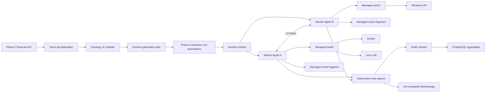

# Phase 9 TeamLab Networking Commercialization Design

Date: 2026-07-14

Status: Approved for implementation planning

## 1. Purpose

Phase 9 turns TeamLab into a reusable commercial networking substrate for Docker, Linux VM, Windows VM, and mixed environments. It must support multi-node placement, explicit managed network infrastructure, reusable service injection, deterministic recovery, and full-path traffic observation without changing the Phase 3 public resource identity or operation model.

This phase changes backend, Agent, persistence, API contracts, and deployment artifacts. It does not implement frontend changes.

## 2. Confirmed Decisions

- Use two infrastructure modes:
  - managed switch/router nodes implemented by the platform without an image;
  - Docker/VM network appliances for attackable or custom routing systems.
- A layer-2 network belongs to one WorkerNode. Phase 9 does not add stretched L2, VXLAN, or EVPN.
- Managed routers may span shards through the routed Fabric. Image-backed multi-interface appliances pin their attached networks to one shard.
- Network connections support stateful `FromTo` and `Bidirectional` direction. Port-level ACL remains out of scope.
- Default traffic metadata covers every managed observation point. Full PCAP remains bounded and on demand.
- Process-level correlation is optional and uses an injected endpoint sensor. Network-only evidence must never be reported as deterministic process causality.
- Linux VM injection uses cloud-init with qemu guest agent support. Windows VM injection uses qemu guest agent and PowerShell, with Cloudbase-init accepted where certified.
- AD and other complex services use versioned bootstrap profiles. TeamLab core does not hard-code AD business logic.
- Bootstrap profiles are OCI artifacts, pinned by digest in a release and pre-distributed with images.
- Runtime startup uses an explicit dependency DAG. `OrderIndex` no longer controls execution order.
- Initial deployment is all-or-cleanup for the current generation. A running runtime can become `Degraded`; business assets are not rebuilt automatically unless they are explicitly stateless and every recovery guard passes.
- WireGuard grant identity, keys, client address, public UDP port, and player configuration remain stable during infrastructure replay or entry-shard replacement.
- Topology schema v2 is added under `/api/open/v1/teamlab`. Existing immutable v1 releases are normalized at the decode boundary into one internal execution model.
- PCAP segments are persisted through the existing BlobStorage abstraction, with S3-compatible storage as the production standard.

## 3. Current Code Facts

### 3.1 Placement cannot split a connected routed topology correctly

`TeamLabAssetPlanner.BuildGroups` in `src/GZCTF/Modules/TeamLab/Application/TeamLabAssetPlanner.cs` unions every network attached to the same asset. A routing asset therefore joins all of its networks into one placement group. Because `TeamLabTopologyValidator` requires a connection router to attach to both connected networks, a normal routed topology collapses into one group and cannot be distributed across WorkerNodes.

The current multi-shard tests only prove disconnected network groups can be placed separately. They do not prove that one connected topology can be split across a routed Fabric.

### 3.2 Infrastructure is not a first-class topology resource

`TeamLabAssetKind` only contains `Docker` and `Vm`. A topology router is an image-backed asset with `RoutingEnabled`; a switch is only an implicit Linux bridge represented by a network. This prevents a zero-image managed router, forces unnecessary capacity use, and makes switch/router runtime health impossible to report as explicit infrastructure facts.

### 3.3 Fabric link addressing is not leased

`TeamLabRouteApplicationService.FabricAddress` derives `169.254.x.x` addresses from `runtimeId % 512` and shard ordinal. This is deterministic but can collide for simultaneously active runtimes. Commercial execution requires persisted, non-overlapping Fabric link leases.

### 3.4 Linux VM injection exists, Windows injection does not

`AgentTeamLabNodeExecutor.BuildCloudInit` creates Linux NoCloud data and static MAC-matched network configuration. Windows returns `Enabled = false`; no PowerShell bootstrap, qemu guest agent channel, reboot checkpoint, or template capability verification exists.

`KvmService` mounts cloud-init data but does not define a qemu guest agent channel or a TeamLab endpoint-sensor channel. VM readiness relies mainly on IP observation.

### 3.5 Service initialization is incomplete

Topology assets contain `Environment`, `StartCommand`, and `HealthCheck`, but `TeamLabNodeAssetCreateRequest` does not carry a bootstrap profile or dependency contract, and `StartCommand` is not propagated into the unified TeamLab execution port. Complex initialization is therefore image-specific and cannot be audited or reproduced from a release.

### 3.6 Traffic metadata is per-network tcpdump text

`TeamLabNetworkService.StartFlowMetadataAsync` starts one external tcpdump process per runtime network and appends text to `/run/gzctf-teamlab`. The main service polls each file and parses at most 500 lines. The facts do not contain observation-point identity, TCP state, packet identity, interface direction, or hop order.

The current `TeamLabTrafficFlow` aggregate can answer that a flow was observed on a network, but cannot reconstruct the same packet across switch, router, and Fabric observation points.

### 3.7 PCAP is single-node and ephemeral

`TeamLabTrafficApplicationService.StartCaptureAsync` resolves one runtime network and one WorkerNode. Agent capture files live under `/run`, and the capture job has one file path. It cannot represent a runtime-wide multi-node capture, durable object storage, per-segment digest, or upload recovery.

### 3.8 Existing foundations must be reused

- Phase 3 owns topology/release/runtime public identity, public UUIDs, access grants, traffic endpoints, and application contracts.
- Phase 6 owns deployment queue, node eligibility, capacity reservation, dispatch concurrency, and Agent feature negotiation.
- Phase 7 owns operational events, correlation, typed errors, tracing, inventory-based recovery, and audit queries.
- Phase 4/5 own PostgreSQL lifecycle, retention, Redis Stream ingestion, batching, and backpressure.
- Image distribution already supports capability-aware Docker/VM pre-distribution and runtime fallback.

Phase 9 must extend these paths rather than introduce parallel schedulers, queues, operation stores, or audit facts.

The current EF runtime entities still live in `Models/Data/TeamLabEntities.cs`, while the Phase 3 application and contracts already live under `Modules/TeamLab`. Phase 9 must finish this ownership move when it splits the runtime model: TeamLab entities move into `Modules/TeamLab/Domain`, `AppDbContext` references those module types, and the old aggregate file is deleted. This is a namespace/code-ownership correction, not a second database model or compatibility layer.

## 4. Target Architecture



### 4.1 Topology schema v2

Schema v2 keeps networks and workload assets, and adds explicit infrastructure, dependencies, bootstrap references, and observation policy.

```csharp
public enum TeamLabInfrastructureKind : byte
{
    ManagedSwitch = 0,
    ManagedRouter = 1
}

public enum TeamLabConnectionDirection : byte
{
    FromTo = 0,
    Bidirectional = 1
}

public sealed record TeamLabTopologyInfrastructureModel(
    string Key,
    string Name,
    TeamLabInfrastructureKind Kind,
    IReadOnlyList<TeamLabTopologyInterfaceModel> Interfaces,
    string? NetworkKey = null);

public sealed record TeamLabTopologyDependencyModel(
    string AssetKey,
    string DependsOnKey,
    TeamLabDependencyCondition Condition);

public sealed record TeamLabBootstrapReferenceModel(
    Guid ProfileId,
    int Version,
    IReadOnlyDictionary<string, string> Parameters);
```

- A managed switch owns exactly one network and compiles to one local bridge.
- A managed router owns two or more interfaces and compiles to router fragments on every shard containing an attached network.
- A custom Docker/VM appliance remains a workload asset. If it has multiple interfaces, all attached networks form one placement group.
- Connections reference a managed router or a custom routing asset through a common topology node key.
- New topology writes use schema v2. V1 release decoding maps implicit bridges and routing assets to the v2 internal plan before validation and placement.

### 4.2 Runtime facts

New current-generation facts are required:

- `TeamLabRuntimeInfrastructure`: runtime identity, generation, topology key, infrastructure kind, status, route version, error.
- `TeamLabRuntimeInfrastructureFragment`: infrastructure identity, shard, WorkerNode, namespace/bridge stable resource token, status, native identity.
- `TeamLabFabricLinkLease`: runtime, generation, shard, allocated link CIDR, released time.
- `TeamLabRuntimeDependencyState`: dependent asset, prerequisite, condition, status, satisfied time, failure.
- `TeamLabBootstrapExecution`: asset, profile version/digest, attempt, stage, status, reboot count, output digest, error.
- `TeamLabObservationPoint`: runtime, generation, shard, network/infrastructure identity, WorkerNode, interface token, kind, status.
- `TeamLabTrafficObservation`: bounded packet/flow observation with fingerprint and observation-point identity.
- `TeamLabTrafficPath`: derived path summary and evidence confidence.
- `TeamLabTrafficCaptureSegment`: capture job, WorkerNode, observation point, object path, digest, size, status.
- `ImageTemplateCapabilityCertification`: template digest, capability set, probe evidence, certified time, error.
- `TeamLabBootstrapProfile` and immutable profile versions referencing OCI artifact digests.

Events remain audit history and are not used as current state facts.

## 5. Placement and Network Compilation

### 5.1 Placement groups

- Start with one group per network.
- Union networks only when an image-backed multi-interface asset must attach to all of them locally.
- Do not union networks connected by a managed router.
- Count Docker and VM slots independently.
- Managed infrastructure consumes network-operation capacity but no Docker/KVM slot.
- Apply Phase 6 node eligibility separately for each group.
- Prefer a single node when it fits, then minimize cross-node connections, then score capacity and load deterministically.
- Reserve every selected node atomically under the existing scheduler lease. Partial reservation is rolled back before queue retry.

### 5.2 Routed Fabric

- Each shard receives one router namespace and one leased /30 namespace uplink.
- Managed router fragments install only routes and stateful network-direction rules belonging to that logical router.
- Worker host routes point remote runtime CIDRs to the destination Worker Fabric IP.
- The runtime never exposes Worker management addresses through public projections.
- Player WireGuard terminates on the entry shard router namespace. The public gateway keeps the same external UDP mapping if the entry shard changes.
- Route application is versioned and idempotent. Reapplying the same route version produces the same commands and resource identities.

### 5.3 Scope boundaries

- IPv4 RFC1918 only.
- No cross-node L2.
- No port/protocol ACL.
- No transparent proxy.
- No mandatory internet egress or NAT.
- No automatic spanning-tree or dynamic routing protocol in v2 managed infrastructure. Custom appliances can provide these behaviors inside their image.

## 6. Dependency Orchestration and Bootstrap

### 6.1 Deployment stages

```text
planning
reserving
artifacts-verifying
network-applying
routes-applying
asset-booting
guest-waiting
bootstrap-injecting
bootstrap-running
guest-rebooting
health-probing
observation-starting
ready
```

- The DAG compiler rejects cycles and missing dependency targets during topology validation.
- Independent assets and shards run concurrently within Phase 6 dispatch limits.
- A dependent asset starts only after all required conditions are satisfied.
- Bootstrap steps have stable IDs and idempotency markers. A retry resumes at the first incomplete step.
- Initial deployment opens access only after all required assets and infrastructure are ready.

### 6.2 Bootstrap profiles

Profile versions contain:

- supported OS and asset kinds;
- required template capabilities;
- parameter schema with secret/non-secret classification;
- files to inject;
- commands to execute;
- allowed reboot count;
- readiness and health checks;
- per-step timeout and retry limit;
- artifact digest and optional signature metadata.

Profiles are stored as OCI artifacts in the internal Registry and pre-distributed to candidate nodes. Release publishing resolves and pins the exact digest. Runtime secrets continue through the encrypted overlay envelope and are never stored in the profile or release.

### 6.3 VM guest control

- Linux uses cloud-init NoCloud for first boot and qemu guest agent for facts, file injection, command execution, and reboot completion.
- Windows uses DHCP reservations for initial reachability, a qemu guest agent channel, and PowerShell bootstrap. Certified Cloudbase-init images may consume a config drive, but Cloudbase-init is not the only Windows path.
- Libvirt domains include stable generation metadata, qemu guest agent channel, and optional endpoint-sensor virtio-serial channel.
- Template certification is tied to the image digest. Updating a template digest invalidates previous certification.
- Unsupported injection combinations fail topology release validation. Runtime deployment does not probe random fallback methods.

### 6.4 AD and complex services

AD is implemented as a reusable bootstrap profile and dependency graph:

1. domain controller boots;
2. network and DNS facts are injected;
3. forest creation runs;
4. required reboot completes;
5. AD/DNS health succeeds;
6. member nodes receive join credentials and join the domain;
7. member reboot and domain-login checks complete.

The same mechanism supports database clusters, industrial services, Linux directory services, and other dependency-driven environments.

## 7. Traffic Observation

### 7.1 Observation points

Every current-generation runtime creates explicit observation points for:

- managed switch bridge;
- managed router ingress/egress interface;
- custom appliance adjacency;
- shard Fabric uplink;
- decrypted WireGuard entry.

The Agent owns observation-point lifecycle and reports inventory facts for recovery.

### 7.2 Agent collector

- Replace per-network tcpdump text processes with one Agent-managed packet observer.
- Use SharpPcap/libpcap and PacketDotNet already present in the repository package catalog.
- Open capture handles only for registered TeamLab observation interfaces.
- Use a bounded snap length sufficient for L2/L3/L4 parsing and packet fingerprinting; default metadata does not retain payload.
- Aggregate in bounded memory by runtime, generation, observation point, direction, and five-tuple.
- Flush structured batches with monotonic source sequence and backpressure counters.
- Continue using Redis Stream, local bounded fallback, and PostgreSQL batch persistence from Phase 5.

### 7.3 Path reconstruction

Packet fingerprints are based on stable header fields, TCP sequence/acknowledgement, length, and a bounded payload-prefix hash while excluding TTL and checksum. Repeated fingerprints observed in a short time window form an ordered hop path.

Separate sessions such as A to B and B to C are not packet-identical. Without endpoint evidence they are only `TemporallyRelated`. With endpoint sensor facts showing the same process instance receiving A to B and creating B to C, the relation becomes `ProcessCorrelated`. The API must expose confidence and evidence type.

### 7.4 Endpoint sensor

- The sensor is an optional, versioned bootstrap artifact.
- Docker uses a host-managed Unix socket mounted read-only/write-only as appropriate.
- VM uses a dedicated virtio-serial channel separate from qemu guest agent.
- Each asset receives an ephemeral HMAC credential bound to runtime, generation, asset, and sensor version.
- Sensor events include process instance, parent process, local/remote endpoint, connect/accept/close event, and monotonic sequence.
- Agent validates identity, sequence, size, and HMAC before accepting events.
- Sensor absence degrades path confidence but does not block normal networking unless the topology explicitly marks deep telemetry as required.

## 8. PCAP and Object Storage

- A capture job expands into one or more capture segments.
- Scope can be network, path, asset neighborhood, or entire runtime.
- Segments start in parallel on all required WorkerNodes.
- Each segment enforces server-side duration and size limits.
- Completed segments stream through an authenticated internal upload endpoint into `IBlobStorage` without buffering the whole object in memory.
- Production uses S3-compatible storage; local disk remains a development provider.
- PostgreSQL stores object path, SHA-256 digest, size, start/end time, observation point, and retention state.
- Runtime download returns a streamed archive containing `manifest.json` and segment PCAP/PCAPNG files.
- Upload is idempotent by segment public ID and digest. Agent deletes the local segment only after object persistence is verified.

## 9. Failure and Recovery

### 9.1 Initial deployment

- Any critical failure prevents access opening.
- Cleanup targets the exact runtime generation, shard, native identity, infrastructure fragment, bootstrap execution, sensor channel, and capture segment.
- Capacity is released only after cleanup facts reach a terminal state or a durable cleanup-pending fact is recorded.

### 9.2 Running runtime

- Worker unavailability first marks affected facts `Unknown` and runtime `Degraded`; it does not immediately recreate resources.
- Infrastructure replay requires a grace period, single recovery owner, fresh node facts, matching route generation, and stable WireGuard facts.
- Stateless asset rebuild additionally requires explicit topology opt-in, immutable release/profile/image digests, missing-resource proof from an online Agent, and no identity conflict.
- Stateful or unspecified assets are never rebuilt automatically.
- Entry-shard replacement preserves the external UDP port and WireGuard grant material.

### 9.3 Inventory

Agent runtime inventory is extended with managed bridges, router namespaces/fragments, Fabric uplinks, observation points, bootstrap executions, sensor channels, and capture segments. Inventory returns stable identities and status only; it does not return commands, secrets, payloads, userdata, or packet content.

## 10. API and Protocol

- Keep `/api/open/v1/teamlab` and Phase 1 authentication, scope, rate limit, ProblemDetails, audit, and `Idempotency-Key` rules.
- Keep topology/release/runtime/access-grant public UUID semantics.
- Add schema v2 models and capabilities advertisement.
- Add bootstrap profile create/publish/query operations with durable `ApiOperation` for artifact import and deletion.
- Add path query and capture-segment projections using opaque cursor pagination.
- All write operations reuse `ApiOperation`; runtime execution continues to map to one `DeploymentQueueTicket`.
- Agent capability features are additive, for example:
  - `teamlab.infrastructure.v2`
  - `teamlab.fabric.leased-links.v1`
  - `runtime.vm.qga.v1`
  - `runtime.vm.windows-bootstrap.v1`
  - `teamlab.observation.v2`
  - `teamlab.endpoint-sensor.v1`
  - `teamlab.pcap-object-storage.v1`
- Workload eligibility checks required feature subsets. No code may use a global protocol integer threshold.

## 11. Migration Strategy

1. Expand tables and nullable schema-v2 fields.
2. Add v2 codec and normalizer while current v1 releases remain readable.
3. Backfill v1 managed-switch facts from networks and custom-router facts from routing assets without changing release content hashes.
4. Switch new topology creation and publishing to v2.
5. Switch runtime planning and deployment to the unified v2 internal plan.
6. Remove old placement-group union behavior, per-network tcpdump process management, single-file capture assumptions, and modulo Fabric address generation.
7. Contract migration makes new current-generation runtime facts mandatory where applicable and fails closed on active inconsistent runtimes.

There is no second scheduler, deployment path, traffic store, or recovery service.

## 12. Acceptance

### 12.1 Concentrated code gates

- Topology v2 codec, validator, migration, and v1 normalization.
- Connected multi-node placement with managed routers and separate Docker/KVM capability requirements.
- Fabric link lease uniqueness and route direction enforcement.
- Linux and Windows guest-control contracts, bootstrap DAG, reboot, and health checks.
- Agent observation collector, bounded memory, packet fingerprinting, path reconstruction, and sensor authentication.
- Multi-node PCAP segmentation, BlobStorage upload, digest verification, retention, and streamed download.
- Phase 3 OpenAPI contract, Phase 6 scheduler integration, Phase 7 event/recovery coverage, EF consistency, and sensitive-data scans.

### 12.2 Real environment on 10.24.0.118

- Deploy a multi-network Docker environment with managed switch/router nodes and stateful directional reachability.
- Deploy a Linux VM environment with multiple NICs, cloud-init, bootstrap profile, DNS, routes, service health, and teardown.
- Deploy a Windows VM environment with QGA, PowerShell bootstrap, reboot, service health, and traffic observation.
- Deploy a mixed multi-shard topology with Docker, Linux VM, Windows VM, managed router, WireGuard, and cross-node routing.
- Deploy an AD bootstrap profile scenario with domain controller and member dependency flow.
- Generate A to B, B to C, C to B, and B to A traffic and verify all segments, packet hop evidence, endpoint process correlation, and runtime-wide PCAP manifest.
- Exercise Agent restart, transient Worker outage, infrastructure replay, capture upload retry, controlled stateless rebuild, reset, and destroy.
- Verify no runtime-specific containers, domains, overlays, seed media, bridges, namespaces, routes, WireGuard interfaces, sensor sockets, bootstrap files, or local PCAP segments remain.

### 12.3 Scale evidence

- Planner and persistence tests cover the contract limit of 32 networks, 128 workload assets, and 8 interfaces per asset.
- A real lightweight Docker topology contains dozens of assets.
- A smaller mixed topology proves every VM, injection, routing, observation, recovery, and cleanup capability without pretending that a resource-limited test host represents maximum VM density.
