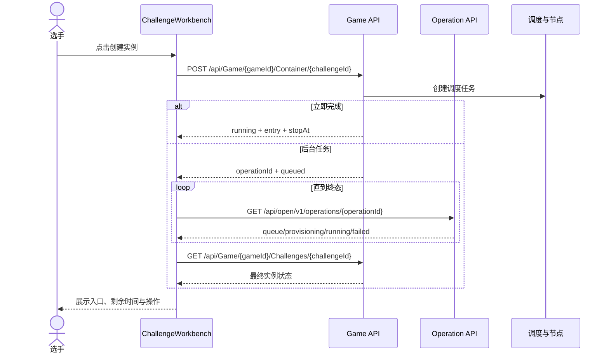
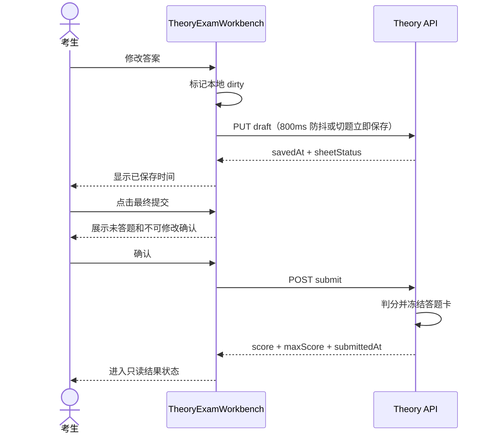
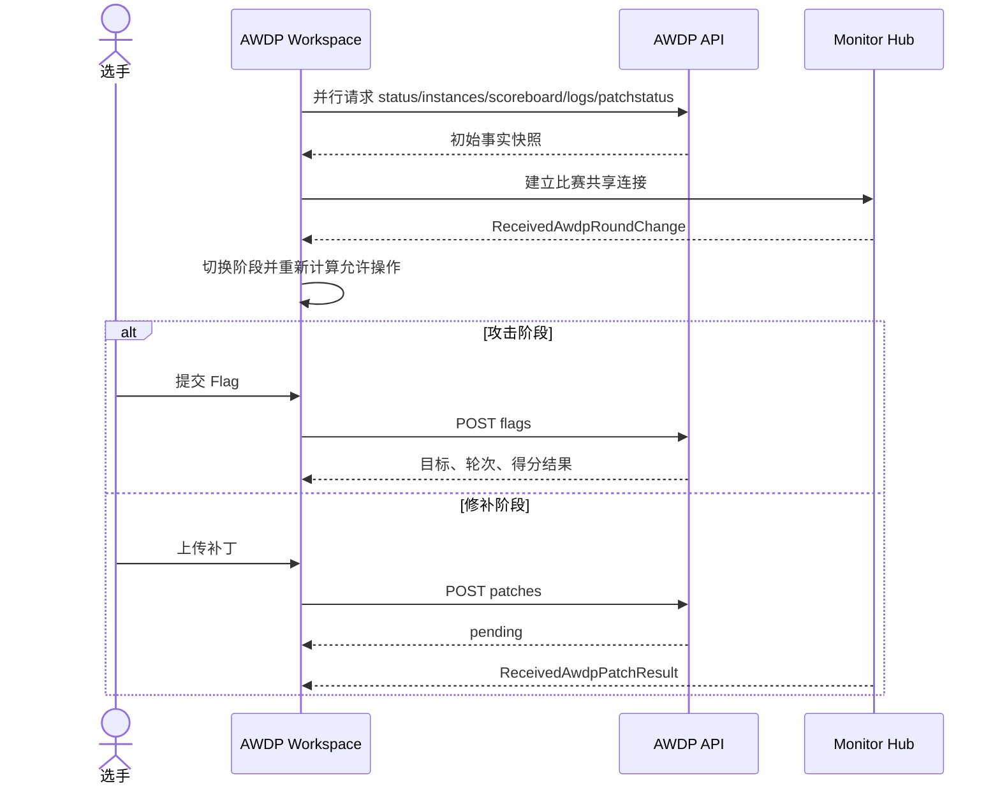
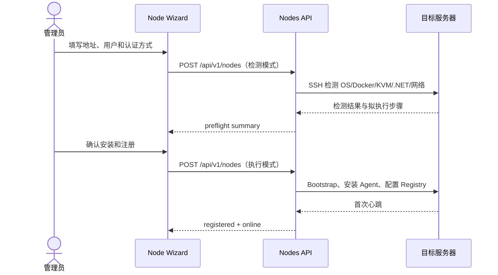

# YINYU vNext 页面交互与 API 设计规格

> 状态：Draft 0.1
>
> 设计基线：[YINYU vNext 前端设计语言初稿](./yinyu-vnext-design-language-draft.md)
>
> 目标：把视觉语言初稿展开为可用于前端实现、后端补充、联调和验收的页面级规格。

## 1. 文档约定

### 1.1 API 状态标记

| 标记 | 含义 |
| --- | --- |
| `现有` | 当前仓库已有控制器和接口，可直接通过 Adapter 使用 |
| `扩展` | 当前接口存在，但查询参数、DTO 或权限裁剪不足 |
| `新增` | 当前后端没有，需要在 vNext 开发中实现 |
| `实时` | 使用现有 SignalR Hub 或需要新增实时事件 |

接口路径采用当前控制器的规范路径。新前端不得在页面中直接散落 `fetch`，统一经过 `api/adapters` 和领域 Hook。

### 1.2 页面范围

本规格覆盖：

- 全局壳、模块抽屉、上下文栏、个人抽屉和主题切换。
- 首页、公告、认证、个人、团队。
- 比赛列表、比赛详情、CTF、榜单、理论考试、AWDP、渗透演练。
- 培训首页、课程详情、章节、章节编辑和课后理论练习。
- 后续练习模块的首页、题库、单题工作区和复盘中心。
- 管理首页、赛事管理、题目管理、理论题库、镜像、节点、队列、实例、用户、日志和系统设置。
- TeamLab 拓扑、部署、流量观测和比赛监控。

不在本规格中重新定义后端判题、计分、调度和权限算法；页面只消费经过服务端裁剪的结果。

### 1.3 页面开发模板

每个页面至少实现六类状态：

1. `loading`：150ms 内未完成时展示保持最终尺寸的 Skeleton。
2. `ready`：数据完整，操作根据权限启用。
3. `empty`：解释为什么为空，并只提供一个最合理的下一步。
4. `stale`：保留旧数据并显示轻量“正在刷新”，不整页白屏。
5. `error`：在当前内容范围内恢复，提供重试；只有路由主体无法识别时进入错误页。
6. `forbidden`：解释权限范围并提供返回入口，不能伪装成 404，确需隐藏资源存在性时除外。

## 2. 全局技术与交互规范

### 2.1 数据访问

- 生成客户端只存在于 `api/generated`，页面使用 `features/*/api` 或 `api/adapters`。
- 查询 Key 包含资源 ID、筛选、分页和权限上下文，不能用模糊字符串共享不同请求结果。
- 页面离开时中止仍在执行的查询和上传；容器创建、部署等服务端任务通过任务 ID 继续跟踪。
- 普通 GET 使用 SWR 或等价查询层；表单提交不使用自动重试，避免重复创建资源。
- 删除、最终交卷、发布比赛、停止运行环境等不可逆操作采用服务端成功后再更新界面的保守策略。
- 收藏、标签切换、草稿状态等低风险操作可乐观更新，失败时回滚并说明原因。
- API 错误优先展示后端 `message` 和稳定错误码，不向用户暴露堆栈、数据库错误或完整网络响应。

### 2.2 实时数据

当前可复用 Hub：

| Hub | 现有事件 | 使用页面 |
| --- | --- | --- |
| `/hub/user?game={id}` | `ReceivedGameNotice`、`ReceivedPenetrationWorkspaceUpdate` | CTF 通知、渗透工作区 |
| `/hub/monitor?game={id}` | 比赛事件、提交、AWDP 轮次、服务状态、补丁结果 | 榜单、监控、AWDP |
| `/hub/admin` | `ReceivedLog` | 系统日志 |

实时连接规则：

- 首次页面数据仍由 REST 获取，Hub 只追加或失效缓存，不能把 Hub 当唯一事实来源。
- 断线时显示非阻塞状态点并自动重连；重连成功后重新请求当前资源，避免遗漏事件。
- 页面隐藏超过 60 秒后降低刷新频率，恢复可见时执行一次同步。
- 同一比赛的多个子页面共享连接，不为每个小组件重复建立 Hub。

### 2.3 URL 与返回行为

- 搜索、分页、筛选、Tab 和当前选中实体进入 URL 查询参数，刷新后应恢复。
- 临时确认框、Tooltip 和普通下拉菜单不写入 URL。
- 可分享的题目、课程章节、用户和节点详情使用稳定路由或查询参数。
- 浏览器返回必须回到上一层并恢复列表滚动位置，不跳到错误 Tab。
- 编辑页面的“返回”使用显式来源参数或路由状态，缺失时回到资源详情默认 Tab，不保留无效 `tab=` 参数。

### 2.4 表单规则

- 输入时只做格式和必填校验，服务端业务校验结果显示在对应字段或表单顶部。
- 保存中禁用重复提交，但允许复制和浏览已有内容。
- 长编辑页使用固定底部操作栏，始终可见“保存”“取消”和未保存状态。
- 自动草稿显示最后保存时间；最终提交必须使用独立确认步骤。
- 上传显示文件名、大小、校验阶段、服务端处理阶段和失败原因，不能只显示旋转图标。

### 2.5 动效规则

| 场景 | 动效 |
| --- | --- |
| 页面同级切换 | `160-180ms`，透明度加 6-8px 横向位移，不等待旧页面退出 |
| 进入详情 | `220-260ms`，从导航方向进入 12px |
| 左右抽屉 | `260-280ms`，仅 transform 和 opacity |
| Tab | `160-220ms` 激活轨道移动，内容短淡化 |
| 列表插入/删除 | 布局动画保留相邻对象位置 |
| 成功完成 | 单次 `360-480ms` 路径闭合或状态锚点确认 |
| 错误 | 局部状态改变，不抖动整页 |

开启 `prefers-reduced-motion` 后移除路径绘制、数字插值和大范围位移，仅保留 80-120ms 淡化。

路由壳层必须设置 `scrollbar-gutter: stable` 和剩余视口最小高度；同级页面切换期间只允许存在一个路由主体，抽屉和 Modal 才使用完整退出动画。

### 2.6 响应式断点

| 宽度 | 规则 |
| --- | --- |
| `>= 1280px` | 固定全局栏，复杂页面可使用主栏、辅栏和模块侧栏 |
| `1024-1279px` | 全局栏保留，模块侧栏转抽屉或水平工具栏，个人入口只显示头像 |
| `768-1023px` | 主内容单栏，辅助信息进入折叠区或抽屉 |
| `< 768px` | 顶部上下文栏加底部导航，所有多栏页面转为单栏或分步视图 |

固定格式元素必须设置稳定尺寸，禁止依靠视口宽度连续缩放字体。

功能性文字的桌面端字号下限为 `11px`，正文、通知和操作说明下限为 `12px`。空间不足时使用换行、截断、分页或响应式重排，禁止将业务文字压缩到 `9-10px`。

## 3. 全局壳与公共覆盖层

### 3.1 `GlobalRail` 与 `ModuleDrawer`

**目标**：让首页、赛事、练习、培训和战队保持一步到达，同时为管理和未来模块提供扩展空间。

**布局**：

- `GlobalRail` 固定 72px，顶部为平台标志和全部模块触发器，中部为高频模块，底部只保留帮助或连接状态等非账户内容。
- `ModuleDrawer` 从全局栏右侧展开，宽度 `288-320px`，按模块组显示完整名称、描述和可选状态摘要。
- 抽屉覆盖主内容，不重新计算页面宽度。

**数据与 API**：

| API | 状态 | 用途 |
| --- | --- | --- |
| `GET /api/Config` | 现有 | 平台名称、Logo、功能配置 |
| `GET /api/navigation/modules` | 新增 | 按角色返回模块、顺序、分组和未完成数量 |

首版可以由前端静态注册表和当前用户角色生成模块；当插件和商业化模块需要服务端开关时再启用导航接口。

**交互**：

- 点击高频模块直接导航。
- 点击平台入口打开模块抽屉；再次点击、`Esc` 或遮罩关闭。
- 当前模块在固定栏和抽屉中同时高亮。
- 键盘方向键在模块组内移动，`Enter` 导航。

**动效**：固定栏不动；抽屉 `260ms` 平移，分组内容不逐项延迟超过 80ms。

### 3.2 `ContextBar`

**目标**：表达当前位置、业务状态和当前页面动作。

**固定区域**：模块名、页面标题、可选面包屑、业务状态、1-3 个页面动作、最右侧个人入口。

**交互**：

- 页面动作过多时保留主动作，其他动作进入省略菜单。
- 比赛倒计时、AWDP 阶段和实例剩余时间采用单一计时源，避免多个组件显示不同秒数。
- 页面滚动时保持固定，但不能遮挡锚点跳转目标。

### 3.3 `AccountDrawer`

**API**：

| API | 状态 | 用途 |
| --- | --- | --- |
| `GET /api/Account/Profile` | 现有 | 当前用户身份 |
| `GET /api/account/summary` | 新增 | 三项摘要、继续进行、未读数量、角色快捷入口 |
| `POST /api/Account/LogOut` | 现有 | 退出登录 |

**内容**：身份区、三项摘要、最多三条继续进行、个人主页、账户设置、角色入口、主题、语言和退出登录。

**交互**：

- 打开时优先使用已有用户缓存，摘要区域单独加载。
- 点击继续进行项目先关闭抽屉，再执行路由转场。
- 退出登录需要一次确认；成功后清空所有用户级缓存并跳转首页。
- 抽屉中部独立滚动，头尾固定，禁止水平滚动。

**动效**：右侧 `280ms` 平移；摘要数据更新仅交叉淡化，不重播抽屉动画。

### 3.4 全局通知与任务反馈

- 普通成功 Toast 自动关闭，包含资源名和结果，不只写“成功”。
- 上传、镜像导入、部署和容器创建使用持久任务反馈，可打开任务详情。
- 同一任务只保留一条通知并更新状态，不能每次轮询新增一条。
- 后台任务建议统一返回 `operationId`，通过 `GET /api/open/v1/operations/{id}` 查询当前状态。

## 4. 页面索引

| 页面 | 建议路由 | API 完整度 |
| --- | --- | --- |
| 首页 | `/` | 需要首页聚合接口 |
| 公告列表/详情 | `/posts`、`/posts/:id` | 完整 |
| 登录与注册 | `/account/*` | 完整 |
| 个人页 | `/users/:userId` | 需要新增聚合接口 |
| 账户设置 | `/settings/*` | 基础接口完整 |
| 战队 | `/teams` | 完整 |
| 赛事列表/详情 | `/games`、`/games/:id` | 基础完整，筛选需扩展 |
| CTF 工作区/榜单 | `/games/:id/challenges`、`scoreboard` | 完整 |
| 理论考试/榜单 | `/games/:id/theory`、`theory-scoreboard` | 完整 |
| AWDP | `/games/:id/awdp` | 完整 |
| 渗透演练 | `/games/:id/pentest` | 基础完整 |
| 培训 | `/training/**` | 完整 |
| 练习 | `/practice/**` | 尚未实现 |
| 管理 | `/admin/**` | 大部分完整 |
| TeamLab | 管理赛事内工作区 | 基础完整 |

## 5. 公共、身份与组织页面

### 5.1 首页 `/`

**目标**：登录用户进入后立即看到需要继续处理的事情；未登录用户直接看到进行中赛事、公开课程和平台通知，不制作营销落地页。

**页面结构**：

```text
上下文栏：平台状态 / 搜索 / 个人入口
┌─────────────────────────────────────────────────────────┐
│ 继续进行：比赛、课程、运行实例、待处理任务              │
├────────────────────────────────┬────────────────────────┤
│ 进行中与即将开始的赛事         │ 平台通知               │
├────────────────────────────────┼────────────────────────┤
│ 最近课程 / 推荐练习            │ 系统与节点状态摘要     │
└────────────────────────────────┴────────────────────────┘
```

未登录时不显示空的“继续进行”和私有系统状态，赛事与通知提升到第一屏。

**API**：

| API | 状态 | 内容 |
| --- | --- | --- |
| `GET /api/Config` | 现有 | Logo、平台名称、口号、注册配置 |
| `GET /api/Posts/Latest` | 现有 | 最新公告 |
| `GET /api/Game?count=5&skip=0` | 现有 | 公开赛事 |
| `GET /api/home/overview` | 新增 | 继续进行、最近课程、练习摘要、运行实例、角色待办 |

`home/overview` 建议一次返回按优先级排序的统一项目：

```ts
type ContinueItem = {
  id: string
  kind: 'game' | 'course' | 'instance' | 'exam' | 'review'
  title: string
  subtitle?: string
  route: string
  deadline?: string
  state: string
  priority: number
}
```

**交互**：

- 继续进行最多显示 4 项；点击直接进入目标状态，不先进入中间列表。
- 赛事卡片包含赛制、状态、时间、报名状态和主操作。
- 公告点击进入详情；教师及以上的置顶操作不直接暴露在普通首页，放入公告管理菜单。
- 首页模块可隐藏空区段，但必须保持第一屏布局稳定。

**状态**：各区段独立加载和恢复；首页聚合失败时仍显示赛事与公告，不整页报错。

**视觉与动效**：

- 品牌折面只占标题与继续进行之间的窄区域，不制作全屏 Hero。
- 首次进入时路径从平台锚点连接到继续进行项目，`360-480ms` 播放一次。
- 卡片出现最多使用两组淡入，不逐卡片长延迟。
- 删除旧版持续打字、全屏扫描和高频背景动画。

**响应式**：1366px 下赛事主栏约占 2/3；移动端顺序为继续进行、赛事、课程、通知。

### 5.2 公告列表 `/posts`

**目标**：浏览平台规则、维护和赛事通知。

**API**：

| API | 状态 | 用途 |
| --- | --- | --- |
| `GET /api/Posts` | 现有 | 公告列表 |
| `POST /api/Edit/Posts` | 现有 | 创建公告 |
| `PUT /api/Edit/Posts/{id}` | 现有 | 修改、置顶 |
| `DELETE /api/Edit/Posts/{id}` | 现有 | 删除 |

**布局与交互**：

- 顶部提供关键词、置顶/普通筛选和管理员“新建公告”。
- 列表使用紧凑行：标题、摘要、发布时间、作者和置顶状态。
- 搜索与分页进入 URL；管理员操作使用行末菜单，不让普通用户看到空操作列。
- 删除需要确认并说明是否影响首页展示。

**动效**：置顶后目标行移动到置顶区，使用布局动画；不整页重载。

### 5.3 公告详情 `/posts/:postId`

**API**：`GET /api/Posts/{id}`、管理角色使用对应编辑和删除接口。

**布局**：标题、发布时间和作者在正文上方；Markdown 正文宽度 `720-840px`；右侧仅显示目录或相关公告，不显示装饰卡片。

**交互**：目录锚点不改变路由；外链明确新窗口；管理者点击编辑进入独立编辑页并保留返回来源。

### 5.4 登录 `/account/login`

**API**：

| API | 状态 | 用途 |
| --- | --- | --- |
| `POST /api/Account/LogIn` | 现有 | 用户名、密码、可选验证码登录 |
| `GET /api/Captcha/PowChallenge` | 现有 | 需要时获取 PoW 挑战 |
| `GET /api/account/portal-sso` | 现有 | IAM Portal SSO 回调入口 |

**布局**：左侧或背景使用一次性品牌折面，表单是页面主体验，不放在多层卡片中。字段顺序为用户名、密码、验证码状态、登录。

**交互**：

- 支持 `returnUrl`，成功后只跳转站内安全路径。
- 登录失败保留用户名，清空密码，不重置整个页面。
- SSO 可用时显示单一“统一身份登录”按钮；Token 仍由 Portal 生成，页面不读取外部 Cookie。
- 连续失败触发验证码时在原位置展开，不造成表单大幅跳动。

**动效**：Logo 折线首次绘制不超过 700ms，表单立即可操作；错误只在字段与顶部摘要中出现。

### 5.5 注册、找回与验证 `/account/register|recovery|reset|verify|pending`

**API**：

- `POST /api/Account/Register`
- `POST /api/Account/Recovery`
- `POST /api/Account/PasswordReset`
- `POST /api/Account/Verify`
- `POST /api/Account/MailChangeConfirm`

**交互闭环**：

- 注册根据返回的 `RegisterStatus` 进入已登录、等待管理员审核或等待邮箱验证状态。
- Recovery 只提示“若账户存在将发送邮件”，避免泄露账户存在性。
- Reset 在成功后清除 Token 参数并跳转登录，不能再次提交同一表单。
- Pending 页面显示当前等待类型、重新检查和退出账户，不用无限旋转加载。

### 5.6 公开个人页 `/users/:userId`

页面结构、统计口径和隐私边界以设计语言初稿 10.9 为准。

**API**：

| API | 状态 | 内容 |
| --- | --- | --- |
| `GET /api/users/{userId}` | 新增 | 公开身份字段 |
| `GET /api/users/{userId}/overview?window=365d` | 新增 | 汇总数字、分类画像、趋势摘要 |
| `GET /api/users/{userId}/activity?from&to` | 新增 | 热力图日聚合 |
| `GET /api/users/{userId}/history?type&cursor` | 新增 | 比赛、课程和里程碑时间线 |

**首屏布局**：身份横幅、六项指标、概览 Tab、主辅双栏。首屏请求只包含身份与 overview；热力图和历史在进入视口后加载。

**交互**：

- Tab 使用 `?tab=overview|challenges|games|training`，切换时不重载身份区。
- 雷达 Hover 与真实数据表对应行联动；键盘聚焦也能读取完整指标。
- 时间窗切换更新 overview 与 activity，保留当前 Tab。
- 自己的页面显示“编辑资料”；其他用户不显示未实现的关注或私信。
- 比赛成绩明确标记团队归属，个人解题只统计本人正确提交。

**动效**：身份路径绘制一次；雷达在首次数据到达时从中心展开，筛选时形状插值；移动端改为条形维度列表。

### 5.7 账户设置 `/settings/profile`

**API**：

| API | 状态 | 用途 |
| --- | --- | --- |
| `GET /api/Account/Profile` | 现有 | 读取本人资料 |
| `PUT /api/Account/Update` | 现有 | 用户名、简介、真实姓名、学号、手机号 |
| `PUT /api/Account/Avatar` | 现有 | 头像上传 |
| `PUT /api/Account/ChangeEmail` | 现有 | 邮箱变更请求 |
| `POST /api/Account/MailChangeConfirm` | 现有 | 邮箱确认 |

**布局**：左侧设置导航，右侧单一表单区。头像、公开资料和内部资料分段；内部资料明确标注不会出现在公开页。

**交互**：

- 头像上传先本地预览，再上传；显示裁切范围和 3MB 限制。
- 用户名修改后说明 IAM 用户的稳定绑定不依赖用户名。
- 表单离开前检测未保存修改。
- 保存成功后同步更新全局用户缓存和个人抽屉。

### 5.8 安全与 API Token `/settings/security`、`/settings/tokens`

**API**：

- `PUT /api/Account/ChangePassword`
- `POST /api/tokens`
- `GET /api/tokens`
- `DELETE /api/tokens/{id}`

**交互**：

- 修改密码成功后使当前会话退出，并返回登录页。
- Token 明文只在创建成功时展示一次；关闭后不可再次获取。
- Token 列表显示名称、作用域、资源限制、创建时间、过期时间和最后使用时间。
- 撤销 Token 使用确认框；成功后行状态先变为已撤销，再从活动列表移除。

### 5.9 战队页 `/teams`

**目标**：管理本人所属战队、申请、邀请和比赛关联，不把多个战队渲染成宽度不一致的独立页面。

**API**：

| API | 状态 | 用途 |
| --- | --- | --- |
| `GET /api/Team` | 现有 | 本人战队列表 |
| `GET /api/Team/{id}` | 现有 | 战队详情 |
| `GET /api/Team/Search` | 现有 | 搜索战队 |
| `POST /api/Team` | 现有 | 创建战队 |
| `PUT /api/Team/{id}` | 现有 | 更新名称和简介 |
| `POST /api/Team/{id}/Requests` | 现有 | 申请加入 |
| `GET /api/Team/{id}/Requests` | 现有 | 队长查看申请 |
| `POST /api/Team/{id}/Requests/{requestId}` | 现有 | 队长处理申请 |
| `GET/PUT /api/Team/{id}/Invite` | 现有 | 获取或刷新邀请码 |
| `POST /api/Team/Accept` | 现有 | 使用邀请码加入 |
| `PUT /api/Team/{id}/Transfer` | 现有 | 转让队长 |
| `POST /api/Team/{id}/Kick/{userId}` | 现有 | 移除成员 |
| `POST /api/Team/{id}/Leave` | 现有 | 离队 |
| `PUT /api/Team/{id}/Avatar` | 现有 | 修改头像 |
| `DELETE /api/Team/{id}` | 现有 | 删除战队 |

**布局**：

- 左侧固定宽度战队列表，右侧详情工作区；无论成员数量和用户名长度，详情区宽度一致。
- 详情 Tab：概览、成员、申请、比赛经历、设置。非队长不显示管理 Tab。
- 成员行显示头像、用户名、角色和加入状态；用户名链接至公开个人页。

**交互**：

- 当前战队写入 `?team=`，刷新和返回后保持。
- 创建、加入邀请码和搜索战队使用独立 Dialog。
- 转让队长、离队和删除必须说明后果；删除要求输入战队名称确认。
- 邀请码只对队长显示，复制后给出短反馈，不在页面长期高亮。

**动效与响应式**：切换战队只替换详情区；移动端先显示战队列表，进入详情后使用返回按钮，不并排压缩。

### 5.10 关于、404 与错误页 `/about`、`*`、`/error/500`

**关于页**：展示平台名称、版本、开源许可、部署标识和联系信息。Logo 可以播放一次完整折面动画，但正文保持普通文档布局。配置来自 `GET /api/Config`，版本建议由新增只读构建信息字段提供。

**404**：说明当前路径不存在，提供返回首页和返回上一页；不要自动倒计时跳转。登录状态下可展示三个高频模块入口。

**500/路由错误**：保留错误追踪 ID、重试和返回入口，不展示前端堆栈给普通用户。动态模块加载失败提供“重新加载此页面”，并提示可能存在版本更新；Service Worker 或 CDN 版本切换后应清理旧 Chunk 缓存。

## 6. 比赛与选手工作区

### 6.1 赛事列表 `/games`

**目标**：快速判断哪些比赛正在进行、能否报名、采用什么赛制，以及下一步入口。

**API**：

| API | 状态 | 用途 |
| --- | --- | --- |
| `GET /api/Game?count&skip` | 现有 | 分页赛事列表 |
| `GET /api/Game/Recent?limit` | 现有 | 近期赛事时间范围 |
| `GET /api/Game?status&type&query&count&skip` | 扩展 | 服务端状态、赛制和关键词筛选 |

**布局**：顶部为搜索、状态、赛制、时间筛选和结果数量；进行中赛事使用强调行，未开始与已结束赛事使用同一稳定列表结构。

赛事项固定显示：海报缩略图、名称、赛制、状态、开始/结束时间、队伍规模、报名状态和一个主操作。

**交互**：

- 筛选写入 URL，并在 250ms 后请求服务端；不在前端只过滤当前页。
- 默认排序为进行中、即将开始、已结束；管理测试赛事不进入普通用户列表。
- 点击整行进入详情，主操作按钮阻止行点击冒泡。
- 时间轴仅作为近期比赛概览，不能替代可访问的列表。

**动效**：筛选结果使用交叉淡化和列表布局动画；不为每张海报使用毛玻璃或缩放。

### 6.2 比赛详情 `/games/:gameId`

**目标**：完成了解规则、选择队伍、报名审核和进入对应赛制工作区的完整流程。

**API**：

| API | 状态 | 用途 |
| --- | --- | --- |
| `GET /api/Game/{gameId}` | 现有 | 比赛详情和当前参与状态 |
| `GET /api/Game/{gameId}/Check` | 现有 | 可报名队伍与分组检查 |
| `POST /api/Game/{gameId}` | 现有 | 提交报名 |
| `DELETE /api/Game/{gameId}` | 现有 | 撤回报名或离开 |
| `GET /api/Game/{gameId}/Notices` | 现有 | 比赛公告 |

**页面结构**：左侧或顶部展示海报、名称、赛制、状态和时间；正文展示 Markdown 规则；右侧或底部为参与状态与操作。

**状态与主操作**：

| 状态 | 主操作 |
| --- | --- |
| 未登录 | 登录后报名 |
| 无战队 | 前往创建/加入战队 |
| 未报名 | 报名参赛 |
| 待审核 | 查看报名信息、撤回 |
| 已拒绝 | 查看原因、重新报名 |
| 已通过未开始 | 显示倒计时 |
| 已通过进行中 | 进入 CTF、理论、AWDP 或渗透工作区 |
| 已结束 | 查看榜单、结果和允许的赛后练习 |

**交互**：

- 报名 Dialog 先调用 Check，再选择战队和赛区；提交中不能关闭造成不确定状态。
- 报名成功后局部刷新详情，不整页跳转。
- 混合赛制显示多个明确入口及其开放状态，不只给一个模糊“进入比赛”。
- 比赛未开始时不提前加载题目或泄露题目数量。

**视觉与动效**：海报为真实内容，不做暗化大背景；状态变化使用时间轴锚点推进一次。移动端主操作固定在安全底部区域。

### 6.3 比赛工作区公共壳 `/games/:gameId/*`

**上下文栏**：比赛名、当前赛制/页面、倒计时或 AWDP 阶段、连接状态、个人入口。

**模块导航**：题目、积分榜、理论考试、理论榜单、AWDP、渗透、公告；仅渲染该比赛实际启用且用户有权访问的模块。

**API**：`GET /api/Game/{gameId}` 作为壳层基础数据。比赛阶段的选手可见摘要建议加入详情 DTO；现有 `/api/v1/phases/{gameId}` 仅教师可用，不能直接用于普通选手壳层。

**规则**：

- 壳层和 Hub 连接在子页面切换时不卸载。
- 所有倒计时由服务端时间戳计算，每 30 秒校准一次。
- 页面不可见时停止逐秒 React 重渲染，恢复时重新计算。

### 6.4 CTF 题目工作区 `/games/:gameId/challenges`

**API**：

| API | 状态 | 用途 |
| --- | --- | --- |
| `GET /api/Game/{gameId}/Details` | 现有 | 当前队伍、题目摘要、解题状态、Token |
| `GET /api/Game/{gameId}/Challenges/{challengeId}` | 现有 | 题目详情、附件和实例状态 |
| `POST /api/Game/{gameId}/Challenges/{challengeId}` | 现有 | 提交 Flag |
| `GET /api/Game/{gameId}/Challenges/{challengeId}/Status/{submitId}` | 现有 | 异步判题状态 |
| `POST /api/Game/{gameId}/Container/{challengeId}` | 现有 | 创建 Docker 实例 |
| `POST /api/Game/{gameId}/Container/{challengeId}/Extend` | 现有 | 延期实例 |
| `DELETE /api/Game/{gameId}/Container/{challengeId}` | 现有 | 销毁实例 |
| `GET /api/Game/{gameId}/Vm/{challengeId}` | 现有 | 创建或获取 Windows VM |
| `DELETE /api/Game/{gameId}/Vm/{challengeId}` | 现有 | 销毁 Windows VM |
| `GET /api/Game/{gameId}/Notices` | 现有 | 比赛公告 |
| `/hub/user?game={gameId}` | 实时 | 公告更新 |

**桌面布局**：

```text
┌────────────────┬──────────────────────────────┬────────────────┐
│ 题目库         │ 题目正文与解题操作           │ 比赛上下文     │
│ 搜索/分类/列表 │ 题面/目标/附件/实例/Flag     │ 队伍/公告/提交 │
│ 280-320px      │ min 460px / 1fr              │ 280-310px      │
└────────────────┴──────────────────────────────┴────────────────┘
```

左栏同时承载分类、关键词和题目列表；中栏始终是当前题目正文与解题操作；右栏承载队伍、通知和提交历史。选中题目使用 `?challenge={id}`，切换题目时三栏尺寸保持不变并保留题目列表滚动位置。分类采用可折叠树，必须能容纳至少 10 种题型；各分类独立开合并允许多个同时展开，搜索时临时展开含匹配结果的分类，清空搜索后恢复原展开集合。禁止依赖固定五列布局或单一下拉框。展开层级使用 `2px` 中性垂直轨道，题目子项高度不得超过分类行，状态使用可识别图标而非无语义圆环。

**题目列表**：

- 固定卡片或紧凑行显示题目名、分类、分值、解题状态、实例状态和血次。
- 分类色只用于小标签和状态边缘；题目内容不使用独立动画背景。
- 筛选包括分类、状态、环境和关键词，均在前端对当前比赛完整题目摘要操作。

**题目详情**：

1. 标题、分类、分数和状态。
2. Markdown 题面与提示。
3. 挑战目标和附件下载。
4. 附件之后的实例运行区和入口。
5. 紧接实例区的 Flag 输入；右栏展示队伍摘要、比赛通知和最近提交。

**实例状态机**：

```text
idle -> queued -> provisioning -> running -> extending/stopping -> stopped
                         \-> failed
```

- 创建后若返回队列任务，按钮变为阶段进度并展示队列位置，不重复发送创建请求。
- `running` 必须展示公网/内网中由服务端确定的唯一选手入口、复制、打开、剩余时间、延期和销毁。
- 页面刷新后通过题目详情恢复实例状态和停止时间。
- 入口地址不得由前端拼接当前页面路径、主机名或端口。
- Windows VM 创建时间较长，展示调度、克隆、启动、网络准备四个阶段；超过预计时间提供任务详情，不直接判定失败。

**Flag 提交**：

- 使用受控输入，不通过 DOM 查询读取值。
- 提交时锁定当前题目和输入副本；结果回来前用户可以切换页面但不能重复提交同一值。
- 返回 `submitId` 时轮询 Status，最终 Accepted 后更新题目、队伍分数和榜单缓存。
- 正确结果使用单次状态路径闭合；错误仅显示原因，不清空输入，便于检查格式。

**响应式**：1024px 以下右栏下移为辅助信息区；768px 以下题目库、正文和上下文区转为单栏，Flag 与实例操作仍保持在附件之后，不悬浮遮挡题面。

### 6.5 CTF 积分榜 `/games/:gameId/scoreboard`

**API**：`GET /api/Game/{gameId}/Scoreboard`；教师导出使用 `GET /api/Game/{gameId}/ScoreboardSheet`。

**布局**：顶部显示更新时间、赛区筛选和本人队伍摘要；主区为排名表，下方或独立 Tab 为分数趋势。

**交互**：

- 赛区筛选进入 `?division=`，不存在的赛区回退总体榜。
- 本人队伍行固定强调，但不能改变行高。
- 点击队伍展开题目得分明细抽屉，不在表格内无限展开。
- 使用 ETag；收到比赛提交实时事件后使榜单失效并节流刷新，最多每 2 秒一次。

**动效**：排名变动使用短距离布局动画；分数变化交叉淡化。首次加载不逐行飞入。

### 6.6 理论考试 `/games/:gameId/theory`

**API**：

| API | 状态 | 用途 |
| --- | --- | --- |
| `GET /api/theory/games/{gameId}/paper` | 现有 | 试卷、当前答题卡和状态 |
| `PUT /api/theory/games/{gameId}/draft` | 现有 | 保存草稿 |
| `POST /api/theory/games/{gameId}/submit` | 现有 | 最终提交 |

**布局**：一次只显示一道题。顶部为考试名、进度、保存状态和剩余时间；中间为题干与选项；右侧为题号索引。

**交互**：

- 单选使用 Radio，多选使用 Checkbox，判断题使用明确的“正确/错误”选项。
- 题号索引只改变当前题号，不产生独立 URL；当前题、已答、未答和待检查状态同时用形状和文字表达。
- 选项变化 800ms 后自动保存草稿；切题和页面隐藏时立即保存未同步修改。
- 保存失败保留本地内存答案并显示重试，不能误显示“已保存”。
- 最终提交打开独立确认页，列出未答题数和提交后不可修改；成功后进入结果状态并清理本地草稿。
- 服务端已提交时页面完全只读，不能通过返回或刷新恢复编辑。

**动效**：上一题/下一题根据方向使用 8px 位移；题号索引轨道移动。提交成功只播放一次确认动效。

**移动端**：题号索引改为底部抽屉；顶部剩余时间固定，但不遮挡题目。

### 6.7 理论榜单 `/games/:gameId/theory-scoreboard`

**API**：`GET /api/theory/games/{gameId}/scoreboard`。

**布局**：排名、队伍、最高个人分、提交时间和满分；页面标题与理论考试标签分别高亮正确。

**交互**：本人队伍突出；不向选手公开其他用户的答案详情。比赛未配置试卷时显示管理员配置缺失，不显示空表格。

### 6.8 AWDP 工作区 `/games/:gameId/awdp`

**API**：

| API | 状态 | 用途 |
| --- | --- | --- |
| `GET /api/awdp/games/{gameId}/status` | 现有 | 当前轮次和阶段 |
| `GET /api/awdp/games/{gameId}/instances` | 现有 | 所有可攻击服务和本人可管理实例 |
| `POST /api/awdp/games/{gameId}/flags` | 现有 | 提交攻击 Flag |
| `POST /api/awdp/games/{gameId}/patches` | 现有 | 上传补丁包 |
| `POST /api/awdp/instances/{instanceId}/reset` | 现有 | 重置本人实例 |
| `POST /api/awdp/instances/{instanceId}/recover` | 现有 | 恢复原始实例 |
| `GET /api/awdp/games/{gameId}/scoreboard` | 现有 | AWDP 榜单 |
| `GET /api/awdp/games/{gameId}/attacklogs` | 现有 | 攻击日志 |
| `GET /api/awdp/games/{gameId}/patchstatus` | 现有 | 补丁状态 |
| `/hub/monitor?game={gameId}` | 实时 | 轮次、服务和补丁结果 |

**页面结构**：顶部阶段时间轴；主区服务矩阵；右侧或下方为阶段操作、攻击日志和榜单摘要。

**攻击阶段**：

- 显示所有队伍可攻击服务入口；本人服务有清晰“本队”标记，不只显示自己的入口。
- 服务行包含队伍、服务名、入口、Checker 状态和最近更新时间。
- Flag 提交返回攻击目标、服务、轮次和得分；过期轮次结果明确提示，不混为普通错误。

**修补阶段**：

- 只允许为本人服务上传 `.tgz`/`.tar.gz`，选择服务后显示包格式要求和最近提交状态。
- 上传进度和 Checker/Exp 两个验证阶段分别展示。
- “漏洞已阻断”与 Checker“服务部分异常”是不同维度，页面同时解释可用性和漏洞验证结果。

**重置与恢复**：

- 重置：重新创建当前服务运行实例，可能保留比赛基线配置并消耗重置次数。
- 恢复：回到原始未修补镜像，清除当前补丁结果并消耗恢复次数。
- 两个动作都显示剩余次数和后果，不使用只有图标的相邻按钮。

**阶段结束与重开**：服务运行状态不能单独决定比赛状态。比赛已结束时页面只读；管理员重新开始必须由后端创建新轮次状态，前端不把旧容器存在误认为正在比赛。

**动效**：阶段切换用折面推进一次；服务状态点最多脉冲三次；日志新行从顶部短淡入。

### 6.9 渗透演练 `/games/:gameId/pentest`

**API**：

| API | 状态 | 用途 |
| --- | --- | --- |
| `GET /api/pentest/games/{gameId}/workspace` | 现有 | 拓扑、入口、得分点和运行状态 |
| `GET /api/pentest/games/{gameId}/teamlab/vpn-config` | 现有 | 内网通道配置 |
| `POST /api/pentest/games/{gameId}/submit` | 现有 | 提交得分点 Flag |
| `POST /api/pentest/games/{gameId}/reset` | 现有 | 重置队伍环境 |
| `GET /api/pentest/games/{gameId}/scoreboard` | 现有 | 榜单 |
| `/hub/user?game={gameId}` | 实时 | 工作区部署和状态更新 |

**布局**：左侧任务与得分点，中间为无卡片边框的拓扑或目标工作区，右侧为访问方式、环境状态和提交。

**交互**：

- 公网入口和 VPN 内网入口明确分组，显示协议、地址、复制和连通状态。
- 下载 VPN 配置前显示用途和有效范围；不在浏览器中展示私钥全文。
- 得分点选择后右侧提交区更新，URL 使用 `?scoreItem=` 便于恢复。
- 实时部署事件更新节点状态；断线后重新请求整个 workspace。
- 重置环境说明将销毁哪些状态，并显示后台任务进度。

**动效**：拓扑节点只在部署、连接和异常时变化；流量线条必须对应真实状态，不做持续装饰流动。

### 6.10 Writeup 提交

**入口**：比赛工作区或详情页在要求 Writeup 且进入允许时间后显示。

**API**：`GET /api/Game/{gameId}/Writeup`、`POST /api/Game/{gameId}/Writeup`。

**交互**：显示截止时间、文件限制、当前提交文件和更新时间；替换文件需要确认。上传成功后立即重新读取服务端记录。

## 7. 培训与练习页面

### 7.1 培训首页 `/training`

**目标**：学生快速继续学习和发现课程；教师快速进入授课课程和创建课程。

**API**：

| API | 状态 | 用途 |
| --- | --- | --- |
| `GET /api/training/courses` | 现有 | 全部可见课程 |
| `GET /api/training/courses/overview` | 现有 | 最近学习、授课、活动和签到摘要 |
| `POST /api/training/courses/check-in` | 现有 | 平台签到 |
| `POST /api/admin/training/courses` | 现有 | 教师及以上创建课程 |
| `POST /api/admin/training/courses/{id}/archive` | 现有 | 归档课程 |
| `DELETE /api/admin/training/courses/{id}` | 现有 | 删除课程 |

**页面结构**：

1. 顶部课程海报轮播，最多 5 门重点课程，自动轮播可暂停。
2. 学生显示最近学习，教师显示授课课程。
3. 活跃热力图与签到位于同一区段，不设置独立右侧学习概览栏。
4. 全部课程使用三列稳定卡片网格。

**课程卡片**：上半部分固定 `16:9` 海报，下半部分显示名称、两行摘要、标签、教师和报名/学习状态。所有卡片等高，摘要溢出使用省略号。

**交互**：

- 搜索、标签和课程状态进入 URL。
- 点击卡片进入详情；教师的归档、删除放入菜单，不能占用学生主操作位置。
- 签到成功只更新当日单元格和连续天数，不重新请求全部课程。
- 创建课程使用分步 Dialog：基本信息、报名策略、封面与确认；创建后进入课程详情编辑状态。

**视觉与动效**：固定全屏背景不随内容滚动；卡片不使用大面积实时毛玻璃。轮播切换 `360ms`，用户交互后暂停自动轮播。

### 7.2 课程详情 `/training/courses/:courseId`

**API**：

| API | 状态 | 用途 |
| --- | --- | --- |
| `GET /api/training/courses/{courseId}` | 现有 | 课程、章节、资源、教师和本人状态 |
| `POST /api/training/courses/{courseId}/enroll` | 现有 | 申请报名 |
| `DELETE /api/training/courses/{courseId}/enroll` | 现有 | 撤回申请 |
| `PUT /api/admin/training/courses/{courseId}` | 现有 | 更新课程 |
| `POST /api/admin/training/courses/{courseId}/publish|archive|draft` | 现有 | 状态变更 |
| `DELETE /api/admin/training/courses/{courseId}` | 现有 | 删除课程 |

**顶部区段**：左侧海报，右侧课程名、标签、摘要、教师、报名状态和主操作。海报与信息使用稳定比例，宽屏不允许文字覆盖图片。

**Tab**：

| Tab | 学生 | 教师/管理员 |
| --- | --- | --- |
| 课程介绍 | 可见 | 可编辑入口 |
| 课程章节 | 审核通过后完整可见 | 可新增、排序、编辑 |
| 课程资源 | 未报名只看摘要，审核通过可下载 | 可新增、编辑、删除 |
| 学习状态 | 只看本人 | 分页查看学员摘要并进入详情 |
| 学员管理 | 不显示 | 审核、拒绝、添加学员 |
| 教师管理 | 不显示 | 仅创建者和管理员可修改 |
| 环境模板 | 不显示 | 课程隔离的模板管理 |
| 题目管理 | 不显示 | 课程隔离的实例题管理 |
| 理论题库 | 不显示 | 课程共享理论题库 |

Tab 使用 `?tab=`，只允许白名单值；未知值回退介绍页并替换 URL，避免出现无法点击其他标签的状态。

**报名交互**：教师审核策略下，申请时允许填写理由；待审核状态可撤回；审核通过后立即刷新课程权限。未报名用户不能通过直接章节 URL 获取正文。

**课程编辑**：点击编辑打开独立页面或宽内容 Dialog；保存后返回原 Tab。删除课程必须输入课程名，并由后端验证关联资源是否允许删除。

**动效**：Tab 激活轨道移动；课程状态发布时顶部状态锚点从草稿推进到已发布。删除不播放庆祝动效。

### 7.3 课程资源 Tab

**API**：

- `POST /api/admin/training/courses/{courseId}/resources`
- `PUT /api/admin/training/courses/{courseId}/resources/{resourceId}`
- `DELETE /api/admin/training/courses/{courseId}/resources/{resourceId}`
- `GET /api/training/courses/{courseId}/resources/{resourceId}/download`
- 本地文件先通过 `POST /api/Assets` 上传。

**布局与交互**：资源表格显示标题、类型、描述、大小/外链、可见状态、上传人和更新时间。上传和外链使用分段模式；文件上传完成后才创建资源绑定。下载失败保留资源行并显示权限或文件缺失原因。

### 7.4 学员与教师管理 Tab

**API**：

| API | 状态 | 用途 |
| --- | --- | --- |
| `GET /api/admin/training/courses/{id}/enrollments` | 现有 | 报名记录 |
| `PUT /api/admin/training/courses/{id}/enrollments/{userId}` | 现有 | 审核或拒绝 |
| `GET /api/admin/training/courses/{id}/student-candidates` | 现有 | 搜索可添加学员 |
| `POST /api/admin/training/courses/{id}/enrollments` | 现有 | 管理员直接添加 |
| `GET /api/admin/training/courses/{id}/learning-summaries` | 现有 | 学习摘要 |
| `GET /api/admin/training/courses/{id}/students/{userId}/learning` | 现有 | 学习详情 |
| `GET /api/admin/training/courses/{id}/teacher-candidates` | 现有 | 搜索教师 |
| `POST /api/admin/training/courses/{id}/teachers` | 现有 | 添加共同教师 |
| `DELETE /api/admin/training/courses/{id}/teachers/{teacherId}` | 现有 | 移除共同教师 |

**学员管理**：顶部筛选报名状态，表格显示学员、申请理由、申请时间和审核动作。批量审核首版不做，避免错误扩大。

**学习状态**：教师看到分页列表，包括章节进度、实例题完成数、理论提交与分数、最后活动。点击学员打开右侧详情抽屉。

**学习详情抽屉**：宽度 `min(720px, 92vw)`，头部固定，正文可滚动；章节按顺序显示阅读百分比、实例题提交和理论答题详情。禁止横向滚动和固定标题覆盖正文。

**教师管理**：创建者和管理员可添加/移除；普通共同教师只读。移除前说明其内容不会删除，但将失去编辑权限。

### 7.5 环境模板 Tab

**目标**：只展示绑定当前课程的模板，不泄露比赛或其他课程资源。

**API**：

- `GET /api/admin/training/courses/{id}/image-templates`
- `GET /api/admin/training/courses/{id}/image-templates/docker-registry`
- `POST /api/admin/training/courses/{id}/image-templates/register-docker`
- `POST /api/admin/training/courses/{id}/image-templates/upload-docker`
- `POST /api/admin/training/courses/{id}/image-templates/upload-vm`
- `POST /api/admin/training/courses/{id}/image-templates/upload-vm-archive`
- `POST /api/admin/training/courses/{id}/image-templates/import-local`
- `POST /api/admin/training/courses/{id}/image-templates`
- `DELETE /api/admin/training/courses/{id}/image-templates/{templateId}`

**布局**：与全局镜像管理使用相同 `ImageTemplateTable`，但数据源和操作都带 CourseId。顶部操作为注册 Docker、上传 Docker、上传 VM、导入本地和绑定已有模板。

**交互**：上传区必须可滚动且底部按钮可见；导入后展示处理阶段。解绑只解除课程关系，删除底层镜像必须进入全局管理且有更高权限。

### 7.6 课程题目管理 Tab

**API**：

- `POST /api/admin/training/courses/{id}/challenges/create`
- `GET /api/admin/training/courses/{id}/challenges/{challengeId}/edit`
- `PUT /api/admin/training/courses/{id}/challenges/{challengeId}`
- `POST /api/admin/training/courses/{id}/challenges`
- `DELETE /api/admin/training/courses/{id}/challenges/{challengeId}`
- 附件使用 `POST /api/Assets` 后写入题目模型。

**布局**：题目表格显示名称、分类、环境、附件、绑定章节、状态和更新时间。点击名称或编辑打开全屏编辑工作区，不使用容纳不下 Flag 和附件的小弹窗。

**编辑工作区**：基本信息、题面、环境、资源限制、Flag、附件和章节绑定按区段排列；底部固定保存栏。创建和再次编辑使用同一组件。

**附件**：支持纯附件题和容器加附件题；上传后显示文件名、Hash、大小、下载测试和解除绑定。首版不做动态附件。

### 7.7 理论题库与课后练习配置

**API**：

- `GET/POST /api/admin/training/courses/{id}/theory-questions`
- `PUT/DELETE /api/admin/training/courses/{id}/theory-questions/{questionId}`
- `GET /api/admin/training/courses/{id}/theory-papers`
- `GET/PUT /api/admin/training/courses/{id}/chapters/{chapterId}/theory-paper`

**题库**：按单选、多选、判断和题库名分组；支持搜索、JSON 导入、新建、编辑和删除。导入先预览校验结果，再确认写入。

**章节试卷编辑**：独立全宽页面，左侧试卷配置和题库选择，右侧已选题目与分值。支持指定题目、按题库随机抽取、统一修改分值、排序和预览。

保存后返回章节或课程原入口；章节列表通过服务端试卷摘要判断“已配置”，不能仅依赖前端临时状态。

### 7.8 章节详情 `/training/courses/:courseId/chapters/:chapterId`

**API**：

| API | 状态 | 用途 |
| --- | --- | --- |
| `GET /api/training/courses/{courseId}` | 现有 | 课程和章节树 |
| `GET /api/training/courses/{courseId}/chapters/{chapterId}` | 现有 | 正文、视频、挑战和进度 |
| `POST /api/training/courses/{courseId}/chapters/{chapterId}/complete` | 现有 | 完成章节 |
| 课程挑战相关接口 | 现有 | 创建实例、延期、销毁、提交 Flag |

**布局**：左侧 240px 章节树，中间 `680-900px` 正文，右侧 200px 文档目录。页面本身只产生一个纵向滚动容器，正常视口不得出现页面级横向滚动条。

**交互**：

- 章节树直接导航稳定 URL，当前章节自动展开父级。
- 正文目录跟随 Markdown 标题，不承担章节导航。
- 视频、正文、实例实验和课后练习依次出现，完成按钮只在页面最后。
- 完成按钮由服务端 `CompletionPolicy` 校验；未满足时列出缺失条件并提供跳转。

**实例题**：复用 `ChallengeWorkbench` 运行区，但调用课程隔离 API：

- `GET /api/training/courses/{courseId}/challenges/{challengeId}`
- `POST .../container`
- `POST .../container/extend`
- `DELETE .../container`
- `POST .../submit`

实例入口必须直接使用后端返回值；剩余时间由 `InstanceStopAt` 计算。Flag 输入为受控状态，不能读取空 DOM 引用。

**动效**：章节导航方向决定正文进入方向；目录锚点平滑滚动在 reduced motion 下关闭。实例成功后只更新对应实验区。

### 7.9 章节编辑 `/training/courses/:courseId/chapters/:chapterId/edit` 与 `/chapters/new`

**API**：`POST /api/admin/training/courses/{id}/chapters`、`PUT/DELETE /api/admin/training/courses/{id}/chapters/{chapterId}`，图片上传使用 `POST /api/Assets`。

**布局**：独立工作台，左侧 Markdown 编辑和元数据，右侧实时预览；顶栏显示课程、章节和保存状态；底部固定保存与取消。

**交互**：

- 编辑器和预览在宽屏各占一半；1024px 以下使用编辑/预览分段控制。
- 图片上传后插入 Markdown URL，不以内联 Base64 保存。
- 视频支持本地文件和外链；切换来源保留未提交内容直到确认。
- 离开前提示未保存修改；保存成功返回来源页面并定位原章节。

### 7.10 章节理论练习 `/training/courses/:courseId/chapters/:chapterId/theory`

**API**：

- `GET /api/training/courses/{courseId}/chapters/{chapterId}/theory`
- `PUT /api/training/courses/{courseId}/chapters/{chapterId}/theory/draft`
- `POST /api/training/courses/{courseId}/chapters/{chapterId}/theory/submit`
- `POST /api/training/courses/{courseId}/chapters/{chapterId}/theory/retry`

交互与比赛理论考试共用 `TheoryExamWorkbench`，但顶部显示课程和章节，完成后返回章节末尾。是否允许重试、是否显示正确答案和通过分数均使用服务端配置。

### 7.11 练习首页 `/practice`（新模块）

**目标**：提供脱离比赛和课程的长期题库刷题入口。

**建议 API**：

| API | 状态 | 用途 |
| --- | --- | --- |
| `GET /api/practice/overview` | 新增 | 最近练习、推荐题单、连续天数、分类进度 |
| `GET /api/practice/lists` | 新增 | 公开题单和本人题单 |
| `GET /api/practice/recommendations` | 新增 | 根据状态和标签推荐，不要求首版复杂算法 |

**布局**：继续练习、分类入口、推荐题单、个人进度和最近错题。推荐首版采用规则：未完成依赖、最近分类、难度递进，不引入黑盒推荐模型。

### 7.12 练习题库 `/practice/challenges`

**建议 API**：

```text
GET /api/practice/challenges?query&category&difficulty&status&tags&page&pageSize
GET /api/practice/tags
POST /api/practice/lists/{listId}/challenges
PUT /api/practice/challenges/{id}/favorite
```

**布局与交互**：模块侧栏为分类，顶部为搜索、难度、标签和完成状态；主区使用紧凑列表。筛选全部进入 URL并由服务端分页。题目显示分类、难度、标签、环境、完成状态和最近尝试，不显示比赛分值。

### 7.13 单题工作区 `/practice/challenges/:challengeId`

**建议 API**：

```text
GET /api/practice/challenges/{id}
POST /api/practice/challenges/{id}/container
POST /api/practice/challenges/{id}/container/extend
DELETE /api/practice/challenges/{id}/container
POST /api/practice/challenges/{id}/submit
GET /api/practice/challenges/{id}/submissions
GET/PUT /api/practice/challenges/{id}/note
PUT /api/practice/challenges/{id}/favorite
```

复用 CTF 的领域无关 `ChallengeWorkbench`，但删除比赛倒计时、队伍得分、血次和比赛公告。正文、附件、实例、Flag、提示、个人笔记和提交历史构成单一阅读工作区。

### 7.14 复盘中心 `/practice/review`

**建议 API**：

```text
GET /api/practice/review?state=wrong|unfinished|favorite&category&page&pageSize
GET /api/practice/statistics/categories
GET /api/practice/activity?from&to
```

**布局**：左侧状态筛选，中间题目列表，右侧分类统计。用户可从错题进入单题工作区，返回时保持复盘筛选。当前 `ExerciseController` 为空，开发该模块前必须新增可审计的 `ExerciseSubmission`，不能只依赖实例的 `SolveTimeUtc`。

## 8. 管理、比赛配置与监控页面

### 8.1 管理壳 `/admin/*`

**导航分组**：内容、赛事、培训、资源、用户、运维、系统。管理壳使用模块侧栏，不把所有入口铺在顶部。

**上下文栏**：管理域、页面标题、环境状态和最多三个动作。教师只看到课程、赛事和授权用户范围；管理员看到节点、日志和系统设置。

**通用列表规则**：筛选和分页进入 URL；列宽稳定；行详情使用右侧抽屉；批量操作必须显示选择数量和影响范围。

### 8.2 管理首页 `/admin/dashboard`

**目标**：展示需要处理的异常和容量，而不是重复所有管理入口。

**现有数据**：`GET /api/v1/nodes`。当前首页只读取节点，信息不足。

**建议新增**：

```text
GET /api/admin/dashboard/overview
```

返回节点在线数、Docker/VM 可用容量、部署队列、失败任务、运行实例、待审核比赛/课程申请、最近错误日志和镜像导入异常。

**布局**：顶部 4-6 个关键指标；中部为容量与队列；底部为异常列表和最近操作。正常状态保持克制，只有异常使用状态色。

**交互**：点击指标进入已带筛选的目标页；刷新只更新摘要。节点或队列异常不通过持续闪烁提示。

### 8.3 赛事管理 `/admin/games`

**API**：

- `GET /api/Edit/Games?count&skip`
- `POST /api/Edit/Games`
- `POST /api/Edit/Games/Import`
- `POST /api/Edit/Games/{id}/Export`
- `DELETE /api/Edit/Games/{id}`

**布局**：状态筛选、赛制筛选、搜索、新建和导入位于工具栏；列表显示名称、赛制、时间、状态、报名数、题目/服务配置状态和负责人。

**交互**：

- 新建比赛使用四步流程：基本信息、赛制、报名与分组、时间与确认。
- 选择 Theory、AWDP、Penetration 后创建对应默认配置，但不自动发布。
- JSON 导入先上传并预检，展示将创建的比赛、题目、Flag 和附件数量后确认。
- 点击比赛进入管理详情；删除只在详情危险区执行，列表菜单只提供入口。

### 8.4 比赛信息 `/admin/games/:gameId/info`

**API**：

- `GET /api/Edit/Games/{gameId}`
- `PUT /api/Edit/Games/{gameId}`
- `PUT /api/Edit/Games/{gameId}/Poster`
- `DELETE /api/Edit/Games/{gameId}`
- `POST /api/Edit/Games/{gameId}/Export`

**布局**：基本信息、时间、报名规则、容器限制、Writeup、可见性和危险区按区段排列。右侧可显示发布前检查摘要。

**交互**：表单使用固定保存栏；修改时间或赛制时显示影响提示。已产生提交后禁止直接改变破坏数据语义的赛制，服务端返回明确冲突。

### 8.5 比赛阶段 `/admin/games/:gameId/phases`

**API**：

- `GET /api/v1/phases/{gameId}`
- `POST /api/v1/phases/{gameId}`
- `PUT /api/v1/phases/{phaseId}`
- `DELETE /api/v1/phases/{phaseId}`

**布局**：时间轴加阶段表格。阶段显示名称、开始、结束和启用模块。

**交互**：拖动只用于视觉预览，最终保存仍提交明确时间；阶段重叠、倒序和超出比赛范围在保存前校验。删除当前阶段需要额外确认。

### 8.6 赛区与报名审核 `/admin/games/:gameId/divisions|review`

**API**：

- `GET/POST /api/Edit/Games/{gameId}/Divisions`
- `PUT/DELETE /api/Edit/Games/{gameId}/Divisions/{divisionId}`
- `GET /api/Game/{gameId}/Participations`
- `PUT /api/Admin/Participation/{participationId}`

**赛区页面**：表格显示名称、报名审核、总体排名、题目权限和队伍数量；编辑使用右侧抽屉。

**审核页面**：按待审核、已通过、已拒绝、已暂停筛选。详情展示战队、参赛成员、申请赛区和历史状态。审核成功后保持当前筛选并移动目标行。

### 8.7 比赛公告 `/admin/games/:gameId/notices`

**API**：

- `GET/POST /api/Edit/Games/{gameId}/Notices`
- `PUT/DELETE /api/Edit/Games/{gameId}/Notices/{noticeId}`

**交互**：公告列表按时间倒序；新增和编辑使用 Markdown Dialog。发布成功通过现有 User Hub 推送选手端，并在管理页标记已发送时间。

### 8.8 CTF 题目列表 `/admin/games/:gameId/challenges`

**API**：

- `GET /api/Edit/Games/{gameId}/Challenges`
- `POST /api/Edit/Games/{gameId}/Challenges`
- `PUT /api/Edit/Games/{gameId}/Challenges/{challengeId}`
- `DELETE /api/Edit/Games/{gameId}/Challenges/{challengeId}`
- `POST /api/Edit/Games/{gameId}/Scoreboard/Flush`
- Open API：`/api/open/v1/games/{gameId}/challenges` 及 batch 接口

**布局**：题目表格显示顺序、标题、分类、类型、环境、分值、启用状态、附件、Flag 数量和实例测试状态。

**交互**：

- 新建题目先选择题型与环境，再进入完整编辑页面。
- 启用开关是独立轻量更新；其他字段进入详情编辑。
- 拖动排序首版可不实现，使用序号编辑和批量保存更稳定。
- Flush Scoreboard 只在明确需要时使用，并说明不会修改提交事实。

### 8.9 CTF 题目编辑 `/admin/games/:gameId/challenges/:challengeId`

**API**：

| API | 用途 |
| --- | --- |
| `GET /api/Edit/Games/{gameId}/Challenges/{challengeId}` | 加载完整题目 |
| `PUT /api/Edit/Games/{gameId}/Challenges/{challengeId}` | 保存配置 |
| `POST /api/Edit/Games/{gameId}/Challenges/{challengeId}/Attachment` | 绑定附件 |
| `POST /api/Edit/Games/{gameId}/Challenges/{challengeId}/Flags` | 添加 Flag |
| `PUT/DELETE .../Flags/{flagId}` | 修改或删除 Flag |
| `POST/DELETE .../Container` | 管理员测试实例 |
| `GET /api/v1/image-templates` | 选择注册镜像或 VM 模板 |
| `POST /api/Assets` | 上传附件 |

**页面区段**：基本信息、题面、计分、环境、资源限制、镜像、附件、Flag、提示和发布状态。整个页面可滚动，底部保存栏固定，禁止弹窗内容被裁切。

**镜像选择**：显示模板名称、Registry URL、类型、OS、状态和大小；题目保存的是服务端认可的模板 ID/镜像引用，不让出题人猜测 `test-alpine` 等本地标签。

**附件**：环境配置下方放附件管理。支持上传、替换、下载测试和解除绑定；纯附件题也使用同一组件。

**Flag**：静态、多 Flag 和动态模板按题型显示；动态 Flag 提供测试生成结果但不暴露真实队伍 Flag。

**管理员测试实例**：显示实际调度节点和入口类型；测试实例与选手实例严格区分。保存题目不自动销毁测试实例。

### 8.10 理论题库 `/admin/theory-bank`

**API**：`GET/POST /api/admin/theory/questions`、`PUT/DELETE /api/admin/theory/questions/{id}`。

**布局**：左侧题型和题库，主区为题目表格，右侧或独立页面为编辑。顶部支持 JSON 导入、导出、搜索和新建。

**JSON 导入**：先解析本地文件，展示有效、警告、错误数量和前 20 条预览；只有全部错误处理后才允许导入。重复策略明确选择跳过、覆盖或新增副本。

### 8.11 比赛理论试卷 `/admin/games/:gameId/theory-paper`

**API**：

- `GET/PUT /api/admin/theory/games/{gameId}/paper`
- `POST /api/admin/theory/games/{gameId}/paper/publish`
- `GET /api/admin/theory/questions`

**布局**：左侧题库筛选与随机抽取，右侧试卷结构、分值和预览。页面底部固定保存与发布。

**交互**：一场比赛只允许一套试卷；支持指定题目和按多个题库随机抽取；统一修改分值后显示总分。发布前校验题目、答案、分值和比赛时间。

### 8.12 理论结果 `/admin/games/:gameId/theory-results`

**API**：`GET /api/admin/theory/games/{gameId}/results`、`POST .../results/recalculate`。

**布局**：队伍排名、最高分成员、分数、正确数、交卷时间；点击进入答题详情抽屉。

**交互**：重新计算需要确认并返回操作结果；页面说明队伍成绩采用成员最高分。导出接口当前缺失，可在需要时新增。

### 8.13 AWDP 服务管理 `/admin/games/:gameId/awdp-services`

**API**：

- `GET/POST /api/admin/awdp/games/{gameId}/services`
- `PUT/DELETE /api/admin/awdp/services/{serviceId}`
- `POST /api/admin/awdp/games/{gameId}/start|stop`
- `GET /api/admin/awdp/games/{gameId}/status|instances|patches|attacklogs|scoreboard`
- `POST /api/admin/awdp/instances/{instanceId}/reset|recover`
- `/hub/monitor?game={gameId}`

**布局**：服务列表、服务编辑区、轮次控制、实例矩阵、补丁日志和攻击日志分为明确 Tab，不在一个超长页面同时展示所有表单。

**服务编辑**：镜像必须从已就绪 Docker 模板中选择或填写可解析 Registry 地址；Checker、Exp、计分、轮次和次数按区段配置。

**开始比赛**：执行前展示服务数、队伍数、预计实例数、节点容量和缺失配置。启动后进入部署进度，不允许重复点击。

**停止比赛**：明确结束当前轮次并停止还是保留实例。若后端只有一种语义，页面必须如实说明。

**实例矩阵**：行是服务、列是队伍，单元格显示运行、Checker、入口和节点。重置/恢复在详情抽屉操作。

### 8.14 渗透与 TeamLab 管理 `/admin/games/:gameId/pentest`

**API**：

- `GET/PUT /api/admin/pentest/games/{gameId}`
- `POST .../validate|plan|publish|deploy|deploy/cancel|stop`
- `GET .../environments|deployment-events|submissions|scoreboard|access`
- `POST .../teams/{teamId}/rebuild|cleanup`
- `POST .../runtime-nodes/{id}/restart|rebuild-team`

**页面模式**：设计、计划、部署、运行、观测五个阶段使用状态机，不用五套互不关联页面。

**低代码拓扑**：全屏画布，中间为节点与网络，左侧资源库，右侧属性面板，底部为验证与部署结果。画布只在该路由加载图形库。

**操作流程**：

1. 编辑拓扑和得分点。
2. Validate 展示错误定位到节点或边。
3. Plan 展示节点调度、网络、端口和镜像需求。
4. Publish 固化版本。
5. Deploy 返回后台任务并展示事件流。

部署失败保留计划和错误节点，可从失败阶段重试，不要求重新配置全图。

### 8.15 TeamLab 流量观测

**API**：

- `GET /api/admin/teamlab/games/{gameId}/teams/{teamId}/events`
- `GET /api/admin/teamlab/games/{gameId}/teams/{teamId}/captures`
- `POST .../captures/start`
- `POST .../captures/{jobId}/stop|status`
- `GET .../captures/{jobId}/download`
- `POST .../flows/refresh`
- `GET .../flows`

**布局**：拓扑画布保持主区；捕获任务、流量列表和事件作为可折叠观测面板浮在边缘，不把画布装进卡片。

**交互**：开始抓包需选择环境、接口、过滤条件和时长；运行中显示大小、包数和剩余时间。下载只在任务完成后启用。流量刷新是显式操作或低频轮询，不持续高频重绘整张拓扑。

### 8.16 比赛监控 `/games/:gameId/monitor/*`

**页面与 API**：

| 页面 | API |
| --- | --- |
| Events | `GET /api/Game/{id}/Events` + `ReceivedGameEvent` |
| Submissions | `GET /api/Game/{id}/Submissions` + `ReceivedSubmissions` |
| CheatInfo | `GET /api/Game/{id}/CheatInfo` |
| Traffic | Captures 系列接口 |

**通用交互**：筛选和分页服务端执行；实时新记录先进入缓冲区，用户点击“显示 N 条新记录”后插入，避免阅读时列表跳动。

**事件与提交**：表格可导出，Flag/答案默认脱敏。点击行打开详情抽屉。

**作弊分析**：关系图仅表达相同错误答案、来源队伍和时间证据；管理员调整参与状态使用 `/api/Admin/Participation/{id}` 并记录审计日志。

**流量**：按题目、队伍和文件组织，下载与删除操作明确范围；删除全部流量要求二次确认。

### 8.17 比赛大屏 `/admin/games/:gameId/screen/*`

**数据**：复用 Scoreboard、Participations、Events、Submissions、Theory、AWDP 和 Penetration API，以及 Monitor Hub。

**设计**：大屏是独立展示路由，可使用更强的表达性动效，但必须提供低性能模式。控制页选择比赛、模式、轮播间隔和主题；展示页无管理按钮。

## 9. 资源、节点与系统管理页面

### 9.1 环境模板 `/admin/images`

**API**：

| API | 状态 | 用途 |
| --- | --- | --- |
| `GET /api/v1/image-templates` | 现有 | 分页模板列表 |
| `GET /api/v1/image-templates/{id}` | 现有 | 模板详情 |
| `GET /api/v1/image-templates/docker-registry` | 现有 | Registry 状态与限制 |
| `POST /api/v1/image-templates/register-docker` | 现有 | 注册并拉取 Docker 引用 |
| `POST /api/v1/image-templates/upload-docker` | 现有 | 上传 Docker Archive |
| `POST /api/v1/image-templates/upload` | 现有 | 上传 VM/通用压缩包 |
| `POST /api/v1/image-templates/import-local` | 现有 | 导入服务器已有文件 |
| `DELETE /api/v1/image-templates/{id}` | 现有 | 删除模板 |
| `GET /api/v1/image-templates/download/{hash}` | 现有 | 下载资源 |
| `/api/open/v1/images/*` | 现有 | API Token 自动化上传与查询 |

**布局**：顶部 Registry 状态与容量摘要；工具栏为搜索、类型、状态、注册 Docker、上传 Docker、上传 VM 和本地导入；主区为全宽表格。

**表格列**：名称、类型、OS、Registry/Hash、真实大小、状态、导入进度、引用数量、创建时间和操作。相同大小按服务端真实字节格式化，不能用占位值。

**交互**：

- 注册 Docker 输入标准引用，例如 `docker.io/library/alpine:latest`，可选认证信息不写入日志。
- 上传 Docker 明确接收 `docker save` 生成的 `.tar` 或支持的压缩格式，不与普通附件压缩包混淆。
- 处理中的模板每 5-10 秒刷新，进入 Ready 或 Error 后停止轮询。
- Error 行展开显示阶段和可操作错误，不只写“异常”。
- 删除前显示被哪些比赛、课程或服务引用；有引用时默认禁止删除。

**动效**：导入进度条使用数值更新，不持续扫光；状态完成时锚点确认一次。

### 9.2 节点列表 `/admin/nodes`

**API**：

- `GET /api/v1/nodes`
- `POST /api/v1/nodes`
- `PATCH /api/v1/nodes/{id}`
- `DELETE /api/v1/nodes/{id}`
- `POST /api/v1/nodes/{id}/sync-agent`
- `POST /api/v1/nodes/{id}/teamlab/enable`

**布局**：全宽节点表格，顶部显示在线数、Docker/VM 容量、告警和新增节点。

**节点列**：名称、地址、角色、在线、Docker、KVM、镜像存储、TeamLab、已用/保留容量、最后心跳和操作。

**新增节点流程**：

1. 连接信息和登录用户。
2. 检测 OS、Docker、KVM、.NET 和网络。
3. 展示将执行的安装与配置。
4. 用户确认后 Bootstrap。
5. 注册并等待心跳。

检测失败要区分“连接失败”“权限不足”“依赖源不可用”“Docker/KVM 未安装”。非 root 用户可以使用 sudo 时允许继续；不写死 root。

**节点删除**：先展示运行资源和队列任务；有资源时要求迁移或清理。离线节点仍可由管理员删除。

### 9.3 节点详情 `/admin/nodes/:nodeId`

**API**：

- `GET /api/v1/nodes/{id}`
- `GET /api/v1/nodes/{id}/resources?type&page&pageSize`
- `PATCH /api/v1/nodes/{id}`
- `POST /api/v1/nodes/{id}/sync-agent`
- `POST /api/v1/nodes/{id}/teamlab/enable`
- `DELETE /api/admin/instances/{instanceId}`
- `DELETE /api/v1/nodes/vms/{instanceId}/admin`

**布局**：顶部节点身份和状态；资源、容量、网络、Agent、TeamLab 和事件六个 Tab。

**资源 Tab**：统一显示容器、VM、渗透和 TeamLab 资源，筛选进入 URL。销毁使用详情抽屉确认资源所有者、比赛和影响。

**容量 Tab**：Docker/VM 已用、保留、可用和超售状态使用堆叠条；数值和百分比同时展示。

**网络 Tab**：内网地址、公网映射、WireGuard、端口池和 Registry 连通性。连通检测是显式按钮，不无限探测。

### 9.4 部署队列 `/admin/queue`

**API**：`GET /api/v1/deployment-targets?page&pageSize&status`、`DELETE /api/v1/deployment-targets/{id}`。

**布局**：状态、类型、节点和时间筛选；全宽表格至少显示请求、资源、目标节点、状态、队列位置、槽位、耗时和错误。

**交互**：10 秒低频刷新并保留当前页；等待和已分配任务可取消，运行任务是否可取消由服务端状态决定。错误详情使用抽屉，表格不被长错误文本撑宽。

### 9.5 运行实例 `/admin/instances`

**API**：`GET /api/Admin/Instances?count&skip`、`DELETE /api/Admin/Instances/{id}`。

**布局**：Docker、VM、培训、比赛和测试实例统一列表；显示所有者、比赛/课程、题目、节点、入口、创建、停止时间和状态。

**交互**：按领域、节点和状态筛选；点击进入详情抽屉。销毁需要确认且不允许前端假定销毁成功，等待服务端返回或任务状态。

### 9.6 用户管理 `/admin/users`

**API**：

- `GET/POST /api/Admin/Users`
- `POST /api/Admin/Users/Search`
- `GET/PUT /api/Admin/Users/{userId}`
- `DELETE /api/Admin/Users/{userId}/Password`
- `DELETE /api/Admin/Users/{userId}`
- 学员组接口 `/api/admin/student-groups/*`

**布局**：搜索、角色、学员组、状态和分页；表格显示用户名、角色、真实姓名、学号、组、注册时间、最后访问和状态。敏感字段仅管理员可见。

**交互**：用户详情使用宽抽屉；角色修改显示权限影响。批量导入先校验用户名、邮箱、学号重复。删除用户前展示其队伍、比赛、课程和提交关联，优先禁用而非物理删除。

### 9.7 战队管理 `/admin/teams`

**API**：`GET /api/Admin/Teams`、`POST /api/Admin/Teams/Search`、`PUT/DELETE /api/Admin/Teams/{id}`。

**布局**：表格显示战队、队长、成员数、锁定状态和参赛数。编辑抽屉不重复普通战队页面，只提供管理员需要的状态和纠错操作。

### 9.8 学员组管理 `/admin/student-groups`

**API**：

- `GET/POST /api/admin/student-groups`
- `GET/PUT/DELETE /api/admin/student-groups/{groupId}`
- `POST/DELETE .../{groupId}/members`
- `POST/DELETE .../{groupId}/managers`

**布局**：左侧组列表，右侧成员与教师管理。添加成员使用搜索选择，不手填 GUID。

### 9.9 系统日志 `/admin/logs`

**API**：`GET /api/Admin/Logs`、`/hub/admin` 的 `ReceivedLog`。

**布局**：时间、级别、模块、用户、节点和关键词筛选；主表显示时间、级别、来源、摘要和关联对象。

**交互**：

- 新日志进入缓冲区，用户点击后合并。
- 点击日志打开结构化详情，长堆栈独立滚动并默认折叠。
- Flag、密码、Registry 认证和 SSO Token 必须在服务端日志中脱敏，前端不能承担安全过滤。
- 导出使用服务端筛选条件，首版缺少接口时标记为新增需求。

### 9.10 系统设置 `/admin/settings`

**API**：

- `GET /api/Admin/Config`
- `PUT /api/Admin/Config`
- `POST /api/Admin/Config/Logo`
- `DELETE /api/Admin/Config/Logo`

**布局**：品牌、注册与认证、实例与网络、Registry、邮件和高级设置分组。危险配置不与普通品牌字段放在同一保存操作中。

**交互**：每个设置组独立保存；修改公网地址、端口池、Registry 或 Portal SSO 时先执行格式检查并展示受影响模块。Logo 上传实时预览，重置需确认。

### 9.11 Open API 操作状态与 Token 管理

**API**：

- `/api/tokens`：签发、列出、撤销 Token。
- `/api/open/v1/images/*`：自动上传镜像。
- `/api/open/v1/games/{gameId}/challenges/*`：自动管理题目。
- `/api/open/v1/operations/{id}`：查询异步操作。

**页面**：管理员 Token 页面显示作用域与资源授权；操作历史页面显示 API 调用来源、状态、关联资源和错误摘要。镜像上传返回 operationId 后，页面跳转操作详情而不是保持未知等待。

## 10. 建议新增与扩展 API 汇总

| API | 类型 | 原因 |
| --- | --- | --- |
| `GET /api/navigation/modules` | 新增，可后置 | 服务端功能开关和插件化导航 |
| `GET /api/account/summary` | 新增 | 个人抽屉轻量摘要 |
| `GET /api/home/overview` | 新增 | 首页跨模块继续进行 |
| `GET /api/users/{id}` 及统计系列 | 新增 | 公开个人页与能力画像 |
| `GET /api/Game` 增加筛选参数 | 扩展 | 赛事列表服务端筛选 |
| 选手可见比赛阶段摘要 | 扩展 | 工作区上下文栏，不开放教师阶段接口 |
| `/api/practice/*` | 新增 | 练习模块完整业务 |
| `ExerciseSubmission` 数据模型 | 新增 | 可审计的练习提交与个人画像 |
| `GET /api/admin/dashboard/overview` | 新增 | 管理首页异常与容量聚合 |
| 理论结果和日志导出 | 新增，可后置 | 管理与测试需要 |

## 11. 前端组件与领域复用

### 11.1 建议组件

```text
app/shell/
  GlobalRail
  ModuleDrawer
  ContextBar
  AccountDrawer
  RouteTransition

design-system/patterns/
  PageHeader
  DataToolbar
  StableTable
  DetailDrawer
  FixedActionBar
  MetricStrip
  ActivityCalendar
  AsyncTaskStatus

features/challenges/
  ChallengeWorkbench
  InstanceRuntimePanel
  AttachmentPanel
  FlagSubmissionPanel

features/theory/
  TheoryExamWorkbench
  QuestionIndex
  TheoryPaperBuilder

features/images/
  ImageTemplateTable
  ImageImportDialog

features/profile/
  UserIdentityHeader
  SkillRadar
  ActivityTimeline
```

### 11.2 复用边界

- `ChallengeWorkbench` 复用题面、附件、实例和提交，但比赛得分、课程进度和练习笔记由宿主注入。
- `TheoryExamWorkbench` 复用答题、索引、草稿和最终提交；比赛与课程只提供标题、配置和返回目标。
- `ImageTemplateTable` 复用展示与导入状态；全局和课程通过 Scope Adapter 隔离数据与权限。
- `DetailDrawer` 统一滚动与焦点行为，但抽屉内容保持领域组件，不创建万能配置对象。
- 管理页面不得直接复用选手页面后再用 CSS 隐藏操作，必须复用领域组件并使用独立页面组合。

## 12. 开发顺序建议

1. 建立 design tokens、全局壳、ContextBar、抽屉、路由转场和通用页面状态。
2. 完成首页、赛事列表、比赛详情、团队和账户设置，验证日间/夜间与响应式基础。
3. 重构 `ChallengeWorkbench` 和 `TheoryExamWorkbench`，接入 CTF、培训和理论考试。
4. 完成培训页面和课程管理组件。
5. 完成管理列表、题目编辑、镜像、节点、队列和日志。
6. 接入 AWDP、Penetration 和 TeamLab 特殊工作区。
7. 后端新增练习提交模型与 API 后实现练习模块。
8. 最后实现公开个人页聚合、能力画像和跨模块首页摘要，避免在数据口径未稳定时写死前端统计。

## 13. 页面验收基线

- 390x844、1366x768、1920x1080、2560x1440 四个视口无非预期横向滚动和文字覆盖。
- 页面缩放 200% 时保留核心查看和操作能力。
- 所有抽屉头尾固定、中间可滚动，关闭后焦点回到触发器。
- 浏览器前进、后退和刷新可恢复筛选、Tab、选中实体与合理滚动位置。
- 容器、VM、镜像、部署和上传流程必须用真实后台状态完成端到端测试，不以 HTTP 200 作为唯一成功标准。
- CTF、理论、AWDP、培训和渗透至少各使用一组真实数据走完创建、发布、参与、提交和结果查看。
- Hub 断线、重连和页面恢复后数据不重复、不丢失、不无限追加。
- 日间与夜间主题都达到 WCAG AA；状态不只依赖颜色。
- 标准业务页面稳定达到 60fps，滚动时不运行全屏 WebGL、强模糊或持续滤镜。

## 14. 关键交互时序

### 14.1 CTF 实例创建与恢复



实现要求：创建按钮从请求开始即绑定本次任务；页面刷新后由题目详情恢复实例，不依赖前端内存中的 operationId 才能找到运行资源。

### 14.2 理论考试草稿与最终提交



草稿请求乱序时以客户端版本号或最后修改时间判断，旧响应不能覆盖较新的本地答案。

### 14.3 AWDP 阶段与实时状态



Hub 事件只更新对应服务或使查询失效；事件缺少完整对象时重新请求，不能凭局部字段构造永久状态。

### 14.4 节点注册



如果当前接口尚未区分检测与执行，应扩展请求模型加入 `dryRun`，避免页面为展示检查结果先实际修改服务器。

## 15. 查询缓存与刷新预算

| 数据 | 建议策略 |
| --- | --- |
| 平台 Config | 会话缓存 30 分钟，配置更新主动失效 |
| 当前用户 Profile | 会话缓存，资料更新和登录状态变化失效 |
| 首页 overview | 30-60 秒；页面重新聚焦时刷新 |
| 赛事列表 | 60 秒；筛选变化立即请求 |
| 比赛详情 | 15-30 秒；报名操作后失效 |
| 题目摘要 Details | ETag；正确提交后失效 |
| 单题详情 | 打开时请求；实例操作和提交后局部刷新 |
| Scoreboard | ETag；Hub 事件后 2 秒节流刷新 |
| 理论答题卡 | 不使用跨用户持久缓存；草稿服务端成功后更新 |
| AWDP 状态 | REST 快照 + Hub；重连后全量刷新 |
| 培训课程列表 | 60 秒；报名、创建、归档后失效 |
| 章节正文 | 5 分钟；教师保存后按课程失效 |
| 镜像导入 | Ready/Error 前 5-10 秒轮询 |
| 节点与队列 | 10 秒；页面隐藏时降频 |
| 系统日志 | 初始分页 + Hub 缓冲，不轮询全表 |

所有时间是前端预算，不代替服务端 Cache-Control、ETag 和审计要求。

## 16. 页面视觉强度矩阵

| 页面类型 | 背景与几何 | 动效强度 |
| --- | --- | --- |
| 首页、登录 | 允许一次性品牌折面和路径 | 中等，首入一次 |
| 赛事、课程、个人身份头部 | 真实海报或稳定生成折面 | 低到中等 |
| CTF、理论、章节正文 | 实体表面，背景静态 | 低，操作反馈为主 |
| AWDP | 阶段时间轴和状态路径 | 中等，仅阶段变化 |
| 管理表格、镜像、节点、队列 | 中性静态背景 | 低，数据状态为主 |
| TeamLab、渗透拓扑、大屏 | 允许全屏画布 | 按真实网络和部署事件驱动 |

任何页面都不使用随机代码雨、蜂巢噪点、持续扫描线、全局鼠标粒子或无业务含义的循环动画。
