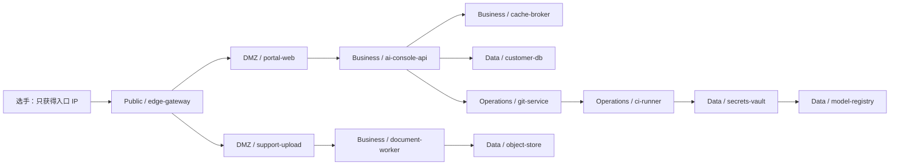
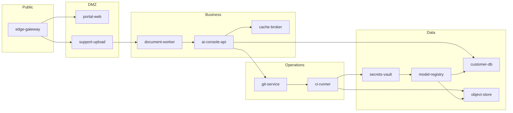

# YINYU 综合渗透靶场场景设计文档：AI 企业业务攻防演练

> 面向对象：负责实现 Docker 镜像、Compose/启动脚本、漏洞服务和种子数据的 Agent。
> 适用模块：GZCTF 综合渗透 `Penetration` 赛制。
> 设计目标：构建一个真实、可解释、可评分、可多队隔离部署的 AI 企业综合渗透环境，而不是简单堆漏洞的演示靶场。
> 重要架构约束：存储节点地址、镜像仓库地址、选手入口地址都可能动态变化，任何 Docker 镜像、环境模板、脚本、题目文案都不得写死主服务器 IP、存储服务器 IP 或 Worker 节点 IP。

## 1. 总体定位

场景名称建议为：

**NebulaMind AI Corp 内网安全评估**

业务背景：

NebulaMind 是一家提供企业级 AI 知识库、智能客服、模型微调、数据标注和推理网关服务的科技公司。公司存在外部官网、客户控制台、模型资源中心、标注平台、CI/CD、对象存储、内部数据服务、运维面板和核心数据库。选手作为授权安全测试人员，只获得一个入口 IP，需要通过外网打点、凭据收集、横向移动、服务利用、数据访问和内网突破逐步获取 Flag。

体验目标：

- 选手端只看到题号、题目描述、入口 IP 和重置按钮，不展示“所属模块、入口目标、得分点几、模块几、内网拓扑”等管理字段。
- 初始只给一个节点服务器地址或入口 IP，不给端口列表；选手需要自行扫描。
- 综合渗透环境不采用端口级代理思路；它应基于分布式节点调度，给每支队伍分配一个 Worker 节点，在该节点上部署该队独立的多网段环境。
- 选手拿到的是该队环境在 Worker 节点上的入口地址。公网端口池只用于普通 CTF 端口级题目，不作为综合渗透整体架构的基础假设。
- 所有漏洞必须有业务逻辑和数据线索支撑，禁止“打开页面直接给 Flag”或“纯脑洞偏怪题”。

## 2. 平台架构与动态地址硬约束

### 2.1 不允许写死的内容

实现 Docker 场景时禁止写死以下值：

- 主服务器地址，如 `10.0.7.118`。
- 存储节点地址，如 `10.0.7.x:5000`。
- Worker 节点地址，如 `10.0.7.125`。
- 某队具体网段，如 `10.60.0.0/24`、`10.61.0.0/24`。
- 某容器固定运行 IP，除非由渗透编排模型中的 `StaticIp` 明确注入。
- 平台公网域名、HTTP 协议前缀、端口池范围。

所有这些地址必须由平台在部署时动态提供。Docker 实现只能使用：

- 平台注入的环境变量。
- 容器内 DNS 服务名。
- Docker 网络内的服务别名。
- `gzctf-internal://` 形式的内部镜像引用。
- 渗透编排模型生成的 `NetworkAttachments`、静态 IP、动态 Flag、入口地址。

### 2.2 镜像仓库与存储节点约束

当前平台支持通过节点管理选择镜像存储节点，默认可为主服务器。存储节点可能切换，因此 Docker 场景实现必须满足：

- 镜像模板注册时只记录逻辑镜像名或内部引用，不写死 registry 地址。
- 需要引用内部仓库镜像时，使用平台提供的内部镜像引用，例如 `gzctf-internal://pentest/nebulamind-web:2026.06`。
- 拉取镜像前由平台解析当前活动存储节点，即 `WorkerNode.IsStorageNode + HostAddress + RegistryPort`。
- 容器启动脚本不得自行 `docker pull 10.x.x.x:5000/...`。
- 文档里的 IP 只作为逻辑示意，不得复制进模板配置。

### 2.3 分布式节点调度约束

综合渗透环境的正确调度逻辑：

1. 主服务根据队伍、比赛、节点容量和调度策略选择一个参与调度的 Worker 节点。
2. 同一支队伍的同一套综合渗透环境必须整体部署在同一个 Worker 节点上。
3. 每支队伍获得自己的独立 Docker 网络、容器、Flag 和运行记录。
4. 选手入口显示为该队被调度到的 Worker 节点地址，不应显示不存在的容器内网 IP。
5. 环境中的内网地址只在容器间使用，不能作为选手直接访问入口。

实现方需要保证容器镜像不依赖“主服务器一定参与调度”这个前提。

## 3. 网络拓扑设计

### 3.1 网络层级

建议设置 5 个逻辑安全域，每个队伍部署时由平台生成实际网段：

| 安全域 | 建议名称 | ZoneType | 默认策略 | 作用 |
|---|---|---|---|---|
| Public | `public-edge` | Public | DenyAll | 外部入口与公开业务 |
| DMZ | `dmz-service` | Dmz | DenyAll | 对外服务后的业务隔离区 |
| Business | `biz-core` | Business | DenyAll | AI 产品后台和员工系统 |
| Data | `data-plane` | Data | DenyAll | 数据库、对象存储、模型仓库 |
| Operations | `ops-control` | Operations | DenyAll | CI/CD、监控、运维与跳板 |

平台实际部署时应形成：

### 3.2 访问策略

首版设计按网络级隔离和显式路由组织，不依赖端口级 ACL：

- Public 只能访问 DMZ 中被设计为入口的服务。
- DMZ 默认不能直接访问 Data。
- DMZ 中获得 RCE 或凭据后，可通过业务服务进入 Business。
- Business 可访问 Data 的特定服务，但题目上不向选手展示端口规则。
- Operations 需要凭据或代码执行链路才能进入。
- Data 是最终目标区，放置高分 Flag。

每条可达路径都必须有业务线索，不允许“扫全网碰运气”。例如：

- 官网 JS 泄露控制台 API 路径。
- 上传服务日志泄露 worker 队列名称。
- 控制台配置泄露 Git 内部地址。
- Git CI 变量泄露对象存储凭据。
- 对象存储中模型配置泄露数据库服务名。

## 4. 容器与服务清单

### 4.1 节点总览

建议一键生成 10 个服务节点，覆盖简单、中等、高级漏洞：

| 节点 Key | 展示名 | 安全域 | 类型 | 镜像建议 | 资源建议 | Flag 数 |
|---|---|---|---|---|---|---|
| `edge-gateway` | 外部入口网关 | Public | Entry | nginx/alpine 定制 | 0.25C/128M | 1 |
| `portal-web` | 企业官网与资源中心 | DMZ | Web | node 或 nginx+php | 0.5C/256M | 3 |
| `support-upload` | 客户支持上传中心 | DMZ | Web | python flask | 0.5C/256M | 3 |
| `ai-console-api` | AI 控制台 API | Business | Service | node/fastapi | 1C/512M | 3 |
| `document-worker` | 文档解析 Worker | Business | Service | python celery/rq | 0.75C/512M | 2 |
| `cache-broker` | 任务缓存与消息队列 | Business | Service | redis 定制 | 0.25C/128M | 2 |
| `git-service` | 内部 Git 服务 | Operations | Service | gitea 或轻量 git-http | 1C/512M | 3 |
| `ci-runner` | CI 构建执行节点 | Operations | Service | dockerless runner mock | 1C/512M | 2 |
| `customer-db` | 客户与标注数据库 | Data | Database | postgres/mysql 定制 | 1C/768M | 3 |
| `object-store` | 对象存储与模型资源 | Data | Service | minio 或 mock-s3 | 0.75C/512M | 3 |
| `secrets-vault` | 密钥配置服务 | Data | Service | vault mock | 0.5C/256M | 2 |
| `model-registry` | 模型仓库与推理配置 | Data | Service | python/http | 0.5C/256M | 2 |

总 Flag 数：29 个。

总分建议：3000 分。

### 4.2 服务真实性要求

每个服务都必须像真实企业系统：

- 企业官网要有首页、产品页、客户案例、新闻、下载中心、登录入口、静态资源和合理导航。
- AI 控制台要有模型、知识库、API Key、数据集、推理任务、审计日志等页面或 API。
- 数据库必须包含真实结构化数据，例如客户、合同、标注任务、模型版本、员工、工单、审计日志、API 调用记录。
- 对象存储必须包含真实文件，例如 PDF 合同、模型配置、训练日志、标注样本、备份包、头像、导出报表。
- Git 服务必须包含至少 3 个仓库，含历史提交、配置文件、README、issue/ci 文件。
- 运维服务必须有日志、任务、runner 状态、构建产物，不能只有一个返回 Flag 的接口。

## 5. 分值与难度分布

### 5.1 难度等级

| 等级 | 分值范围 | 占比 | 特征 |
|---|---:|---:|---|
| 入门 | 50-100 | 25% | 扫描、隐藏目录、robots、备份文件、弱配置、信息泄露 |
| 基础利用 | 120-180 | 30% | 文件上传、路径穿越、SSRF、JWT 弱密钥、越权、Git 泄露 |
| 横向移动 | 200-280 | 25% | 凭据复用、内网服务访问、队列注入、CI 变量泄露、对象存储错误权限 |
| 核心突破 | 320-450 | 15% | RCE 链、服务间信任滥用、数据库权限提升、密钥服务访问 |
| 终局 | 500 | 5% | 串联前面多条线索进入模型仓库或核心数据域 |

### 5.2 Flag 命名与动态注入

所有 Flag 必须支持平台动态注入。

推荐命名：

- `FLAG_PUBLIC_DISCOVERY`
- `FLAG_PORTAL_BACKUP`
- `FLAG_UPLOAD_BYPASS`
- `FLAG_API_IDOR`
- `FLAG_GIT_SECRET`
- `FLAG_CI_RUNNER_RCE`
- `FLAG_DB_CUSTOMER_CORE`
- `FLAG_MODEL_REGISTRY_FINAL`

容器实现约束：

- Flag 不能硬编码到镜像层。
- Flag 通过环境变量或启动时挂载文件注入。
- Flag 文件权限要和题目逻辑匹配。例如普通信息泄露 Flag 可在 Web 静态目录备份中；高分 Flag 应在数据库、对象存储或受限服务内。
- 动态 Flag 模板由平台负责生成，容器只读取环境变量。

## 6. 具体题目链路设计

### 6.1 阶段 A：外网发现与公开信息

选手初始信息：

> 你获得了 NebulaMind AI Corp 的授权测试入口地址。请从公开服务开始评估，逐步获取内网数据库与模型仓库中的敏感标识。

选手只看到入口 IP，不给端口。

#### A1. 端口扫描与官网入口

- 服务：`edge-gateway` 转发到 `portal-web`。
- 漏洞类型：开放端口识别、HTTP 指纹。
- 难度：入门。
- 分值：50。
- Flag：`FLAG_PUBLIC_DISCOVERY`。
- 设计：
  - 入口节点开放 80 和 8080 两个对外服务。
  - 80 是企业官网。
  - 8080 是“资源下载镜像站”，页面很正常，但页脚 build 信息泄露 `/status/build-info`。
  - build-info 中有第一个低分 Flag 和部分服务版本信息。
- 质量要求：
  - 页面视觉要像正式 AI 企业官网，不允许默认 nginx 页面。
  - build-info 要像真实运维接口，包含 commit、buildTime、serviceName。

#### A2. 隐藏目录与历史白皮书

- 服务：`portal-web`。
- 漏洞类型：隐藏目录、目录扫描。
- 难度：入门。
- 分值：80。
- Flag：`FLAG_PORTAL_HIDDEN_DOCS`。
- 设计：
  - `robots.txt` 提示 `/resources/archive/` 不应被索引。
  - 目录中有旧版白皮书 PDF、客户案例压缩包、API 域名线索。
  - Flag 放在旧版白皮书 PDF 元数据或导出 HTML 注释中。
- 逻辑线索：
  - 白皮书提到“内部知识库 Console API 与门户共用 SSO 客户端”。

#### A3. 前端 Source Map 泄露

- 服务：`portal-web`。
- 漏洞类型：Source Map 泄露。
- 难度：入门到基础。
- 分值：120。
- Flag：`FLAG_PORTAL_SOURCEMAP`。
- 设计：
  - 生产 JS 保留 `.map`。
  - map 中出现 `/api/v1/console/session/bootstrap`、`X-NM-Trace`、内部 API 名称。
  - Flag 不直接在 JS 明文中，应藏在 sourcemap 的 `sourcesContent` 注释里。
- 后续线索：
  - 暴露 `ai-console-api` 的路径和测试租户 ID。

### 6.2 阶段 B：DMZ 服务利用

#### B1. 文件上传 MIME 绕过

- 服务：`support-upload`。
- 漏洞类型：文件上传、MIME/扩展名校验绕过。
- 难度：基础。
- 分值：150。
- Flag：`FLAG_UPLOAD_MIME_BYPASS`。
- 设计：
  - 客户支持中心允许上传“日志包”。
  - 后端只检查 MIME，不检查真实内容。
  - 上传 `.phar.jpg` 或双扩展文件后，可访问解析结果页面。
  - 不要求直接 getshell；目标是读取上传处理日志中的 Flag。
- 真实感：
  - 页面有工单号、客户名称、上传状态、解析报告。
  - 上传成功后返回任务 ID，不直接返回路径。

#### B2. 路径穿越读取处理队列配置

- 服务：`support-upload`。
- 漏洞类型：路径穿越。
- 难度：基础。
- 分值：180。
- Flag：`FLAG_UPLOAD_PATH_TRAVERSAL`。
- 设计：
  - `/download?file=` 存在规范化缺陷。
  - 可读取 `/app/config/worker.yml`。
  - `worker.yml` 包含队列服务名 `cache-broker`、内部任务类型、低权限 worker token。
- 后续线索：
  - worker token 可用于访问 `document-worker` 的任务状态 API。

#### B3. 文档解析 SSRF

- 服务：`support-upload` -> `document-worker`。
- 漏洞类型：SSRF。
- 难度：中等。
- 分值：220。
- Flag：`FLAG_WORKER_SSRF_METADATA`。
- 设计：
  - 上传中心允许提交远程 URL 给文档解析 Worker。
  - Worker 会抓取 URL 并解析。
  - 可 SSRF 到 Business 网段中的 `ai-console-api` 健康接口或 metadata mock。
  - 不能直接打 Data 网段。
- 逻辑：
  - 通过 SSRF 获取内部 API 的服务发现信息和临时 trace token。

### 6.3 阶段 C：业务后台与身份越权

#### C1. 测试租户 IDOR

- 服务：`ai-console-api`。
- 漏洞类型：IDOR/越权访问。
- 难度：基础到中等。
- 分值：180。
- Flag：`FLAG_API_TENANT_IDOR`。
- 设计：
  - API 使用 `tenantId` 参数获取知识库列表。
  - 前端 sourcemap 泄露测试租户 ID。
  - 后端缺少租户归属校验，可枚举另一个客户知识库摘要。
- 数据要求：
  - 至少 30 条知识库记录，包含客户名、数据集、更新时间。
  - Flag 在某条“废弃知识库”的描述字段里，不要在第一条。

#### C2. JWT 弱密钥与角色提升

- 服务：`ai-console-api`。
- 漏洞类型：JWT 弱密钥。
- 难度：中等。
- 分值：240。
- Flag：`FLAG_API_JWT_ROLE`。
- 设计：
  - 测试环境仍使用弱 JWT secret，例如从泄露配置中得到候选。
  - 伪造 `role=operator` 后访问 `/api/v1/admin/audit/export`。
  - 导出审计日志中包含 Flag 和 Git 内部仓库地址。
- 注意：
  - 不能设计成纯爆破，需要前面配置泄露提供候选密钥。

#### C3. GraphQL 查询深度限制缺失

- 服务：`ai-console-api`。
- 漏洞类型：GraphQL introspection / 查询缺陷。
- 难度：中等。
- 分值：260。
- Flag：`FLAG_API_GRAPHQL_AUDIT`。
- 设计：
  - 控制台有 `/graphql`。
  - 开启 introspection。
  - 可查询内部 `integrationSecrets(masked:false)`，但要求 operator token。
  - 返回对象存储 bucket 名、Git service URL 和一个低权限 access key。
- 业务合理性：
  - GraphQL 是内部运营后台，原本只给内网使用。

### 6.4 阶段 D：对象存储、缓存与异步任务

#### D1. Redis 未鉴权任务队列

- 服务：`cache-broker`。
- 漏洞类型：未鉴权 Redis / 队列注入。
- 难度：中等。
- 分值：220。
- Flag：`FLAG_REDIS_QUEUE_INFO`。
- 设计：
  - 只能从 Business 网段访问，不对 Public 暴露。
  - 通过 SSRF 或 worker token 获取访问路径。
  - Redis 中有队列任务、worker 心跳、任务结果。
  - Flag 藏在旧任务结果 JSON 中。
- 注意：
  - 不要求真实 Redis RCE，避免题目偏怪。

#### D2. 对象存储 Bucket 权限错误

- 服务：`object-store`。
- 漏洞类型：对象存储错误权限。
- 难度：中等。
- 分值：240。
- Flag：`FLAG_OBJECT_BUCKET_POLICY`。
- 设计：
  - 低权限 access key 可列出 `public-model-artifacts`，不能列出 `customer-private`。
  - `public-model-artifacts` 中误放 `exports/tenant-summary-2026.csv`。
  - CSV 中有 Flag 和数据库表名线索。
- 真实数据：
  - 至少 100 行样例对象，目录结构真实。
  - 文件大小适中，避免加载慢。

#### D3. 文档解析 Worker 命令注入

- 服务：`document-worker`。
- 漏洞类型：命令注入。
- 难度：较高。
- 分值：320。
- Flag：`FLAG_WORKER_COMMAND_INJECTION`。
- 设计：
  - Worker 处理文档转换时调用 `convert --profile {profile}`。
  - profile 参数来自任务 JSON，过滤不严格。
  - 选手通过队列注入任务触发命令执行。
  - Flag 在 worker 容器内 `/opt/nebulamind/worker.flag`。
- 限制：
  - 该 RCE 只能进入 Worker 容器，不直接给 Data 网段最高权限。
  - Worker 内应有可发现的服务账号凭据，用于下一步。

### 6.5 阶段 E：Git 与 CI/CD

#### E1. Git 仓库泄露低权限凭据

- 服务：`git-service`。
- 漏洞类型：内部 Git 凭据泄露。
- 难度：基础到中等。
- 分值：180。
- Flag：`FLAG_GIT_CONFIG_SECRET`。
- 设计：
  - Git 服务只能从 Business/Operations 路径访问。
  - 仓库 `nebulamind/console-api` 的历史提交中有 `.env.example.old`。
  - 文件中有 Flag 和 CI 项目名称。
- 真实感：
  - 至少 3 个仓库：`console-api`、`doc-worker`、`infra-playbooks`。
  - 每个仓库至少 8 次提交，历史中有真实差异。

#### E2. CI 变量泄露

- 服务：`ci-runner`。
- 漏洞类型：CI 配置错误、变量可读。
- 难度：中等。
- 分值：260。
- Flag：`FLAG_CI_VARIABLE_LEAK`。
- 设计：
  - 通过 Git 泄露的 token 可访问 CI mock API。
  - `/api/projects/:id/variables` 错误暴露 masked 变量明文。
  - 返回对象存储高权限 key、Vault bootstrap token。

#### E3. CI Runner 任务注入

- 服务：`ci-runner`。
- 漏洞类型：构建脚本注入。
- 难度：高。
- 分值：380。
- Flag：`FLAG_CI_RUNNER_EXEC`。
- 设计：
  - 选手可通过低权限 token 触发指定分支构建。
  - CI mock 错误信任仓库中的 `.nebulaci.yml`。
  - 构建环境中有 Flag 和到 `secrets-vault` 的服务凭据。
- 限制：
  - 不需要真的启动 Docker-in-Docker；可以用安全的 mock runner 执行受控命令或模拟命令输出。
  - 必须保证不会逃逸宿主机。

### 6.6 阶段 F：数据库与核心数据

#### F1. 数据库只读凭据

- 服务：`customer-db`。
- 漏洞类型：数据库凭据复用。
- 难度：中等。
- 分值：260。
- Flag：`FLAG_DB_READONLY_CUSTOMERS`。
- 设计：
  - 从对象存储或 CI 变量得到只读账号。
  - 只读账号可查询客户与标注任务。
  - Flag 在 `security_findings` 或 `audit_exports` 表。
- 数据要求：
  - 至少 8 张表：customers、contracts、datasets、label_tasks、model_versions、api_keys、audit_logs、security_findings。
  - 至少 300 行真实风格数据。

#### F2. 数据库函数权限提升

- 服务：`customer-db`。
- 漏洞类型：PostgreSQL SECURITY DEFINER 或 MySQL 存储过程权限错误。
- 难度：高。
- 分值：360。
- Flag：`FLAG_DB_PRIVESC_FUNCTION`。
- 设计：
  - 只读用户可执行一个错误授权的导出函数。
  - 函数可以读取 `internal_exports` 中的数据。
  - Flag 在导出结果。
- 注意：
  - 不要设计为数据库主机 RCE，保持业务权限提升即可。

#### F3. 核心客户数据 Flag

- 服务：`customer-db`。
- 漏洞类型：链路终点数据访问。
- 难度：高。
- 分值：420。
- Flag：`FLAG_DB_CORE_CUSTOMER_DATA`。
- 设计：
  - 需要结合 CI 高权限变量或 Vault token 获取更高权限数据库账号。
  - 查询 `regulated_model_training_records`。
  - Flag 放在合规审计字段中。
- 题目描述建议：
  - “获取核心客户训练数据审计记录中的 flag。”

### 6.7 阶段 G：密钥服务与模型仓库终局

#### G1. Vault Bootstrap Token 滥用

- 服务：`secrets-vault`。
- 漏洞类型：密钥管理策略错误。
- 难度：高。
- 分值：360。
- Flag：`FLAG_VAULT_POLICY_BYPASS`。
- 设计：
  - CI 变量中有 bootstrap token。
  - token 权限过大，可读取 `secret/data/nebulamind/model-registry`.
  - 读取结果中有 Flag 和模型仓库管理员凭据。
- 实现建议：
  - 可以做轻量 Vault mock，不必部署真实 Vault。
  - API 风格要接近 Vault，例如 `/v1/secret/data/...`。

#### G2. 模型仓库越权下载

- 服务：`model-registry`。
- 漏洞类型：访问控制缺陷。
- 难度：高。
- 分值：420。
- Flag：`FLAG_MODEL_REGISTRY_ADMIN`。
- 设计：
  - 使用 Vault 中得到的 admin token。
  - 模型仓库 API 可列出私有模型版本。
  - Flag 在 `recommendation-v4-private` 的 manifest。
- 真实感：
  - 模型 manifest 包含参数量、训练集、评估指标、SHA256、签名信息。

#### G3. 终局：模型供应链审计

- 服务：`model-registry` + `object-store` + `customer-db`。
- 漏洞类型：多系统关联。
- 难度：终局。
- 分值：500。
- Flag：`FLAG_FINAL_MODEL_SUPPLY_CHAIN`。
- 设计：
  - 需要从模型 manifest 找到训练产物对象路径。
  - 从对象存储下载训练日志。
  - 从数据库查询对应审计记录。
  - 三者拼接出最终 Flag 或在最终审计记录中读取 Flag。
- 题目描述建议：
  - “获取私有推荐模型供应链审计记录中的最终 flag。”
- 质量要求：
  - 终局不能靠单点漏洞直接拿到，必须至少串联 Git/CI/Vault/DB 或 Worker/Object/DB 两条链路中的关键线索。

## 7. 每个网段内服务和 Flag 分布

### Public / `public-edge`

| 服务 | Flag | 分值 |
|---|---|---:|
| edge-gateway | A1 端口与构建信息 | 50 |

### DMZ / `dmz-service`

| 服务 | Flag | 分值 |
|---|---|---:|
| portal-web | A2 隐藏目录 | 80 |
| portal-web | A3 Source Map | 120 |
| support-upload | B1 上传绕过 | 150 |
| support-upload | B2 路径穿越 | 180 |
| support-upload/document-worker | B3 SSRF | 220 |

### Business / `biz-core`

| 服务 | Flag | 分值 |
|---|---|---:|
| ai-console-api | C1 IDOR | 180 |
| ai-console-api | C2 JWT | 240 |
| ai-console-api | C3 GraphQL | 260 |
| cache-broker | D1 队列信息泄露 | 220 |
| document-worker | D3 命令注入 | 320 |

### Operations / `ops-control`

| 服务 | Flag | 分值 |
|---|---|---:|
| git-service | E1 Git 历史泄露 | 180 |
| ci-runner | E2 CI 变量泄露 | 260 |
| ci-runner | E3 Runner 执行 | 380 |

### Data / `data-plane`

| 服务 | Flag | 分值 |
|---|---|---:|
| object-store | D2 Bucket 权限错误 | 240 |
| customer-db | F1 只读数据 | 260 |
| customer-db | F2 数据库函数权限提升 | 360 |
| customer-db | F3 核心客户数据 | 420 |
| secrets-vault | G1 Vault 策略错误 | 360 |
| model-registry | G2 模型仓库越权 | 420 |
| model-registry/object-store/customer-db | G3 终局 | 500 |

分值合计：5110。实际上线可按比赛时长压缩到 3000，例如对所有分值乘以 0.6 后四舍五入到 10。

建议正式分值表：

| 阶段 | 原始分 | 上线分 |
|---|---:|---:|
| A1 | 50 | 50 |
| A2 | 80 | 80 |
| A3 | 120 | 100 |
| B1 | 150 | 120 |
| B2 | 180 | 150 |
| B3 | 220 | 180 |
| C1 | 180 | 150 |
| C2 | 240 | 200 |
| C3 | 260 | 220 |
| D1 | 220 | 180 |
| D2 | 240 | 200 |
| D3 | 320 | 260 |
| E1 | 180 | 150 |
| E2 | 260 | 220 |
| E3 | 380 | 320 |
| F1 | 260 | 220 |
| F2 | 360 | 300 |
| F3 | 420 | 360 |
| G1 | 360 | 300 |
| G2 | 420 | 360 |
| G3 | 500 | 450 |

上线总分：4770。若需要 3000 总分，可以保留 18 个 Flag，删除或合并 A1、D1、F1 这类冗余项。

## 8. 编排模型配置建议

### 8.1 Network 配置

建议拓扑 key：

- `net-public-edge`
- `net-dmz-service`
- `net-biz-core`
- `net-ops-control`
- `net-data-plane`

配置：

- `BaseCidr` 由管理员在平台设置，例如 `10.60.0.0/12`，但 Docker 镜像不得假设这个值。
- `TeamSubnetPrefix` 建议 `/24` 或更大。
- `NetworkSubnetPrefix` 建议 `/28`，每网段可容纳当前服务规模。
- 每个网络 `DefaultPolicy=DenyAll`。
- `public-edge` 设置 `IsEntry=true`。

### 8.2 Node 配置

每个节点至少包含：

- `TopologyKey`：稳定 key。
- `PlayerAlias`：选手可见简短名称，例如“题目 01”或“入口服务”。
- `PlayerDescription`：选手题目描述，不包含内网拓扑字段。
- `ImageTemplateId`：对应 Docker 镜像模板。
- `PublishPort`：只给 `edge-gateway` 或入口服务开启。综合渗透整体不应给每个内部服务单独发布公网端口。
- `AllowRouting`：跳板或路由节点开启。
- `HealthCheck`：每个关键服务必须有健康检查。

### 8.3 Interface 配置

多网卡建议：

- `edge-gateway`：连接 `public-edge` 与 `dmz-service`，允许把选手流量导向公开服务。
- `portal-web`：连接 `dmz-service`。
- `support-upload`：连接 `dmz-service`，可通过业务逻辑访问 `document-worker`。
- `document-worker`：连接 `dmz-service` 与 `biz-core`。
- `ai-console-api`：连接 `biz-core` 与 `data-plane`。
- `git-service`、`ci-runner`：连接 `ops-control`，必要时 `ci-runner` 连接 `data-plane`。
- `customer-db`、`object-store`、`secrets-vault`、`model-registry`：连接 `data-plane`。

### 8.4 Edge / Access Policy 配置

建议边：

| Source | Target | Mode | 说明 |
|---|---|---|---|
| edge-gateway | portal-web | Both | 公开官网 |
| edge-gateway | support-upload | Both | 客户支持入口 |
| support-upload | document-worker | Both | 上传解析链路 |
| document-worker | ai-console-api | RuntimeRoute | SSRF/worker 内网访问 |
| ai-console-api | cache-broker | RuntimeRoute | 后台队列 |
| ai-console-api | customer-db | RuntimeRoute | 业务数据库 |
| ai-console-api | git-service | RuntimeRoute | 内部集成 |
| git-service | ci-runner | RuntimeRoute | CI 链路 |
| ci-runner | secrets-vault | RuntimeRoute | 构建密钥 |
| ci-runner | object-store | RuntimeRoute | 构建产物 |
| secrets-vault | model-registry | RuntimeRoute | 模型仓库凭据 |
| model-registry | object-store | RuntimeRoute | 模型产物 |
| model-registry | customer-db | RuntimeRoute | 模型审计 |

备注：

- 端口字段可填 `any` 或用于计划说明，但首版网络级隔离不以端口级 ACL 做安全边界。
- `HintOnly` 只用于纯展示线索，正式可达路径应使用 `RuntimeRoute` 或 `Both`。

## 9. 镜像实现标准

### 9.1 基础要求

每个镜像必须：

- 使用明确版本的基础镜像，不使用 `latest`。
- 以非 root 用户运行业务进程，除非漏洞设计明确需要 root 权限且在容器内安全隔离。
- 暴露最小必要端口。
- 支持通过环境变量注入 Flag、服务地址、凭据、队伍 ID、随机盐。
- 启动脚本幂等，容器重启后数据可重新初始化到同一队伍状态。
- 日志输出到 stdout/stderr，便于平台收集。
- 提供健康检查命令，例如 `/healthz`、`pg_isready`、`redis-cli ping`、`curl localhost/health`。

### 9.2 数据真实性标准

生成数据必须满足：

- 员工名、客户名、工单、合同、模型版本、API key、日志时间线相互一致。
- 重要线索应散落在合理位置，例如 commit 历史、配置文件、审计日志、导出报表。
- 不得出现“flag.txt 放在根目录让人扫到”这种低质量题，除非它是明确的入门题且有业务解释。
- 简单漏洞也要有真实性。例如隐藏目录中应有真实白皮书、备份目录、资源索引，而不是空目录加 Flag。

### 9.3 安全边界

实现漏洞时必须保证：

- 不允许容器逃逸宿主机。
- 不挂载 Docker socket。
- 不使用特权容器。
- 不允许选手通过题目漏洞访问平台数据库、平台 Redis、平台文件目录。
- CI runner、命令注入类题目必须限制在容器内部或 mock sandbox。
- 网络扫描范围应被平台网络隔离限制在该队伍环境内。

## 10. 题目描述标准

选手端描述应简洁，不给过多提示，但要有关键目标。

示例：

- “从公开入口识别 NebulaMind 的资源镜像服务，并获取构建信息中的 flag。”
- “获取客户支持上传中心历史配置中的 flag。”
- “获取 AI 控制台测试租户的知识库泄露 flag。”
- “获取内网数据库中的客户审计 flag。”
- “获取私有模型仓库供应链审计记录中的最终 flag。”

不应出现：

- “所属模块：DMZ”
- “入口目标：portal-web”
- “请攻击 10.60.1.5:8080”
- “得分点 3”
- “先打 SSRF 再去 Redis”

内部服务名可以作为选手通过枚举获得的线索出现，但不能直接作为 UI 固定字段暴露。

## 11. 管理端一键生成标准

一键生成不应只是生成 6 个普通镜像和几条边。它应生成：

- 5 个安全域。
- 10-12 个服务节点。
- 每个服务节点 2-3 个得分项或至少一个关键得分项。
- 合理的位置布局：Public 在左，DMZ 左中，Business 中部，Operations 右上，Data 右下。
- 每条边有业务说明。
- 每个节点有 `PlayerAlias` 和管理端描述。
- 每个节点有资源限制、健康检查、镜像模板引用。
- 每个 Flag 有分类、分值、前置依赖和是否可见配置。

默认布局建议：

## 12. 验收清单

### 12.1 功能验收

- 每支队伍部署后获得不同 Flag。
- 每支队伍部署后网络互相隔离。
- 主服务器不参与调度时，环境仍可部署到 Worker 节点。
- 选手入口显示 Worker 节点入口地址，而不是容器内部 IP。
- 选手只通过入口 IP 开始，不需要平台显示内部端口或拓扑。
- 重置环境后 Flag 与数据库记录一致。
- 销毁环境后容器、网络、路由、代理记录无残留。

### 12.2 动态地址验收

- 搜索 Dockerfile、entrypoint、compose、seed 脚本，不存在写死 `10.0.7.`、`10.48.`、`127.0.0.1:5000` 作为业务依赖。
- 切换存储节点后，镜像拉取仍由平台动态解析。
- Worker 节点地址变化后，选手入口随运行环境更新。
- 镜像内部不直接访问平台服务 IP。

### 12.3 题目质量验收

- 每个 Flag 都有明确漏洞路径。
- 每个漏洞都有业务解释。
- 简单题、中等题、高级题分布合理。
- 不重复考点：上传、目录、SSRF、JWT、IDOR、GraphQL、对象存储、Git、CI、DB、Vault、模型仓库各有侧重。
- 高分题必须依赖前置线索，不能从初始入口直接拿到。
- 终局题需要多系统关联。

### 12.4 性能验收

- 单队完整环境 CPU 默认请求不超过 8C，总内存不超过 5G。
- 10 队并发部署时，镜像拉取应命中节点缓存或内部 registry。
- 单个 Web 服务首页加载小于 500ms。
- 数据库 seed 小于 10 秒。
- 所有健康检查在 60 秒内通过。

### 12.5 安全验收

- 无特权容器。
- 无宿主 Docker socket。
- 无宿主敏感目录挂载。
- CI/RCE 类题目不能逃逸容器。
- 容器出网按平台策略控制，不访问真实外网依赖。
- Flag 不出现在镜像历史层。

## 13. 交付物要求

实现方最终需要交付：

1. 每个服务的 Dockerfile。
2. 每个服务的 entrypoint 和 seed 脚本。
3. 每个服务的健康检查说明。
4. 镜像构建脚本，支持统一 tag。
5. 镜像模板注册清单，使用逻辑名称或内部引用。
6. 一键生成拓扑的节点/网络/边/得分项配置映射。
7. 每个 Flag 的解题路径说明，供管理员验题。
8. 最小 smoke test：
   - 所有服务启动。
   - 入口可访问。
   - 每个 Flag 的预期利用路径可获得。
   - 错误路径不会意外泄露高分 Flag。

## 14. 推荐实现节奏

### Milestone 1：骨架环境

- 完成 5 个网段、入口网关、官网、上传中心、API、数据库。
- 完成 A/B/C/F1 题目。
- 确认动态 Flag 注入、队伍隔离、入口地址正确。

### Milestone 2：横向移动

- 增加 Redis、Worker、对象存储、Git。
- 完成 D/E1 题目。
- 验证业务线索串联。

### Milestone 3：CI 与核心数据

- 增加 CI runner、Vault mock、模型仓库。
- 完成 E2/E3/G/F2/F3。
- 验证高分题前置依赖。

### Milestone 4：真实感与压测

- 补齐真实数据。
- 优化 UI、日志、PDF、报表、仓库历史。
- 做 5 队以上并发部署和销毁测试。

## 15. 关键设计底线

- 不绑死任何平台、存储、节点 IP。
- 不把内网拓扑字段展示给选手。
- 不用端口级代理模拟综合渗透整体入口。
- 不做只有 Flag 没业务的玩具容器。
- 不把所有漏洞堆在一个 Web 服务里。
- 不让一个漏洞直接绕过整条链拿终局 Flag。
- 不引入宿主机逃逸风险。
- 不让一键生成继续生成平庸的 6 个默认节点。

这套场景的核心价值不是“漏洞数量”，而是“像真实 AI 企业一样运行，又能被选手按清晰线索逐步攻破”。实现时每个 Docker 服务都应先问一句：如果这是一个真实公司的生产系统，它为什么会这样配置、为什么会留下这个线索、为什么这个权限能通向下一步。只有这个逻辑成立，题目才成立。
