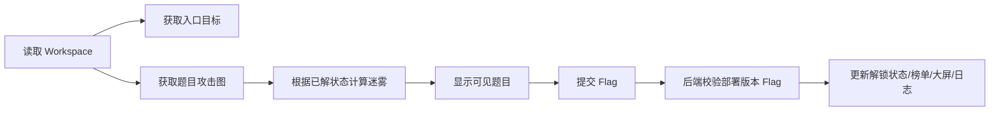

# YINYU 综合渗透编排商业化落地执行计划

> 制定日期：2026-06-18
> 适用范围：综合渗透 `Penetration` 赛制、Mixed 中的渗透子赛制、管理端低代码 Builder、选手端渗透工作台、部署/IPAM/访问策略/题目拓扑/榜单、大屏、日志链路。
> 目标标准：不是“能演示”的半成品，而是可上线、可排障、可扩展、可持续维护的商业化功能模块。

## 1. 总目标

综合渗透模块最终应成为平台内一等赛制，具备以下闭环能力：

- 管理员可以用低代码画布设计安全域、资产节点、多网卡、访问策略、得分项和任务链。
- 系统可以可靠保存、校验、发布、预览部署计划，并按队伍自动部署隔离环境。
- Docker/Fleet Agent 可以正确创建多网段、多容器、多网卡、固定 IP、端口入口和动态 Flag。
- 访问策略既能驱动选手端题目解锁，也能逐步落地为运行期网络控制，避免“画布有策略但环境不执行”的安全假象。
- 选手端不暴露底层网络细节，而是以“题目攻击图 + 战争迷雾”引导渗透路径。
- 榜单、大屏、日志、管理入口、重置、销毁、失败回滚都与现有 Jeopardy/AWDP/Theory 体验统一。
- 每个阶段都有静态质量、自动化测试、性能预算、可观测性和回滚验收。

## 2. 当前核验状态

### 2.1 已具备的基础能力

- 已有 `Penetration` 赛制模型和 Mixed 分数聚合。
- 已有安全域、节点、网卡、访问策略、得分项、队伍环境、运行节点、提交、重置实体。
- 已有 ReactFlow 管理端画布，支持安全域框、资产节点、网卡、边、属性面板和基础计划预览。
- 已有三级 IPAM：基础 CIDR -> 队伍 CIDR -> 安全域子网 -> 节点接口 IP。
- 已有本地 Docker 与 Fleet Agent 的 `NetworkAttachments[]` 多网卡协议。
- 已有按队伍部署、入口端口、动态 Flag 注入、选手提交、重置、后台访问入口。

### 2.2 已确认的关键缺陷

| 优先级 | 问题 | 影响 |
|---|---|---|
| P0 | `SaveConfig` 先删除旧拓扑并中途 `SaveChanges` | 保存失败可能丢拓扑；整套重建会导致节点/得分项 ID 改变，破坏前置依赖和动态 Flag 稳定性。 |
| P0 | 提交校验使用当前配置版本而不是队伍环境部署版本 | 发布新版本但未重新部署时，容器内 Flag 与提交校验不一致，选手正确答案也会失败。 |
| P0 | `Validate/Plan` 会先保存传入 model | 校验/预览不应破坏当前草稿；错误 model 可能污染现有配置。 |
| P0 | 保存/校验偶发 `The model field is required` | 当前可用性风险，需要从前端请求体、控制器模型绑定和部署版本一致性一起排查。 |
| P0 | 销毁失败后清空 runtime 关联 | Docker/Agent 资源可能成为孤儿，后续无法从平台追踪清理。 |
| P1 | 部署无全局锁、无幂等检查 | 多管理员重复点击可能交叉销毁/重建，影响比赛运行。 |
| P1 | `SelectWorkerNode` 绕过统一调度锁 | 并发部署可能造成容量超卖。 |
| P1 | 访问策略不生成运行期网络可达性规则 | 当前策略主要用于展示和计划，尚未闭环到 Linux bridge/veth fabric 隔离与显式路由。 |
| P1 | 选手端暴露安全域、接口 IP 等底层信息 | 不符合黑盒渗透体验，也削弱题目探索感。 |
| P1 | Workspace 安全域 CIDR 展示错误 | 多安全域都显示队伍大网段，影响理解和排障。 |
| P2 | 得分项高级字段缺少 UI | 前置依赖、动态 Flag 模板、尝试次数、可见性无法完整配置。 |
| P2 | 高危操作缺少确认、撤销、草稿保护 | 商业化可用性不足。 |
| P2 | 健康检查字段存储但不执行 | 部署后缺少自动健康判断和恢复基础。 |

## 3. 设计原则

### 3.1 业务原则

- 管理端编辑真实网络拓扑，选手端只展示题目攻击图。
- 访问策略不能只作为视觉元素；首版运行期采用方案 B 的网络级隔离思想，最终落地为平台管理的 Linux bridge/veth fabric + 显式路由，闭环到网络级可达性，不承诺端口级防火墙能力。
- 发布版本与部署版本必须分离：草稿可改，已部署环境必须按部署时版本稳定运行。
- 所有“预览/校验/计划”默认不得修改持久化配置。
- 所有高危操作必须可确认、可追踪、可回滚或至少可补偿清理。
- 前端不能出现空实现按钮；每个可见功能都必须有后端数据、接口、权限和失败态。

### 3.2 工程原则

- 保持与现有 GZCTF 架构一致，优先复用 `GameRepository`、`ParticipationRepository`、`IContainerManager`、Fleet、日志和榜单体系。
- 数据模型变更必须兼容旧数据，迁移必须可重复执行、可回滚、可在空数据和已有数据上验证。
- 每个接口返回可定位的对象级错误，例如 `nodeId/networkId/edgeId/scoreItemId`。
- 后端是事实源；前端展示状态不得自行猜测关键安全或分数逻辑。
- 大拓扑下交互必须流畅，不允许每次输入都全量重建 ReactFlow。

## 4. 目标架构

### 4.1 管理端链路


### 4.2 选手端链路



### 4.3 数据分层

- `Draft Topology`：管理员正在编辑的草稿。
- `Published Topology Version`：已发布、可部署的不可变版本快照。
- `Runtime Environment`：某队部署到某 WorkerNode 的运行实例，绑定 `PublishedVersion`。
- `Player Attack Graph`：由拓扑和得分项派生出来的选手题目图，不直接等同网络拓扑。
- `Runtime Reachability Policy`：由访问策略编译出的运行期网络级可达性规则，首版采用平台管理的 Linux bridge/veth fabric + 显式路由；协议/端口字段保留为计划说明、题目提示和长期扩展，不作为首版运行期强制边界。

## 5. 分阶段实施计划

## Phase 1：可靠保存、版本、校验、计划闭环

### 目标

先修复当前最容易导致功能报错和数据损坏的问题，让 Builder 的保存、校验、计划达到可信状态。

### 后端任务

1. 重构 `SaveConfig`
   - 使用数据库事务包裹完整保存过程。
   - 删除旧拓扑和重建新拓扑不得中途提交。
   - 捕获异常时回滚，不改变现有有效配置。
   - 返回对象级错误，不返回泛化 `common.error.encountered`。

2. 引入稳定拓扑标识
   - 为 `PenetrationNetwork/Node/Interface/Edge/ScoreItem` 新增或复用稳定业务键，例如 `TopologyKey`。
   - 前端新建对象使用 `crypto.randomUUID()` 生成临时 key，保存后后端保留 key，不在保存时重新生成。
   - 后端保存时校验 key 格式、对象类型和作用域唯一性；同一草稿配置内同类型对象 `TopologyKey` 不得重复。
   - 发布快照内也必须保证同类型对象 `TopologyKey` 唯一；不使用 `(GameId, TopologyKey)` 全局唯一约束，避免同一稳定 key 在多个发布版本中合法复用时被误拦截。
   - 保存时按 key 做 upsert，避免每次保存改变 ID。
   - 若暂不做完整 upsert，至少保证 `PrerequisiteItemIds` 在保存后按 key 重映射。
   - `PenetrationRuntimeNode.TopologyNodeId` 不能继续只依赖易变化的自增节点 ID；必须增加 `TopologyNodeKey` 或通过发布快照中的稳定 key 关联运行节点。
   - 运行中的环境读取 workspace、admin access、提交日志时，应优先按 `environment.PublishedVersion + TopologyKey` 解析对应节点，避免管理员保存草稿后运行环境失联。
   - 保存草稿不得删除正在运行环境引用的已发布拓扑快照；旧快照至少保留到所有绑定该版本的环境停止并完成清理。

3. 分离保存与校验/计划
   - `POST /validate` 和 `POST /plan` 支持传入 model 做临时计算，不落库。
   - 无 body 时使用当前已保存草稿。
   - 前端点击“校验/计划”不再自动覆盖草稿。

4. 修复模型绑定错误
   - 检查 `PenetrationConfigModel` 必填字段与前端 `normalizeConfig`。
   - 确保 `PUT/POST` 请求始终设置 JSON body 和 `Content-Type: application/json`。
   - 控制器对空 body、空列表、枚举错误给出明确中文错误。
   - 加入集成测试覆盖保存、校验、计划、发布。

5. 修复 Flag 版本一致性
   - 提交校验使用 `environment.PublishedVersion`。
   - 动态 Flag 注入、计划预览、提交校验三者统一使用同一版本来源。
   - 发布新版本未部署时，选手继续按旧环境版本提交。

6. 修复 Workspace CIDR
   - 复用 `BuildNetworkSubnets(config, teamIndex, networkNames)`。
   - 每个安全域返回实际队伍安全域子网。
   - 如果选手端改成黑盒视图，CIDR 仅给管理员或调试模式。

7. 明确草稿、发布快照、运行环境隔离
   - `GetWorkspace`、`Submit`、`GetAdminAccess`、运行节点日志等运行期读取必须基于 `environment.PublishedVersion` 对应的发布快照，而不是当前草稿。
   - 当前 `PenetrationConfig` 可作为草稿容器，但发布时必须生成不可变快照，快照内容包括网络、节点、网卡、边、得分项、IPAM 参数和 Flag 模板。
   - 快照采用独立 `PenetrationPublishedSnapshot` 表存储，字段至少包含 `GameId`、`PublishedVersion`、`SnapshotJson`、`SnapshotHash`、`CreatedAt`、`CreatedBy`，并建立 `(GameId, PublishedVersion)` 唯一索引。
   - 快照内容首版以 JSON 序列化存储，避免为每个版本拆出大量子表；JSON schema 由后端模型和集成测试锁定，后续如需查询优化再拆分索引字段。
   - `GetWorkspace`、`Submit`、`GetAdminAccess`、部署计划和运行观测统一通过 `environment.PublishedVersion` 读取快照；若快照缺失，应把环境标为不可恢复错误并阻止继续提交，不能回退到当前草稿。
   - 快照清理由 Phase 2 补偿任务附带执行；清理条件是该版本下所有 `PenetrationEnvironment` 已 `Stopped/Destroyed`，且容器、网络、路由、端口入口等残留资源检查通过。
   - 草稿保存允许改变 BaseCidr、节点、得分项等字段，但不得影响已部署环境的 Flag、IP、入口、题目可见性和运行节点关联。

8. 拆分 `PenetrationService`
   - `PenetrationConfigService`：草稿 CRUD、发布快照、模型映射。
   - `PenetrationValidationService`：CIDR、模板、容量、策略、得分项校验。
   - `PenetrationPlanService`：IPAM、网络、容器、Flag、路由计划预览。
   - `PenetrationDeploymentService`：部署、停止、重建、补偿清理。
   - `PenetrationScoringService`：提交、计分、榜单、提交日志。
   - `PenetrationAttackGraphService`：Phase 4 新增，负责题目拓扑和迷雾状态。
   - `PenetrationReachabilityCompiler`：Phase 3 新增，负责编译网络级可达性和显式路由。
   - Phase 1 开始先抽离纯函数和模型映射，避免后续继续把策略和迷雾逻辑堆入单个巨型类。

### 前端任务

1. 保存状态明确化
   - 增加“未保存/已保存/保存失败/已发布版本/运行版本”状态。
   - 保存失败时不刷新画布为 fallback，避免误以为保存成功。

2. 校验/计划入口明确化
   - “校验”只检查当前画布，不保存。
   - “计划”展示样例队伍部署结果，不保存。
   - “发布”要求当前草稿已保存且校验通过。

3. 错误定位
   - 校验错误点击后自动选中对应画布对象。
   - 错误列表显示对象类型、名称、字段、原因、建议修复。

### 验收标准

- 任意保存失败不会丢失数据库中上一份有效拓扑。
- 修改草稿后点击校验/计划，不会改变数据库保存时间和版本。
- 发布后不部署，旧环境 Flag 仍可提交成功。
- 保存/校验不再出现 `The model field is required` 泛化错误。
- 前置依赖在连续保存后不丢失、不指向错误得分项。
- 比赛运行期间保存草稿，选手 workspace、runtime node 状态、admin access 不失联。
- 已部署环境绑定的发布快照可追溯，停止前不会被草稿保存覆盖或删除。

## Phase 2：部署调度、幂等、销毁和补偿清理闭环

### 目标

让“发布 -> 部署 -> 运行 -> 重建 -> 停止 -> 清理”达到比赛现场可用标准。

### 后端任务

1. 部署锁
   - 以 `pentest:deploy:{gameId}` 为粒度加分布式锁。
   - 同一比赛部署、停止、重建互斥。
   - 返回“已有部署任务进行中”，而不是并发执行。

2. 幂等部署
   - 若队伍环境 `PublishedVersion == config.PublishedVersion` 且所有 runtime 节点 Running，则跳过。
   - 提供“强制重建”开关。
   - 管理端部署按钮显示本次将新增/跳过/重建多少队伍。

3. 统一调度
   - 不再用独立 `SelectWorkerNode` 直接读库决定容量。
   - 复用 Fleet 调度锁和容量预留。
   - 保证同一队所有容器落在同一 WorkerNode。
   - 需要支持“预留 N 个 Docker 容器容量”的队伍级调度，而不是逐容器分散调度。
   - 修复 `QueueManager.ProcessPendingAsync`：Pending target 分配节点后不能只改为 Running，必须触发实际容器/VM 创建流程，或明确队列只负责调度并由独立 Worker 消费 `Assigned` 状态。
   - 队列状态建议改为 `Pending -> Assigned -> Creating -> Running/Failed/Cancelled`，避免“Running 但资源未创建”的语义错误。

4. 部署事务边界
   - 数据库记录采用环境级状态机：`Pending -> CreatingNetworks -> CreatingContainers -> Running/Failed/CleanupPending`。
   - 外部 Docker 操作不可放进长事务，但每一步要持久化可恢复状态。
   - 部署失败时记录已创建资源清单，进入补偿清理。
   - `CreatingNetworks -> CreatingContainers` 的前置条件是该队所有 Docker 网络创建成功。
   - `CreatingNetworks -> CleanupPending`：网络创建失败时回滚已创建网络。
   - `CreatingContainers -> Running`：所有容器创建成功且基础健康检查通过。
   - `CreatingContainers -> CleanupPending`：容器部分失败时销毁已创建容器，再清理网络。
   - 每个状态转换都写入系统日志和环境级 timeline，便于后台排障。

5. 销毁和补偿
   - 容器销毁失败时不得直接清空 `ContainerId`。
   - 引入 `CleanupPending/Orphaned` 状态。
   - 后台补偿任务定期清理孤儿容器和网络。
   - 网络清理失败记录重试次数和最后错误。
   - 补偿任务每 5 分钟扫描一次 `CleanupPending/Orphaned`。
   - 单资源最大自动重试 3 次，退避间隔为 1 分钟、5 分钟、15 分钟。
   - 超过自动重试次数后标记为 `ManualCleanupRequired`，管理端显示告警和手动清理入口。

6. 重建语义修正
   - 当前 `runtime-nodes/{id}/restart` 实际重建整队，应改 UI 文案为“重建整队环境”。
   - API 可新增 `rebuild-team-by-runtime-node`，保留旧路由兼容但文案不误导。
   - 真正单节点重启作为长期能力，不混入当前闭环。

7. 健康检查
   - 短期：部署后主动探测容器状态、端口监听和可选命令探针。
   - 中期：Agent 支持健康检查执行结果上报。
   - 长期：Docker 原生 Healthcheck 或 sidecar probe。

8. 部署并行化
   - 按 WorkerNode 分组并行部署不同队伍，同一队伍内部仍按网络和容器依赖顺序执行。
   - 每个 WorkerNode 默认并行 2 队，按节点 CPU/内存/容器容量可配置为 1-4 队。
   - 单队失败不阻塞其他队伍；最终状态按队伍聚合为 Running/Failed/Partial。
   - 部署计划预估总耗时、并行度和每节点队伍分配。
   - 大规模部署必须支持取消，取消后未开始队伍保持未部署，进行中队伍进入 CleanupPending。
   - 取消操作必须二次确认，确认框显示当前已完成、进行中、未开始队伍数量，以及取消后需要清理的资源数量。
   - 取消后不可恢复同一任务，管理员必须重新发起部署；已完成队伍保持当前状态，进行中队伍进入 `CleanupPending`，未开始队伍保持 `Pending/NotDeployed`。
   - 取消结果页显示“已取消，X 队进入清理，Y 队未开始，Z 队已完成”，并持续展示清理进度和残留资源列表。

9. 节点注销资源清理
   - `NodesController.Deregister` 注销远端 WorkerNode 前必须检查该节点上的容器、VM、渗透环境和网络。
   - 默认不允许直接注销仍承载运行资源的节点；提供“强制注销并清理”显式选项。
   - 强制注销时先调用容器/VM/网络销毁流程；无法连接 Agent 时将资源标记为 `OrphanedOnRemovedNode` 并要求人工确认风险。
   - 渗透环境引用该节点时，要同步进入 `CleanupPending` 或 `Failed`，不能简单置空 `NodeId` 后丢失追踪。

10. VM 容量释放稳定性
   - 修复 `VmReadyService` / `FleetVmService.DestroyVmAsync` 中 VM 超时销毁不释放 `node.CurrentVms` 的问题。
   - Docker 与 VM 的容量释放路径保持一致：销毁成功、创建失败回滚、超时回收都必须调用 `FleetManager.ReleaseCapacity` 并持久化。
   - 虽然综合渗透首版以 Linux Docker 为主，但该修复是后续 AD/Windows 编排和平台整体调度稳定性的前置条件。

### 前端任务

1. 部署确认面板
   - 显示影响范围：队伍数、节点数、将被销毁的运行环境、预计耗时。
   - 部署、停止、强制重建必须二次确认。

2. 运行观测
   - 管理端按队伍/节点展示状态机、WorkerNode、容器 ID、网络、IP、端口、健康状态、最后错误。
   - 提供“重新清理残留资源”操作。

3. 进度日志
   - 部署过程展示步骤日志：分配网段、创建网络、创建容器、注入 Flag、生成入口、健康检查。

### 验收标准

- 双管理员同时点部署，只有一个任务执行。
- 重复点击部署不会无意义销毁 Running 环境。
- 部署中途失败后，管理端能看到失败节点和残留清理状态。
- Agent 网络异常时不会丢失容器追踪信息。
- 50 队 × 8 节点部署失败/停止后无不可追踪资源。
- Pending 队列任务被调度后会真正创建资源，不会停留在“Running 但无容器/VM”的假状态。
- 100 队 × 10 节点部署不再串行等待数十分钟，部署耗时随 WorkerNode 并行度线性下降。
- 注销节点前能阻止或清理该节点承载的渗透资源。
- VM/Docker 容量在失败、销毁、超时回收后不会泄漏。

## Phase 3：访问策略语义与网络级可达性闭环

### 目标

解决“访问策略只是画线”的问题。首版明确采用方案 B：网络级隔离 + 显式路由，最终实现为平台管理的 Linux bridge/veth fabric，而不是 Docker `Internal=true` bridge；不承诺端口级防火墙能力。协议和端口字段保留为部署计划说明、题目提示、迷雾解锁语义和长期扩展字段。

### 设计分层

1. `RouteHint`
   - 用于题目攻击图、迷雾解锁、计划说明。
   - 不承诺运行期阻断。

2. `RuntimeReachability`
   - 需要实际改变运行期网络可达性。
   - 首版强制粒度是“网络是否可达”，不是“端口是否可达”。
   - 管理端必须明确标识“网络级可达性已生效”，不得写成“端口级控制已生效”。

3. `DefaultPolicy`
   - 安全域默认策略，例如 `DenyAll` 或 `AllowInternal`。
   - 需要体现在 fabric 安全域隔离、路由生成和部署计划中。

4. `Protocol/PortRange`
   - 首版作为访问路径摘要、题目引导和未来端口级控制的配置字段。
   - 计划页必须标注“首版不按端口阻断；运行期按网络可达性执行”。

### 后端任务

1. 扩展策略模型
   - 增加 `EnforcementMode`: `HintOnly / RuntimeRoute / Both`。
   - 增加策略优先级、描述、对象定位字段。
   - 增加策略编译结果模型：哪些路由生成成功、哪些降级为提示、哪些由于拓扑不满足无法执行。

2. 技术验证 Spike
   - 验证 fabric 安全域下，不同安全域默认互不可达。
   - 验证多网卡跳板/路由节点可以通过显式路由连接指定网络。
   - 验证路由变更在本地 Docker 和 Fleet Agent 上都能部署、重建、清理。
   - 验证容器重启、队伍重建、比赛停止后路由不会残留。
   - Spike 必须覆盖以下用例并记录命令、网络拓扑和结果：同安全域容器默认可达；不同 fabric 安全域默认不可达；多网卡跳板节点启用显式路由后源到目标可达；移除显式路由后恢复不可达；容器重启后路由规则保留或由 Agent 可靠重放；队伍重建后旧 bridge/veth 和路由无残留。
   - 验收标准以网络级连通性为准，例如 `ping`、`curl` 或指定 TCP 探测可达/不可达；不得把端口级精细阻断作为首版验收项。
   - 明确不在首版做容器内端口级规则注入、自定义 Docker 网络驱动或复杂宿主机防火墙规则。

3. 可达性编译器
   - 输入：安全域、节点、接口、IPAM、访问策略。
   - 输出：每个队伍/节点/网络的 fabric bridge/veth 设置、路由节点、目标网段、下一跳和清理标签。
   - 支持 node->node、node->network、network->node、network->network。
   - 编译时先计算网络级可达性图，再检查是否存在可作为路由点的多网卡节点。
   - `Protocol/PortRange` 不参与首版运行期阻断，只进入摘要和未来扩展结果。

4. Linux bridge/veth fabric 网络
   - 非入口、非发布节点默认使用 Docker `network none`，只接入平台管理的安全域 bridge。
   - 入口/发布节点保留管理/入口网络用于外部访问，同时业务网卡仍由 fabric 接入。
   - 队伍之间仍使用独立 bridge 名、veth 名和 CIDR，路由规则必须包含 game/team/version 可追踪信息。

5. 显式路由
   - 跳板机、堡垒机、防火墙/路由器节点可以成为路由节点。
   - 路由节点必须拥有连接源/目标安全域的网卡，或满足编译器可证明的下一跳关系。
   - `PenetrationEdge.PolicyAction = Allow` 且 `EnforcementMode` 包含 `RuntimeRoute` 时，编译对应网络路由。
   - `Deny` 首版表示“不生成可达路由”，不做端口级或包级 deny 规则。
   - 显式路由可以通过 Agent 在宿主机/容器命名空间内配置；具体实现必须在 Spike 后选定，并保证可清理。

6. 跳板机转发策略
   - 默认内网节点不接入 Docker 公共网络，只拥有 fabric connected route。
   - 多网卡跳板节点的转发能力由节点属性和访问策略共同控制。
   - `JumpHost/Bastion/FirewallRouter` 默认允许作为候选路由节点，但只有存在 `RuntimeRoute` 策略时才启用对应转发。
   - 普通业务节点默认不启用转发，除非管理员显式开启“允许作为路由节点”。
   - 防火墙/路由器节点可作为策略执行点，但首版不要求容器内自动配置。

7. 策略状态
   - `HintOnly`：只用于计划、题目拓扑、迷雾解锁。
   - `RoutePlanned`：可编译成网络路由，但尚未部署。
   - `RouteApplied`：网络级可达性已部署。
   - `RouteFailed`：路由应用失败，部署计划和运行页必须显示原因。
   - `Unsupported`：策略需要端口级控制或拓扑缺少路由节点，首版无法执行。

### 前端任务

1. 访问策略属性面板
   - 清楚区分“题目解锁提示”和“网络级运行期路由”。
   - 文案明确：首版不做端口级防火墙；端口/协议只作为路径摘要与未来扩展。
   - 对不可执行策略给出原因，例如缺少多网卡路由节点、源/目标网络无法形成可达路径。

2. 计划预览
   - 每条策略显示：源、目标、协议、端口、动作、执行模式、网络路由计划、编译结果。
   - 对 `Unsupported` 策略给出补救建议：添加跳板机网卡、调整安全域、改为 HintOnly。

### 验收标准

- 管理员能明确知道哪些策略会影响运行期网络可达性，哪些只用于题目引导。
- 非入口内网安全域默认不可从外部和其他安全域直接访问。
- 只有存在显式 RuntimeRoute 且拓扑满足路由条件时，目标网络才可达。
- 协议/端口不会被误展示为首版运行期强制边界。
- 停止/重建后路由和网络可达性配置能清理，不残留跨比赛规则。

## Phase 4：选手端题目攻击图与战争迷雾体验

### 目标

把选手端从“网络拓扑列表”升级为“题目引导的黑盒渗透地图”，形成综合渗透区别于 Jeopardy 的核心体验。

### 产品设计

1. 视角
   - 选手看到的是题目模块和攻击路径，不是安全域、CIDR、网卡 IP。
   - 入口目标保留真实访问地址。
   - 内部节点只显示代号，例如 `边界服务 A`、`业务节点 B`，避免泄露底层细节。

2. 迷雾状态
   - `Hidden`：完全隐藏或显示黑雾轮廓。
   - `Revealed`：已驱散，显示模块名称和任务数量。
   - `Accessible`：可提交题目。
   - `Completed`：模块完成，向外扩散迷雾。

3. 解锁规则
   - 入口节点初始可见。
   - 以 `PolicyAction == Allow` 且 `IsRouteHint == true` 的边构建攻击图。
   - 攻击图计算不依赖 Phase 3 的 `EnforcementMode`；即使 RuntimeRoute 尚未落地，也可以先用 HintOnly/RouteHint 语义完成迷雾和题目解锁闭环。
   - 若源节点配置了 checkpoint 题目，必须完成该节点全部 checkpoint 题目后才视为源节点完成；非 checkpoint 题目可作为加分或扩展探索，不阻塞下一跳。
   - 若源节点未配置 checkpoint，默认完成该节点所有可见得分项才算完成。
   - 管理端得分项编辑 UI 必须明确提示“该节点全部 checkpoint 完成后会解锁下一跳”，避免管理员误以为任一 checkpoint 即可解锁。
   - 多条路径默认 OR 解锁；高级模式可选 AND 解锁。
   - 后端采用 BFS 最短路径深度算法：从所有入口节点出发计算每个节点最短攻击深度；不同深度路径取最短路径；同深度合流默认任一路径完成即可解锁；环路只参与可达性，不造成无限递归。
   - 断链节点默认 Hidden，并在管理端校验中提示“该节点无法从入口路径到达”。

4. 视觉效果
   - 中心为入口题目范围，周围是黑雾。
   - 完成入口后，沿连线驱散到下一模块，并驱散两者之间的雾。
   - 雾边缘应为不规则、柔和、低性能开销的 CSS/SVG mask，而不是重 WebGL。
   - 支持缩放、拖拽、重置视角、小地图。
   - 状态不能只依赖颜色区分；Hidden/Revealed/Accessible/Completed 必须同时使用图标、边框、纹理或文字摘要区分。
   - Hidden 节点应设置 `aria-hidden="true"`，可见节点支持键盘 Tab 聚焦；迷雾遮罩不得阻止屏幕阅读器读取可见节点内容。
   - 低性能设备或 `prefers-reduced-motion` 下关闭复杂雾动画，保留状态和解锁信息。

5. 重置与 Mixed 语义
   - 选手重置环境只重建容器、网络入口和 Flag 注入，不清空提交记录，也不清空迷雾状态。
   - 重置期间攻击图保持当前已解锁状态，但对应节点显示“环境重建中/入口恢复中”，完成后恢复可操作。
   - Mixed 模式下渗透题目默认以独立 Tab 展示攻击图，与 Jeopardy、AWDP、Theory 并列，不跨赛制影响其他题目可见性。
   - Mixed 模式可由管理员选择是否启用迷雾；未启用时仍使用同一后端权限过滤和题目可见性规则，只是前端呈现为列表/分组。

### 后端任务

1. 新增攻击图模型
   - `PenetrationAttackGraphModel`
   - `AttackNode`: id、displayName、depth、status、scoreSummary、position、isEntry、isCheckpointCompleted。
   - `AttackEdge`: source、target、status、label。
   - `FogState`: hidden/revealed/accessible/completed。

2. 新增字段
   - `PenetrationScoreItem.IsCheckpoint`。
   - `PenetrationNode.PlayerAlias` 或自动生成选手端代号。
   - `PenetrationNode.PlayerDescription`，区别于管理员内部说明。

3. 解锁服务
   - `PenetrationAttackGraphService`
   - 根据环境版本、拓扑版本、已 Accepted 提交计算状态。
   - 只返回该队当前应可见的数据。
   - 不把 Hidden 节点真实名称、IP、描述返回给前端。
   - 攻击图状态按 `(GameId, TeamId, PublishedVersion)` 缓存，缓存值只包含该队可见状态和安全摘要。
   - Accepted 提交、环境重置、重新部署、停止环境后失效对应队伍缓存；缓存 miss 时实时查询提交记录并执行 BFS 计算。
   - 缓存 TTL 默认 5 分钟，作为一致性兜底和内存泄漏保护；并发提交时以提交事务完成后的失效事件为准。
   - 单元测试覆盖：单线、多线不同深度、线路合并、环路、断链、checkpoint、默认全题完成解锁。

4. API
   - `GET /api/pentest/games/{gameId}/attack-graph`
   - Workspace 中可以内嵌 attack graph，也可以拆分接口按需加载。

5. 实时推送
   - 复用现有 SignalR 基础设施或新增 `PenetrationHub`。
   - Accepted 提交后向该队推送 `attackGraphUpdated`、`scoreUpdated`、`nodeUnlocked` 事件。
   - 前端收到事件后局部刷新攻击图和任务面板，不要求整页刷新。
   - 推送失败不影响提交结果；前端保留提交后主动拉取兜底。

### 前端任务

1. 地图画布
   - 复用 ReactFlow 只读模式或轻量自定义 SVG/HTML 层。
   - 支持拖拽、缩放、自动布局、节点聚焦。
   - 节点按深度分层，但入口居中，后续围绕入口呈放射布局。

2. 任务面板
   - 点击可访问节点，右侧显示题目列表、说明、提交框。
   - Hidden 节点不可点击。
   - Completed 节点显示完成效果和路径高亮。

3. 渐进动画
   - Accepted 后局部刷新 attack graph。
   - 新解锁节点从雾中显现。
   - 动画可关闭，尊重 `prefers-reduced-motion`。
   - SignalR 推送到达时触发局部驱散动画；主动拉取兜底时使用较短过渡，避免突兀。

### 验收标准

- 初始只显示入口模块。
- 完成入口 checkpoint 后，仅解锁访问策略允许的下一跳。
- 抓包不能获得未解锁节点真实题目内容、IP、描述。
- 100 个模块、300 条边时拖拽缩放保持流畅。
- 移动端至少可浏览和提交，不要求复杂编辑。
- 提交 Accepted 后不刷新页面即可看到迷雾驱散；SignalR 失败时主动拉取能在可接受延迟内更新。

## Phase 5：管理端 Builder 商业化体验

### 目标

让 Builder 从“能编辑很多表单”升级为低代码产品级体验。

### 前端任务

1. 流程指引
   - 顶部固定流程：设计草稿 -> 校验 -> 计划 -> 发布 -> 部署 -> 观测。
   - 每一步显示完成度和阻塞原因。
   - 首次进入显示“推荐从企业蓝图开始 / 从空白开始”。

2. 画布交互
   - 统一连线方式，优先 ReactFlow 原生拖拽连线。
   - 保留“连线模式”仅作为辅助模式，文案明确。
   - 安全域可折叠、缩放、自动布局。
   - 节点拖入安全域自动绑定主网卡。

3. 属性编辑
   - 得分项支持高级配置：动态/静态 Flag、Flag 模板、尝试次数、前置依赖、可见性、Checkpoint。
   - 节点支持启动命令、健康检查、管理通道、路由能力、选手端别名。
   - IP/CIDR/端口输入即时校验。

4. 草稿保护
   - 本地自动保存未提交草稿。
   - 刷新/离开页面提醒。
   - 支持撤销/重做至少 30 步。
   - 撤销粒度以逻辑操作为单位，例如添加节点、删除边、批量修改网卡、修改得分项组；不能每个键盘输入字符都入栈。
   - 使用内存栈 + localStorage 草稿快照；可选采用 immer patch 或 command pattern，保证刷新后能恢复未保存操作。

5. 高危操作
   - 删除安全域/节点/边、部署、停止、重建必须确认。
   - 删除节点时显示会影响的网卡、边、得分项、前置依赖。

6. 国际化
   - 渗透模块新增文案统一接入项目翻译体系，不继续扩散硬编码中文。
   - zone、node type、policy action、状态、按钮、说明文档等使用 `t('pentest.*')` 翻译键。
   - 第一阶段可保留中文资源作为默认语言，但新增 UI 必须按翻译键组织，避免后续整体返工。

7. 管理端选手视角预览
   - Builder 增加“选手视角预览”模式，使用当前草稿或已发布版本生成攻击图预览，不产生真实提交记录。
   - 管理员可模拟完成任意得分项或 checkpoint，实时查看 Hidden/Revealed/Accessible/Completed 变化。
   - 预览面板必须标明当前模拟状态、入口节点、断链节点、下一跳解锁原因和阻塞原因。
   - 该功能用于验证多线路深度、合流、环路、断链和 Mixed 独立 Tab 效果；不得将模拟状态写入队伍真实进度。

### 后端任务

- 校验结果提供对象定位。
- 删除/保存时返回依赖影响摘要。
- 支持导出/导入拓扑 JSON，便于迁移和模板化。
- 提供攻击图预览计算接口或复用服务层纯函数，输入模拟完成项集合，输出预览迷雾状态；接口必须标记为管理端权限，不触发得分、日志和 SignalR 真实事件。

### 验收标准

- 新管理员可按流程完成一套可部署拓扑。
- 保存刷新不丢布局、不丢选中对象、不丢前置依赖。
- 大型拓扑编辑不卡顿。
- 所有按钮有明确结果反馈和失败态。
- 撤销/重做不会破坏前置依赖、拓扑 key、ReactFlow 布局。
- 新增渗透 UI 文案具备翻译键，不再新增裸硬编码文案。

## Phase 6：榜单、大屏、监控和日志闭环

### 目标

渗透赛制在所有展示出口与其他赛制一致，并提供足够排障信息。

### 后端任务

1. 榜单
   - `ScoreboardItem.PentestScore` 正确参与 Penetration/Mixed 总分。
   - Timeline 合并渗透得分事件。
   - 同队同得分项只首次 Accepted 计分。

2. 大屏
   - 按真实排行榜接口对齐数据。
   - 展示题目总数、解题数、队伍得分、实时提交、分类统计。
   - Penetration/Mixed 不得出现空分数或空题目。

3. 系统日志
   - 保存、校验、发布、部署、销毁、重建、网络路由应用、清理补偿都写系统日志。
   - 日志包含 `gameId/teamId/nodeId/runtimeNodeId/version/workerNodeId`。

4. 审计日志
   - 管理员部署、停止、强制重建、修改策略应记录操作者。

### 前端任务

- 大屏渗透数据与 CTF/AWDP/Theory 统一展示。
- 管理端运行 Tab 提供日志筛选。
- 错误空态必须正式、可操作，不出现开发说明文案。

### 验收标准

- Jeopardy、AWDP、Theory、Penetration、Mixed 大屏数据均与各自排行榜一致。
- 提交成功后，选手端、榜单、大屏、日志在可接受延迟内更新。
- 部署失败可通过日志定位到具体队伍和节点。

## 6. 性能优化规范

### 6.1 前端性能预算

| 场景 | 目标 |
|---|---|
| Builder 初始加载 100 节点/200 边 | 2 秒内可交互 |
| 拖拽节点 | 60 FPS 优先，最低不低于 30 FPS |
| 属性输入 | 不触发全量 ReactFlow 重建 |
| 保存 100 节点拓扑 | 前端组包 < 300ms |
| 选手攻击图 100 模块/300 边 | 缩放拖拽不卡顿 |

规范：

- `toFlowNodes/toFlowEdges` 必须 memo 化，避免每个输入框字符都全量构建。
- 节点卡片使用 `memo`，只根据必要字段重渲染。
- 大表格使用分页或虚拟滚动。
- 迷雾效果优先 CSS/SVG mask；WebGL 效果必须有低配 fallback。
- 动画尊重 `prefers-reduced-motion`。

### 6.2 后端性能预算

| 场景 | 目标 |
|---|---|
| 校验 100 节点/200 边 | < 1 秒 |
| 计划预览 100 节点/200 边 | < 2 秒 |
| 50 队 × 8 节点部署计划生成 | < 5 秒 |
| 榜单查询 | 与现有赛制同级，不因渗透提交线性退化 |

规范：

- 计划/校验使用批量查询，避免每节点查模板。
- 提交校验只查必要项，避免加载完整拓扑。
- 榜单聚合只取 Accepted 提交和必要字段。
- 部署状态查询分页，避免一次返回所有容器日志。

## 7. 静态质量与验收门禁

### 7.1 必跑命令

```powershell
dotnet build src/GZCTF/GZCTF.csproj --no-restore
dotnet build src/GZCTF.Agent/GZCTF.Agent.csproj --no-restore
pnpm --dir src/GZCTF/ClientApp check
pnpm --dir src/GZCTF/ClientApp build
git diff --check
```

### 7.2 必查静态模式

```powershell
rg -n "SaveChangesAsync\\(token\\)" src/GZCTF/Services/PenetrationService.cs
rg -n "PublishedVersion|BuildFlag\\(" src/GZCTF/Services/PenetrationService.cs
rg -n "RemoveRange\\(config\\." src/GZCTF/Services/PenetrationService.cs
rg -n "The model field is required|common.error.encountered|TODO|HACK|临时|占位" src/GZCTF src/GZCTF/ClientApp/src
rg -n "interface .*Penetration|Penetration.*Model" src/GZCTF/ClientApp/src/Api/PenetrationApi.ts src/GZCTF/Models/Request/Game/PenetrationModels.cs
```

验收要求：

- `SaveConfig` 中不得有“删除旧拓扑后立即提交”的中间保存。
- 选手提交动态 Flag 必须使用运行环境版本。
- 计划/校验不得强制保存草稿。
- 前后端模型字段保持一致。
- 新功能不得留下未接后端的空按钮或占位文案。

### 7.3 代码质量规范

- 后端服务方法按职责拆分：保存、校验、计划、部署、销毁、攻击图、策略编译不要继续堆进单个巨型类。
- 复杂规则使用纯函数，便于单元测试。
- 所有公共 API 有明确错误码或错误 message。
- 前端组件按 Builder、Inspector、PlanPreview、Runtime、AttackGraph 拆分。
- 样式遵循现有 YINYU 组件体系，不引入新的随机视觉系统。

## 8. 自动化测试计划

### 8.1 后端单元测试

- CIDR 切分：基础 CIDR、队伍 CIDR、安全域 CIDR、静态 IP 平移。
- IPAM 冲突：重复 IP、越界 IP、网段容量不足。
- Flag 版本：发布不部署、部署后发布新草稿、重建环境。
- 访问策略图：单线、多线、合流、环路、断链。
- 迷雾状态：入口初始可见、checkpoint 解锁、OR/AND 前置。

### 8.2 后端集成测试

- 保存失败回滚。
- 校验/计划不落库。
- 发布前必须校验通过。
- 部署幂等。
- 销毁失败进入 `CleanupPending/Orphaned`。
- 提交 Accepted 后榜单和日志更新。

### 8.3 前端测试

- Builder：拖拽安全域、拖拽节点、连线、编辑属性、保存后刷新。
- Inspector：得分项高级配置、前置依赖选择、Flag 模板配置。
- Plan：错误点击定位对象。
- Player：迷雾初始、提交后解锁、隐藏节点不泄露内容。
- Responsive：桌面、笔记本、平板宽度。

### 8.4 手工验收场景

1. 创建 5 安全域、8 节点、12 网卡、10 策略、20 得分项拓扑。
2. 两支队伍部署，确认队伍间 IP 不冲突、容器互相隔离。
3. 发布 v1 部署，选手提交成功；发布 v2 不部署，v1 仍可提交。
4. 一队重置，提交记录保留，Flag 不变。
5. 部署失败模拟，确认残留资源可见且可补偿清理。
6. 选手端只看到入口题目，完成后解锁下一层迷雾。
7. 大屏和排行榜分数一致。
8. 100 队 × 20 节点压力部署，验证部署耗时、并行度、资源占用、失败隔离和补偿清理。
9. 50 队并发提交，验证提交校验、迷雾推送、榜单和大屏更新性能。
10. 100 节点/300 边拓扑编辑，验证画布拖拽、属性编辑、保存和计划预览性能。
11. 模拟 Agent 网络抖动和节点离线，验证重试、状态机、补偿清理和管理端告警。

## 9. 数据迁移与兼容策略

- 旧 `NetworkId/StaticIp/Edges` 数据继续兼容。
- 迁移时为每个旧节点生成默认主网卡。
- 旧边默认 `EnforcementMode = HintOnly`，避免误承诺运行期网络路由已生效。
- 引入 `TopologyKey` 时为旧对象补齐稳定 key；旧数据迁移统一使用 `Guid.NewGuid()` 生成，不用名称、类型、坐标等业务字段 hash，避免重名和历史脏数据导致冲突。
- 迁移后校验同一草稿配置内、同一发布快照内的同类型对象 key 唯一；发现冲突时生成新 key 并写迁移日志。
- 新建 `PenetrationPublishedSnapshot` 后，为当前已发布版本生成首个快照；无法从旧数据完整还原的字段使用兼容默认值并标注 `MigratedFromLegacy=true`。
- 旧部署环境继续按原 `PublishedVersion` 提交，不强制重建。
- API 字段只增不删，删除字段至少保留一个版本兼容期。

## 10. 可观测性与排障

### 10.1 指标

- 拓扑保存成功/失败次数。
- 校验耗时、计划耗时。
- 部署队伍数、成功数、失败数、平均耗时。
- 容器创建失败率、网络创建失败率、显式路由应用失败率。
- 残留资源数量和补偿清理成功率。
- 选手提交成功率、错误原因分布。

### 10.2 日志字段

所有关键日志必须包含：

- `gameId`
- `teamId`
- `publishedVersion`
- `workerNodeId`
- `topologyNodeId`
- `runtimeNodeId`
- `containerId`
- `operation`
- `operatorUserId`
- `correlationId`

### 10.3 管理端排障入口

- 运行环境表。
- 单队部署详情。
- 单节点容器详情。
- 网络/IPAM 表。
- 网络可达性/策略编译表。
- 清理补偿任务状态。
- 最近提交与判题日志。

## 11. 权限与安全

- 管理端渗透 Builder 仅 Teacher 及以上可访问，具体权限遵循当前角色分级。
- 部署、停止、强制重建建议至少 Admin 或有比赛管理权限的 Teacher。
- 选手 Workspace 只能访问本队环境。
- AttackGraph 不返回 Hidden 节点真实信息。
- Admin Access 入口只对管理权限开放。
- StartCommand、环境变量、镜像名等字段要进行长度和危险字符校验；执行语义需明确由管理员负责。
- 运行期网络路由功能必须可关闭并有清晰降级提示；关闭后策略仅作为 HintOnly 驱动题目拓扑。
- Flag 提交必须增加速率限制：默认每队每分钟最多 10 次，可按比赛配置调整；超过限制返回 `Too Many Requests` 和剩余等待时间。
- 得分项级 `maxAttempts` 与速率限制分开处理：速率限制防暴力请求，`maxAttempts` 控制题目尝试次数，两者都必须在提交响应中给出清晰提示。

## 12. 发布与回滚

### 12.1 开发分支策略

- 主开发分支：`codex/pentest-commercialization`
- 每个 Phase 完成后单独提交。
- 涉及迁移的提交必须附带迁移验证说明。

### 12.2 灰度策略

- 第一阶段只修保存/版本/计划，不改变选手端主 UI。
- 第二阶段上线部署可靠性，保留旧部署入口但增加确认和幂等。
- 迷雾拓扑先以配置开关启用，旧列表工作台作为 fallback。
- RuntimeRoute 初期默认 `HintOnly`，由管理员显式开启网络级可达性编排。

### 12.3 回滚策略

- 数据库迁移必须支持回滚或至少不破坏旧字段。
- 前端可通过 feature flag 回退旧选手端。
- 部署任务失败不影响已运行旧环境。
- 网络路由应用失败自动降级并阻止标记为“网络级可达性已生效”。

## 13. 里程碑验收

### M1：可靠草稿与版本

- 保存、校验、计划、发布无数据损坏风险。
- Flag 版本一致性修复。
- 前置依赖保存稳定。

### M2：可靠部署与清理

- 部署互斥、幂等、状态机、补偿清理完成。
- 管理端可定位部署失败原因。

### M3：策略语义闭环

- 策略驱动计划、题目解锁和可选 RuntimeRoute 网络级可达性。
- 策略/路由执行状态清晰可见。

### M4：选手攻击图与迷雾

- 黑盒题目拓扑上线。
- 未解锁内容后端不泄露。
- 解锁动画和任务提交闭环。

### M5：商业化体验

- Builder 流程指引、撤销/重做、草稿保护、高级配置完成。
- 榜单、大屏、日志、监控全链路一致。
- 性能预算和测试通过。

## 14. 最终上线验收清单

- [ ] 保存失败不丢拓扑。
- [ ] 校验/计划不落库。
- [ ] 发布版本和部署版本分离。
- [ ] 旧环境 Flag 不因新发布失效。
- [ ] 多队多网段部署 IP 不冲突。
- [ ] 部署重复点击不会中断正常环境。
- [ ] 停止/重建失败有残留追踪和补偿清理。
- [ ] 访问策略至少驱动题目解锁；RuntimeRoute 开启时按网络级可达性执行，且不误导为端口级控制。
- [ ] 选手端不暴露 Hidden 节点真实信息。
- [ ] 迷雾拓扑提交后正确解锁。
- [ ] 得分项高级配置完整可用。
- [ ] 榜单、大屏、提交日志一致。
- [ ] 管理端所有高危操作有确认。
- [ ] 100 节点拓扑编辑流畅。
- [ ] 所有必跑命令通过。
- [ ] 无明显乱码、占位文案、未接功能入口。

## 15. 建议执行顺序

1. 先做 Phase 1，解决当前保存/校验/版本错误。
2. 再做 Phase 2，保证部署与销毁不会破坏比赛现场。
3. 同步小步补齐 Builder 高级字段，但不抢在后端稳定性前面。
4. 做 Phase 4 题目攻击图与迷雾，形成产品差异化体验；该阶段只依赖 `PolicyAction == Allow` 与 `IsRouteHint == true`，不依赖 Phase 3 的 `EnforcementMode` 和运行期路由执行。
5. 最后推进 Phase 3 RuntimeRoute、性能压测、大屏/日志全面验收；Phase 3 增加 `EnforcementMode` 后不得改变 Phase 4 已有攻击图计算结果，只补充网络级可达性执行状态。

这个顺序的核心原因是：综合渗透模块的商业价值来自“复杂场景可信编排”，而可信编排的底座是可靠保存、版本稳定、部署可回滚和状态可观测。只有底座稳定，战争迷雾题目拓扑和运行期策略才不会变成漂亮但脆弱的展示层。

## 16. 执行进度记录

> 本章节用于跨上下文记录真实执行进度。每完成一个可验证子项，都要同步更新，避免上下文压缩后丢失状态。

### 2026-06-18 Phase 1 启动

- 状态：进行中，已完成第一批 P0 稳定性修复。
- 已确认：`PenetrationAdminController.Validate/GetPlan` 当前在传入 model 时会调用 `SaveConfig`，会污染草稿，需改为临时模型校验/计划。
- 已确认：`PenetrationService.SaveConfig` 当前存在多次 `SaveChangesAsync` 和删除旧拓扑后中途提交，保存失败存在丢拓扑风险。
- 已确认：当前实体尚未具备 `TopologyKey` 和 `PenetrationPublishedSnapshot`，运行期仍主要依赖易变化的自增 ID。
- 执行策略：优先落地 Phase 1 的保存事务、校验/计划不落库、模型绑定错误修复和发布快照；再逐步扩展运行期按快照读取。

### 2026-06-18 Phase 1 第一批落地

- 已完成：`PenetrationAdminController.Validate/GetPlan` 改为传入 model 时调用临时配置计算，不再自动保存草稿。
- 已完成：`PenetrationService.SaveConfig` 增加数据库事务；保存策略从“整体删除重建”改为按 `TopologyKey` 复用已有安全域、节点和得分项，重映射前置依赖并重建访问策略，失败会整体回滚。
- 已完成：保存草稿时对已被运行环境引用的节点、已有提交记录的得分项增加删除保护；管理员必须先停止/清理或归档环境，避免普通保存级联破坏运行环境和提交记录。
- 已完成：新增 `TopologyKey` 到安全域、节点、网卡、访问策略、得分项；前端新对象使用 `crypto.randomUUID()` 生成 key，旧对象由后端/迁移兜底。
- 已完成：后端 `ToModel` 回传所有拓扑对象的 `TopologyKey`，避免保存后前端重新生成 key。
- 已完成：保存后前端选中对象优先按 `TopologyKey` 重映射，降低保存刷新后选中对象错位风险。
- 已完成：新增 `PenetrationPublishedSnapshot` 表和迁移，发布时生成 `(GameId, PublishedVersion)` 不可变 JSON 快照。
- 已完成：`PenetrationRuntimeNode` 新增 `TopologyNodeKey` 并在部署写入；动态 Flag 提交校验改为使用 `environment.PublishedVersion`。
- 已验证：`dotnet build src/GZCTF/GZCTF.csproj --no-restore` 通过；仅存在项目既有 VM 过时和 nullable converter 警告。
- 已验证：`pnpm --dir src/GZCTF/ClientApp check` 通过。
- 已验证：本轮变更文件 `git diff --check` 通过。
- 已完成：修复 `YinyuPanel` 类型定义以支持原生 div 交互属性，解除前端全量 check 阻塞。
- 未完成且必须继续：运行期 Workspace/AdminAccess/Submit 仍有部分展示路径依赖当前草稿实体和自增 ID；当前已通过 `TopologyKey` 复用和删除保护降低破坏风险，下一批需要把运行环境读取切到发布快照或快照索引，并最终解除 `PenetrationRuntimeNode.TopologyNodeId` 对草稿节点外键的强依赖。
- 未完成且必须继续：发布快照已有生成，但部署、重建、workspace、admin access、提交日志还没有全链路按快照还原对象；不能把 Phase 1 版本隔离标记为完全完成。

### 2026-06-18 Phase 1 第二批落地

- 已完成：同步 `AppDbContextModelSnapshot`，避免后续 EF 迁移误判新增 `TopologyKey`、`PenetrationPublishedSnapshot` 等模型状态。
- 已完成：`PenetrationSubmission` 新增 `PublishedVersion` 与 `ScoreItemTopologyKey`，迁移会从运行环境和当前得分项回填旧数据；排行榜聚合优先按 `(PublishedVersion, ScoreItemTopologyKey)` 去重，旧数据 fallback 到旧 `ScoreItemId`。
- 已完成：部署全场时不再直接使用当前草稿实体，而是读取当前 `PublishedVersion` 对应发布快照；重建单队时优先使用该队运行环境记录的 `PublishedVersion` 快照，防止发布新草稿后重建旧队伍改变 Flag/拓扑。
- 已完成：选手 Workspace 改为按队伍环境 `PublishedVersion` 读取发布快照，并按 `TopologyNodeKey` 关联运行节点；安全域 CIDR 改为按队伍索引和安全域实际计算，不再全部显示队伍大网段。
- 已完成：Workspace 解题状态和尝试次数优先按 `ScoreItemTopologyKey` 汇总；提交日志和管理员直连入口优先从发布快照恢复节点/得分项名称、端口与分类。
- 已完成：Flag 提交改为按运行环境版本快照定位得分项，动态 Flag token 改为基于 `node.TopologyKey + scoreItem.TopologyKey + PublishedVersion` 派生，避免草稿自增 ID 漂移影响正在运行的环境。
- 已完成：保存草稿时增加“已部署节点下得分项删除保护”，避免运行环境尚未提交的题目被从草稿删除后破坏提交外键和工作台。
- 已完成：`SaveConfig` 的 `InvalidOperationException` 转为明确 `BadRequest(RequestResponse)`，删除运行中节点/得分项时会返回具体业务原因，而不是泛化错误。
- 已完成：`ValidateConfig` 增加同作用域 `TopologyKey` 重复校验，错误直接定位到安全域、节点、网卡、访问策略或得分项。
- 已完成：`LoadPublishedConfig` 对缺失快照返回错误并写日志，不再悄悄回退当前草稿，保证“发布版本与草稿隔离”语义真实成立。
- 已验证：`dotnet build src/GZCTF/GZCTF.csproj --no-restore` 通过；仅存在既有 VM 过时和 nullable converter 警告。
- 已验证：`pnpm --dir src/GZCTF/ClientApp check` 通过。
- Phase 1 剩余风险：`PenetrationRuntimeNode.TopologyNodeId` 和 `PenetrationSubmission.ScoreItemId` 仍保留对草稿实体的兼容外键；本阶段通过快照读取、稳定 key 和删除保护保证运行期不被草稿改动破坏。彻底解除强外键依赖应作为后续迁移单独执行，避免一次性破坏现有数据。
- 不纳入 Phase 1：部署互斥/补偿状态机、Docker `Internal=true` + 显式路由、选手战争迷雾攻击图、系统日志深度观测，这些按计划进入后续阶段。

### 2026-06-18 Phase 1 最终收口

- 状态：Phase 1 已按当前范围完成；后续不得把 Phase 2/3/4 能力误标为已完成。
- 已补齐：选手 Workspace 的已解状态和尝试次数增加 `environment.PublishedVersion` 过滤，避免不同发布版本的历史提交串台。
- 已复核：`Validate` / `Plan` 传入 model 时仅基于临时拓扑计算，不落库；无 body 时才使用已保存草稿。
- 已复核：`DeployGame` 使用当前已发布版本快照；`RebuildTeam` 优先使用队伍环境绑定版本快照；`Submit`、`GetWorkspace`、`GetAdminAccess` 和提交日志展示按发布快照恢复对象信息。
- 已复核：保存草稿使用事务和 `TopologyKey` upsert，运行环境引用节点、已提交得分项、已部署节点下得分项具备删除保护。
- 已验证：`dotnet build src/GZCTF/GZCTF.csproj --no-restore` 通过；当前仅有既有 VM obsolete 与 nullable converter 警告。
- 已验证：`pnpm --dir src/GZCTF/ClientApp check` 通过。
- 已验证：`git diff --check` 通过；仅输出 Git 换行符规范提示，无空白错误。
- 遗留说明：`PenetrationRuntimeNode.TopologyNodeId` 与 `PenetrationSubmission.ScoreItemId` 仍保留兼容外键，当前运行逻辑已经优先使用 `TopologyNodeKey`、`ScoreItemTopologyKey` 和发布快照；彻底去除外键依赖应进入后续独立迁移。

### 2026-06-18 Phase 1 审查回修

- 已修复：提交前置项校验改为基于 `ScoreItemTopologyKey`，不再使用可能跨版本漂移的 `ScoreItemId`。
- 已修复：`Validate` 和 `Plan` 前端入口改为只检查当前画布，不再先保存草稿；`publish` 仍然要求先落盘，再做校验后发布。
- 已修复：前端 Builder 增加草稿未保存状态、最近校验状态和运行版本提示，避免管理员误判配置是否已写入。
- 已修复：保存链路中的网卡和访问策略改为按 `TopologyKey` 更新/复用，减少反复保存导致的对象 ID 漂移。
- 已修复：`GetAdminAccess` 的运行节点空引用风险，增加节点回退兜底。
- 已修复：`Publish` 接口接收操作者 `CreatedBy` 审计字段。
- 已补齐：校验中新增全局网卡/全局得分项拓扑 key 去重和安全域顺序越界检查。
- 已验证：`dotnet build src/GZCTF/GZCTF.csproj --no-restore` 通过；仍保留现有 VM obsolete 与 nullable converter 警告。
- 已验证：`pnpm --dir src/GZCTF/ClientApp check` 通过。
- 已验证：`git diff --check` 通过。
- 仍需关注：`PenetrationRuntimeNode.TopologyNodeId` 与 `PenetrationSubmission.ScoreItemId` 仍保留兼容外键，当前通过稳定 key 和快照读取保证运行期正确性；若后续要彻底解除旧外键依赖，应单独做兼容迁移，不建议在当前阶段扩大破坏面。

### 2026-06-19 Phase 2 第一批落地

- 状态：进行中，已完成部署可靠性底座的第一批高确定改动；尚未把 Phase 2 标记为全部完成。
- 已完成：`DeployGame`、`StopGame`、`RebuildTeam` 增加比赛级互斥锁 `pentest:deploy:{gameId}`，同一比赛的部署、停止、重建不会并发交叉执行；拿锁失败会返回“已有任务进行中”。
- 已完成：`DeployGame` 增加幂等跳过逻辑，若队伍环境已是当前发布版本、运行节点数量和拓扑节点一致且节点均 Running，则本次部署跳过该队，不再无意义销毁重建。
- 已完成：部署队伍状态从单一 Pending 扩展为 `CreatingNetworks -> CreatingContainers -> Running/Failed/CleanupPending`，管理端可以看到部署阶段。
- 已完成：销毁环境不再在容器/网络删除失败时清空 `ContainerId` 或移除 `PenetrationRuntimeNode`；失败资源进入 `Orphaned/CleanupPending/ManualCleanupRequired`，保留容器、网络、节点和错误信息以便追踪。
- 已完成：新增 `CleanupRetryCount`、`NextCleanupAt`、`LastCleanupAttemptAt` 到 `PenetrationTeamEnvironment`，并新增迁移 `20260619093000_AddPenetrationDeploymentCleanupState`。
- 已完成：新增 `PenetrationCleanupService` 后台任务，每 5 分钟扫描待清理/孤儿环境，按 1 分钟、5 分钟、15 分钟退避自动重试，超过 3 次后标记为 `ManualCleanupRequired`。
- 已完成：管理端运行观测表展示运行状态中文、发布版本、运行节点数、调度节点、清理重试次数和错误摘要；`runtime-nodes/{id}/restart` 前端文案改为“重建整队环境”，避免误导为单节点重启。
- 已完成：新增 `POST /api/admin/pentest/games/{gameId}/teams/{teamId}/cleanup` 手动清理入口；管理端仅在 `CleanupPending/Orphaned/ManualCleanupRequired` 状态下显示“重新清理残留”按钮。
- 已完成：新增 `PenetrationDeploymentEvent` 时间线实体和迁移 `20260619113000_AddPenetrationDeploymentEvents`，部署、清理、失败、运行状态检查关键阶段都会写入环境级事件。
- 已完成：`GetTeamEnvironments` 返回 runtime 节点和最近部署事件；管理端运行页展示队伍节点摘要、后台入口、最近事件时间线，方便现场排障。
- 已完成：部署、停止、重建整队环境、重新清理残留资源均接入确认弹窗，减少误触。
- 已完成：清理容器时不再只依赖底层无异常返回，必须确认容器状态为 `Destroyed` 才会删除运行节点关联，否则保留为 `Orphaned` 并进入补偿清理。
- 已完成：`NodesController.Deregister` 默认阻止注销仍承载活跃容器、Creating/Running VM 或未停止渗透环境的远端节点，避免直接置空 `NodeId` 丢失资源追踪。
- 已验证：`dotnet build src/GZCTF/GZCTF.csproj --no-restore` 通过；仍有项目既有 VM obsolete 与 nullable converter 警告。
- 已验证：`pnpm --dir src/GZCTF/ClientApp check` 通过。
- 仍需继续：队伍级容量预留仍在使用当前 `CheckFleetCapacity + PreferredNodeId` 组合，尚未实现真正的 N 容器原子预留；部署仍按队伍串行，尚未按 WorkerNode 并行；部署取消、节点注销强制清理、协议/端口级健康探针仍需后续批次完成。

### 2026-06-19 Phase 2 审查回修

- 状态：已按 `pentest-phase2-review.md` 完成第一轮高确定 P0/P1 修复；Phase 2 仍未标记为完成。
- 已修复：`RedisDistributedLock` 默认 TTL 从 45 秒调整为 5 分钟，并增加续期循环；TTL 可通过 `Fleet:DistributedLockExpirySeconds` 配置，避免大规模渗透部署中途锁过期。
- 已修复：`DeployGameCore` 增加 `Deploying` 状态二道防线；即使锁异常过期，也不会直接覆盖正在部署的比赛状态。
- 已修复：全场部署按队伍隔离异常；单队 `DestroyEnvironment`、`BuildRuntimePlan` 或容器创建异常不会中断其他队伍部署。
- 已修复：`BuildRuntimePlan` 异常不再让环境卡在 `CreatingNetworks`；会写入 `Failed` 状态和环境时间线，容量预留会回滚。
- 已修复：部署失败后的清理不再覆盖 `ManualCleanupRequired`；超过自动重试次数后会保持人工清理状态，避免无限自动重试。
- 已修复：补偿清理加载 `DeploymentEvents`，并通过进入清理前的 retry count 避免外层异常导致 `CleanupRetryCount` 双重递增。
- 已修复：`FleetContainerManager` 远程 Agent 容器销毁失败不再吞异常并标记 `Destroyed`；异常交给渗透补偿清理链路标记 `Orphaned` 并保留容器追踪。
- 已修复：`AgentClient.DestroyContainerAsync`、`DestroyVmAsync`、`RemoveNetworkAsync` 对 Agent HTTP 非成功响应会抛出可追踪异常；`404 NotFound` 按幂等删除成功处理，避免网络/Agent 错误被静默吞掉。
- 已修复：Docker 容量释放只在容器确认 `Destroyed` 后执行，避免远程销毁失败时调度容量被提前释放。
- 已修复：`FleetVmService.DestroyVmAsync` 仅在 VM 实际销毁成功后标记 `Destroyed` 并释放 KVM 容量；本地/远端销毁失败会抛出异常，不再伪装成功。
- 已修复：`QueueManager` 和 Fleet 调度状态新增 `Assigned/Creating` 语义，不再把仅分配节点但尚未创建资源的 `DeploymentTarget` 标记为 `Running`；通用队列在没有资源归属执行器前不再预留容量，避免“Assigned 但无人消费”造成容量泄漏。
- 已修复：渗透部署改为在 `fleet:scheduler` 锁下为整队一次性预留 N 个 Docker 容器容量；单容器 PreferredNode 创建通过 `FleetCapacityReserved` 避免重复预留，同时容器创建失败会释放对应预留槽位。
- 已修复：删除渗透部署中已无调用的旧 `SelectWorkerNode`，避免后续代码继续绕过 Fleet 调度锁。
- 已修复：节点注销不再忽略 `ManualCleanupRequired` 渗透环境；仍有待人工处理残留时会阻止注销，避免资源追踪链断裂。
- 已补齐：运行观测模型和前端表格增加容器数据库 ID、容器 ID、容器状态、镜像、公开主机、接口摘要等字段，便于现场定位问题。
- 已补齐：渗透部署健康检查从单纯容器状态扩展为“容器 Running + 公开入口 TCP 探测”；入口/发布端口探测失败会把该队部署判为失败并进入清理链路。命令健康探针当前仍需 Agent 执行协议支持，事件文案会明确说明只执行了端口/运行状态探针。
- 已验证：`dotnet build src/GZCTF/GZCTF.csproj --no-restore` 通过；仍有项目既有 VM obsolete 与 nullable converter 警告。
- 已验证：`pnpm --dir src/GZCTF/ClientApp check` 通过。
- 已验证：`git diff --check` 通过；仅有 Git 换行符规范提示，无空白错误。
- 审查研判：`QueueManager` 目前没有挑战实例/VM 实例归属回填模型，不能在后台仅凭 `DeploymentTarget.Payload` 直接创建资源，否则会制造无人引用的孤儿容器；本轮先修正假 `Running` 状态，真正异步队列执行应作为独立设计补齐任务归属表。
- 仍需继续：部署仍按队伍串行，尚未按 WorkerNode 分组并行；部署取消任务模型和取消 UI 未实施；命令健康探针和远端 Agent 执行协议待补；节点注销强制清理路径仍未实施；`CheckFleetCapacity` 仍是部署前估算，真正容量保障由本轮队伍级预留完成。

### 2026-06-19 Phase 2 第二批收口

- 状态：继续按 Phase 2 审查意见收口部署调度、取消、节点注销和时间线观测；仍不把 Phase 3 的网络级策略执行误标为完成。
- 已完成：`DeployGame` 增加比赛级部署取消令牌和管理端“取消部署”入口；取消后停止调度新队伍，已完成队伍保持运行，正在部署的队伍进入补偿清理链路。
- 已完成：全场部署从逐队串行改为按队伍并行执行，默认并行度 `Penetration:DeploymentParallelism=2`，最大限制为 4；每队使用独立 DI scope 和独立 DbContext，避免 EF Core 跨线程访问。
- 已完成：部署接口和管理端确认框新增“强制重建已运行队伍”开关；默认保持幂等跳过当前发布版本且运行正常的队伍，勾选后会清理并重建全部已审核队伍。
- 已完成：取消部署时不再把取消 token 传入清理流程；旧环境销毁和取消补偿清理使用不可取消/短超时 token，避免“取消请求导致清理也被取消”。
- 已完成：队伍部署内部跟踪“已预留但尚未转化为容器记录”的容量槽位；取消或计划失败时显式释放，容器创建成功后立即落库并写运行节点，保证补偿清理可以追踪已创建资源。
- 已完成：容器创建一旦开始即使用不可取消 token 完成底层创建并落库，再由补偿清理接手；避免请求取消发生在远端 Agent 已创建容器但平台尚未记录时制造不可追踪孤儿容器。
- 已完成：新增 `POST /api/admin/pentest/runtime-nodes/{runtimeNodeId}/rebuild-team` 作为明确语义接口；旧 `/restart` 保留兼容，前端改用新接口。
- 已完成：新增 `GET /api/admin/pentest/games/{gameId}/deployment-events` 分页事件流接口，返回事件所属环境、队伍和总数；管理端运行页改为分页展示全局部署时间线，不再只拼接每队前三条事件。
- 已完成：部署事件模型增加可空 `UserId` 审计字段，自动事件暂留空，后续人工操作可直接写入操作者；事件表迁移和 EF snapshot 已同步。
- 已完成：节点注销新增显式 `force=true` 清理路径；默认仍阻止注销活跃资源。强制模式会先暂停节点调度，再清理该节点上的渗透环境、普通容器和 VM；只要仍有资源未确认清理，就返回 400 并保留节点与资源追踪，不会强行抹掉 `NodeId`。
- 已完成：force 清理普通容器时同步解除 GameInstance、ExerciseInstance、AWDP、测试容器和渗透运行节点引用，避免资源已销毁但数据库外键阻塞后续管理。
- 已完成：`PenetrationCleanupService` 启动后先立即执行一次补偿清理，再进入 5 分钟周期；避免服务启动后残留资源至少等待一个周期才被处理。
- 已验证：`dotnet build src/GZCTF/GZCTF.csproj --no-restore` 通过；仍有项目既有 VM obsolete 与 nullable converter 警告。
- 已验证：`pnpm --dir src/GZCTF/ClientApp check` 通过。
- 仍需关注：命令型健康检查仍依赖 Agent 执行协议，当前只完成容器状态和 TCP 入口探测；真正后台异步队列执行仍需新增资源归属模型后单独设计，不能直接从 `DeploymentTarget.Payload` 创建无人引用资源。

### 2026-06-19 Phase 3 第一批落地

- 状态：Phase 3 进入实现收口，已完成模型、编译器、Docker/Fleet/Agent 执行链路第一版；尚需真实 Docker/Fleet Spike 验证后才能判定完整完成。
- 已完成：访问策略新增 `EnforcementMode=HintOnly/RuntimeRoute/Both` 和 `Priority`；节点新增 `AllowRouting`，旧跳板机、堡垒机、防火墙/路由节点迁移时回填为可作为路由节点。
- 已完成：新增 `PenetrationRuntimeRoute` 运行期路由记录，保存策略编译结果、路由节点、源/目标网段、网关、执行摘要、应用状态和失败原因。
- 已完成：部署计划会编译 `node->node`、`node->network`、`network->node`、`network->network` 的网络级可达性；`Deny` 在首版只表示不生成可达路由，不做端口级或包级阻断。
- 已完成：非公网且非入口安全域继续以 Docker `Internal=true` 创建；只有 `RuntimeRoute/Both + Allow` 且存在连接源/目标安全域的多网卡路由节点时，才给端点和路由节点启用显式路由。
- 已完成：本地 Docker、Fleet 本地节点和 Fleet Agent 新增受控容器命令执行接口；Kubernetes 后端显式返回 unsupported，避免误报可执行。
- 已完成：仅参与运行期路由的端点和路由节点授予 `NET_ADMIN`；路由节点同时设置 `net.ipv4.ip_forward=1`。普通业务节点、普通提示策略不增加额外能力。
- 已完成：部署成功创建全部容器后执行路由命令：路由节点启用 IP 转发，源端点添加到目标 CIDR 的下一跳路由，目标端点添加反向路由，并用 `ip route show` 做轻量确认。
- 已完成：路由命令失败会写入运行期路由和部署时间线；镜像缺少 `iproute2/ip`、缺少 `NET_ADMIN`、后端不支持命令执行会返回明确中文原因，不再变成不可读泛化错误。
- 已完成：额外网卡连接失败不再被 Docker/Fleet Agent 静默忽略；必需网络连接失败会销毁刚创建的容器并让队伍部署失败，避免“平台记录有双网卡但实际没接网”的假成功。
- 已完成：管理端节点属性增加“允许作为路由节点”；访问策略属性增加“执行模式”和“优先级”；计划页和运行页显示网络级路由状态、路由节点、网关和编译/执行说明。
- 已修复：前端“校验/计划”恢复为仅检查当前画布并调用临时 plan，不再隐式保存草稿；发布才先保存并生成快照，部署只使用已发布版本。
- 仍需验证：必须用真实本地 Docker 和远端 Fleet Agent 跑至少三网段拓扑（入口、跳板、数据域），确认不同 `Internal=true` 安全域默认不可达、显式路由后网络级可达、停止/重建后网络和路由无残留。
- 仍需关注：首版运行期路由依赖容器镜像包含 `iproute2`，这是管理员模板要求；后续可评估 sidecar/netns 方式减少对题目镜像的侵入，但不在当前阶段扩大实现面。

### 2026-06-19 Phase 3 本地 Spike 与成熟方案调研结论

- 状态：必须调整 Phase 3 网络落地方案；不能把当前 Docker `Internal=true` + 容器内静态路由实现判定为完成。
- 本地 Docker 29.4.0 验证结果：
  - `--internal` Docker bridge 默认隔离成立，源端点访问目标网段会返回 `Network is unreachable`。
  - 在同样拓扑下，源/目标端点写入静态路由、路由节点开启 `net.ipv4.ip_forward=1` 后，`ip route show` 能看到路由，但端到端 ping 仍 100% 丢包。
  - 普通非 internal Docker bridge 下，同样的双网卡路由节点和静态路由可以双向连通，说明 IPAM、路由命令和容器内转发逻辑本身没有问题。
  - 对 internal bridge 尝试 `gateway_mode_ipv4=routed`、显式 host `FORWARD/DOCKER-USER` 放行、路由节点 SNAT、接口级 forwarding/rp_filter 调整，均未让流量进入可控转发路径；这与 Moby 社区关于 “internal bridge network cannot use custom gateway container” 的问题现象一致。
- 已做安全修复：
  - 运行期路由应用不再只以 `ip route show` 成功作为 `RouteApplied` 判据。
  - 增加端到端 `ping` 探测；如果 Docker internal bridge 阻断跨网段转发，会把该路由标记为 `RouteFailed` 并阻止环境假成功。
  - 修复端点路由验证目标，验证应检查刚写入的目标 CIDR，而不是对端安全域 CIDR。
- 成熟方案调研结论：
  - Docker bridge/internal 适合普通容器隔离、端口发布和简单项目网络，不适合作为多级靶场里的自定义路由器/战争迷雾网络 fabric。
  - Docker 官方文档说明 `--internal` 的语义是限制外部访问，Docker 同时会创建自己的 firewall/bridge 规则；官方也提示不要直接修改 Docker 生成的规则，用户自定义过滤应通过清晰边界完成。
  - containerlab 等成熟容器网络实验室的做法是“启动容器 + 构建虚拟接线”，使用 Linux bridge/veth 把容器网络命名空间按拓扑连接起来，而不是依赖 docker-compose/Docker bridge 自动网络来表达复杂拓扑。
  - 本地 POC 已验证 Linux bridge + veth fabric 可行：三个 `--network none` 容器，宿主创建两个 Linux bridge，使用 veth 接入源端点、双网卡路由节点、目标端点；端点只写显式路由，路由节点开启 `ip_forward` 后双向 ping 成功。
- Phase 3 修订方向：
  - 保留“方案 B 的网络级隔离 + 显式路由”目标，但实现底座从 Docker `internal bridge` 调整为平台管理的 Linux bridge/veth fabric。
  - Docker/Fleet Agent 需要新增 `PenetrationFabricManager` 能力：创建安全域 bridge、创建/命名 veth、把 veth peer 移入容器 netns、配置 IP/CIDR/interface、写入显式路由、开启路由节点转发、端到端探测、停止时清理 bridge/veth。
  - 运行期路由不再要求题目镜像自带 `iproute2/ping`；优先由宿主/Agent 使用 `nsenter` 和宿主 `ip` 工具配置容器 netns，减少对题目镜像侵入。
  - 本地 Docker 后端只有在宿主具备 `ip/nsenter` 且服务有 `CAP_NET_ADMIN`/root 等网络管理能力时启用 fabric；否则明确返回“当前节点不支持渗透 fabric 网络”，不再假装执行成功。
  - Fleet Agent 是推荐生产路径：Agent 作为节点侧受控组件执行 fabric 网络操作，并把每个 bridge/veth/route/probe 结果上报平台。
- 下一批验收标准：
  - 三网段拓扑在 fabric 后端下默认不可达。
  - 完成入口策略后，仅策略允许的方向通过显式路由可达；无策略的安全域仍不可达。
  - 销毁/重建后 bridge/veth/容器 netns 连接无残留。
  - Agent 远端节点和本地 Docker 至少各跑一组 Spike；如果本地无权限，必须展示明确的“不支持原因”，Agent 路径必须跑通。

### 2026-06-19 Phase 3 第二批修订实施计划：Agent Fabric 后端

- 目标：把 Phase 3 从“Docker internal bridge 上尝试容器路由”修订为“Docker 管容器生命周期，Agent/本地后端管网络 fabric”，保证功能真实成功。
- 不再继续投入的方向：
  - 不再把 Docker `Internal=true` bridge 作为多级渗透数据面的核心实现，因为本地 Spike 已确认它会阻断跨 internal bridge 的自定义路由路径。
  - 不再用 host 全局 `iptables`/`DOCKER-USER` 临时放行作为主方案，因为它与 Docker 自身规则耦合高，清理和并发安全复杂，且本地计数显示流量未进入预期 FORWARD 链。
  - 不再把普通 Docker bridge 的“默认隔离”当作访问策略实现；普通 bridge 可以作为管理面或兼容后端，但不能表达战争迷雾式多级网络。
- 采用的成熟工程路线：
  - 借鉴 containerlab/container networking lab 的做法：容器以 `--network none` 或最小管理网启动，平台为每个安全域创建 Linux bridge，为每个网卡创建 veth pair，把 peer 移入容器 netns 并配置 IP。
  - 安全域不是 Docker network，而是平台管理的 Linux bridge；运行时对外显示的 networkName 保留 game/team/environment 语义，宿主实际接口名使用 `yyb` + 12 位稳定哈希，确保符合 Linux 15 字符接口名限制。
  - 节点网卡不是 Docker `network connect`，而是平台管理的 veth；host 端使用 `yyp` + 12 位稳定哈希，容器端使用 `yyc` + 12 位稳定哈希，peer 冲突回退到 `yyr` 前缀，所有名称均限制在 15 字符内。
  - 路由策略由平台在容器 netns 内写入 `ip route replace <targetCIDR> via <routeNodeIP>`；路由节点由平台开启 `ip_forward`。
  - 默认不给业务容器默认路由；没有 RuntimeRoute/Both 策略时只保留本安全域 connected route，天然不可达其他安全域和外部网络。
- 后端接口设计：
  - 新增 `IPenetrationFabricManager`，独立于普通 `IContainerManager`：
    - `CreateNetworkAsync(name, cidr, token)`
    - `AttachInterfaceAsync(containerId, pid, networkName, hostIfName, containerIfName, ipCidr, token)`
    - `EnableForwardingAsync(containerId, token)`
    - `ApplyRouteAsync(containerId, targetCidr, gatewayIp, token)`
    - `ProbeAsync(containerId, targetIp, token)`
    - `DetachAndCleanupAsync(environmentId/resources, token)`
  - 本地 Docker 后端通过 Docker inspect 获取 PID，通过宿主 `ip/nsenter` 执行 fabric 操作；缺少权限时明确返回 unsupported。
  - Fleet Agent 后端在远端 Agent 内实现同样接口，主服务只下发拓扑和路由命令，不直接操作远端宿主网络。
  - Kubernetes 后端继续返回 unsupported，后续若需要应改为 CNI/NetworkPolicy/Multus 方向，不混入 Docker fabric。
- 数据模型补齐：
  - `PenetrationRuntimeInterface` 或等价 JSON 记录每张运行网卡：网络名、CIDR、容器接口名、host veth 名、容器 veth 名、IP、MAC、清理状态。
  - `PenetrationRuntimeNetwork` 或等价 JSON 记录每个运行安全域 bridge：bridge 名、CIDR、创建时间、清理状态。
  - `PenetrationRuntimeRoute` 保留，增加 probe 结果语义：`RouteApplied` 只表示命令写入且端到端探测通过。
- 部署流程修订：
  - 先创建所有容器，渗透 fabric 模式下容器使用 `network none`，只有入口/管理需要发布端口时再通过专用入口代理或管理网处理。
  - 创建安全域 bridge。
  - 按拓扑把 veth 接入容器 netns 并配置 IP。
  - 对路由节点开启 forwarding。
  - 对 RuntimeRoute/Both 写入端点路由。
  - 执行端到端 probe，通过后才把环境置为 Running。
  - 任一步失败必须进入 CleanupPending，并保留已创建 bridge/veth/容器记录。
- 入口访问修订：
  - 入口节点若需要从外部访问，不直接依赖业务安全域 Docker publish；优先通过管理/入口代理或单独的公开入口网卡实现。
  - 非入口安全域不暴露到宿主网络；管理员后台查看内部节点仍通过平台管理入口或节点调试能力。
- 安全与清理规范：
  - 所有 bridge/veth 资源必须能从环境、节点、网卡和安全域种子稳定派生；宿主接口名使用 `yyb`/`yyp`/`yyc`/`yyr` 短前缀 + 哈希，避免冲突并满足 Linux IFNAMSIZ 限制。
  - 删除环境时按 veth -> bridge -> container 的顺序幂等清理；找不到资源视为清理成功并记录。
  - Agent 启动或后台补偿扫描孤儿 `yyb*`/`yyp*`/`yyc*`/`yyr*` fabric 资源时，必须先和主服务数据库中的 CleanupPending/Orphaned 环境资源记录比对，只清理可归属资源，避免误删人工网络。
  - 严禁使用全局宽泛 iptables allow 规则作为主实现。
- 验收 Spike：
  - 本地 Docker fabric：源节点、路由节点、数据节点三容器；默认无跨域路由不通；写入 RuntimeRoute 后双向 ping 成功；销毁后 `ip link` 不残留 `yyb*`/`yyp*`/`yyc*`/`yyr*`。
  - Fleet Agent fabric：同样三网段拓扑在远端 Agent 节点跑通，并把 bridge/veth/route/probe 事件上报主服务。
  - 失败路径：移除 `NET_ADMIN`/缺少宿主 `ip/nsenter`/路由节点缺失时，部署失败原因可读且不会产生假 Running。

### 2026-06-19 Phase 3 第二批代码落地：可运行 Docker Bridge 修订版

- 状态：已把本地可成功的中间方案接入代码，作为完整 Agent Fabric 之前的可运行后端。
- 本地 POC 结论：
  - 普通 Docker user-defined bridge 下，不同 bridge 之间默认不可达。
  - 在非入口容器中删除 default route 后，容器只保留本安全域 connected route，不能外联，也不能访问其他安全域。
  - 给源/目标端点写入到对端 CIDR 的显式路由，并通过双网卡路由节点转发后，双向 ping 成功。
- 已接入代码：
  - 参与 RuntimeRoute/Both 的安全域不再创建为 Docker `Internal=true`，避免 internal bridge 阻断自定义路由路径；不参与运行期路由的非入口安全域仍保持 internal。
  - 参与运行期路由的非入口内网节点授予 `NET_ADMIN`，并在容器启动、附加网卡完成后删除 default route；入口节点和显式发布端口节点保留 default route，避免破坏公网入口回包。
  - 入口节点和显式发布端口节点不删除 default route，避免破坏公网入口回包。
  - 本地 Docker 和 Fleet Agent 均支持 `RemoveDefaultRoute` 创建参数。
  - `RouteApplied` 仍然必须经过端到端探测，不允许仅因命令写入成功而标绿。
- 质量审查补丁：
  - 修复 Fleet 自动调度远端 Agent 时 `RemoveDefaultRoute` 漏传的问题，避免远端节点与本地 Docker 行为不一致。
  - 修复路由节点准备命令无条件删除 default route 的问题，入口/发布节点作为路由节点时不会破坏公开入口。
  - 修复 RuntimeRoute 策略缺少可探测业务端点时仍进入部署期的问题；节点级策略允许“跳板节点本身就是策略端点”的合法拓扑。
  - 修复部署时间线中 internal/普通 bridge 描述不准确的问题，避免管理员把过渡方案误读成 Docker internal bridge 已跨域转发成功。
- 风险与约束：
  - 当前中间方案仍依赖题目镜像内有 `ip` 和 `ping`，因为路由写入和探测通过容器 exec 执行；完整 Agent Fabric 后端会改为宿主 `nsenter/ip`，降低镜像侵入。
  - 普通 Docker bridge 仍由 Docker 管理，默认隔离强度不等价于专用 Linux bridge/veth fabric；它是为了先实现真实可达闭环的工程过渡。
  - RuntimeRoute 当前会为源/目标端点写入双向路由以保证回包和端到端探测，因此表达的是网段级连通，不是单向 ACL；协议/端口字段仍只作为说明和后续扩展。
  - 后续仍应实现 `IPenetrationFabricManager`，用平台管理 Linux bridge/veth 作为商业化最终数据面。

### 2026-06-19 Phase 3 第三批收口：Linux bridge/veth Fabric 数据面

- 状态：已把 Phase 3 从 Docker bridge 过渡方案收口到平台管理的 Linux bridge/veth fabric 数据面；Docker 只负责容器生命周期和入口/发布管理网，渗透业务网卡由本地 Docker 后端或 Fleet Agent 在宿主网络命名空间内创建和配置。
- 已完成：
  - 新增并接通 `IPenetrationFabricManager`：本地 Docker、Fleet 本地节点、远端 Fleet Agent 均支持创建 fabric bridge、挂载 veth、开启路由节点转发、写入显式路由、端到端探测和幂等清理；Kubernetes 明确返回 unsupported。
  - Fabric 模式下非入口/非发布节点使用 Docker `network none`，避免统一 open/challenge 管理网破坏多级隔离；入口或发布端口节点保留管理网以保证外部入口可用。
  - RuntimeRoute 不再给题目容器额外授予 `NET_ADMIN` 或依赖容器内 `sysctl`；网络管理权限集中在本地 Docker 后端或 Fleet Agent 所在节点侧。
  - 安全域 bridge 使用稳定哈希短名，host/container veth 接口名均限制在 Linux 15 字符以内，避免 `ArgumentOutOfRangeException` 和接口名超长失败。
  - bridge 作为二层 fabric，不再给宿主 bridge 配置安全域 CIDR，避免宿主路由污染。
  - 路由写入和连通探测使用宿主/Agent 的 `ip`、`nsenter`、`ping` 进入容器 network namespace 执行，不再要求题目镜像内置 `iproute2` 或 `ping`。
  - `RouteApplied` 仍必须经过端到端探测，不允许仅因命令写入成功而标记已生效；失败会写入运行期路由状态和部署时间线。
  - 旧容器内路由 helper 已从渗透部署链路移除，错误提示统一指向节点宿主/Agent fabric 能力和权限。
- 当前边界：
  - 生产推荐使用 Linux Fleet Agent 路径；节点必须具备 `ip`、`nsenter`、`ping`，并以可管理网络命名空间的权限运行。
  - RuntimeRoute/Both 表达的是网段级可达性；为保证回包和探测，首版写入双向路由，不承诺端口/协议级 ACL。
  - 普通 CTF/AWDP/训练容器仍走原 Docker 网络路径，不受 fabric 数据面影响。
- 下一步验收：
  - 用本地 Docker 或 10.0.7.118 的 Linux Agent 跑三网段拓扑：源端点、双网卡路由节点、目标端点。
  - 验证无 RuntimeRoute 时不同安全域不可达；启用 RuntimeRoute/Both 后源/目标经路由节点端到端 ping 成功；销毁后 `ip link` 不残留 `yyb*`/`yyp*`/`yyc*` 资源。
  - 验证入口节点保留公开入口，普通内网节点无默认外联路径。

### 2026-06-19 Phase 3 第四批验收与稳定性补丁

- 状态：Phase 3 可判定为代码完成并通过本地 Linux Docker Desktop VM 级 Spike；生产上线前仍建议在真实 Linux Fleet Agent 节点上重复同一三段拓扑验收。
- 已修复：
  - 本地 Docker 后端的 `EnableForwardingAsync`、`ApplyRouteAsync`、`ProbeAsync` 与 `Create/Attach/Remove` 一致，非 Linux 宿主进程或 Windows Docker daemon 明确返回 unsupported，不再可能误进入宿主网络命令。
  - fabric 清理成功后不再继续把同名 Linux bridge 当成 Docker network 删除，避免新版环境停止/失败清理时产生假错误；Kubernetes/不支持 fabric 时仍保留旧 Docker network 兼容清理路径。
  - 本地 Docker 和 Agent 的 fabric host command 超时后会尝试杀掉整个进程树，避免 `ip/nsenter/ping` 命令超时后悬挂。
  - Agent 容器销毁失败不再被吞掉；主服务会保留 Orphaned/CleanupPending 状态，避免远端容器假销毁。
  - fabric attach 命令增加 `ERR` trap，veth 接入中途失败时会尽量清理 host/container 端临时接口，降低半配置残留概率。
- 已验证：
  - `dotnet build src/GZCTF/GZCTF.csproj --no-restore` 通过；仅剩既有 `VmManager` obsolete 和 EF value converter nullable warning。
  - `dotnet build src/GZCTF.Agent/GZCTF.Agent.csproj --no-restore` 通过，0 warning。
  - Docker Desktop Linux VM helper Spike 通过：3 个 `--network none` 容器、2 个平台 bridge、4 条 veth；无显式路由时源到目标不可达；路由节点开启 `ip_forward` 且源/目标端写入显式路由后双向 ping 成功；清理后 `yybphase3*`/`yyp3*` 无残留。
  - Spike 关键输出：`before_unreachable=ok`、`after_source_to_target=ok`、`after_target_to_source=ok`、`cleanup_no_leftover=ok`。
- 验收边界：
  - 当前 Windows 工作站本机主进程不能直接作为生产 fabric 节点，必须通过 Linux Docker VM/helper 或 Linux Fleet Agent 执行宿主网络命名空间操作。
  - `10.0.7.118` 在本轮验证时 22/8080 均不可达，因此未能在该服务器上重复 Agent 路径 Spike。
  - RuntimeRoute/Both 首版仍是网段级双向可达性；协议/端口字段只用于计划说明、题目提示和后续扩展，不表示运行期端口级 ACL。


### 2026-06-19 Phase 4 第一批落地

- 状态：Phase 4 已进入实现，完成后端安全攻击图、选手端迷雾工作台和管理端关键配置入口的第一批闭环；SignalR 实时推送和 ReactFlow 小地图暂未纳入本批。
- 已完成：新增 `PenetrationFogState`、`PenetrationAttackGraphModel`、`PenetrationAttackNodeModel`、`PenetrationAttackEdgeModel` 等安全 DTO；选手端攻击图只返回代号、状态、深度和得分摘要。
- 已完成：新增 `PenetrationNode.PlayerAlias`、`PenetrationNode.PlayerDescription`、`PenetrationScoreItem.IsCheckpoint`，并补齐实体、DTO、保存映射、发布快照回放、前端类型和迁移 `20260619162000_AddPenetrationAttackGraphFields`。
- 已完成：新增 `PenetrationAttackGraphService`，按 `PolicyAction == Allow && IsRouteHint == true` 构建攻击图；BFS 计算入口最短深度；多路径按 OR 解锁；环路通过集合收敛避免递归；断链节点保持 Hidden。
- 已完成：解锁语义为“入口初始可访问；源节点完成后解锁下一跳”；节点若有 checkpoint，则全部 checkpoint 完成才算完成；无 checkpoint 时完成全部可见得分项；已可达的空节点可自然透传路由，不会让未解锁空节点提前打通路径。
- 已完成：`GetWorkspace` 改为返回安全过滤后的工作区并内嵌 `AttackGraph`；不再向选手端返回安全域、CIDR、隐藏节点真实名称、隐藏节点 IP、隐藏节点接口或隐藏题目项。
- 已完成：`Submit` 接入攻击图可达性校验，未解锁得分项即使猜到 ID 也会被后端拒绝，避免只靠前端隐藏。
- 已完成：管理端节点属性新增“选手端代号/说明”，得分项新增“作为解锁检查点”，并明确提示“该节点全部 checkpoint 完成后解锁下一跳”。
- 已完成：选手端渗透页面从网段/资产列表改为黑盒攻击图、入口目标、迷雾状态、模块任务面板；Hidden 节点不可点击且 `aria-hidden`，可见节点支持键盘聚焦；低成本 CSS 迷雾轮廓替代重 WebGL。
- 已验证：`dotnet build src/GZCTF/GZCTF.csproj --no-restore` 通过；仅有既有 VM obsolete 与 nullable converter 警告。
- 已验证：`pnpm --dir src/GZCTF/ClientApp check` 通过。
- 后续建议：若进入 Phase 4 第二批，应补充提交 Accepted 后的队伍级 SignalR 推送、攻击图缩放/拖拽/小地图，以及 100 节点/300 边的浏览性能实测。
- 已补齐：新增 `GET /api/pentest/games/{gameId}/attack-graph` 独立接口，复用同一安全过滤来源，避免 workspace 与 attack graph 状态分叉。
- 已补齐：选手端攻击图增加轻量拖拽、缩放、重置视角和小地图；实现基于 CSS transform，不引入额外重型渲染依赖。

### 2026-06-19 Phase 4 第二批收口：实时刷新与路径可读性

- 状态：继续完善 Phase 4，不做额外压测实测；重点补齐提交后的队伍级实时刷新、路径关系展示和黑盒数据边界。
- 已完成：`UserHub` 在原比赛组之外新增渗透队伍私有组 `Game_{gameId}_PentestTeam_{teamId}`，只有已登录且已通过比赛审核的成员会加入，避免其它队伍收到解锁进度。
- 已完成：`PenetrationSubmitResultModel` 新增 `AttackGraphChanged`、`UnlockedNodeCount`；正确提交后后端计算提交前后攻击图差异，并通过 SignalR 推送安全摘要 `PenetrationAttackGraphUpdateModel`。推送只包含 game/team/version 与可见/完成/新解锁数量，不包含节点真实名称、IP、接口或隐藏拓扑 key。
- 已完成：SignalR 推送失败只记录 warning，不影响提交落库、计分、榜单缓存刷新和兼容 Submission/GameEvent 副作用。
- 已完成：选手端连接 `/hub/user?game={gameId}`，收到本队攻击图更新后静默刷新 workspace；新解锁模块时显示轻量通知，多标签页/多成员协作时不会要求整页手动刷新。
- 已完成：攻击图边数据收紧为“源/目标两端均非 Hidden 才返回”，避免通过 `targetNodeKey` 间接泄露黑雾后的真实节点。
- 已完成：选手端攻击图下方新增“已发现攻击路径”横向玻璃条，展示已可见模块之间的 route hint 关系；点击路径目标可快速切换任务面板，仍只使用后端已过滤的可见边。
- 已完成：`PenetrationAttackGraphService` 增加状态指纹型本地缓存，key 包含 game/team/publishedVersion、环境状态与更新时间、已解题集合指纹；提交、重置、停止、重新部署会自然换 key，TTL 作为兜底，提交前后差异计算仍使用纯 `Build` 方法避免缓存干扰。


### 2026-06-19 Phase 3/4 深度审查修复记录

- 已核实并修复：`GetAttackGraph` 独立接口不再构建完整 workspace，仅加载团队环境、发布快照和已解得分项后直接返回攻击图，减少无用映射和查询。
- 已核实并修复：提交成功后的 `GraphChanged` 不再硬编码为 true，改为对比提交前后攻击图的可见节点数、完成节点数、已解得分项、边数量和节点状态/摘要，避免前端误刷新。
- 已核实并修复：删除攻击图服务未使用的 `IsScoreItemAccessible` 死代码；`Submit` 仍由服务层按 Accessible/Completed 状态做后端可达性拦截。
- 已核实并修复：攻击图缓存从 check-then-set 改为按 key 的 `Lazy` 构建器，同一缓存 key 高并发 miss 时只构建一次，构建完成后释放 builder，TTL 仍由 memory cache 管理。
- 已核实并修复：RuntimeRoute 路由节点在同一安全域存在多网卡时，优先选择 Primary，其次 Management，再按 OrderIndex，避免 `First()` 选错网卡。
- 已核实并修复：`ApplyRuntimeRoutes` 先生成并应用下一批路由记录，再统一替换 DB 中旧记录，避免方法开始时清空旧记录后中途异常导致运行期状态丢失。
- 已核实并修复：Agent 端 `AttachFabricInterfaceAsync` 增加 `ERR` trap，与本地 Docker 后端一致，veth 接入中途失败时尽量清理 host/container 临时接口。
- 已核实并修复：删除 `CompileRuntimeRoutes` 末尾不可触达的兜底 Unsupported 分支；每个失败 pair 已在对应分支写入明确 Unsupported 原因。
- 已补充防护：多条 RuntimeRoute/Both 策略覆盖同一安全域路径时，编译器只执行最高优先级的网络级路由，其余同路径策略降级为 HintOnly 审计/题目提示；验证和管理端运行页同步提示“会写入网络级路由”或“仅提示/审计”。
- 已纠正文档：fabric 宿主资源实际命名前缀为 `yyb`/`yyp`/`yyc`/`yyr` + 稳定哈希，不再记录为超长 `yy-pentest-*` 接口名；未来孤儿扫描必须按短前缀并结合数据库资源归属清理。
- 研判为设计约束：Deny 首版只是不生成可达路由，不做端口/协议级阻断；反向路由用于回包和探测，不应在本阶段当作单向 ACL 漏洞修复。
- 暂缓项：Agent 启动孤儿 bridge/veth 扫描需要主服务提供可归属资源清单或清理租约协议，否则直接按前缀删除有误删风险；应作为独立补偿清理 Phase 实现。
- 暂缓项：Fleet `IsSupported` 是同步属性，不能安全访问数据库判断 Linux 节点；实际 fabric 操作已在节点解析后返回 unsupported。后续可新增异步部署预检接口，而不是在属性中隐藏 IO。
