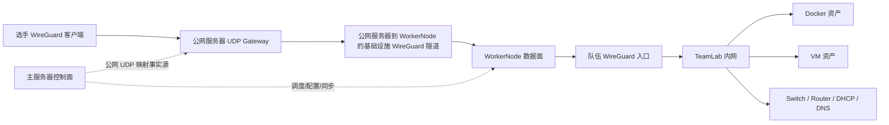

# YINYU 多级网段渗透 TeamLab 主架构设计稿

> 状态：正式设计稿 1.0，进入评审前版本
> 日期：2026-07-03
> 范围：综合渗透 / 多级网段编排模块的 VPN 化、VM 化、网络基础设施化重构。
> 非范围：端口级 ACL、跨 WorkerNode 单队环境、每选手独立 VPN peer、全流量审计、攻击拓扑/迷雾设计。

## 1. 目标

将当前以 Docker fabric 和公网入口为主的多级网段渗透模块，重构为商业化 TeamLab 靶场能力：每支队伍获得一套隔离的内网实验环境，选手通过 WireGuard VPN 进入该队内网，自行扫描、访问、渗透 Docker 与 VM 混合资产。平台负责网络、调度、生命周期、日志、题目、Flag 和重置闭环。

第一版必须达成：

- 一个 WorkerNode 可承载多支队伍环境，不需要一队一个公网 IP。
- 选手 VPN 流量不经过主服务器数据面。
- Docker 与 VM 接入同一队伍网络平面。
- 支持交换机、路由器、防火墙、DHCP、DNS、VPN 入口等基础设施概念。
- 支持 Windows、Ubuntu、银河麒麟等异构 VM 的稳定 IP/MAC/DHCP 接入。
- 支持 AD 域场景编排框架，但域内容由镜像或场景脚本实现。
- 管理端保持低代码编排体验，选手端保持黑盒题目体验。
- 部署、重置、销毁、失败回滚、日志和容量校验可追踪。

## 2. 总体架构

### 2.1 角色边界



主服务器只承担控制面：比赛配置、拓扑保存、发布版本、调度、下发配置、生成 VPN 配置、同步公网 UDP 映射、记录日志和计分。主服务器不承载选手扫描/攻击流量。

公网服务器是薄 UDP Gateway：维护公网 UDP 端口池，使用 nftables/iptables DNAT + SNAT 将每队 WireGuard UDP 入口转发到承载该队的 WorkerNode 隧道地址。公网服务器不理解题目、网络拓扑、Docker、VM 或 Flag。

WorkerNode 是数据面：运行队伍 WireGuard 入口、TeamLab 网络、Linux bridge、router namespace、DHCP/DNS、Docker 容器、KVM/libvirt VM。队伍环境调度到哪个 WorkerNode，选手 VPN 就进入哪个 WorkerNode 上的该队 TeamLab。

### 2.2 网络路径

选手访问路径：

```text
选手电脑
  -> 203.195.157.191:<team-public-udp>/udp
  -> 公网服务器 DNAT/SNAT
  -> WorkerNode 基础设施隧道 IP:<worker-team-wg-port>/udp
  -> WorkerNode 队伍 WireGuard
  -> TeamLab 内网
```

公网服务器当前不能直接访问内网 WorkerNode，因此 WorkerNode 必须主动建立到公网服务器的基础设施 WireGuard 隧道。该隧道是平台基础设施，不是选手 VPN，也不是队伍网络本身。

### 2.3 与现有公网代理的关系

现有 Nginx/Redis TCP 端口代理继续服务普通 CTF Docker 题、AWDP 等公网 TCP 场景。TeamLab 使用独立 WireGuard UDP 入口池，不与 Docker TCP 端口池混用。

系统设置或节点管理中的公网接入配置统一入口、分通道展示：

- Web/API 访问：平台自身公网访问、frp 或反向代理。
- 普通容器 TCP 端口代理：现有 Nginx/Redis 链路。
- WireGuard UDP 靶场入口：TeamLab 队伍 VPN 入口，独立 UDP 端口池。
- VM 管理/RDP/Guacamole 入口：管理和教学调试通道，不作为选手内网入口。

## 3. 核心概念模型

### 3.1 TeamLab

TeamLab 是某比赛某队伍的一套运行环境，绑定一个发布版本、一个 WorkerNode、一组网络资源、一组运行资产和一个队伍 WireGuard peer。TeamLab 是部署、重置、销毁、健康检查和容量调度的最小整体单元。

每个 TeamLab 包含：

- TeamLab 基础信息：GameId、TeamId、PublishedVersion、WorkerNodeId、状态、创建时间、更新时间、最后错误。
- TeamLab IPAM：队伍网段、VPN 地址、基础设施保留地址、资产接口地址。
- TeamLab 网络资源：LabNetwork、LabSwitch、LabRouter、LabDhcpScope、LabDnsZone、LabVpnEndpoint。
- TeamLab 运行资产：Docker、VM、Router namespace、DHCP/DNS 服务等。
- TeamLab 事件：创建、部署、启动、重置、销毁、失败、清理、VPN 配置生成/吊销。

### 3.2 LabNetwork / LabSwitch

LabNetwork 表示队伍内一个二层安全域或子网。产品上可以呈现为“网络段 / 交换机”。第一版底层由 Linux bridge 实现，代码层通过 LabNetworkProvider 抽象，后续可新增 OVS provider。

第一版要求：

- 每个 LabNetwork 有独立 CIDR、网关、DHCP 池、DNS 区域、bridge 名称和状态。
- 同队不同 LabNetwork 默认不互通，必须经 Router namespace 或自定义路由资产转发。
- 不同队伍即使网段结构相似，也必须在资源命名、bridge、VPN、路由上隔离。

### 3.3 LabRouter / Firewall

首版默认 Router/Firewall 使用平台托管 Linux network namespace，不作为普通题目资产。它接入多个 LabNetwork bridge，平台在 namespace 中启用转发并写入网段级路由和基础隔离规则。

边界：

- 首版不做端口级 ACL，不承诺包级防火墙策略。
- Deny 语义首版表示不生成可达路由。
- 管理员可放置自定义容器或 VM 作为题目资产型路由器/防火墙，但默认自动生成设备使用 namespace。
- Router namespace 进入部署事件、健康检查、清理链路。

### 3.4 DHCP / DNS

平台 IPAM 是 IP/MAC 的唯一事实源。DHCP 以静态租约为主：平台先为每张资产网卡分配固定 MAC 和固定 IP，再由每个 LabNetwork 的 DHCP 服务按 MAC 下发固定 IP。

首版提供基础内部 DNS：

- DHCP 下发本队 DNS 地址。
- 平台自动维护资产名、别名到 IP 的记录。
- 老师可以选择是否在题目描述中暴露域名。
- AD 场景支持域控 DNS 接管或协同：平台负责 DNS 指向和启动依赖，域内容由镜像脚本实现。

Docker 可以继续由平台直接配置 IP；VM 默认通过 DHCP 获取固定 IP。不支持 DHCP 的镜像可通过 cloud-init、sysprep、QEMU guest agent 或初始化脚本做静态注入兜底。

### 3.5 LabAsset

LabAsset 是 TeamLab 中的运行资产，类型包括：

- Docker：复用现有 Docker ImageTemplate 和镜像仓库。
- VM：复用现有 VM ImageTemplate、KVM/libvirt、VmInstance 和 Guacamole 管理链路。
- RouterNamespace：平台托管基础设施。
- DhcpDnsService：平台托管基础设施。
- CustomInfrastructure：管理员自定义容器/VM 路由器、防火墙、域控、堡垒机等。

资产必须支持多网卡。Docker 通过 veth 接入 LabNetwork bridge；VM 通过 libvirt tap/vnet 接入 LabNetwork bridge。平台为每张接口分配稳定 MAC/IP，并记录运行状态。

### 3.6 LabVpnPeer

首版每队一个 WireGuard peer。队内成员共用同一份配置。平台支持管理员重新生成本队 VPN 配置，旧 peer 立即吊销。

选手端配置包含：

- PrivateKey。
- Address：队伍 VPN 客户端地址。
- Endpoint：公网服务器分配的 UDP 端口。
- AllowedIPs：本队 TeamLab 内网范围或平台定义的必要目标范围。
- DNS：本队内部 DNS 地址。

后续可扩展为每选手一个 peer，但第一版不实现个人级 VPN 审计。

### 3.7 数据模型落地契约

第一版可以复用现有 `PenetrationConfig`、`PenetrationNetwork`、`PenetrationNode`、`PenetrationInterface`、`PenetrationTeamEnvironment` 等表的部分字段，但运行时语义必须收敛到 TeamLab。实现时不允许只在前端换名，后端必须有能表达 VPN、VM、网络基础设施和运行状态的真实模型。

建议最小数据边界如下：

- `TeamLabPublishedVersion`：某次发布后的不可变拓扑版本，包含网络、资产、接口、路由、题目、Flag、资源需求和校验摘要。运行环境只绑定发布版本，不绑定草稿。
- `TeamLabRuntime`：某比赛某队伍的运行实例，记录 GameId、TeamId、PublishedVersionId、WorkerNodeId、状态、队伍网段、创建时间、最后错误和清理状态。
- `LabNetworkRuntime`：运行期网络段，记录 TeamLabRuntimeId、CIDR、网关、bridge 名称、DHCP/DNS 状态和资源名称。
- `LabAssetRuntime`：运行期资产，记录 Docker/VM/RouterNamespace/DhcpDnsService 等类型、模板来源、资源 ID、健康状态和失败原因。
- `LabInterfaceRuntime`：运行期网卡，记录资产、LabNetwork、MAC、IP、主网卡/管理网卡标记和实际接入状态。
- `LabVpnPeerRuntime`：队伍 VPN peer，记录公网 Endpoint、AllowedIPs、DNS、peer 公钥、配置版本、吊销状态和最后生成时间；私钥只在生成配置时安全交付，不作为普通明文字段长期暴露。
- `PublicUdpMapping`：公网 UDP 映射事实源，记录 PublicUdpPort、WorkerNodeTunnelIp、WorkerTeamWireGuardPort、规则版本和同步状态。
- `TeamLabEvent`：生命周期事件，记录操作人、队伍、阶段、对象类型、对象 ID、结果、底层错误和建议操作。

迁移策略是兼容优先：旧渗透赛继续可读可进入；新 TeamLab 能力通过发布版本和运行模型逐步接管。禁止在旧字段中塞入不可解释的 JSON 后让前端假装支持 VM/VPN。

### 3.8 状态机

TeamLabRuntime 必须使用显式状态机，避免“部分成功但界面显示可用”。建议状态：

- `Pending`：队伍环境尚未部署。
- `Planning`：生成容量、IPAM、VPN、网络和资产计划。
- `Scheduled`：已选择 WorkerNode 和公网 UDP 端口。
- `Deploying`：正在创建基础设施、Docker、VM、DHCP/DNS、WireGuard 和公网映射。
- `Probing`：资源已创建，正在做连通性、租约、DNS、资产健康检查。
- `Running`：关键资源全部通过，选手可进入。
- `Failed`：关键资源失败，环境不开放。
- `CleanupPending`：失败或销毁后仍有资源待清理。
- `Stopped`：管理员停止，保留可恢复的运行记录。
- `Destroying`：正在销毁资源。
- `Destroyed`：资源清理完成。

状态转换原则：

- 部署请求只能从 `Pending`、`Stopped`、`Failed`、`Destroyed` 或显式重建入口进入 `Planning`。
- 任一关键资源在 `Deploying` 或 `Probing` 失败，必须进入 `Failed` 或 `CleanupPending`，不得进入 `Running`。
- 环境重置是 `Running/Failed/Stopped -> Destroying -> Planning -> Deploying -> Probing -> Running`，默认保留提交、得分、题目完成状态和 VPN peer。
- 重新生成 VPN 配置是独立管理员动作，会吊销旧 peer 并生成新 peer，不应被普通环境重置隐式触发。
- 发布新版本不会热更新运行中的 TeamLab；只有重建或重新部署时才绑定新版本。

### 3.9 API 与权限边界

TeamLab 管理能力放在比赛管理内，与渗透编排入口相邻。权限沿用现有角色体系：只有具备比赛管理权限的老师、管理员或超级管理员可以编辑、发布、部署、停止、重置、销毁和查看运行事件；学生只能访问选手端 VPN 配置、题目列表、题目详情、Flag 提交和允许的环境重置入口。

后端 API 应按职责分组：

- 草稿与发布：保存草稿、校验、生成计划、发布版本。
- 运行环境：按队伍部署、批量部署、停止、重建、销毁、清理残留。
- VPN：获取本队配置、管理员重置 peer、查看连接状态。
- 节点能力：启用 TeamLabNetwork、探测基础设施隧道、查看节点容量。
- 运行观测：队伍环境事件、资产健康、部署失败详情。

前端不得显示后端未接通的入口。任何“校验通过、计划可部署、资源运行中、VPN 可用”的状态都必须来自后端真实状态或 probe 结果。

### 3.10 兼容与回滚边界

本次重构不得破坏以下既有链路：普通 CTF Docker 题公网 TCP 端口代理、AWDP、现有 VM/Guacamole 管理入口、旧渗透赛查看和计分。TeamLab 的 WireGuard UDP 入口、队伍内网、VM bridge 接入和 DHCP/DNS 是新增通道，不应复用或污染普通 Docker TCP 代理状态。

回滚策略：任一阶段上线前必须能关闭 TeamLabNetwork 能力标记，使节点继续按旧 Docker/VM 调度工作；旧比赛数据不应因新增字段迁移失败而无法打开。公网 UDP Gateway 的规则同步失败时，只影响 TeamLab VPN 入口，不影响平台 Web/API 和普通 TCP 代理。

## 4. 部署与调度模型

### 4.1 调度单位

TeamLab 是整体调度单位。第一版强制一个队伍环境落在单个 WorkerNode。多个队伍可以共享同一 WorkerNode，但一支队伍的 Docker、VM、LabNetwork、Router、DHCP、DNS、WireGuard 全部在同一节点内完成。

调度评估至少包含：

- Docker 数量和资源限制。
- VM 数量、CPU、内存、磁盘。
- LabNetwork 数量。
- Router namespace、DHCP/DNS 服务、WireGuard 入口开销。
- 公网 UDP 端口池余量。
- WorkerNode 是否启用 TeamLabNetwork 能力。
- WorkerNode 基础设施隧道是否健康。

跨 WorkerNode 的单队 TeamLab 不进入第一版。后续如需支持，需引入 VXLAN/OVS tunnel/WireGuard mesh 和新的跨节点健康检查。

### 4.2 节点注册与存量节点补配置

新注册节点流程扩展：

1. 安装或检查 WireGuard。
2. WorkerNode 本地生成基础设施隧道私钥/公钥。
3. 主服务器分配 WorkerNode 隧道 IP，保存公钥、隧道 IP、状态和配置版本。
4. 主服务器把 WorkerNode peer 同步到公网服务器。
5. WorkerNode 启动基础设施隧道。
6. 平台探测公网服务器到 WorkerNode 隧道 IP 的连通性。
7. 探测通过后标记节点具备 TeamLabNetwork 能力。

已注册节点在节点管理页提供“启用 VPN 靶场网络”操作。补配置失败不影响原有 Docker/VM 调度，只是不参与 TeamLab 调度。节点详情显示隧道状态、隧道 IP、最后握手、最后错误、重新配置和吊销入口。

密钥边界：WorkerNode 私钥只保存在 WorkerNode 本地；主服务器保存 WorkerNode 公钥和状态；公网服务器保存 peer 公钥和 AllowedIPs。重置节点隧道时生成新配置并吊销旧 peer。

### 4.3 公网 UDP 映射

公网 UDP 端口池独立于现有 Docker TCP 端口池。主服务器维护映射事实源：

```text
GameId + TeamId + TeamLabId
  -> PublicUdpPort
  -> WorkerNode Tunnel IP
  -> WorkerNode Local Team WireGuard Port
```

公网服务器通过内部 API 同步映射，生成 nftables/iptables DNAT + SNAT 规则。规则更新必须支持原子应用、失败回滚和规则漂移检测。

## 5. VM 与异构 OS 设计

### 5.1 VM 接入方式

现有 VM 通过 libvirt default NAT 网络启动。TeamLab 需要改造为由平台生成 libvirt 网络接口配置，将 VM tap/vnet 接入 LabNetwork bridge。

VM 创建前，平台为每张 VM 网卡分配：

- LabNetwork。
- MAC 地址。
- 固定 IP。
- 是否主网卡。
- 是否管理网卡。
- DNS 和网关策略。

libvirt domain XML 或 virt-install 参数必须使用 bridge 接入，而不是 default NAT。VM Ready 识别不再依赖 default DHCP lease，应读取 Lab DHCP lease、ARP/neigh、QEMU guest agent 或系统探针。

### 5.2 OS 兼容

首版目标支持 Windows Server、Windows 客户端、Ubuntu、银河麒麟等常见系统。平台统一假设 VM 默认通过 DHCP 获取固定地址。不同 OS 的差异由镜像标准和初始化脚本处理，平台只提供通用编排能力。

验收必须覆盖：

- 启动成功。
- 固定 MAC/IP 获取成功。
- 重启/重建后 IP/MAC/主机名稳定。
- SSH/RDP/WinRM 或自定义健康探针可选通过。
- DHCP 租约、ARP/neigh、guest agent 至少一种可识别 Ready。

### 5.3 AD 域边界

平台提供 AD 编排框架，不在平台核心硬编码完整 AD 创建逻辑。

平台负责：

- 创建 Windows VM。
- 分配固定 IP/MAC/DNS。
- 标记 DomainController、DomainMember、DNS、Bastion 等角色。
- 编排启动顺序：域控/DNS 先启动，成员机后启动。
- 注入域名、域控 IP、主机名、初始化变量。
- 触发初始化脚本或等待镜像自启动初始化。
- 健康检查 LDAP、Kerberos、DNS、RDP、WinRM 等可选探针。
- 重置/销毁整套 AD 环境。

镜像或场景脚本负责：

- 域控初始化。
- OU、用户、组策略、弱口令、服务账号。
- 成员机自动入域。
- 漏洞点、凭据链和业务数据。

## 6. 管理端设计

管理端复用当前渗透编排画布，但对象模型升级为 TeamLab 拓扑：

- 左侧资源库：Docker 模板、VM 模板、网络设备、交换机、路由器、防火墙、DHCP/DNS、VPN 入口、AD 角色模板。
- 中间画布：网络段、交换机、路由器、Docker、VM、网卡连接、依赖关系。
- 右侧属性面板：按对象类型展示最小必要配置。
- 顶部操作：保存、校验、计划、发布、部署、停止、重建、健康检查。
- 底部或侧栏：队伍环境、部署事件、VPN 状态、资源清单、探测结果。

产品原则：

- 网络基础设施是一等对象，但一键生成默认结构，避免老师从零搭建。
- 管理端可以显示网段、路由、DHCP、基础设施状态。
- 选手端不显示底层拓扑。
- 校验错误必须定位到具体对象和字段。

## 7. 选手端设计

选手端基本复用当前题目界面，只调整入口信息为 VPN 配置。

选手端显示：

- 下载 WireGuard 配置。
- 复制配置。
- 可选二维码。
- VPN 配置重置提示。
- 题目列表。
- 题目详情、可配置描述、分值、Flag 提交。
- 环境重置按钮和剩余次数。

选手端不显示：

- 安全域。
- 网段。
- 拓扑。
- 路由器/交换机。
- 真实资产清单。
- 底层公网转发链路。

扫描范围、目标背景和线索由题目描述、附件或课程材料给出，不由平台自动暴露。

## 8. 生命周期与版本

### 8.1 发布版本

运行中的 TeamLab 绑定部署时的发布版本。管理员可以赛中编辑草稿、保存、校验、预览计划，但不会影响已运行环境。

新版本发布后，必须明确执行整队重建或按新版本重新部署才生效。第一版不做热迁移、热改网卡、热改路由、热改 VM/Docker 资产。题目描述和分值等争议敏感内容也统一走版本，不开独立热更新口子。

### 8.2 重置语义

环境重置是整队 TeamLab 重建：销毁并重建 Docker、VM overlay、bridge、router namespace、DHCP/DNS、WireGuard 路由和健康检查。

重置保留：

- 队伍提交记录。
- 得分。
- 已完成题目状态。
- 默认保留 WireGuard peer 和配置。

只有管理员主动重新生成 VPN 配置时才吊销旧 peer。重置后 IP/MAC/主机名保持稳定。

### 8.3 部署失败

TeamLab 是原子化部署单元。任一关键资源失败，整队环境不开放并进入 Failed 或 CleanupPending。默认所有资产关键；后续可支持非关键资产标记。

关键资源包括 VPN 路由、LabNetwork、DHCP/DNS、Router namespace、关键 Docker/VM、Flag 所在资产。

失败必须记录具体失败阶段、失败对象、底层错误、建议操作。管理员可以一键清理并重新部署。

## 9. 日志与观测

首版不做流量审计，不做 conntrack/NetFlow，不做全流量抓包。

必须记录：

- 队伍环境创建、启动成功/失败、关闭、重置、销毁。
- VPN 配置生成、重置、吊销。
- WorkerNode 基础设施隧道启用、探测失败、重新配置。
- DHCP/DNS/Router/VM/Docker 关键基础设施启动失败。
- 清理重试、残留资源、手动清理。

入口放在比赛管理中，与渗透编排相邻，展示为队伍环境事件时间线。

## 10. 安全边界

- 不同队伍的 VPN peer、AllowedIPs、LabNetwork、bridge、router namespace、DHCP/DNS、运行资产必须隔离。
- 公网 UDP 端口池不能与 Docker TCP 端口池混用。
- WorkerNode 私钥不进入主服务器数据库。
- 选手端不暴露底层转发链路和拓扑。
- 主服务器不承载选手数据面，降低全局瓶颈和单点风险。
- Router/Firewall 首版只做网段级可达，不宣称端口级 ACL。
- 所有资源命名必须可追溯、可幂等清理，避免误删人工网络。

## 11. 技术抽象

建议新增或重构以下服务边界：

- `TeamLabService`：TeamLab 生命周期、版本绑定、状态机。
- `TeamLabPlanService`：容量、IPAM、网络、资产、VPN 计划。
- `TeamLabDeploymentService`：部署、停止、重建、清理、补偿。
- `LabNetworkProvider`：Linux bridge 第一版实现，后续 OVS。
- `LabRouterProvider`：Linux network namespace 第一版实现。
- `LabDhcpDnsProvider`：DHCP/DNS 静态租约与解析记录。
- `LabVpnProvider`：队伍 WireGuard peer、WorkerNode 本地 WireGuard 入口。
- `PublicUdpGatewayProvider`：公网服务器 DNAT/SNAT 规则同步。
- `VmNetworkProvider`：libvirt tap/vnet 接入 LabNetwork。
- `NodeTunnelService`：WorkerNode 到公网服务器基础设施隧道。

这些服务可以逐步落地，但正式实现时应避免继续把所有逻辑堆入单个 `PenetrationService`。

## 12. 设计结论

第一版应优先做稳“WorkerNode 本地 TeamLab 数据面 + 公网薄 UDP Gateway + 平台控制面”三层结构。这样既适配当前公网服务器通过 frp 访问主平台、WorkerNode 位于内网的真实部署，也避免主服务器承载选手攻击流量。

Docker/VM 混合网络、DHCP/DNS、Router namespace、基础设施隧道和公网 UDP 转发是本次重构的核心。端口级 ACL、跨节点 TeamLab、个人级 VPN peer、全流量审计和 OVS 数据面作为后续扩展，不进入第一版实现闭环。
