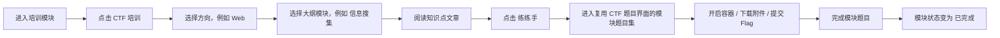
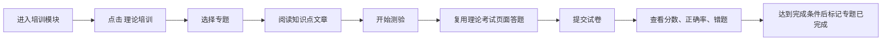

# YINYU 权限分组与培训模块闭环落地方案 v2

## 0. 本版订正

本文件替代上一版“在线练习模块”方案。根据最新需求，模块定位从“学生在线练习”升级为“培训模块”，并新增学生分组、老师视角的培训大纲编辑、分组维度培训统计、CTF 培训大纲式学习路径、理论培训组卷配置。

本轮只写方案，不执行代码改造。后续实施必须按本文件作为源头，不允许做只有前端入口、没有后端模型和接口支撑的空实现。

核心变化：

- 学生必须支持分组，由老师或更高权限创建、维护和查询。
- 人员管理界面必须体现学生分组，并增加筛选能力。
- 学生侧入口改为“培训模块”，而不是“在线练习”。
- 培训模块分为“CTF 培训”和“理论培训”。
- CTF 培训按方向、大纲模块、知识文章、练手题目集组织。
- 老师或更高权限在管理端“培训管理”里编辑大纲、文章、题目集、可见分组、完成规则。
- 理论培训由老师在培训管理中配置随机抽题或手动组卷，不再通过题库题目的单独“开放练习”开关实现。
- 学生完成状态要在学生培训模块中可见；老师和管理员要能按分组查询学生培训进度。

---

## 1. 当前代码事实与必须保留的已有改造

### 1.1 当前角色基础

当前后端角色位于 `src/GZCTF/Utils/Enums.cs`，已有值：

- `Banned = 0`
- `User = 1`
- `Monitor = 2`
- `Admin = 3`

当前授权过滤器位于 `src/GZCTF/Middlewares/PrivilegeAuthentication.cs`，核心是 `user.Role >= requiredRole`。

必须兼容旧数据：

- 旧 `User = 1` 映射为新 `Student = 1`
- 旧 `Monitor = 2` 映射为新 `Teacher = 2`
- 旧 `Admin = 3` 保持为 `Admin = 3`
- 新增 `SuperAdmin = 4`

### 1.2 当前练习相关雏形

项目中已经存在以下模型：

- `ExerciseChallenge : Challenge`
- `ExerciseInstance : Instance`
- `ExerciseDependency`
- `UserInfo.ExerciseVisible`
- `ExerciseController`，目前仍是 TODO

新方案中，用户可见的产品名不再叫“Exercise/练习”，统一叫“Training/培训”。但为了降低风险，可以继续把 `ExerciseChallenge` 和 `ExerciseInstance` 作为 CTF 培训题目的底层题目池和用户容器实例，不直接暴露为独立“练习模块”。

推荐命名边界：

- 前端路由、页面文案、接口路径使用 `training` / `培训`。
- 后端底层实体可以保留 `ExerciseChallenge` / `ExerciseInstance` 作为兼容层。
- 新增 `Training*` 实体承载培训大纲、文章、可见分组、统计和课程结构。

### 1.3 当前线上稳定性问题仍需先修

实施培训模块前，必须先修复以下已知问题：

1. `GameRepository.GetPenetrationScoreStates` 中 `GroupBy + First` EF 翻译失败。
2. 一二三血奖牌需要用 `D:\Downloads\奖牌.svg` 的造型改为金、银、铜三版。
3. 左下角多余头像按钮需要删除。

这些属于 Phase A，不应被培训模块大改拖延。

---

## 2. 总体产品目标

### 2.1 学生视角

学生进入平台后：

1. 左侧导航里不显示“管理”。
2. 同一位置显示“培训模块”。
3. 进入培训模块后，左侧是层级式培训导航：
   - CTF 培训
   - 理论培训
4. 点击 `CTF 培训` 后，旁边展开方向层：
   - Web
   - Misc
   - Pwn
   - Reverse
   - Crypto
   - Mobile
   - Forensics
   - 自定义方向
5. 点击某个方向，如 `Web`，继续展开大纲模块：
   - 信息搜集
   - SQL 注入
   - XSS
   - 文件上传
   - SSRF
   - 反序列化
   - 自定义模块
6. 点击具体大纲模块后，主区域展示：
   - 模块标题
   - 学习状态，如 `未开始 / 阅读中 / 练习中 / 已完成`
   - 知识点文章
   - 关联环境说明
   - 练练手按钮
   - 完成条件
   - 关联题目完成进度
7. 点击“练练手”后，跳转到复用比赛 CTF 题目界面的题目集页面。
8. 题目集标题自动跟随大纲模块名，例如 `Web / 信息搜集`。
9. 已完成的大纲模块在左侧树和模块标题后显示 `已完成`。

理论培训：

1. 点击 `理论培训` 后展开理论专题。
2. 点击某专题后，主区域展示知识文章和测验入口。
3. 测验页面复用理论考试比赛页面，但不需要报名、队伍、正式榜单。
4. 试卷来源由老师配置：
   - 随机抽题
   - 老师手动组卷
5. 学生完成后看到：
   - 得分
   - 正确率
   - 错题
   - 知识点完成状态

### 2.2 老师视角

老师进入管理界面后：

1. 只看到自己有权访问的管理标签页，标签页左对齐。
2. 人员管理中可以：
   - 查看自己负责分组内的学生。
   - 创建学生。
   - 编辑学生基础信息。
   - 锁定/解锁学生。
   - 重置学生密码。
   - 把学生加入或移出自己管理的分组。
   - 根据分组、关键字、状态、训练进度筛选学生。
3. 培训管理中可以：
   - 管理自己负责分组可见的培训内容。
   - 编辑 CTF 培训方向、大纲模块、知识文章。
   - 给大纲模块选择环境模板。
   - 给大纲模块添加 CTF 题目。
   - 配置理论培训专题和组卷策略。
   - 发布/隐藏培训内容。
   - 查看自己管理分组内学生的培训完成情况。

老师不能：

- 查看或管理其他老师、管理员、超级管理员。
- 查看不属于自己管理范围的学生详细训练情况。
- 访问系统配置、节点管理、全站日志等高权限后台。

### 2.3 管理员视角

管理员拥有除管理 Admin/SuperAdmin 账号之外的全部管理功能：

- 可查看全部学生和老师。
- 可管理全部学生分组。
- 可查询全部学生培训情况。
- 可编辑全部培训内容。
- 可访问全站管理功能。
- 用户管理中不能查看、编辑、删除 Admin 和 SuperAdmin。

### 2.4 超级管理员视角

超级管理员是内置最高权限：

- 可管理所有角色。
- 可管理所有分组。
- 可编辑所有培训内容。
- 可查询所有训练统计。
- 可防止最后一个超级管理员被删除或降级。

---

## 3. 权限模型设计

### 3.1 角色枚举

建议后端枚举：

```csharp
public enum Role : byte
{
    Banned = 0,
    Student = 1,
    Teacher = 2,
    Admin = 3,
    SuperAdmin = 4,

    User = Student,
    Monitor = Teacher,
}
```

默认注册用户为 `Student`。

### 3.2 角色管理矩阵

| 操作者 | 可查看用户 | 可创建用户 | 可编辑用户 | 可删除用户 | 可授予角色 |
|---|---|---|---|---|---|
| Student | 无 | 无 | 无 | 无 | 无 |
| Teacher | 自己管理分组内 Student | Student | 自己管理分组内 Student | 自己管理分组内 Student | Student |
| Admin | Student / Teacher | Student / Teacher | Student / Teacher | Student / Teacher | Student / Teacher |
| SuperAdmin | 全部 | 全部 | 全部 | 全部 | 全部 |

硬性约束：

- Teacher 不能查看或管理其他 Teacher。
- Admin 不能查看或管理 Admin/SuperAdmin。
- 非 SuperAdmin 不能创建 Admin/SuperAdmin。
- 用户不能删除自己。
- 最后一个 SuperAdmin 不能被删除或降级。
- Teacher 创建学生时必须选择至少一个自己管理的分组；如果不选择，系统放入“我的默认分组”。

### 3.3 管理后台访问矩阵

| 后台标签 | Student | Teacher | Admin | SuperAdmin |
|---|---:|---:|---:|---:|
| 比赛管理 | 否 | 是 | 是 | 是 |
| 题库管理 | 否 | 是 | 是 | 是 |
| 环境模板 | 否 | 是 | 是 | 是 |
| 培训管理 | 否 | 是 | 是 | 是 |
| 用户管理 | 否 | 是，仅学生 | 是，学生+老师 | 是，全部 |
| 队伍管理 | 否 | 否 | 是 | 是 |
| 实例管理 | 否 | 否 | 是 | 是 |
| 节点管理 | 否 | 否 | 是 | 是 |
| 部署队列 | 否 | 否 | 是 | 是 |
| 系统日志 | 否 | 否 | 是 | 是 |
| 系统设置 | 否 | 否 | 是 | 是 |

### 3.4 权限工具

必须新增集中式权限判断，避免前后端散落比较：

```csharp
public static class RolePolicy
{
    public static bool IsStudent(Role role);
    public static bool IsTeacherOrAbove(Role role);
    public static bool IsAdminOrAbove(Role role);
    public static bool IsSuperAdmin(Role role);

    public static bool CanAccessAdmin(Role actor);
    public static bool CanAccessAdminTab(Role actor, AdminTab tab);

    public static bool CanViewRole(Role actor, Role target);
    public static bool CanManageRole(Role actor, Role target);
    public static bool CanAssignRole(Role actor, Role target);

    public static bool CanManageStudentInGroup(Role actor, Guid actorId, Guid studentId, int groupId);
    public static bool CanViewTrainingStats(Role actor, Guid actorId, Guid studentId);
}
```

所有用户管理、培训统计、分组管理接口必须调用该工具。前端隐藏只作为体验优化，后端必须兜底。

---

## 4. 学生分组设计

### 4.1 为什么需要单独的学生分组

已有队伍 `Team` 是比赛参赛队伍，不适合作为教学分组：

- 队伍由选手组成，可能跨比赛变化。
- 教学分组由老师管理，常用于班级、课程批次、训练营。
- 老师需要按分组查看训练情况，不应依赖战队。
- 一个学生可能属于多个培训分组。

因此新增独立学生分组模型。

### 4.2 数据模型

新增 `StudentGroup`：

```text
StudentGroup
- Id
- Name
- Description
- CreatedById
- OwnerId nullable
- IsArchived
- CreatedAt
- UpdatedAt
```

新增 `StudentGroupMember`：

```text
StudentGroupMember
- GroupId
- StudentId
- AddedById
- JoinedAt
- Note
```

新增 `StudentGroupManager`：

```text
StudentGroupManager
- GroupId
- ManagerId
- RoleInGroup: Owner / Assistant
- AddedById
- CreatedAt
```

设计理由：

- 使用 `StudentGroupManager` 而不是单个 `TeacherId`，为后续多个老师共同管理一个班级预留扩展。
- Admin/SuperAdmin 可以查询所有分组，不需要加入 `StudentGroupManager`。
- Teacher 只管理自己是 `Owner/Assistant` 的分组。

### 4.3 分组权限

Teacher：

- 能创建分组，创建后自动成为 `Owner`。
- 能编辑自己管理的分组名称和描述。
- 能把学生加入/移出自己管理的分组。
- 能查询自己管理分组的学生训练情况。
- 不能把其他老师设为分组管理员，第一版由 Admin/SuperAdmin 处理。

Admin：

- 能创建、编辑、归档所有分组。
- 能给任意 Teacher 分配分组管理权。
- 能把任意 Student 加入任意分组。
- 不能操作 Admin/SuperAdmin 用户。

SuperAdmin：

- 无限制。

### 4.4 人员管理筛选

人员管理界面必须新增筛选区：

- 关键字：用户名、真实姓名、学号、邮箱、手机号。
- 角色：学生、老师、管理员、超级管理员，按当前用户权限过滤可选项。
- 分组：当前用户可见分组。
- 账号状态：正常、锁定、禁用。
- 邮箱确认：已确认、未确认。
- 最近登录：全部、7 天内、30 天内、从未登录。
- 培训状态：全部、有未完成培训、最近 7 天未训练、已完成指定模块。

教师默认视图：

- 默认只显示自己管理分组内学生。
- 如果老师创建学生但未选择分组，系统放入“我的默认分组”，避免出现老师看不见自己创建学生的问题。

---

## 5. 培训模块信息架构

### 5.1 培训模块顶层结构

培训模块分两大类：

```text
培训模块
├─ CTF 培训
│  ├─ Web
│  │  ├─ 信息搜集
│  │  ├─ SQL 注入
│  │  └─ ...
│  ├─ Misc
│  ├─ Pwn
│  ├─ Reverse
│  └─ Crypto
└─ 理论培训
   ├─ 网络安全基础
   ├─ 法律法规
   ├─ Linux 基础
   └─ 自定义专题
```

CTF 培训中的“方向”和“模块”都必须可编辑，不写死为固定五类。

推荐默认方向：

- Web
- Misc
- Pwn
- Reverse
- Crypto
- Mobile
- Forensics
- OSINT
- Blockchain
- 自定义

### 5.2 CTF 培训学习流程

学生完整流程：



主页面必须体现：

- 文章阅读进度。
- 练手题完成进度，例如 `3/5`。
- 是否已完成。
- 未完成原因，例如“还有 2 道题未解出”或“文章未读完”。

### 5.3 理论培训学习流程

学生完整流程：



理论培训可配置：

- 随机抽题。
- 老师手动组卷。
- 题量，如默认 30。
- 通过条件，如正确率 >= 80%。
- 是否允许重复答题。
- 是否展示错题答案。

---

## 6. 培训数据模型设计

### 6.1 培训方向

新增 `TrainingDirection`：

```text
TrainingDirection
- Id
- Type: Ctf / Theory
- Key
- Title
- Description
- Icon
- Color
- Order
- IsEnabled
- CreatedById
- CreatedAt
- UpdatedAt
```

说明：

- `Type = Ctf` 时表示 Web/Misc/Pwn 等方向。
- `Type = Theory` 时表示理论专题大类。
- `Key` 用于路由和接口稳定识别，如 `web`、`misc`。
- `Icon/Color` 用于前端图标型展示，允许老师配置但提供默认值。

### 6.2 培训大纲模块

新增 `TrainingModule`：

```text
TrainingModule
- Id
- DirectionId
- ParentId nullable
- Type: Ctf / Theory
- Title
- Slug
- Summary
- ArticleContent
- ArticleContentType: Markdown / Html
- CoverFileHash nullable
- EnvironmentTemplateId nullable
- CompletionRule
- IsPublished
- PublishedAt nullable
- Order
- CreatedById
- UpdatedById
- CreatedAt
- UpdatedAt
```

说明：

- 支持 `ParentId` 是为了后续大纲多层嵌套，例如 `Web -> 注入 -> SQL 注入基础`。
- 第一版前端至少支持三级级联选择；后端模型支持无限层。
- `EnvironmentTemplateId` 表示该模块默认环境模板。
- 如果模块下的 CTF 题目本身已有环境模板，则题目模板优先。
- 如果老师从题库加入题目时未指定题目模板，可继承模块默认环境模板。
- `CompletionRule` 使用 JSON 存储，第一版可定义为：

```json
{
  "requireArticleRead": true,
  "requiredChallengeMode": "All",
  "requiredChallengeCount": 0,
  "theoryPassRate": 80
}
```

### 6.3 模块可见分组

新增 `TrainingModuleVisibility`：

```text
TrainingModuleVisibility
- ModuleId
- GroupId nullable
- VisibilityType: AllStudents / GroupOnly
- CreatedById
- CreatedAt
```

规则：

- 没有可见记录时默认不对学生发布。
- `AllStudents` 只有 Admin/SuperAdmin 默认可创建；Teacher 是否能全体发布由配置决定，第一版建议不允许。
- Teacher 发布时只能选择自己管理的分组。
- Admin/SuperAdmin 可选择全部分组。

### 6.4 CTF 培训题目集

复用现有 `ExerciseChallenge` 作为 CTF 培训题目池，并新增映射表 `TrainingModuleChallenge`：

```text
TrainingModuleChallenge
- ModuleId
- ExerciseChallengeId
- Order
- IsRequired
- DisplayTitle nullable
- CreatedById
- CreatedAt
```

题目来源：

1. 从正式比赛题目复制。
2. 从已有 `ExerciseChallenge` 选择。
3. 在培训管理中直接新建培训题。

复制正式比赛题目时复制字段：

- 标题
- 内容
- 分类
- 类型
- 提示
- 附件
- 动态附件配置
- 容器镜像
- 环境模板
- 端口
- 资源限制
- flag 配置
- 网络模式

不复制字段：

- 正式比赛 ID
- 正式比赛提交记录
- 正式比赛一血记录
- 正式比赛队伍、分数和报名关系

### 6.5 CTF 培训提交与容器

建议新增 `TrainingCtfSubmission`，不要复用正式比赛 `Submission`：

```text
TrainingCtfSubmission
- Id
- ModuleId
- ExerciseChallengeId
- UserId
- Status: Accepted / WrongAnswer / CheatDetected / ...
- SubmittedAt
- SubmittedAnswerHash
- FlagId nullable
- IpAddress
```

容器复用 `ExerciseInstance`：

- `ExerciseInstance.UserId`
- `ExerciseInstance.ExerciseId`
- `ExerciseInstance.Container`
- `ExerciseInstance.FlagContext`
- `ExerciseInstance.SolveTimeUtc`

为模块上下文补充 `TrainingCtfAttempt` 或在 `TrainingCtfSubmission` 中包含 `ModuleId`，避免同一题在多个模块中出现时统计混淆。

动态 flag：

```text
training-module-id + exercise-challenge-id + user-id + flag-id + server-secret
```

同一学生同一模块同一题重建容器时 flag 不变；不同学生不同。

### 6.6 理论培训计划

新增 `TheoryTrainingPlan`：

```text
TheoryTrainingPlan
- Id
- ModuleId
- Title
- Description
- Mode: Random / Manual
- QuestionCount
- BankName nullable
- QuestionTypes nullable
- Difficulty nullable
- PassRate
- AllowRetake
- ShowCorrectAnswerAfterSubmit
- IsPublished
- CreatedById
- UpdatedById
- CreatedAt
- UpdatedAt
```

新增 `TheoryTrainingPlanQuestion`：

```text
TheoryTrainingPlanQuestion
- PlanId
- SourceQuestionId
- Score
- Order
```

随机抽题：

- 从 `TheoryQuestionBankItem` 按 `BankName / Type / Tags / Difficulty` 过滤。
- 随机抽 `QuestionCount`，默认 30。
- 不足则全部返回。

手动组卷：

- 使用 `TheoryTrainingPlanQuestion` 固定题目和顺序。

不再使用题库题目上的“练习开放”开关作为主机制。题目是否进入培训，由培训计划决定。

### 6.7 理论培训答题快照

新增 `TheoryTrainingSession`：

```text
TheoryTrainingSession
- Id
- PlanId
- ModuleId
- UserId
- Status: Draft / Submitted
- Score
- MaxScore
- CorrectCount
- TotalCount
- CreatedAt
- SubmittedAt nullable
```

新增 `TheoryTrainingSessionQuestion`：

```text
TheoryTrainingSessionQuestion
- Id
- SessionId
- SourceQuestionId nullable
- Type
- Title
- Content
- Options
- AnswerIndexes
- SelectedIndexes
- IsCorrect nullable
- Score
- Order
```

必须做题目快照，原因：

- 老师后续编辑题库不应改变学生已生成的训练卷。
- 错题复盘需要稳定展示当时题目内容。

### 6.8 文章阅读进度

新增 `TrainingArticleProgress`：

```text
TrainingArticleProgress
- ModuleId
- UserId
- ReadPercent
- CompletedAt nullable
- LastReadAt
```

文章是否完成：

- 第一版可以由学生点击“标记已读”完成。
- 后续可根据滚动百分比自动完成。

### 6.9 模块完成进度

新增 `TrainingModuleProgress`：

```text
TrainingModuleProgress
- ModuleId
- UserId
- Status: NotStarted / Reading / Practicing / Completed
- ChallengeSolvedCount
- ChallengeTotalCount
- TheoryBestScore nullable
- TheoryBestPassRate nullable
- StartedAt nullable
- CompletedAt nullable
- UpdatedAt
```

进度可由事件更新，也可按需计算。第一版推荐：

- 提交 flag、提交理论卷、标记文章已读时更新。
- 查询时如发现缺失，按提交记录和配置补算。

---

## 7. 培训管理端功能设计

### 7.1 管理端新增标签页

`Teacher/Admin/SuperAdmin` 的管理界面新增“培训管理”标签。

Teacher 可见：

- 学生分组
- CTF 培训
- 理论培训
- 培训统计

Admin/SuperAdmin 可见同样模块，但数据范围更大。

### 7.2 学生分组管理页面

布局：

- 左侧：分组列表和新建分组按钮。
- 中间：当前分组学生列表。
- 右侧：分组详情、老师管理人、批量导入、批量移出。

功能：

- 创建分组。
- 编辑分组名称/说明。
- 归档分组。
- 添加学生到分组。
- 从分组移除学生。
- 批量导入学生账号并加入分组。
- Admin/SuperAdmin 可设置分组管理老师。

筛选：

- 分组名。
- 管理老师。
- 是否归档。
- 学生数量区间。
- 最近训练活跃度。

### 7.3 CTF 培训管理页面

布局参考低代码/课程编辑器，但不做复杂画布：

- 左侧：方向和大纲树。
- 中间：当前模块预览。
- 右侧：属性编辑面板。

左侧大纲树：

- 新建方向。
- 新建模块。
- 拖拽排序。
- 展开/折叠。
- 显示发布状态。
- 显示可见分组数量。

模块属性：

- 标题。
- 摘要。
- 图标。
- 颜色。
- 知识点文章。
- 默认环境模板。
- 完成规则。
- 可见分组。
- 是否发布。

题目集配置：

- 添加已有培训题。
- 从正式比赛题目复制为培训题。
- 新建培训题。
- 选择题目分类，如 Web/Misc/Pwn。
- 调整顺序。
- 设置是否必做。
- 查看容器模板和 flag 类型。

模块题目集命名：

- 默认自动命名为 `{方向名} / {模块名}`。
- 路由可使用 `moduleId`，展示标题使用模块名。
- 修改模块名后，学生侧题目集标题自动变化。

环境模板选择：

- 模块可以选择默认环境模板。
- 添加题目时如果题目没有环境模板，可一键继承模块模板。
- 已有题目明确配置的模板不被模块模板强制覆盖。
- 后续可扩展为“模块级实验环境”，第一版只做题目默认模板和元数据展示。

### 7.4 理论培训管理页面

布局：

- 左侧：理论方向/专题树。
- 中间：文章预览和测验预览。
- 右侧：组卷配置。

专题属性：

- 标题。
- 摘要。
- 知识文章。
- 可见分组。
- 发布状态。

组卷配置：

- 模式：随机抽题 / 手动组卷。
- 随机题量，默认 30。
- 题库范围。
- 题型范围。
- 通过正确率。
- 是否允许重复测验。
- 是否提交后显示答案。
- 手动模式下可搜索题库并排序。

### 7.5 培训统计页面

Teacher：

- 默认展示自己管理的分组。
- 可切换分组。
- 可查看学生列表、模块完成率、最近活跃、未完成模块、错题统计。
- 不能看到其他老师分组。

Admin/SuperAdmin：

- 可查看所有分组。
- 可按老师、分组、方向、模块筛选。

统计卡片：

- 学生总数。
- 活跃学生。
- CTF 模块平均完成率。
- 理论平均正确率。
- 未开始人数。
- 最近 7 天提交次数。

表格：

- 学生。
- 分组。
- CTF 完成 `x/y`。
- 理论完成 `x/y`。
- 最近训练时间。
- 未完成重点模块。
- 详情按钮。

学生详情：

- CTF 方向雷达/条形图。
- 模块列表。
- 每个模块文章阅读、题目完成、理论测验结果。
- 开启过但未解出的题。
- 错题列表。

---

## 8. 学生培训前端设计

### 8.1 路由

新增路由：

- `/training`
- `/training/ctf`
- `/training/ctf/modules/:moduleId`
- `/training/ctf/modules/:moduleId/challenges`
- `/training/theory`
- `/training/theory/modules/:moduleId`
- `/training/theory/modules/:moduleId/session`

### 8.2 左侧级联导航

交互要求：

- 第一级固定显示 `CTF 培训 / 理论培训`。
- 点击一级后，在旁边展开第二级小方框。
- 点击第二级后，如果有下级，继续在旁边展开第三级。
- 直到选择到可明确展示的模块页面。
- 每一层小方框采用和管理界面一致的毛玻璃卡片风格。
- 每个可完成模块后显示状态：
  - 已完成
  - 进行中
  - 未开始
- 状态使用现有渐变字体体系，不使用突兀胶囊。

### 8.3 培训首页

首页需要饱满但不拥挤，避免大片空白。

建议布局：

- 顶部：欢迎与整体培训进度。
- 左侧：最近继续学习。
- 中间：CTF 方向进度卡片。
- 右侧：理论培训正确率和进度。
- 下方：进度曲线、未完成模块、开启过但未解出的题。

图标型展示：

- CTF 方向使用图标和渐变标题。
- 完成状态使用小型状态文字。
- 统计数字使用大号渐变数字。

### 8.4 CTF 模块详情页

页面结构：

- 上方：模块标题、方向、完成状态、进度。
- 中间：知识点文章。
- 右侧：模块信息卡：
  - 推荐环境。
  - 题目数量。
  - 已解数量。
  - 完成条件。
  - 可见分组来源不显示给学生。
- 下方：`练练手` 按钮。

`练练手` 按钮行为：

- 跳转 `/training/ctf/modules/:moduleId/challenges`。
- 页面复用正式 CTF 比赛题目界面：
  - 分类栏。
  - 题目卡。
  - 题目弹窗。
  - 容器启动/销毁。
  - 附件下载。
  - Flag 提交。
- 不显示报名、队伍、比赛榜单。

### 8.5 理论模块详情页

页面结构：

- 上方：专题标题、完成状态、通过条件。
- 中间：知识点文章。
- 右侧：测验配置卡：
  - 题量。
  - 通过正确率。
  - 是否允许重考。
  - 当前最好成绩。
- 下方：开始测验 / 继续测验 / 查看结果。

理论测验页面：

- 复用正式理论考试页面布局。
- 修复题目标题不换行和字体自适应逻辑应在正式考试和培训理论共用。
- 切换题目时重置打字机状态，避免文本叠加。

---

## 9. 后端 API 设计

### 9.1 学生分组管理 API

管理端：

- `GET /api/admin/student-groups`
- `POST /api/admin/student-groups`
- `GET /api/admin/student-groups/{groupId}`
- `PUT /api/admin/student-groups/{groupId}`
- `DELETE /api/admin/student-groups/{groupId}`
- `GET /api/admin/student-groups/{groupId}/members`
- `POST /api/admin/student-groups/{groupId}/members`
- `DELETE /api/admin/student-groups/{groupId}/members/{studentId}`
- `GET /api/admin/student-groups/{groupId}/managers`
- `POST /api/admin/student-groups/{groupId}/managers`
- `DELETE /api/admin/student-groups/{groupId}/managers/{teacherId}`

权限：

- Teacher 只能访问自己管理的 group。
- Admin/SuperAdmin 可访问全部 group。
- Teacher 不能添加 group manager。
- Admin/SuperAdmin 可添加 Teacher 为 group manager。

### 9.2 用户管理 API 增强

现有：

- `GET /api/admin/Users`
- `POST /api/admin/Users/Search`
- `POST /api/admin/Users`
- `PUT /api/admin/Users/{userid}`
- `DELETE /api/admin/Users/{userid}`

新增查询参数：

```text
role
groupId
keyword
locked
emailConfirmed
lastSignedInRange
trainingStatus
count
skip
```

返回模型增加：

```text
Role
RoleLabel
Groups[]
IsLocked
TrainingSummary
```

后端过滤必须按权限裁剪：

- Teacher 的 `groupId` 只能是自己管理的 group。
- Teacher 即便不传 groupId，也只能返回自己管理 group 内学生。
- Admin 返回 Student/Teacher。
- SuperAdmin 返回全部。

### 9.3 培训目录 API

学生端：

- `GET /api/training/catalog`
  - 返回当前学生可见的培训树。
  - 包含方向、模块、完成状态、是否有子节点。
  - 不返回未发布模块。
  - 不返回学生不可见分组模块。

- `GET /api/training/overview`
  - 返回个人培训首页统计。

### 9.4 CTF 培训学生 API

- `GET /api/training/ctf/modules/{moduleId}`
  - 模块详情、文章、完成状态、题目概览。

- `POST /api/training/ctf/modules/{moduleId}/read`
  - 标记文章阅读进度。

- `GET /api/training/ctf/modules/{moduleId}/challenges`
  - 返回题目集。

- `GET /api/training/ctf/modules/{moduleId}/challenges/{challengeId}`
  - 返回题目详情。

- `POST /api/training/ctf/modules/{moduleId}/challenges/{challengeId}/submit`
  - 提交 flag。

- `POST /api/training/ctf/modules/{moduleId}/challenges/{challengeId}/container`
  - 创建容器。

- `DELETE /api/training/ctf/modules/{moduleId}/challenges/{challengeId}/container`
  - 销毁容器。

权限：

- `[RequireStudent]`
- 必须验证模块对当前学生可见。
- 必须验证 challenge 属于 module。

### 9.5 理论培训学生 API

- `GET /api/training/theory/modules/{moduleId}`
  - 专题详情、文章、测验信息。

- `POST /api/training/theory/modules/{moduleId}/read`
  - 标记文章阅读进度。

- `GET /api/training/theory/modules/{moduleId}/session`
  - 获取 Draft session，没有则按计划生成。

- `POST /api/training/theory/modules/{moduleId}/session/regenerate`
  - 重新生成 Draft。

- `POST /api/training/theory/sessions/{sessionId}/submit`
  - 提交答案。

权限：

- `[RequireStudent]`
- 必须验证计划已发布并对学生可见。

### 9.6 培训管理 API

方向：

- `GET /api/admin/training/directions`
- `POST /api/admin/training/directions`
- `PUT /api/admin/training/directions/{id}`
- `DELETE /api/admin/training/directions/{id}`
- `POST /api/admin/training/directions/reorder`

模块：

- `GET /api/admin/training/modules`
- `POST /api/admin/training/modules`
- `GET /api/admin/training/modules/{id}`
- `PUT /api/admin/training/modules/{id}`
- `DELETE /api/admin/training/modules/{id}`
- `POST /api/admin/training/modules/reorder`
- `POST /api/admin/training/modules/{id}/publish`
- `POST /api/admin/training/modules/{id}/unpublish`
- `PUT /api/admin/training/modules/{id}/visibility`

CTF 题目集：

- `GET /api/admin/training/modules/{id}/challenges`
- `POST /api/admin/training/modules/{id}/challenges`
- `POST /api/admin/training/modules/{id}/challenges/from-game-challenge/{challengeId}`
- `PUT /api/admin/training/modules/{id}/challenges/{exerciseChallengeId}`
- `DELETE /api/admin/training/modules/{id}/challenges/{exerciseChallengeId}`
- `POST /api/admin/training/modules/{id}/challenges/reorder`

理论计划：

- `GET /api/admin/training/modules/{id}/theory-plan`
- `PUT /api/admin/training/modules/{id}/theory-plan`
- `POST /api/admin/training/modules/{id}/theory-plan/questions`
- `DELETE /api/admin/training/modules/{id}/theory-plan/questions/{questionId}`
- `POST /api/admin/training/modules/{id}/theory-plan/questions/reorder`

统计：

- `GET /api/admin/training/stats/overview`
- `GET /api/admin/training/stats/groups/{groupId}`
- `GET /api/admin/training/stats/students/{studentId}`
- `GET /api/admin/training/stats/modules/{moduleId}`

权限：

- Teacher 可操作自己创建或自己管理分组可见的培训模块。
- Admin/SuperAdmin 可操作全部。
- 如果一个模块发布给多个分组，Teacher 只能发布到自己管理的分组；不能借此把内容发布给全站。

---

## 10. 与正式比赛系统的隔离和复用

### 10.1 必须隔离

培训不能写入或影响：

- 正式比赛 `Participation`
- 正式比赛 `Submission`
- 正式比赛 `FirstSolve`
- 正式比赛排行榜缓存
- 正式比赛报名状态
- 正式比赛战队积分

### 10.2 可以复用

可以复用：

- `Challenge` 基础字段。
- 附件和动态附件能力。
- 容器调度能力。
- Docker 端口池。
- 环境模板。
- Flag 校验逻辑。
- 题目弹窗 UI。
- CTF 题目卡 UI。
- 理论考试答题 UI。
- 图表组件。
- 统一背景和卡片样式。

### 10.3 推荐抽象

前端建议抽象 Adapter：

```text
ChallengePlayAdapter
- listChallenges()
- getChallengeDetail()
- submitFlag()
- createContainer()
- destroyContainer()
- getAttachment()
```

正式比赛实现 `GameChallengeAdapter`。

培训实现 `TrainingChallengeAdapter`。

这样能最大限度复用现有 CTF 比赛界面，而不是复制一套。

理论同理：

```text
TheorySessionAdapter
- getPaper()
- saveDraft()
- submit()
- getResult()
```

---

## 11. 完成状态口径

### 11.1 CTF 模块完成

一个 CTF 模块完成需要满足 `CompletionRule`：

默认：

- 文章已读。
- 模块内所有 `IsRequired = true` 的题目已 Accepted。

可配置：

- 完成任意 N 道题。
- 完成全部题。
- 只阅读文章即可完成。
- 只做题不要求文章。

### 11.2 理论模块完成

默认：

- 文章已读。
- 至少一次测验提交。
- 正确率达到 `PassRate`，默认 80%。

可配置：

- 不要求文章。
- 不要求通过，只要求提交。
- 允许多次答题，取最好成绩。

### 11.3 未做出来题目

“未做出来”定义：

- 学生开启过容器或打开过题目详情。
- 没有 Accepted 提交。
- 题目仍属于可见已发布模块。

这个指标用于学生首页和老师统计详情。

---

## 12. 前端风格与布局要求

### 12.1 统一风格

培训页面使用管理界面同样的背景风格：

- 全局背景与管理端一致。
- 卡片使用当前统一毛玻璃样式。
- 状态文字使用渐变字体。
- 不恢复旧噪点、蜂巢纹、过度发光卡片。

### 12.2 饱满但不拥挤

布局原则：

- 页面首屏必须有有效信息，不留大片空白。
- 左侧级联导航不能占过宽空间。
- 主区域文章阅读和统计卡片平衡展示。
- 题目集页面复用正式比赛题目界面，避免额外学习成本。

### 12.3 图标型展示

CTF 方向：

- Web：地球/浏览器图标，绿色或青绿色。
- Misc：拼图/文件图标，蓝绿色。
- Pwn：终端/芯片图标，紫色。
- Reverse：循环箭头/汇编图标，蓝紫色。
- Crypto：钥匙/锁图标，金绿或青色。
- Theory：书本/文档图标，银白绿。

所有图标和色彩都应与现有 YINYU 主题协调。

---

## 13. 迁移计划

新增迁移建议：

1. `AddRoleSuperAdminCompatibility`
   - 不一定需要数据库字段变更。
   - 主要是代码枚举和启动初始化逻辑。

2. `AddStudentGroups`
   - `StudentGroups`
   - `StudentGroupMembers`
   - `StudentGroupManagers`

3. `AddTrainingCatalog`
   - `TrainingDirections`
   - `TrainingModules`
   - `TrainingModuleVisibilities`

4. `AddTrainingCtfModuleChallenges`
   - `TrainingModuleChallenges`
   - `TrainingCtfSubmissions`

5. `AddTheoryTraining`
   - `TheoryTrainingPlans`
   - `TheoryTrainingPlanQuestions`
   - `TheoryTrainingSessions`
   - `TheoryTrainingSessionQuestions`

6. `AddTrainingProgress`
   - `TrainingArticleProgress`
   - `TrainingModuleProgress`

兼容导入：

- 旧 `ExerciseChallenge` 不删除。
- 已有 `ExerciseChallenge` 可被管理员导入到某个 `TrainingModuleChallenge`。
- `ExerciseController` 可废弃或仅内部保留，不作为学生公开入口。

---

## 14. 实施顺序

### Phase A：稳定性与小修

1. 修复 `GetPenetrationScoreStates` EF 翻译问题。
2. 用 `D:\Downloads\奖牌.svg` 重写一二三血轻量奖牌。
3. 删除左下角多余头像按钮。
4. 运行：

```powershell
dotnet build src/GZCTF/GZCTF.csproj --no-restore
pnpm --dir src/GZCTF/ClientApp check
pnpm --dir src/GZCTF/ClientApp build
git diff --check
```

### Phase B：角色与权限框架

1. 修改 `Role` 枚举。
2. 新增 `RolePolicy`。
3. 修改授权 Attribute。
4. 初始化 SuperAdmin。
5. 更新前端角色显示与权限枚举。

### Phase C：学生分组与人员管理

1. 新增分组模型和迁移。
2. 新增分组管理接口。
3. 用户管理接口增加权限过滤和筛选。
4. 前端用户管理增加角色徽标、分组列、筛选区。
5. Teacher 视角只显示自己分组学生。

### Phase D：培训目录与 CTF 培训后台

1. 新增 `TrainingDirection` 和 `TrainingModule`。
2. 新增模块可见分组。
3. 新增培训管理页面。
4. 实现 CTF 方向/模块编辑。
5. 实现文章编辑。
6. 实现环境模板选择。
7. 实现题目添加、复制、排序。

### Phase E：理论培训后台

1. 新增理论培训计划。
2. 支持随机抽题配置。
3. 支持手动组卷。
4. 支持通过率、重考、显示答案配置。
5. 接入培训模块发布和分组可见性。

### Phase F：学生培训前端和接口

1. 新增 `/training` 路由。
2. 学生侧导航从“管理”替换为“培训模块”。
3. 实现培训首页。
4. 实现左侧级联导航。
5. 实现 CTF 模块详情和题目集。
6. 实现理论模块详情和理论测验。
7. 实现完成状态显示。

### Phase G：统计与查询

1. 实现学生个人 overview。
2. 实现老师分组统计。
3. 实现管理员全局统计。
4. 实现学生详情训练报告。
5. 优化统计索引和缓存。

### Phase H：回归与部署

1. 权限矩阵测试。
2. 培训内容发布测试。
3. 学生学习闭环测试。
4. 正式比赛榜单和容器回归。
5. 部署测试服务器。

---

## 15. 验收清单

### 15.1 权限验收

Student：

- 看不到管理入口。
- 看到培训模块入口。
- 直接访问 `/admin` 被拒绝或跳转。
- 只能看到自己分组可见或全体可见的培训内容。

Teacher：

- 能进入管理后台。
- 只看到授权标签页。
- 用户管理只看到自己管理分组内学生。
- 能创建学生并加入分组。
- 能编辑自己培训内容。
- 能查看自己分组训练统计。
- 不能查看其他老师分组学生详情。

Admin：

- 能看所有管理标签。
- 用户管理只显示 Student/Teacher。
- 能管理所有学生分组。
- 能查询全部学生培训统计。
- 不能管理 Admin/SuperAdmin 用户。

SuperAdmin：

- 能管理所有角色。
- 能管理全部培训和分组。
- 最后一个 SuperAdmin 不能删除或降级。

### 15.2 CTF 培训验收

- 老师创建 `Web -> 信息搜集` 模块。
- 老师上传/编辑文章。
- 老师选择环境模板。
- 老师从正式题目复制 3 道题到模块。
- 老师发布给某个学生分组。
- 分组内学生能看到模块。
- 分组外学生看不到模块。
- 学生阅读文章后状态更新。
- 学生点击“练练手”进入 CTF 同款题目界面。
- 学生开启容器、提交 flag。
- 提交正确后模块题目进度更新。
- 完成条件满足后模块显示 `已完成`。
- 正式比赛排行榜不变化。

### 15.3 理论培训验收

- 老师创建理论专题。
- 老师配置随机 30 题。
- 题库不足 30 题时自动回退为全部题。
- 老师配置手动组卷。
- 学生进入理论培训，复用理论考试界面答题。
- 提交后显示分数、正确率、错题。
- 达到通过率后模块完成。
- 老师在统计页看到该学生完成状态。

### 15.4 分组统计验收

- Teacher A 创建 Group A。
- Teacher B 创建 Group B。
- 同一学生可以属于多个分组。
- Teacher A 只能看 Group A 统计。
- Teacher B 只能看 Group B 统计。
- Admin 能看 Group A 和 Group B。
- 学生被移出分组后不再看到只发布给该分组的新内容；历史完成记录保留。

### 15.5 构建验收

```powershell
dotnet build src/GZCTF/GZCTF.csproj --no-restore
pnpm --dir src/GZCTF/ClientApp check
pnpm --dir src/GZCTF/ClientApp build
git diff --check
```

---

## 16. 风险与规避

### 16.1 权限泄漏

风险：前端隐藏了入口，但后端接口仍返回越权数据。

规避：

- 所有学生分组、用户管理、培训统计接口必须后端过滤。
- 所有查询都基于当前用户角色和分组管理关系裁剪。
- 为 Teacher/Admin 越权请求写集成测试。

### 16.2 正式比赛污染

风险：培训提交写入正式比赛提交表，影响榜单。

规避：

- CTF 培训使用 `TrainingCtfSubmission`。
- 理论培训使用 `TheoryTrainingSession`。
- 容器可以复用调度，但实例归属必须是 `ExerciseInstance` 或训练专用实例。

### 16.3 题目复用导致配置漂移

风险：正式题目改动影响已发布培训。

规避：

- 从正式题目加入培训时复制为 `ExerciseChallenge`。
- 培训题可单独编辑。
- 记录来源 `SourceGameChallengeId` 仅用于追溯，不做强绑定。

### 16.4 老师发布范围过大

风险：老师误发布给全部学生。

规避：

- Teacher 第一版只能发布给自己管理分组。
- `AllStudents` 只允许 Admin/SuperAdmin。

### 16.5 统计性能

风险：培训统计全表扫描。

规避：

- `TrainingModuleProgress` 事件更新。
- 关键字段加索引：
  - `UserId`
  - `ModuleId`
  - `GroupId`
  - `SubmittedAt`
  - `Status`
- 统计接口分页和按分组查询。

---

## 17. 推荐默认配置

默认 CTF 方向：

- Web
- Misc
- Pwn
- Reverse
- Crypto

默认理论方向：

- 网络安全基础
- Linux 基础
- Web 安全基础
- 密码学基础
- 法律法规

默认完成规则：

- CTF：文章已读 + 必做题全部解出。
- 理论：文章已读 + 最好正确率 >= 80%。

默认题量：

- 理论随机 30 题，不足则全部。

默认可见性：

- 新模块创建后未发布。
- Teacher 发布时必须选择至少一个自己管理分组。

---

## 18. 最终落地边界

本方案要求后续实现必须达到以下边界：

1. 前端所有可点击功能都有真实后端接口。
2. 培训大纲、文章、题目集、理论组卷都可由老师或更高权限编辑。
3. 学生分组是独立实体，不复用比赛战队。
4. 老师只能查询自己分组学生，管理员可查全部学生，超级管理员最高。
5. CTF 培训复用正式比赛题目体验，但不复用正式比赛榜单。
6. 理论培训复用理论考试答题体验，但不复用正式比赛报名和排行榜。
7. 学生能清楚看到自己完成了哪些模块。
8. 老师能按分组看到学生培训情况。
9. 所有权限必须后端兜底。
10. 页面风格与现有管理界面一致，保持饱满、清晰、可扩展。
