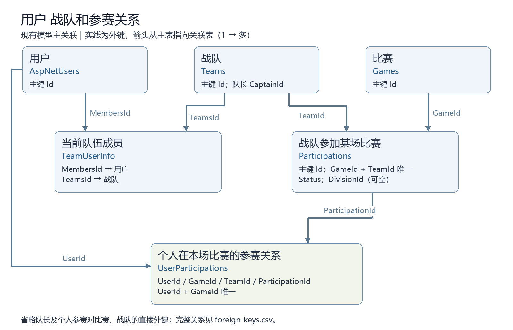
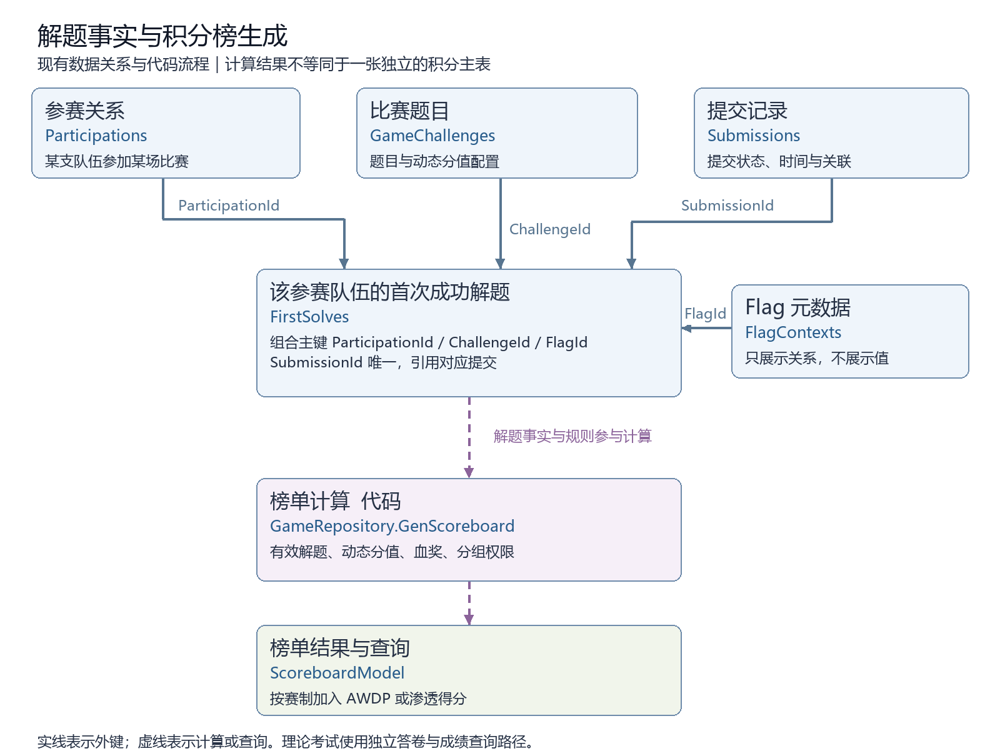

# YINYU 现有数据库关系与复用讨论简报

日期：2026-09-15。用途：汇报当前数据结构，明确新平台复用范围和首批交付内容。

源码基线为 `4bef3770`，模型快照包含 **152 张逻辑表、308 条外键关系**。这些是源码模型统计，生产库可能因迁移版本和遗留表而不同；本材料不是生产数据库结构导出，也不包含生产业务数据。

## 一分钟汇报

现有平台已经具备用户、战队、参赛关系、提交记录和计分基础，建议继续使用 PostgreSQL 的现有架构，先整理模块边界和接口。现在最需要确定的是，新平台想复用表结构、现有数据，还是通过 API 复用业务能力。

战队当前成员和每场比赛的参赛成员已经分别保存，这为复用提供了基础。计分则需要结合题目规则、解题事实、时间和赛制计算，不能只复制一张积分表。后续应优先明确队伍和计分规则，再交付关系图、接口范围和迁移方案；组网独立 API 按需求方意见放在较低优先级。

## 当前数据库如何分工

业务数据主要在同一个 PostgreSQL 库中，按表分开；下表的业务分组不表示已经拆成独立数据库或独立服务。

| 业务范围 | 代表表 | 保存的事实 |
| --- | --- | --- |
| 身份与战队 | AspNetUsers、Teams、TeamUserInfo | 账号、战队、当前队伍成员关系 |
| 比赛与参赛 | Games、Divisions、Participations、UserParticipations | 比赛、分组、战队参赛、个人参赛关系 |
| CTF 题目与解题 | GameChallenges、FlagContexts、Submissions、FirstSolves | 题目及规则、Flag 元数据、提交、首次成功解题 |
| 理论考试 | TheoryQuestionBankItems、TheoryPapers、TheoryAnswerSheets | 题库、试卷、答卷及成绩 |
| 培训与练习 | TrainingCourses、TrainingCourseEnrollments、ExerciseChallenges、ExerciseSubmissions | 课程、报名、练习定义、练习提交 |
| 内容与文件 | Files、Attachments、ImageTemplates | 文件元数据、附件关系、镜像模板 |
| 运行与组网 | DeploymentQueueTickets、WorkerNodes、TeamLabTopologies、TeamLabRuntimes | 统一部署任务、节点、场景和运行 |
| 攻防与审计 | AwdpRounds、AwdpCheckerTasks、Logs、DataGovernanceRuns | 攻防轮次与检测、日志、数据清理记录 |

Redis 承担缓存、协调和高频数据缓冲；附件、镜像及实例磁盘的实际内容在文件或镜像存储中。数据库 `Files` 记录 hash、文件名和大小，存储子目录由 hash 计算；因此服务器磁盘占用不能直接等同于数据库体积。

## 图一 用户战队和参赛关系

实线表示现有外键，箭头从被引用的主表指向保存外键的表。图中展示核心关联，省略复线；完整外键见附录 CSV。字段名称和关联来自当前模型，不是新表方案。

| 表 | 业务意义 | 对复用的启示 |
| --- | --- | --- |
| Teams 与 TeamUserInfo | 战队本身及当前成员关系 | 可供不同比赛使用，但成员变动规则需要明确 |
| Participations | 某支战队参加某场比赛；包含审核状态和分组引用 | `(GameId, TeamId)` 有唯一约束，同队同场不重复报名 |
| UserParticipations | 个人属于该场比赛的哪支参赛队伍 | `(UserId, GameId)` 有唯一约束；另直接引用 TeamId、GameId |

例如，同一支战队可以参加多场比赛，每场对应自己的 Participation；某场的参赛成员通过 UserParticipation 关联。现有结构已经区分“当前队伍成员”和“本场参赛成员”，但没有据此证明姓名、队名及成员关系是永久冻结的历史快照；历史保留、成员更换和删除规则仍需确认。

Teams.CaptainId 还引用用户；该关系和 UserParticipations 对 GameId、TeamId 的直接外键为简化图面未绘出。

## 图二 提交记录如何形成积分榜

上半图实线表示数据库外键；下半图虚线表示代码计算和查询，不是外键，也不是新建的数据库表。

1. Submissions 保存提交状态、时间及参赛、题目等关联；它有 Score 字段，但 CTF 榜单并非直接把所有 Submission.Score 相加。
2. FirstSolves 保存某个参赛关系对某题、某 Flag 的首次成功解题，并引用对应 Submission。其组合主键为 `(ParticipationId, ChallengeId, FlagId)`，SubmissionId 有唯一索引。它不是“整场比赛只有第一支解出题的队伍才有一条记录”。
3. `GameRepository.GenScoreboard` 读取首次解题、提交时间、题目及 Flag 计分配置、参赛状态和分组权限，计算动态分值及一二三血奖励，再生成榜单。
4. 当前普通／混合榜单的总分由 CTF、AWDP、Penetration 三部分组成，按赛制加入攻防或渗透结果；理论考试有独立答卷和成绩查询路径。不能先假设所有业务采用同一计分规则。

这意味着积分复用至少要定义：分数来自哪些事实、使用什么规则、什么时候重新计算，以及如何查询排名。是否需要跨比赛累计积分、人工调分和不可变成绩快照，要由新平台需求决定。

## 审计结论与当前处理状态

| 结论 | 当前证据 | 当前处理 |
| --- | --- | --- |
| 不能仅因表多就拆库或合表 | 152 张表承担不同事实；尚未采集现网体积和负载 | 先测容量、增长率和查询，再做性能决策 |
| 修改影响范围需要缩小 | 部分 Controller 直接操作多模块数据，映射仍部分集中在 AppDbContext | 建议明确表 owner，按用例收拢读写入口和公开接口 |
| 数据清理有已定位故障 | 流量分区检查 SQL 含错误反斜杠，会中断该周期后续清理 | 独立审计分支已修复，PostgreSQL 专项 4/4；未合并和部署 |
| 后续治理仍有缺口 | 单周期单批清理吞吐、空窗口扫描、Blob GC、历史迁移来源 | 已记录后续任务，本次未宣称全部修复 |

审计修复提交 `293b6d2d` 位于 `codex/database-maintainability-review`；后续文件存储说明修订为 `44dd2f0`。该分支 Release 构建通过，全量单测 1,121/1,123，两项为既有 TeamLab 调度断言失败。当前关系图分支仅交付文档和生成工具，不改变计分、数据库或生产环境。

## 需要需求方确认的五个问题

| 要确认什么 | 可以直接这样问 | 决定什么 |
| --- | --- | --- |
| 首批业务 | 新平台第一版是什么类型，需要支持哪几种比赛或赛制？ | 模块范围和计分规则 |
| 复用方式 | 是沿用表结构、沿用现有账号和战队数据，还是通过 API 使用现有能力？是否要求共用一个库？ | 数据边界、接口和迁移方式 |
| 队伍规则 | 需要复用成员、队长、报名审核、分组中的哪些内容？比赛中能否换人，历史名单如何保留？ | 战队与参赛模型 |
| 积分规则 | 需要哪些得分方式、动态分值、攻防加减分、人工调整、并列排名或跨比赛累计？ | 计分事实、规则与查询接口 |
| 本周验收 | 本周先确认结构和接口方案，还是要完成开发、数据迁移并让新平台实际调用？谁负责验收？ | 可承诺的交付边界 |

建议对方先确认以上问题，再评审一份“保留哪些现有表、哪些关系需要调整、公开哪些接口、旧数据如何迁移”的对照方案。现在的图是现状图，不能当作已批准的新平台数据库设计。

## 可直接转发的说明

> 已整理现有数据库关系和审计结果，重点展开了用户、战队、参赛、提交与积分榜。现有结构可以作为复用基础，但积分涉及赛制和计算规则，不能只复制几张表。建议先确认新平台首批赛制、需要共享的数据、队伍及积分规则，以及本周验收范围；范围确定后，再给出调整后的表结构、API 和迁移方案。组网 API 作为后续独立事项推进。

## 技术核对附录

- [完整逻辑表清单](database-diagrams/tables.csv)：152 张表及对应实体和主键。
- [完整外键清单](database-diagrams/foreign-keys.csv)：308 条关系，记录子表、外键列、被引用表、删除行为和基数；基数结合主键、无条件唯一索引推导，不包含 hash 等非外键引用或仅在业务代码中检查的规则。
- [完整关系图 Mermaid 源文件](database-diagrams/full-schema.mmd)：可按模块筛选后渲染；全部节点同时展示较密，不作为汇报主图。
- 来源：`src/GZCTF/Migrations/AppDbContextModelSnapshot.cs`、`Models/AppDbContext.cs`、`Models/Data/Team.cs`、`UserParticipation.cs`、`FirstSolve.cs`、`Modules/Ctf/Infrastructure/Persistence/CtfQueryEntityConfigurations.cs`、`Repositories/GameRepository.cs`、`Models/Request/Game/ScoreboardModel.cs`、`Controllers/TheoryPlayerController.cs`。
- 生成和检查：`python scripts/documentation/build_database_relationship_brief.py`，需 Python 与 Pillow。Windows 默认使用微软雅黑，其他环境可通过 `--font` 指定中文字体。工具仅读取源码快照，不连接数据库；如快照生成格式变化会报错，需要复核解析器。生成统计保存在 [manifest.json](database-diagrams/manifest.json)，含快照 SHA-256，便于确认材料对应的版本。
