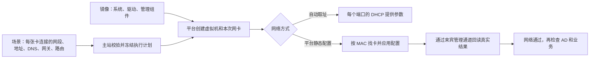

# TeamLab 镜像与平台网络如何配合

2026-10-02。本说明对应 `codex/teamlab-managed-network` 开发版本；尚未部署，实机验收结果另记。

## 先理解分工

镜像保存操作系统、应用和驱动。平台每次创建实例时重新提供虚拟硬件，包括网卡；旧网卡的名字和设置不一定跟着磁盘迁移。平台因此需要用本次网卡的 MAC（网卡地址）识别设备，再应用场景要求，不能假定第一张卡总叫 `Ethernet` 或 `ens18`。



QGA 是虚拟机里的管理服务。平台通过虚拟硬件通道联系它，网络不通时也能使用，不需要额外管理网卡。cloud-init 是 Linux 首次启动读取初始化资料的工具。两者都需要安装和配置，单装网卡驱动不够。

## 选择网络方式

| 方式 | 谁填写来宾网络 | 适用情况 |
| --- | --- | --- |
| DHCP 自动取址 | 来宾请求，平台 DHCP 返回本次参数 | 普通自动取址镜像；继续支持既有场景 |
| 平台静态配置（ManagedStatic） | Agent 按 MAC 配置并回读 IP、掩码、DNS、路由 | 从 PVE 迁移的固定内网、多网卡、AD 环境 |

`Preconfigured` 是旧的“镜像自行配置”值，只保留旧数据读取和执行。新建场景优先使用表中两种方式。`Dhcp=0` 和 `Preconfigured=1` 的数值不能重新解释，否则已有场景会变成别的模式；本轮没有增加旧镜像自动修补子系统。

新增逐网卡选项仅用于 VM，Docker 继续既有网络行为。若把 VM 连接改成 Docker，界面提供明确清除 VM 专用要求的按钮，保存前须移除不支持的设置。

## 镜像准备一次

先在独立制作机或副本完成下列准备，保留原模板和快照。不要把旧网卡修复任务、平台网络初始化与应用启动混在一个脚本里。

| 来宾 | 本轮静态执行器前提 |
| --- | --- |
| Ubuntu/Netplan Linux | QGA、virtio-serial 通道、cloud-init/NoCloud、Netplan、Python3/PyYAML、支持 JSON 输出的 iproute2、systemd-resolved/resolvectl、GNU timeout |
| Windows | 支持 guest-exec input-data 的 QGA、与系统版本匹配的 virtio-serial 和网卡驱动、Windows PowerShell/WMI/netsh |

Linux 当前实现面向上述工具组合，并非所有发行版都可直接使用。Windows 不按 Linux NoCloud 初始化；Agent 使用 QGA 执行系统自带的网络工具。脚本通过管理通道的标准输入传入，避免多网卡配置超过 Windows 命令长度限制；QGA不支持该输入能力会明确失败。Server 2008 R2 使用兼容旧 PowerShell 的路径，仍须实际检查其 QGA/驱动版本，不能凭脚本语法检查宣布支持通过。

检查 Linux 是否具备工具，用途是及早发现缺件；输出应有路径和 QGA 服务状态。不同发行版服务名可能不同。

```bash
command -v cloud-init netplan python3 ip resolvectl timeout
python3 -c 'import yaml; print("PyYAML OK")'
systemctl status qemu-guest-agent --no-pager
```

Windows 在“服务”窗口确认 QEMU Guest Agent 运行，在“设备管理器”确认网卡和管理通道没有黄色警告。平台仍会独立验证 QGA 通道，服务正在运行不能替代通道已接通。

## 平台填写每张网卡

在资产里选择平台静态配置，再逐张连接填写网络要求：

1. 接入哪个交换机/网段；地址由场景分配规则决定，须核对最终计划地址。
2. 需要固定接口名时明确填写。平台用 MAC 找卡，再命名；无需沿用 PVE 的插槽顺序。
3. 默认网关可继承主网卡选择，也可明确关闭。同一资产最多一个有效默认网关。主网卡是配置偏好，不是旧网卡绑定证明。
4. DNS 留空表示继承网段设置；明确无 DNS 表示不设置；明确列表只应用到这张卡。网段可选择 DC 资产作为 DNS，实际地址从本次计划解析。
5. 需要额外路由时指定目的网段和下一跳；可选 metric 是优先级，数值越小通常越优先，仅静态模式支持。

平台静态配置会管理声明的网卡，其已有 IPv4/DNS/默认网关会按要求替换。Linux 会保留配置备份；Windows 不提供整套失败回滚，故首次验收务必使用独立实例。应用和 AD 账户不会由网络初始化器修改。

DHCP 模式下 Linux 配置盘识别并开启对应网卡的 DHCP；IP、DNS、网关、无 metric 的静态路由由端口 DHCP 选项提供。不要同时保留会反复写静态地址的旧开机任务。DHCP 客户端必须能读取相关路由选项，实机验收仍有必要。

## 第二套环境的目标关系

| 机器 | 接口网络 | 目标地址 | 默认网关 | DNS |
| --- | --- | --- | --- | --- |
| web01 / 原 VM118 | 外网段 | 10.66.0.15/24 | 无 | 无 |
| web01 / 原 VM118 | 内网段 | 172.22.1.15 | 无 | 无 |
| DC01 / 原 VM119 | 内网段 | 172.22.1.2 | 无 | 127.0.0.1 |
| OA01 / 原 VM120 | 内网段 | 172.22.1.18 | 无 | 无 |
| Windows / 原 VM121 | 内网段 | 172.22.1.21 | 无 | 172.22.1.2 |

平台内网计划此前使用 `172.22.0.0/23`，以保留上述地址并满足当前保留地址约束；最终来宾掩码须与平台计划一致，不能一边 `/24` 一边 `/23`。平台不添加连接两个网段的逻辑路由器。web01 的两张卡只代表接入两网段；是否转发流量仍由原来宾配置决定。本轮不修改其题目业务或转发策略。

## 发布和验收

先保存场景，检查计划里的网卡数、MAC 对应、IP/掩码、DNS/网关与节点能力，再发布独立版本。平台提示缺管理组件时修复制作用副本，不直接改原教学环境。

网络阶段依次为 `guest-ready`（管理通道可用）、`guest-network-apply`（已应用）、`guest-network-verify`（真实结果匹配）。静态模式缺工具或回读不匹配必须失败。配置更新可能替换资产并造成中断；预览会包含受影响资产。例如 DC 地址变化，也会替换继承其 DNS 的静态成员机。

验收顺序：创建独立实例 → 核对每张卡的真实参数 → 同网段互通 → 外/内网没有平台额外打通 → RDP/SSH → 域解析和登录 → 重置后重复检查 → 按正常平台流程销毁。两份实例隔离另测；固定 IP 的多副本地址池/VRF 重设计不在本轮范围，不能默认当前地址分配支持原样并行复制。

清理只销毁本次专用测试实例；不清理原 PVE VM、模板、快照和备份。发布物、镜像和原始验收日志放仓库外，凭据不写本文档。
