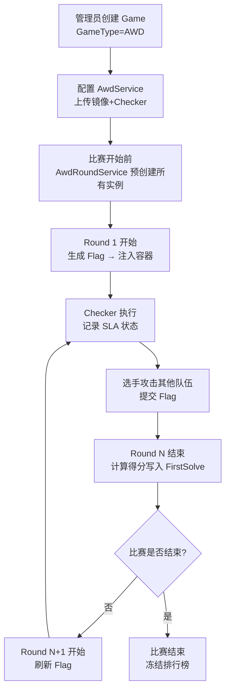
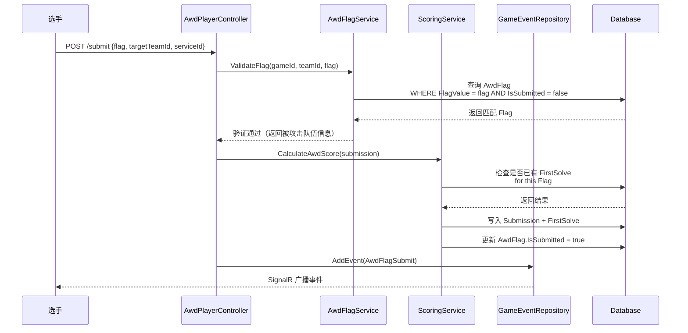
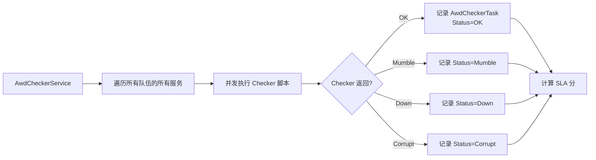

# AWD 攻防赛模式 — 设计文档

> 版本：v1.0  
> 日期：2026-06-04  
> 作者：AI Agent  
> 关联需求：平台 AWD 赛制拓展，与理论赛功能零冲突合并

---

## 1. 概述

### 1.1 目标
为 NEWGZCTF 平台引入传统团队 AWD（Attack With Defense）赛制，作为独立于原生 Jeopardy CTF 和应急响应（IR）赛制的第三种比赛模式。

### 1.2 核心特征
- **赛制类型**：传统团队 AWD（CTF-AWD）
- **靶机环境**：Docker 容器（复用原生容器基础设施）
- **队伍规模**：团队制（复用原生 Team/Participation 体系）
- **轮次驱动**：定时 Tick/Round，每轮 Flag 强制刷新
- **计分方式**：攻击分 + SLA 分（零和博弈）

### 1.3 设计原则
1. **零侵入原生**：不改任何原生 Controller/Service/Repository 的内部逻辑
2. **最大化复用**：排行榜、通知、日志、容器、队伍管理全部复用原生
3. **命名空间隔离**：所有 AWD 专属代码以 `Awd` 前缀命名，与 Exercise（理论赛）绝对隔离
4. **渐进式实现**：分 Phase 交付，核心功能优先，高级功能（攻击图、流量审计）放到 v2

---

## 2. 术语表

| 术语 | 英文 | 含义 |
|------|------|------|
| 服务 | Service | AWD 中的一道"题"，对应一个 Docker 镜像（如 Web 漏洞靶机） |
| 靶机实例 | Instance | 某队伍运行的某个服务的容器实例 |
| 轮次 | Round / Tick | 比赛的时间片（如 5 分钟），每轮 Flag 刷新 |
| Flag | Flag | 每轮每个队伍每个服务中的随机字符串，攻击目标 |
| Checker | Checker | 裁判脚本，检查服务可用性、功能性、Flag 可读性 |
| SLA | SLA | Service Level Agreement，服务可用性得分 |

---

## 3. 数据模型设计

### 3.1 新增实体关系图

```
Game (1) ───────< (N) AwdService
   │
   └─────────────< (N) AwdRound
                       │
                       ├─< (N) AwdFlag
                       │       (RoundId + ServiceId + TeamId)
                       └─< (N) AwdCheckerTask
                               (RoundId + ServiceId + TeamId)

AwdService (1) ──< (N) AwdServiceInstance
                        │
                        └─> (1) Container (原生)
```

### 3.2 实体详细定义

#### `AwdService` — AWD 服务定义
```csharp
public class AwdService
{
    public int Id { get; set; }
    public int GameId { get; set; }
    public Game Game { get; set; }

    [Required]
    public string Name { get; set; } = string.Empty;           // 服务名称（如 "WebShop"）

    [Required]
    public string ImageName { get; set; } = string.Empty;      // Docker 镜像名

    public int ExposePort { get; set; }                        // 暴露端口（如 80, 8080）

    public string? CheckerScript { get; set; }                 // Checker Python 脚本内容
    public string? CheckerEntrypoint { get; set; }             // Checker 入口（如 "python checker.py"）

    public int OriginalScore { get; set; } = 1000;             // 初始分值权重
    public int AttackPoints { get; set; } = 50;                // 每次攻击得分
    public int SlaPoints { get; set; } = 20;                   // 每轮 SLA 得分

    // 限制
    public int MaxAttackPerRound { get; set; } = 3;            // 每轮每服务被攻击失分上限
}
```

#### `AwdServiceInstance` — 队伍靶机实例
```csharp
public class AwdServiceInstance
{
    public int Id { get; set; }
    public int ServiceId { get; set; }
    public AwdService Service { get; set; }

    public int TeamId { get; set; }
    public Team Team { get; set; }

    public int? ContainerId { get; set; }                      // FK → 原生 Container 表
    public Container? Container { get; set; }

    public string NetworkName { get; set; } = string.Empty;    // Docker 网络名（awd-team-{teamId}）
    public bool IsRunning { get; set; }
    public DateTimeOffset CreatedAt { get; set; } = DateTimeOffset.UtcNow;
}
```

#### `AwdRound` — 轮次管理
```csharp
public class AwdRound
{
    public int Id { get; set; }
    public int GameId { get; set; }
    public Game Game { get; set; }

    public int RoundNumber { get; set; }                       // 第 N 轮（从 1 开始）
    public DateTimeOffset StartTime { get; set; }
    public DateTimeOffset? EndTime { get; set; }
    public AwdRoundStatus Status { get; set; } = AwdRoundStatus.Preparing;
}

public enum AwdRoundStatus
{
    Preparing,     // 准备中（还未开始）
    Running,       // 进行中
    Finished       // 已结束
}
```

#### `AwdFlag` — 每轮每队 Flag
```csharp
public class AwdFlag
{
    public int Id { get; set; }
    public int RoundId { get; set; }
    public AwdRound Round { get; set; }

    public int ServiceId { get; set; }
    public AwdService Service { get; set; }

    public int TeamId { get; set; }
    public Team Team { get; set; }

    [Required]
    public string FlagValue { get; set; } = string.Empty;      // 如 "flag{32位随机}"

    public bool IsSubmitted { get; set; }                      // 是否已被其他队伍提交
    public DateTimeOffset? FirstSubmittedAt { get; set; }      // 首次被提交时间
}
```

#### `AwdCheckerTask` — Checker 执行结果
```csharp
public class AwdCheckerTask
{
    public int Id { get; set; }
    public int RoundId { get; set; }
    public AwdRound Round { get; set; }

    public int ServiceId { get; set; }
    public AwdService Service { get; set; }

    public int TeamId { get; set; }
    public Team Team { get; set; }

    public CheckerStatus Status { get; set; }
    public string? Message { get; set; }                       // 错误信息或附加说明
    public DateTimeOffset ExecutedAt { get; set; } = DateTimeOffset.UtcNow;
}

public enum CheckerStatus
{
    OK,        // 服务正常，Flag 可读
    Mumble,    // 服务运行但功能异常
    Down,      // 服务宕机/不可达
    Corrupt    // Flag 丢失/不可读
}
```

### 3.3 对原生模型的最小扩展

#### `Game` 模型 — 增加 `GameType` 枚举
```csharp
public enum GameType
{
    Jeopardy = 0,      // 原生 Jeopardy CTF
    AWD = 1,           // AWD 攻防赛
    Theory = 2,        // 预留：理论赛（Exercise）
    Mixed = 3          // 混合模式：同时包含 CTF + AWD
}

public class Game
{
    // ... 现有字段 ...
    public GameType GameType { get; set; } = GameType.Jeopardy;
}
```

> **Mixed 模式**：当 `GameType == Mixed` 时，比赛同时包含原生 CTF 题目（`GameChallenge`）和 AWD 服务（`AwdService`）。排行榜同时显示 CTF 总分和 AWD 总分，综合排名按两者之和排序。
>
> **与 Exercise 的兼容性**：Exercise 功能可使用 `GameType.Theory = 2`，与 AWD 的 `GameType.AWD = 1` / `Mixed = 3` 互不冲突。

#### `EventType` 枚举 — 新增 AWD 事件类型
```csharp
public enum EventType
{
    // ... 现有值 ...
    AwdFlagSubmit = 20,       // AWD Flag 提交
    AwdServiceUp = 21,        // Checker 检测服务恢复
    AwdServiceDown = 22,      // Checker 检测服务宕机
    AwdServiceMumble = 23,    // Checker 检测服务功能异常
    AwdRoundStart = 24,       // 轮次开始
    AwdAttackSuccess = 25,    // 攻击成功（一血/二血等）
}
```

---

## 4. API 设计

### 4.1 后端 Controller

#### `AwdAdminController` — 管理后台 API
路由前缀：`/api/admin/awd`

| 方法 | 路由 | 权限 | 说明 |
|------|------|------|------|
| GET | `/games/{gameId}/services` | Admin | 获取某比赛的 AWD 服务列表 |
| POST | `/games/{gameId}/services` | Admin | 创建 AWD 服务 |
| PUT | `/services/{serviceId}` | Admin | 更新 AWD 服务 |
| DELETE | `/services/{serviceId}` | Admin | 删除 AWD 服务（连带清理所有实例） |
| POST | `/games/{gameId}/start` | Admin | 启动 AWD 比赛（创建所有实例，开始第一轮） |
| POST | `/games/{gameId}/stop` | Admin | 停止 AWD 比赛 |
| POST | `/games/{gameId}/next-round` | Admin | 手动推进到下一轮 |
| GET | `/games/{gameId}/instances` | Admin | 获取所有队伍的所有实例状态 |
| POST | `/instances/{instanceId}/reset` | Admin | 重置指定队伍实例 |
| GET | `/games/{gameId}/rounds` | Admin | 获取轮次历史 |
| GET | `/games/{gameId}/flags` | Admin | 获取 Flag 审计日志 |

#### `AwdPlayerController` — 参赛者 API
路由前缀：`/api/awd`

| 方法 | 路由 | 权限 | 说明 |
|------|------|------|------|
| GET | `/games/{gameId}/status` | User | 获取当前比赛状态（当前轮次、剩余时间） |
| GET | `/games/{gameId}/services` | User | 获取服务列表（含本队访问地址） |
| GET | `/games/{gameId}/scoreboard` | User | 获取 AWD 实时排行榜 |
| POST | `/games/{gameId}/submit` | User | 提交 Flag |
| GET | `/games/{gameId}/attack-log` | User | 获取本队的攻击记录 |
| GET | `/games/{gameId}/service-status` | User | 获取各队服务状态矩阵 |

### 4.2 SignalR Hub 事件

复用原生 `MonitorHub`，新增 AWD 专属事件：

```csharp
// IMonitorClient 接口新增方法
Task ReceivedAwdRoundChange(AwdRound round);
Task ReceivedAwdFlagSubmit(GameEvent gameEvent);
Task ReceivedAwdServiceStatusChange(AwdServiceStatusModel status);
```

---

## 5. 核心流程设计

### 5.1 比赛生命周期



### 5.2 轮次轮转流程（AwdRoundService）

`AwdRoundService` 是一个 `IHostedService`，负责驱动整个 AWD 比赛的时间线。

**每轮执行流程**：

1. **生成 Flag**：复用原生 `FlagHelper.GenerateFlag()` 为每个队伍的每个服务生成随机 Flag
2. **注入 Flag**：复用原生动态 Flag 机制，通过 `ContainerConfig.Flag` 字段在容器创建/重启时注入（环境变量 `FLAG={value}`）
3. **触发 Checker**：调用 `AwdCheckerService` 执行本轮检查
4. **等待轮次结束**：睡眠到配置的轮次时长
5. **结算得分**：
   - 读取本轮所有 Flag 提交记录
   - 读取本轮所有 Checker 结果
   - 计算每个队伍的攻击分、SLA 分、被攻击失分
   - 写入 `Submission` + `FirstSolve`（对接原生排行榜）
6. **广播事件**：通过 `IGameEventRepository.AddEvent()` 推送 `AwdRoundStart` 事件

### 5.3 Flag 提交与验证流程



**关键规则**：
- 同一 Flag 只能被成功提交一次（`AwdFlag.IsSubmitted` 保证）
- 选手不能提交自己队伍的 Flag（前端过滤 + 后端校验）
- 每轮每服务被攻击失分有上限（`AwdService.MaxAttackPerRound`）

### 5.4 Checker 执行流程（AwdCheckerService）



**Checker 执行方式**：
- Checker 是管理员上传的 Python 脚本
- 平台通过 `Process.Start()` 执行：
  ```bash
  python checker.py <target_ip> <target_port> <flag_value>
  ```
- Checker 返回值：
  - 退出码 0 + stdout "OK" → `OK`
  - 退出码 0 + stdout "MUMBLE" → `Mumble`
  - 退出码 1 + stdout "DOWN" → `Down`
  - 退出码 1 + stdout "CORRUPT" → `Corrupt`
- 超时：30 秒（可配置）

---

## 6. 得分计算

### 6.1 公式

```
总得分 = 攻击分 + SLA 分 - 被攻击失分
```

### 6.2 各项得分

| 得分项 | 计算方式 | 说明 |
|--------|----------|------|
| **攻击分** | 每次成功提交 Flag：`+AwdService.AttackPoints` | 攻击其他队伍获得 |
| **SLA 分** | 每轮每个服务 Checker 返回 OK：`+AwdService.SlaPoints` | 服务存活奖励 |
| **被攻击失分** | 每次被其他队伍攻破：`-AwdService.AttackPoints` | 零和博弈 |

### 6.3 保护机制

- **被攻击失分上限**：每轮每个服务最多失分 `MaxAttackPerRound` 次，防止头部队伍被无限刷分
- **SLA 分下限**：SLA 分不会为负，即使所有服务都 Down，最低为 0

### 6.4 对接原生排行榜

#### Mixed 模式排行榜展现

当 `GameType == Mixed` 时，排行榜同时显示 CTF 分数和 AWD 分数：

| 排名 | 队伍 | CTF 赛 | AWD 赛 | 综合总分 |
|------|------|--------|--------|----------|
| 1 | TeamA | 1500 | 800 | 2300 |
| 2 | TeamB | 1200 | 1000 | 2200 |

- **CTF 赛得分**：原生 `GenScoreboard()` 按 `GameChallenge` 计算的得分
- **AWD 赛得分**：通过 `Submission` + `FirstSolve` 写入的 AWD 得分（攻击分 + SLA 分 - 被攻击失分）
- **综合总分**：CTF 分 + AWD 分，用于最终排名

#### 得分写入方式

AWD 得分通过写入 `Submission` + `FirstSolve` 进入原生排行榜系统：

```csharp
// AwdRoundService 结算时
foreach (var teamScore in roundScores)
{
    // 攻击分写入
    foreach (var attack in teamScore.Attacks)
    {
        await scoringService.CreateNativeSubmissionAsync(
            gameId: game.Id,
            teamId: attack.AttackerTeamId,
            challengeId: attack.ServiceId,  // 用 ServiceId 作为 ChallengeId
            answer: attack.FlagValue,
            score: attack.Points,
            type: ScoringSubmissionType.Flag
        );
    }

    // SLA 分写入（作为特殊 Submission）
    await scoringService.CreateNativeSubmissionAsync(
        gameId: game.Id,
        teamId: teamScore.TeamId,
        challengeId: 0,  // SLA 用特殊 ChallengeId
        answer: "SLA",
        score: teamScore.SlaPoints,
        type: ScoringSubmissionType.Custom
    );
}
```

> **实现说明**：为每个 `AwdService` 同步创建对应的 `GameChallenge` 记录（标记为特殊类型，前端 Challenge 列表中不显示），使原生 `GenScoreboard()` 能够自动按 Challenge 分组计算 AWD 每服务得分。

---

## 7. 前端设计

### 7.1 技术约束
- **UI 库**：`@mantine/core` v9 + `@mantine/emotion`
- **图标**：`@mdi/js` + `@mdi/react`
- **图表**：`echarts` + `recharts`
- **路由**：`react-router` v7 + `vite-plugin-pages`（文件系统路由）
- **数据获取**：`swr`
- **主题**：完全复用 `ThemeOverride.ts`，primaryColor = 'brand'

### 7.2 参赛者界面

#### 新增 Tab：`/games/:id/awd`
在 `WithGameTab` 的 `pages` 数组中新增（仅当 `game.gameType === GameType.AWD` 时显示）：

```tsx
{
  icon: mdiSwordCross,
  title: t('game.tab.awd'),
  path: 'awd',
  link: 'awd',
  requireJoin: true,
}
```

#### 页面组件：`pages/games/[id]/Awd.tsx`

**布局**：复用 `WithGameTab` + `Stack` + `Card`（Mantine 风格）

**核心区域**：
1. **轮次倒计时卡片**（顶部）
   - 复用 `GameCountdown` 样式，改为 Round 倒计时
   - 使用 `Card` + `GameProgress` 组件

2. **服务状态矩阵**（左侧 60%）
   - `Table` 组件：行=队伍，列=服务
   - 单元格用 `Badge` 显示状态（`variant="outline"`，颜色：teal=OK, yellow=Mumble, red=Down）
   - 本队行高亮显示

3. **Flag 提交区**（右侧 40%）
   - `TextInput`（Flag 输入框）+ `Select`（目标队伍）+ `Select`（目标服务）+ `Button`（提交）
   - 提交后显示 `showNotification` 反馈

4. **攻击记录流**（底部）
   - 复用 `LogsView` 的 `logItem` 样式
   - 显示实时攻击事件（通过 SignalR `ReceivedAwdFlagSubmit`）

5. **实时排行榜**（右侧边栏）
   - 复用 `ScoreboardTable` 组件样式
   - 显示总分、攻击分、SLA 分、被攻击失分

### 7.3 管理员界面

#### 新增页面：`/admin/games/[id]/Awd.tsx`

**布局**：复用 `AdminPage` + `WithGameEditTab`

**核心区域**：
1. **比赛控制面板**
   - `Button` 组：开始比赛 / 暂停 / 结束 / 手动推进轮次
   - `SegmentedControl`：切换当前视图

2. **服务管理**
   - `Table`：服务列表（名称、镜像、端口、Checker 脚本）
   - `ActionIcon`：编辑/删除
   - `Dropzone`：上传 Checker 脚本
   - `Modal`：创建/编辑服务表单

3. **靶机监控网格**
   - `SimpleGrid`：每队每服务一个 `Card`
   - `Card` 内显示：`Badge`（状态）+ `Text`（IP:Port）+ `ActionIcon`（重置按钮）

4. **Flag & 提交审计**
   - `Table`：所有 Flag 提交记录
   - 列：时间、攻击者、被攻击者、服务、Flag、得分
   - `ScrollArea` 分页

5. **轮次历史**
   - `Timeline` 组件（Mantine Timeline）
   - 显示每轮的开始时间、Checker 结果摘要、得分变化

---

## 8. 与原生系统的对接清单

| 原生系统 | AWD 如何使用 | 是否修改原生代码 |
|----------|-------------|-----------------|
| `Game` 模型 | 增加 `GameType` 字段 | **是（仅增加枚举+字段）** |
| `Participation` / `Team` | 复用，AWD 队伍即原生队伍 | 否 |
| `Container` 表 | `AwdServiceInstance.ContainerId` FK 关联 | 否 |
| `IContainerManager` | 复用 `CreateContainerAsync` / `DestroyContainerAsync` | 否 |
| `ContainerOrchestrator` | 复用 `CreateIsolatedNetwork` / `PullImageFromRegistryAsync` | 否 |
| `GameEvent` / `IGameEventRepository` | 复用 `AddEvent()`，新增 `EventType` 枚举值 | **是（仅增加枚举值）** |
| `SignalR / MonitorHub` | 复用广播机制，新增 AWD 事件接口方法 | **是（仅增加接口方法）** |
| `Submission` / `FirstSolve` | 复用，AWD 得分通过写入这些表进入排行榜 | 否 |
| `GameRepository.GenScoreboard()` | 复用，自动读取 `FirstSolve` 计算排行榜 | 否 |
| `FlagChecker` | AWD 不经过 `FlagChecker` 队列（同步验证） | 否 |
| `LogsView.tsx` | 复用样式和布局，新增 AWD 事件渲染 | 否（新增独立组件） |
| `WithGameTab.tsx` | 复用 Tab 导航，新增 AWD Tab 条件渲染 | **是（仅增加 Tab 配置）** |
| `AdminPage.tsx` | 复用管理后台布局 | 否 |

---

## 9. 与 Exercise（理论赛）的零冲突保证

| 维度 | Exercise（理论赛） | AWD（攻防赛） | 冲突风险 |
|------|-------------------|--------------|----------|
| **模型命名** | `ExerciseChallenge` | `AwdService` | 无 |
| **控制器路由** | `/api/exercise/...` | `/api/awd/...` / `/api/admin/awd/...` | 无 |
| **前端路由** | `/exercise/...`（假设） | `/games/:id/awd` | 无 |
| **数据库表** | `ExerciseChallenges` | `AwdServices`, `AwdRounds`, `AwdFlags`, `AwdCheckerTasks`, `AwdServiceInstances` | 无 |
| **GameType 枚举** | 预留 `Theory = 2` | `AWD = 1` | 无 |
| **服务注册** | `ExerciseController` | `AwdAdminController`, `AwdPlayerController`, `AwdRoundService`, `AwdCheckerService` | 无 |
| **前端组件目录** | `components/exercise/`（假设） | `components/awd/` | 无 |

---

## 10. 数据库迁移计划

### 10.1 EF Core Migration

```bash
# 1. 新增 AWD 实体到 AppDbContext
dotnet ef migrations add AddAwdModeSupport

# 2. 应用迁移
dotnet ef database update
```

### 10.2 迁移内容

1. **新增表**：
   - `AwdServices`
   - `AwdServiceInstances`
   - `AwdRounds`
   - `AwdFlags`
   - `AwdCheckerTasks`

2. **修改表**：
   - `Games`：增加 `GameType` 列（int，默认 0 = Jeopardy）
   - `GameEvents`：`EventType` 列已有，无需修改（枚举映射为 int）

---

## 11. 实现顺序与里程碑

### Phase 1：数据模型与基础设施（1-2 天）
- [ ] 定义 `GameType` 枚举并应用到 `Game` 模型
- [ ] 创建 `AwdService`, `AwdServiceInstance`, `AwdRound`, `AwdFlag`, `AwdCheckerTask` 实体
- [ ] 注册到 `AppDbContext`
- [ ] 生成 EF Core Migration
- [ ] 创建 `AwdAdminController` 骨架 + `AwdPlayerController` 骨架

### Phase 2：容器管理与实例化（2-3 天）
- [ ] 实现 `AwdInstanceService`（创建/销毁/重置靶机实例）
- [ ] 复用 `IContainerManager` + `ContainerOrchestrator` 创建容器
- [ ] 实现网络隔离（每队一个 Docker Network）
- [ ] 实现 Flag 注入（环境变量方式）
- [ ] 管理员 API：创建服务、启动比赛、重置实例

### Phase 3：轮次驱动与 Flag 轮转（2-3 天）
- [ ] 实现 `AwdRoundService`（HostedService）
- [ ] 轮次定时驱动（Tick）
- [ ] 每轮 Flag 生成与注入
- [ ] 轮次状态管理（Preparing → Running → Finished）

### Phase 4：Checker 机制（2 天）
- [ ] 实现 `AwdCheckerService`
- [ ] Checker 脚本执行（Python 进程调用）
- [ ] Checker 结果记录到 `AwdCheckerTask`
- [ ] SLA 分计算

### Phase 5：Flag 提交与得分（2 天）
- [ ] 实现 Flag 提交 API
- [ ] Flag 验证逻辑（一次性、不可自提交）
- [ ] 攻击分/防守分计算
- [ ] 得分写入 `Submission` + `FirstSolve`（对接原生排行榜）
- [ ] 复用 `IGameEventRepository` 记录 AWD 事件

### Phase 6：前端参赛者界面（3 天）
- [ ] 修改 `WithGameTab` 增加 AWD Tab
- [ ] 创建 `pages/games/[id]/Awd.tsx`
- [ ] 轮次倒计时组件
- [ ] 服务状态矩阵
- [ ] Flag 提交表单
- [ ] 实时攻击记录流（SignalR）
- [ ] 实时排行榜

### Phase 7：前端管理员界面（2-3 天）
- [ ] 创建 `pages/admin/games/[id]/Awd.tsx`
- [ ] 比赛控制面板（开始/暂停/结束/推进轮次）
- [ ] 服务管理（CRUD + Checker 上传）
- [ ] 靶机监控网格
- [ ] Flag & 提交审计表格
- [ ] 轮次历史 Timeline

### Phase 8：集成测试与优化（2 天）
- [ ] 端到端测试：创建比赛 → 启动 → 提交 Flag → 查看排行榜
- [ ] 性能测试：100+ 队伍并发场景
- [ ] 修复 Bug，优化性能

---

## 12. 风险评估与关键决策点

### 12.1 风险 1：原生排行榜 `GenScoreboard` 的 `ChallengeId` 分组（已确认）

**决策**：采用方案 A。为每个 `AwdService` 同步创建对应的 `GameChallenge` 记录，但标记为特殊类型（如 `ChallengeType.AWDService`），前端 Challenge 列表中过滤隐藏。原生 `GenScoreboard()` 无需修改即可自动计算 AWD 每服务得分。

**Mixed 模式排行榜**：当 `GameType == Mixed` 时，排行榜同时显示 CTF 列和 AWD 列，综合总分 = CTF 分 + AWD 分。

### 12.2 风险 2：Flag 注入方式（已确认）

**决策**：复用原生动态 Flag 机制。每轮通过 `FlagHelper.GenerateFlag()` 生成 Flag，通过 `ContainerConfig.Flag` 字段在容器创建/重启时注入（环境变量方式）。每轮开始时重启容器以刷新 Flag（服务中断 3-5 秒，在可接受范围内）。

### 12.3 风险 3：Checker 脚本安全性

**问题**：管理员上传的 Python Checker 脚本在服务器上执行，存在代码注入风险。

**缓解措施**：
- Checker 在沙箱中执行（如 Docker 容器或受限用户）
- 超时机制（30 秒）
- 资源限制（CPU/Memory）

---

## 13. 已确认的关键决策

以下决策已由需求方确认，作为实现阶段的基准：

1. **比赛模式**：`GameType.Mixed = 3`，一场比赛同时包含原生 CTF 题目（`GameChallenge`）和 AWD 服务（`AwdService`）。排行榜同时显示 CTF 列和 AWD 列。
2. **排行榜对接**：为每个 `AwdService` 同步创建对应的 `GameChallenge` 记录（标记为 `ChallengeType.AWDService`，前端 Challenge 列表中隐藏），原生 `GenScoreboard()` 无需修改。
3. **Flag 注入**：复用原生动态 Flag 机制（`FlagHelper.GenerateFlag()` + `ContainerConfig.Flag`），每轮通过重启容器刷新 Flag。
4. **Checker 实现**：采用 iCTF/ForcAD 标准 Checker 协议（OK/Mumble/Down/Corrupt），通过 `Process.Start()` 执行 Python 脚本，超时 30 秒。

---

*本文档基于对 newGZCTF 项目的深度代码审查和主流 AWD 平台（iCTF、ForcAD、VulnRange、OpenAWD）的功能调研编写。*
