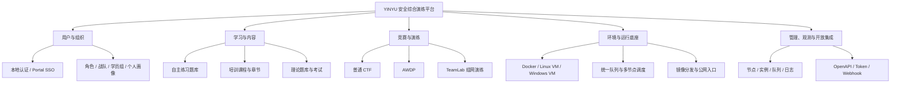

# YINYU 安全综合演练平台功能、亮点与差异化分析

> 编制日期：2026-08-13
>
> 平台源码依据：`main@55db938`；练习模块 PR #5 已合并，并包含后续验收修复
>
> 竞品观察范围：2026-08-13 可访问的 NSSCTF、CTFshow、青岑公开页面

## 1. 文档口径与结论

### 1.1 事实口径

本文描述的平台能力以远端稳定主线 `main@55db938` 为准。该主线已包含 CTF、理论考试、培训、AWDP、Windows VM、多节点调度、镜像分发、TeamLab 组网、身份认证、后台管理和自主练习模块。练习模块源自 PR #5，并已纳入后续启动、迁移和核心流程验收修复；生产环境是否已经发布仍以 `docs/development/current-state.md` 为准。

竞品比较只依据公开可见页面和可直接观察到的功能入口。没有公开展示的后台、私有部署能力或商业版本能力，本文统一标记为“公开页面未观察到”，不武断判断为“绝对不支持”。

### 1.2 一句话定位

> YINYU 不是单一的 CTF 题库或比赛系统，而是一套把赛事、日常练习、培训课程、理论考试、AWDP 攻防、复杂组网靶场、多节点算力和后台运维统一起来的网络安全教学与演练平台。

### 1.3 核心结论

YINYU 当前最显著的产品差异不是某一个单点页面，而是以下能力组合：

- **赛制更完整**：普通 CTF、理论考试、AWDP、日常练习、课程实验和 TeamLab 组网演练在一个平台内协同。
- **环境类型更完整**：附件题、静态/动态 Flag、Docker、Linux VM、Windows VM 和混合网络场景使用统一运行底座。
- **教学闭环更完整**：教师可以从课程内容、实验、课后理论一直看到学员个人完成情况和错题详情。
- **基础设施能力更强**：统一队列、容量预留、多节点调度、镜像分发、公网入口确认、运行恢复和结构化日志不再只是隐藏脚本。
- **复杂场景可资产化**：TeamLab 将多网段、多节点、容器与虚拟机混合环境变成可设计、校验、发布、复用、观测和回收的场景资产。
- **管理与开放能力更完整**：内容、用户、组织、镜像、节点、队列、实例和日志集中管理，并提供中文 OpenAPI、API Token、幂等异步操作与 Webhook。
- **界面面向长期生产使用**：vNext 采用统一设计令牌、日夜主题、响应式布局、稳定工作台和克制的几何动效，不把“网安风格”简单等同于全站终端化和霓虹效果。

## 2. 产品能力全景

| 产品域 | 主要对象 | 典型使用者 | 形成的结果 |
| --- | --- | --- | --- |
| 身份与组织 | 用户、角色、战队、学员组 | 全体用户、管理员 | 统一账号、权限与组织关系 |
| 自主练习 | 练习题、标签、附件、Flag、实例、提交 | 学员、选手、教师 | 日常刷题、分类进度和正确率 |
| 培训课程 | 课程、章节、资源、实验、课后理论 | 学生、教师 | 可管理、可考核的学习路径 |
| 理论考试 | 题库、试卷、答卷、成绩 | 学生、教师、赛事管理员 | 理论能力评价与错题回顾 |
| 普通 CTF | 比赛、队伍、题目、实例、榜单 | 选手、裁判、赛事管理员 | 解题竞赛和动态靶场 |
| AWDP | 服务、轮次、Checker、攻击、补丁 | 攻防队伍、裁判 | 服务可用性和攻防对抗评价 |
| TeamLab | 拓扑、版本、运行、网络、流量 | 场景设计者、管理员、选手 | 可重复交付的复杂组网环境 |
| 运行底座 | 镜像、节点、队列、实例、网关 | 运维与平台管理员 | 统一资源调度、可观测与恢复 |
| 开放集成 | API Token、OpenAPI、异步操作、Webhook | 门户、教学系统、自动化程序 | 系统间身份、内容和环境协同 |

## 3. 不同维度的功能与亮点

### 3.1 从“用户生命周期”看：一个账号贯穿学习、竞赛与成长

平台支持本地账号和 Portal SSO，用户不需要为课程、比赛和练习分别维护账号。围绕同一身份可以持续沉淀：

- 参加过的比赛、所属战队和比赛成绩。
- 自主练习中的已完成题目、提交次数、正确率和分类进度。
- 培训课程报名、章节完成、实验题完成和理论作业成绩。
- 理论考试答卷、成绩和错题回顾。
- 个人资料、安全设置和公开能力画像。

**亮点**：平台不是只记录某场比赛的临时成绩，而是具备形成长期网络安全学习档案的基础。

### 3.2 从“内容体系”看：一次建设，多场景使用

平台内容不局限于传统 CTF 题目：

- 普通题目支持 Markdown 题面、标签、提示、本地附件和外链附件。
- 支持单 Flag、多 Flag、静态 Flag、动态 Flag、尝试上限和不同判定方式。
- 支持静态附件题、静态容器题和动态容器题。
- 理论题支持单选、多选和判断，可组织成比赛试卷或课程章节作业。
- 课程内容支持章节、资源、视频/外链、实验题和课后测试。
- TeamLab 场景将镜像、网段、资产、路由、依赖和观测策略一起保存为版本化内容资产。

练习模块进一步打通了内容流转：

- 公共练习题库拥有独立业务域，不直接修改课程私有题目。
- 比赛题、培训习题和 AWDP 服务题可以按规则自动收录或深复制到练习池。
- 收录时保留来源关系，但不共享正在运行的赛事实例、Flag 占用状态或附件实体。
- 外部系统可通过 `/api/open/v1/exercises` 批量导入练习题，并用稳定 `externalId` 和幂等键避免重复创建。

**亮点**：内容从“一次比赛用完即止”转向“比赛、课程、练习和演练之间可治理地流转”，提高出题和教学资产的复用率。

### 3.3 从“自主练习体验”看：不只是题目列表

当前主线的练习模块包含完整用户链路：

- 支持 Web、Pwn、Reverse、Crypto、Misc、Forensics、Mobile、Blockchain、Hardware、AI、Pentest、OSINT、IR 等分类。
- 支持关键词、分类、标签、难度星级、完成状态和题目来源筛选。
- 教师可查看练习题、比赛题和培训题等来源；学生只看到允许公开的练习内容。
- 题目详情支持 Markdown、提示、题目附件和每个 Flag 独立附件。
- 容器题复用统一实例控制，支持创建、延期、销毁、队列阶段、入口状态和剩余时间。
- 支持多 Flag 逐项完成、尝试次数、正确/错误反馈和完成状态。
- 统计页面展示总题数、已完成数、正确率、分类完成情况和难度分布。
- 后台支持题目的新建、编辑、删除、附件、容器参数、动态 Flag 模板和多 Flag 管理。

**亮点**：练习模块不是另起一套简化运行逻辑，而是复用平台已经验证的附件、Flag、容器、队列和入口能力，能够自然升级为长期刷题产品。

### 3.4 从“教学闭环”看：内容、实验、测试和教师观察统一

培训模块以课程为上层对象：

- 教师及以上角色创建课程，支持草稿、发布、归档和删除。
- 课程创建者可以添加共同教师。
- 报名支持自动通过和教师审核。
- 章节支持 Markdown、资源、实验题和课后理论作业。
- 课程题目、课程环境模板和理论题库按课程隔离。
- 学生完成实验 Flag 和理论作业后，章节按条件完成。
- 教师可以查看整体学习摘要，也可以打开单个学员详情，检查章节、实验题、理论分数和对错情况。

**亮点**：与只提供“题库 + WP”的学习方式相比，YINYU 能表达教学组织关系、授课责任、报名审核、章节顺序和可量化学习结果，更适合学校、培训班和内部人才培养。

### 3.5 从“赛制广度”看：覆盖解题、理论与持续攻防

#### 普通 CTF

- 赛事信息、公告、阶段、组别、参赛审核、战队和榜单。
- 附件题、静态/动态 Flag、Docker 动态实例和 Windows VM。
- 创建、延期、销毁、倒计时、入口就绪和提交判定。
- 比赛榜单、提交记录、公告和结果导出。

#### 理论考试

- 题库、试卷、单选、多选、判断、草稿和最终提交。
- 自动判分、理论榜单、成绩统计和答案回顾。
- 同一能力可用于比赛理论赛和课程章节测试。

#### AWDP

- 服务、轮次、Checker、队伍实例和服务状态。
- 攻击 Flag 提交、补丁上传、修补状态和攻击日志。
- 实例重置、恢复、比赛停止和态势/排行榜。

#### TeamLab 组网演练

- 多网段、多节点、容器、Linux VM、Windows VM 和路由设备混合编排。
- 场景校验、不可变发布、试运行、比赛绑定和生命周期管理。
- 选手隔离接入、管理员受审计终端、流量元数据、路径和抓包。

**亮点**：平台可以从基础理论考核一路覆盖到单题动态靶场、AWDP 持续攻防和复杂企业网络演练，不需要为每种赛制维护完全独立的平台。

### 3.6 从“环境能力”看：容器与虚拟机不是外挂脚本

平台将环境作为正式业务对象管理：

- Docker 题按用户或队伍创建隔离实例。
- 动态 Flag 按实例生成，避免不同实例共享答案。
- Windows VM 支持 KVM/libvirt、网页 RDP，以及比赛场景的原生 `.rdp` 连接入口。
- 容器和 VM 共用镜像模板、节点能力判断、资源预留和部署队列。
- 镜像模板主状态与每个节点的分发状态分开表达。
- 镜像只分发到具备相应 Docker 或 KVM 能力的节点。
- 永久失败与可重试失败分开处理，避免无意义无限重试。

**亮点**：在多数以题库为中心的平台中，环境创建往往只是一个按钮；YINYU 同时建设了按钮背后的镜像、节点、队列、容量、入口和恢复体系。

### 3.7 从“多节点调度”看：从单机部署走向统一资源池

平台已形成统一运行调度底座：

- 多台 Worker 通过 Agent 上报 Docker/KVM 能力和资源库存。
- 调度同时考虑 CPU、内存、实例数、VM 数量、已运行任务和已预留任务。
- Docker 与 KVM 独立判断，缺少 KVM 不会阻断节点承载 Docker。
- 普通 CTF、VM、培训实验、AWDP 和 TeamLab 使用统一 `DeploymentQueueTicket`，不建立彼此不可见的第二套队列。
- 长耗时任务展示等待、镜像准备、调度、创建、就绪、失败和取消阶段。
- 主站重启后依据 PostgreSQL 当前事实和 Agent inventory 恢复，不依赖只存在于内存或日志文本中的状态。

**亮点**：对学校或组织内部平台而言，YINYU 不只是把多台服务器“接上去”，而是将它们作为一个可统计、可预留、可追踪的资源池管理。

### 3.8 从“复杂组网”看：TeamLab 是显著差异化能力

TeamLab 可将网络安全实验场景资产化：

- 可视化放置交换机、路由器、Docker、Linux VM 和 Windows VM。
- 配置入口区、业务区、数据区、管理区等网络区域。
- 配置网段、固定地址、网卡顺序、主网卡、路由方向、启动依赖和健康检查。
- 草稿与正式版本分离；发布形成不可变快照，后续编辑不影响正在运行的环境。
- 优先单节点放置，容量不足时按完整网段拆分到多个 Worker，并建立跨节点受控连接。
- 每支队伍获得独立运行环境、地址、网络和访问授权。
- 管理员通过网页终端、SSH 或 RDP 访问资产，不向浏览器暴露 Worker 管理地址和临时转发端口。
- 支持通信流、通信路径和按范围、时长、大小限制的抓包。
- 销毁统一回收容器、VM、临时磁盘、网络、路由、访问授权、抓包任务、容量预留和镜像引用。

**亮点**：传统题库平台主要交付“单道题 + 单个环境”，TeamLab 交付的是完整网络、资产关系和运行生命周期，更接近靶场、企业网演练和攻防教学平台。

### 3.9 从“后台管理”看：不仅管理题目，也管理平台运行

后台覆盖：

- 赛事信息、阶段、组别、公告、审核和赛制配置。
- CTF 题目、练习题、理论题库、课程与 TeamLab 场景。
- Docker/VM 镜像登记、上传、导入、运维访问配置和节点分发。
- Worker 节点注册、能力、容量和详情。
- 当前实例、部署队列、结构化日志、运行事件和错误关联。
- 用户、战队、学员组、角色权限和系统设置。
- TeamLab 场景设计、发布版本、试运行、远程运维、流量与生命周期。

**亮点**：内容管理员、教师、赛事管理员和基础设施管理员可以在同一产品内工作，但通过角色和资源作用域保持权限边界。

### 3.10 从“开放集成”看：可被门户和自动化系统调用

平台不仅提供浏览器页面，也提供面向系统集成的能力：

- Portal SSO 与本地认证并存。
- 中文 `/api-docs/` 和版本化 `/api/open/v1`。
- API Token 按 scope 和具体资源 grant 授权。
- 长耗时写操作使用 `Idempotency-Key`，返回 operation ID，不要求调用方长时间保持连接。
- 支持比赛题、练习题、培训、理论题库、战队和 TeamLab 等资源的开放接口。
- TeamLab 支持控制范围、批量发布、运行、访问、流量、抓包和 Webhook。

**亮点**：平台可以作为独立产品使用，也可以成为统一门户、教学管理系统、自动出题流水线和演练编排系统的执行平台。

### 3.11 从“界面与交互”看：现代、简约，但不牺牲复杂业务效率

vNext 的界面设计不是简单换色，而是建立统一产品语言：

- 首页、赛事、练习、培训、战队、个人主页和管理端使用一致壳层。
- 高频模块固定直达，低频模块进入全局模块抽屉；个人入口位于上下文栏右侧。
- 日间与夜间主题使用同一套语义 Token，不是两套互相覆盖的 CSS。
- 使用 CSS Module、语义颜色、稳定间距和有限圆角，避免全站大面积毛玻璃与卡片套卡片。
- 动效用于解释页面切换、抽屉位移、状态变化和首页品牌表达；支持 `prefers-reduced-motion`。
- 390、1366、1920、2560 像素宽度作为响应式检查基线。
- 长题目列表、课程正文、考试和后台表格保持安静、清晰和高密度；几何动画不会抢占工作页面注意力。
- API 缺失时显示真实空态，不用旧页面套壳或伪造数据维持“看起来完整”。

**亮点**：相较于传统 CTFd 风格页面，YINYU 的信息架构和视觉系统更适合承载课程、复杂管理工作台和 TeamLab 拓扑等大规模业务；相较于强终端化主题，正文和表单具有更好的长期可读性。

### 3.12 从“工程与治理”看：功能增长不必持续堆叠技术债

- 后端采用模块化单体主站加独立 Agent 执行面。
- 调用方向固定为 `HTTP -> Contracts -> Application -> Domain -> Infrastructure ports`。
- Controller 负责协议、授权和用例映射，不直接拼装 Agent 命令。
- PostgreSQL 是业务与运行状态事实源；Redis 负责缓存、协调和高频缓冲。
- 前端采用 `Route -> feature controller/hook -> feature panel -> foundation component`。
- 页面通过 feature API adapter 访问后端，不直接在大型组件内混合请求、DTO 转换和视觉状态。
- 生成 API、数据库迁移、领域模型和测试具有明确变更门禁。

**亮点**：平台具备继续增加新赛制、新题目类型和外部集成的结构基础，而不是每加一个页面就复制一套状态和样式。

## 4. 与同类平台的差异化比较

### 4.1 对比对象的公开产品定位

#### NSSCTF

公开页面表现为成熟的 CTF 题库与社区型产品：

- 一级入口包含题库、交流、比赛、排行、工坊、战队和 AI 专区。
- 题库公开显示 CTF、KOH、RHG 以及 Web、Pwn、Reverse、Crypto、Misc、Mobile、ETH、IoT、AI、实战等筛选。
- 提供题单、年份、来源比赛、标签、靶机、分数、评分、随机一题、每日一题和进度统计。
- 公开页面显示约 4392 道题的规模，具备明显的长期内容和社区积累。

其核心优势是**公开题库规模、细粒度筛选、社区内容、每日学习机制和长期用户成长体系**。

#### CTFshow

公开页面以长期在线靶场和专题课程为核心：

- 题目按 Web、Pwn、Reverse、Crypto、Misc、电子取证、网络迷踪、入门专题和历史赛事等大量分组组织。
- 同时提供赛事中心、积分榜、通关名单以及 Web/Pwn 课程入口。
- 页面基于 CTFd 形态，进入靶场路径直接，长期专题内容辨识度高。

其核心优势是**Web 等方向的大量专题题目、成熟课程品牌、长期靶场运营和清晰的通关路径**。

#### 青岑 CTF

公开页面表现为题库、题目集、赛事和社区融合的平台：

- 提供题库、题目集、赛事列表、战队、积分商城、排行榜、社区、个人中心和站内信。
- 题库支持分类、难度、状态、排序、搜索、网格/列表切换、随机题和个人进度。
- 页面采用强烈的终端/网格视觉语言，信息密度高、产品识别度强。

其核心优势是**题目集组织、社区与积分运营、明确的终端化品牌视觉和紧凑题库体验**。

### 4.2 能力维度矩阵

说明：`强` 表示公开页面明确展示或 YINYU 源码已形成完整能力；`有` 表示存在对应入口或基础能力；`未观察到` 仅指本次公开页面调研没有看到，不代表对方私有版本绝对不具备。

| 维度 | YINYU | NSSCTF | CTFshow | 青岑 CTF |
| --- | --- | --- | --- | --- |
| 普通 CTF 赛事 | 强 | 强 | 有赛事中心 | 强 |
| 长期公开刷题题库 | 有，练习模块已形成产品闭环，内容规模待运营 | 强，公开规模与筛选维度突出 | 强，专题靶场积累突出 | 强，题库与题目集并行 |
| 理论考试与自动判分 | 强，独立题库、试卷、草稿、成绩、回顾 | 公开页未观察到完整考试闭环 | 公开页未观察到 | 公开页未观察到 |
| 课程与教师教学管理 | 强，课程、章节、共同教师、报名、实验、作业、学员详情 | 工坊/学习入口较强，公开页未观察到同等教师管理闭环 | 有 Web/Pwn 课程入口，公开页未观察到课程后台闭环 | 公开页未观察到同等课程管理闭环 |
| AWDP 完整赛制 | 强，服务、Checker、攻击、补丁、恢复和榜单 | 公开题库可见 KOH/RHG，是否具备同等管理闭环未观察到 | 可见 AWDP 攻击题目分类，公开页未观察到完整赛事后台 | 公开页未观察到 |
| Docker 动态靶场 | 强 | 有靶机筛选，具体底座未公开 | 强，长期靶场为核心 | 有题目运行能力，具体底座未公开 |
| Linux/Windows VM | 强，KVM、网页远程访问、比赛原生 RDP | 公开页未观察到底层 VM 管理 | 公开页未观察到 | 公开页未观察到 |
| 多节点容量调度 | 强，统一队列、预留、Docker/KVM 能力和恢复 | 公开页未展示后台实现 | 公开页未展示后台实现 | 公开页未展示后台实现 |
| 多网段混合组网 | 强，TeamLab 设计、版本、跨节点、接入与回收 | 公开页未观察到 | 公开页未观察到 | 公开页未观察到 |
| 流量观测与抓包 | 有核心链路，持续扩大验收 | 公开页未观察到 | 公开页未观察到 | 公开页未观察到 |
| 镜像与节点后台 | 强，模板、分发、节点、队列、实例和日志 | 公开页未展示 | 公开页未展示 | 公开页未展示 |
| Portal SSO 与组织管理 | 强，本地认证、SSO、战队、学员组 | 战队和用户体系成熟 | 有用户中心 | 战队、用户、站内信成熟 |
| 开放 API 与自动化 | 强，OpenAPI、Token、资源授权、幂等操作、Webhook | 公开页未观察到同等开放控制面 | 公开页未观察到 | 公开页未观察到 |
| 社区与内容运营 | 基础能力存在，运营生态仍需建设 | 强，交流、工坊、AI、题单和长期数据 | 强，课程、通关名单和内容品牌成熟 | 强，社区、商城、消息和题目集 |
| 视觉设计 | 现代简约、几何动效、日夜主题、复杂工作台一致性 | 信息丰富、消费型平台成熟，视觉元素较多 | 传统 CTFd 结构，功能直接但现代化程度有限 | 终端化识别度强，紧凑但风格更偏垂直圈层 |

### 4.3 我们相对 NSSCTF 的差异

#### YINYU 更突出的方面

- 不只面向公共刷题，还覆盖课程教学、理论考试、AWDP 和复杂组网演练。
- 后台直接管理 Docker、KVM/Windows VM、镜像分发、节点容量、部署队列和实例。
- TeamLab 可以交付多网段、多节点、容器与虚拟机混合场景。
- 平台具备 Portal SSO、学员组、共同教师、报名审核和学员学习详情，更适合组织内部教学。
- OpenAPI、资源授权、幂等异步操作和 Webhook 更适合与现有信息系统集成。

#### NSSCTF 更成熟的方面

- 公开题库规模、历史赛事题目积累和标签体系明显更强。
- 每日一题、打卡、题单、用户评分、WP、社区交流和工坊形成成熟运营循环。
- 用户已经可以基于大量真实数据形成更丰富的长期画像。

#### 推荐差异化表述

> NSSCTF 更像成熟的公共 CTF 题库与社区，YINYU 更像组织内部的“教学 + 竞赛 + 靶场 + 运维”一体化平台。我们的重点不是在短期内比拼公开题目数量，而是让课程、理论、比赛和复杂环境在同一套基础设施上闭环。

### 4.4 我们相对 CTFshow 的差异

#### YINYU 更突出的方面

- 支持普通 CTF、理论考试、培训、AWDP 和 TeamLab 多类产品形态。
- 支持从单个 Docker 题到 Windows VM 和多网段混合靶场。
- 提供教师、学员、战队、报名、课程进度和后台资源治理。
- vNext 的页面壳层、响应式、日夜主题和工作台一致性更适合复杂管理业务。

#### CTFshow 更成熟的方面

- 长期 Web 靶场和专题课程拥有强品牌认知与大量内容沉淀。
- 按入门、专题、赛事和方向分组的学习路径非常直接。
- 面向大众刷题用户的入口简单，用户不需要理解复杂后台概念。

#### 推荐差异化表述

> CTFshow 擅长把大量专题题目组织成长期开箱即用的在线靶场；YINYU 的优势是把靶场进一步扩展为可组织课程、可举办多赛制比赛、可调度多节点、可管理 Windows VM 和复杂网络场景的综合平台。

### 4.5 我们相对青岑 CTF 的差异

#### YINYU 更突出的方面

- 课程、理论、AWDP、Windows VM、多节点调度和 TeamLab 形成更宽的业务覆盖。
- 后台运维能力贯穿镜像、节点、队列、实例和日志。
- 现代简约的“折域”设计在保持品牌感的同时，更适合中文长正文、表单、数据表和复杂拓扑工作台。
- 全局几何动效被限制在有解释作用的场景，普通工作页面不长期承担高强度终端装饰。

#### 青岑更成熟的方面

- 题目集、积分商城、社区、站内信和用户积分构成更完整的公开运营体系。
- 终端化视觉识别鲜明，题库网格的信息密度和快速筛选体验成熟。

#### 推荐差异化表述

> 青岑更强调题库、题目集和社区运营，并以终端视觉建立鲜明品牌；YINYU 更强调多业务工作台的一致性和复杂演练环境的交付能力，视觉上追求现代、简约和长期可读，而不是让所有页面都模拟终端。

## 5. YINYU 最值得强调的十个产品亮点

### 亮点一：多赛制统一

普通 CTF、理论、AWDP、练习、培训实验和 TeamLab 不再由多套系统割裂承载。

### 亮点二：教学与竞赛真正贯通

课程中的内容、实验和理论结果可以沉淀到用户学习记录；比赛题和培训题又可以进入练习池继续使用。

### 亮点三：Docker、Linux VM、Windows VM 统一治理

镜像、节点、容量、队列和远程访问在同一运行底座中管理，不把 Windows 靶机当成一次性人工特例。

### 亮点四：多节点调度是产品能力

平台能够解释任务为什么等待、调度到哪里、镜像是否就绪、创建到哪个阶段，而不是只显示一个无限转圈。

### 亮点五：复杂网络场景可以版本化复用

TeamLab 将拓扑草稿校验后发布为不可变版本，可多次试运行和绑定比赛，解决复杂环境难复现的问题。

### 亮点六：公网入口具有真实就绪语义

容器启动不等于外网可访问。公网 Nginx 完成配置校验、加载并 ACK 后，入口才对用户显示为 Ready。

### 亮点七：教师能看到学习过程，而不只看最终分数

学员管理可以下钻到章节、实例题、理论成绩和错题，支持教学干预与复盘。

### 亮点八：内容可以通过 API 规模化进入平台

练习题、比赛题、理论题、培训课程和 TeamLab 均具备或正在形成开放导入与自动化编排能力。

### 亮点九：现代界面服务于复杂业务

统一壳层、语义 Token、日夜主题、响应式工作台和生产性动效，使选手端与管理端保持同一产品感。

### 亮点十：明确区分“代码完成”和“生产签收”

平台文档会把功能实现、自动化测试、真实基础设施验收和规模指标分开，避免用页面存在替代生产可用性证明。

## 6. 不应回避的现阶段短板

### 6.1 内容和社区运营仍弱于成熟公共平台

练习模块已经具备完整产品与技术结构，但题库数量、题单策划、WP、评论、评分、每日任务、勋章、社区讨论和用户运营仍无法与 NSSCTF、CTFshow 等长期运营平台直接比较。

改进方向：

- 建立公开/校内题库的内容治理和版权规则。
- 建设题单、专题路径、每日任务、WP 审核和题目反馈。
- 将课程、比赛和练习记录汇总为持续成长体系。

### 6.2 练习模块仍需完成生产验收

练习模块已经合并到 `main`，并完成本地前后端门禁、数据库迁移和核心 HTTP 流程验收。正式宣传“已上线”前仍需完成：

- 在生产数据库备份或副本上复核迁移与回滚路径。
- 静态附件、多 Flag、动态容器、来源自动汇集和删除隔离的真实基础设施验收。
- 生产发布、冒烟、监控和回退验证。

### 6.3 规模指标仍需正式签收

平台具备容量预留、多节点调度和并发协调机制，但不能在没有目标硬件压测的情况下承诺固定并发数字。

改进方向：

- 按附件题、Docker、Linux VM、Windows VM、TeamLab 分别建立容量模型。
- 在目标 Worker、Registry 和公网网关上执行并发创建、重启恢复和故障演练。
- 输出“可支持多少用户/实例”的有条件指标，而不是单一营销数字。

### 6.4 TeamLab 仍有扩大验收项

单队混合场景的创建、重置、销毁和容器终端核心链路已经验证，但以下项目仍应表述为持续验收：

- 正式比赛多队并发与权限边界。
- 双 Worker 故障注入和控制面恢复。
- Linux SSH、Windows RDP 的更多模板认证。
- 端到端通信路径、长期流量留存和大抓包治理。
- 大文件远程操作和复杂服务注入效率。

### 6.5 Windows 镜像需要标准化认证

平台侧已经支持 Windows VM 和原生 RDP，但镜像仍需按照统一的固件、磁盘控制器、远程桌面、账号和关机状态规范制作并认证。应建立“已认证镜像目录”，避免把单个测试镜像成功等同于所有镜像兼容。

## 7. 建议的对外宣传口径

### 7.1 推荐主标题

> YINYU：面向网络安全教学、竞赛与复杂演练的一体化平台

备选：

- 从一道题到一张网络：统一承载学习、竞赛和实战演练
- 让课程、题目、靶机和网络场景成为可持续复用的安全教学资产
- 一个平台，覆盖练习、培训、CTF、AWDP 与多节点组网

### 7.2 推荐核心卖点

1. **一体化业务**：练习、课程、理论、CTF、AWDP 和组网演练统一入口。
2. **混合环境交付**：Docker、Linux VM、Windows VM 和多网段场景统一调度。
3. **完整教学闭环**：内容、实验、作业、进度、成绩和错题可追踪。
4. **多节点运行底座**：容量预留、镜像分发、队列、实例和恢复可观察。
5. **复杂组网能力**：可视化设计、版本发布、隔离接入、运维审计和流量观测。
6. **现代产品体验**：简约几何设计、日夜主题、响应式和一致管理工作台。
7. **开放集成**：统一认证、中文 API、资源授权、幂等操作和 Webhook。

### 7.3 不推荐的表述

- 不说“全面超过 NSSCTF/CTFshow/青岑”。它们在公开题库、社区、课程品牌和运营积累上有明显优势。
- 不说“支持无限并发”或未经压测的固定人数。
- 不把 TeamLab 的核心链路通过表述成所有规模和故障场景已签收。
- 练习模块完成生产发布验收前，不说“练习模块已经在生产环境上线”。
- 不把“界面更现代”当作唯一卖点；视觉优势必须与复杂业务可读性、响应式和一致工作台结合表达。

## 8. 面向不同受众的价值表达

### 面向领导与建设方

> 平台减少多套系统重复建设，使用户、内容、环境和结果数据能够统一治理；复杂靶场从人工项目转化为可持续复用的数字资产。

### 面向学校与教师

> 教师可以组织课程、章节、实验和理论作业，审核学员，并查看每个人的真实学习和做题情况；同一批题目还可继续用于练习和比赛。

### 面向赛事组织者

> 平台支持普通 CTF、理论和 AWDP，并统一管理附件、动态容器、Windows VM、榜单、公告和队伍；多节点调度降低集中开赛时的资源风险。

### 面向运维人员

> 镜像、节点、容量、部署队列、实例、日志和公网入口均可观察；创建失败能够定位到镜像、调度、节点执行或网关阶段。

### 面向学员和选手

> 一个账号可以完成日常刷题、课程实验、理论考试和比赛，查看个人进度与能力分布；界面在不同模块间保持一致，不必重新学习操作方式。

### 面向系统集成人员

> 统一身份认证、版本化 OpenAPI、Token 作用域、资源授权、幂等异步操作和 Webhook 可以让门户、教务、自动出题和外部编排系统安全接入。

## 9. 后续产品优先级建议

### 第一优先级：完成练习模块生产落地

- 完成生产数据库迁移、真实业务验收、生产发布和回滚验证。
- 补齐题单、收藏入口、错题/最近练习、分页与大题库查询效率。
- 明确比赛题、培训题、AWDP 题进入公共练习池的审核策略。

### 第二优先级：沉淀内容与教学运营能力

- 题单、专题路径、每日练习、WP、题目反馈和教师推荐。
- 用户成长趋势、分类能力画像、课程与练习统一记录。
- 内容版权、来源、版本、下架和复核流程。

### 第三优先级：完成基础设施规模签收

- 多节点容量压测、Registry 吞吐、公网入口并发和恢复演练。
- Windows 标准镜像目录与自动认证检查。
- TeamLab 多队比赛、双 Worker 故障、长期流量和抓包容量验收。

### 第四优先级：形成可复制交付包

- 标准部署拓扑、节点安装、镜像仓库和公网网关自动化。
- 角色模板、示例赛事、示例课程、示例练习题库和 TeamLab 场景包。
- 面向教师、赛事管理员、出题人和运维人员的分角色手册。

## 10. 总结

YINYU 与 NSSCTF、CTFshow、青岑的关系，不应被描述为“另一个更大的题库”。成熟公共平台已经在题目规模、社区、课程品牌和用户运营上建立了长期优势。YINYU 更合理的差异化方向是：

> 以现代统一的产品体验为入口，以课程、练习和多赛制竞赛为业务层，以 Docker、Windows VM、多节点调度和 TeamLab 组网为执行层，以后台治理、日志观测和开放 API 为支撑层，形成面向组织内部教学与实战演练的一体化平台。

这条路线的价值在于覆盖从“学什么、练什么、怎么考”到“环境在哪里运行、如何隔离、如何观察、如何复用”的完整问题域。平台下一阶段的重点不是继续无边界增加菜单，而是完成练习模块的生产落地、扩大真实基础设施验收，并用高质量内容和标准场景把已有技术能力转化为可持续使用的产品价值。

## 附录 A：参考页面

- NSSCTF 首页：<https://www.nssctf.cn/index>
- NSSCTF 题库：<https://www.nssctf.cn/problem>
- CTFshow 靶场：<https://ctf.show/challenges>
- 青岑题库：<https://ctf.qingcen.net/challenges>
- 青岑题目集：<https://ctf.qingcen.net/problemsets>
- YINYU 练习模块 PR #5：<https://github.com/Y3X1L2/newGZCTF/pull/5>

## 附录 B：比较结论的使用边界

- 竞品功能会持续更新，正式对外发布前应重新复核公开页面。
- 公开页面无法证明对方后台、私有版和未公开 API 的全部能力。
- “视觉更优秀”属于目标用户和使用场景相关判断。本文更准确的结论是：YINYU 的视觉与信息架构更适合承载课程、复杂管理和组网工作台；其他平台在公共刷题消费体验和品牌辨识度上各有优势。
- 所有生产可用性与并发结论最终以实际部署版本、目标硬件压测和真实验收记录为准。
