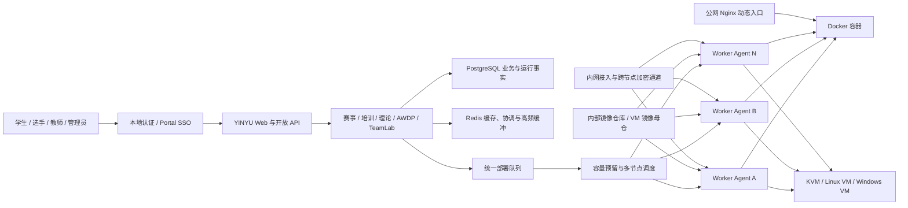
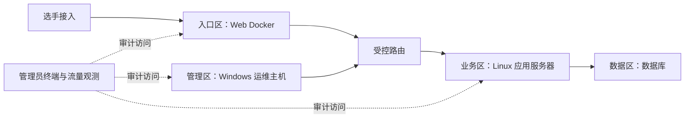

# YINYU 安全综合演练平台功能汇报与演示提纲

> 编制日期：2026-08-10
>
> 源码基线：`origin/main@55db938`
>
> 使用对象：汇报讲述人、演示操作人员
>
> 说明：本文按最新主线源码整理。正式演示前应再次核对演示服务器的部署版本、数据和节点状态。

## 一、汇报目标

这次汇报不只是展示若干页面，而是说明平台已经形成一套覆盖“内容建设、竞赛训练、环境交付、组网演练、运行保障和结果复盘”的统一能力。

建议用一句话开场：

> YINYU 是一套面向网络安全竞赛、教学培训和实战演练的综合平台，它把题目、课程、考试、容器、虚拟机、多节点资源和网络场景统一到同一套管理与运行体系中。

建议重点回答四个问题：

1. 平台能承载哪些业务？
2. 复杂靶场如何快速、批量、隔离地交付？
3. 管理人员如何知道环境是否正常、问题发生在哪里？
4. 现阶段哪些能力已经可用，哪些仍处于扩大验收阶段？

## 二、平台解决的问题

### 2.1 传统建设方式的主要问题

- 比赛、培训、理论考试和攻防演练往往使用不同系统，用户、题目和环境重复维护。
- 靶机依赖人工部署，准备时间长，临场问题难以定位和恢复。
- 多台计算服务器各自运行，缺少统一容量统计，容易出现某台节点过载、其他节点闲置。
- Docker、Linux 虚拟机、Windows 虚拟机和复杂网络环境缺少统一编排入口。
- 环境启动、镜像分发、端口转发和资源回收过程不透明，失败后依赖人工查日志。
- 培训结束后难以形成学员进度、理论成绩和实验完成情况的统一视图。

### 2.2 平台当前的解决方式

- 一个账号体系覆盖竞赛、培训、考试、战队和后台管理，并兼容 Portal SSO。
- 镜像与题目资产统一治理，并按赛事、课程和组网场景的业务作用域分别授权和绑定。
- 一套部署队列和调度器统一管理 Docker、虚拟机、培训实验、AWDP 和 TeamLab 运行任务。
- 多个 Worker 节点按 Docker/KVM 能力、CPU、内存、实例数和镜像就绪情况进行调度。
- 公网 Nginx 网关通过动态端口映射和 ACK 确认入口真正可用后，前端才向用户展示。
- TeamLab 将多网段、路由、容器、Linux VM、Windows VM、访问入口和流量观测编排为可重复发布的场景。
- PostgreSQL 保存业务与运行事实，Redis 承担缓存、协调和高频数据缓冲；主站重启后可依据数据库和 Agent inventory 恢复判断。

## 三、总体架构

讲解重点：

- 主站负责业务规则、权限、状态和调度，不直接在 Controller 中拼装节点命令。
- Agent 只执行已经校验的本机操作，不读取比赛计分、课程或权限实体。
- 镜像模板状态、节点分发状态、运行实例状态和部署队列状态分别记录，避免把“镜像已登记”误认为“节点已准备”。
- Docker 和 KVM 能力独立判断；某个节点没有 KVM，不影响它继续承载 Docker 任务。

## 四、平台功能全景

| 能力域 | 当前功能 | 业务价值 | 当前状态 |
| --- | --- | --- | --- |
| 身份与组织 | 本地账号、Portal SSO、角色权限、战队、学员组、个人主页 | 一次登录进入竞赛、学习和管理场景 | 已实现 |
| CTF 赛事 | 赛事、公告、题目、附件、静态/动态 Flag、Docker、Windows VM、计分和榜单 | 支持从入门题到动态靶场的完整赛事 | 已实现并有真实环境验证 |
| 理论考试 | 题库、试卷、单选、多选、判断、草稿、提交、成绩、答题回顾 | 支持赛前考核、课堂测验和理论竞赛 | 已实现 |
| 培训课程 | 课程、共同教师、报名审核、章节、资源、实验、课后理论、学习进度、学员详情 | 将内容学习、动手实验和考核放在同一课程闭环 | 已实现 |
| AWDP | 服务配置、轮次、Checker、攻击提交、补丁、重置、恢复、停止、榜单和日志 | 支持攻防对抗与服务可用性考核 | 功能已实现，真实攻防流程采用人工验收 |
| TeamLab 组网 | 可视化拓扑、版本发布、多节点调度、混合资产、隔离接入、运维终端、流量与抓包 | 快速交付可重复、可观测的复杂网络靶场 | 核心链路已实现，扩大验收中 |
| 运行底座 | 镜像管理、节点能力、统一队列、容量预留、实例、事件、日志和恢复 | 降低并发创建、资源争抢和故障定位成本 | 已实现 |
| 开放能力 | 中文 API 文档、API Token、幂等操作、操作进度、TeamLab 外部控制面、Webhook | 支持与门户、教学系统和自动化平台集成 | 已实现，按授权范围开放 |
| 自主练习 | 题库刷题、分类筛选、附件、Flag、容器实例、提交、统计与后台管理 | 衔接课程和赛事的日常训练 | 已进入主线，待生产部署验收 |

## 五、核心业务功能

### 5.1 身份、用户与组织

平台同时支持本地账号和 Portal SSO。门户用户可以从统一入口进入平台，平台按稳定身份完成登录；本地不存在对应用户时可按对接规则创建账号。

组织能力包括：

- 用户注册、登录、找回、验证和安全设置。
- 战队创建、申请、邀请、审核、转让、退出和成员管理。
- 学员组及组内成员、教师/管理人员维护。
- 个人主页展示参赛、解题、学习和活动信息。
- 学生、教师、管理员、超级管理员等角色对应不同的操作边界。

视角价值：统一用户入口后，竞赛结果、课程进度和能力画像可以围绕同一用户持续沉淀。

### 5.2 CTF 赛事

赛事模块覆盖比赛创建到结果复盘：

- 配置赛事基本信息、时间、阶段、分组、公告和参赛规则。
- 管理 Web、Pwn、Reverse、Crypto、Misc 等多类型题目。
- 支持题目说明、附件、静态 Flag、实例动态 Flag 和计分规则。
- Docker 题目按选手或队伍创建隔离实例，支持创建、延期、销毁、入口状态和倒计时。
- Windows VM 题目支持浏览器远程桌面；比赛场景可同时提供原生 `.rdp` 配置，便于使用系统远程桌面和剪贴板。
- 公网容器入口只有在 Nginx 配置校验、加载并 ACK 后才进入 `Ready`，避免展示尚不可访问的地址。
- 支持提交判定、题目完成状态、比赛榜单、理论榜单、提交记录和结果导出。

视角价值：选手看到的是统一比赛工作台，后台实际完成了镜像、节点、实例、入口和计分的联动。

### 5.3 理论考试

理论模块既可以独立用于理论比赛，也可以用于培训章节课后测试：

- 统一维护单选、多选和判断题。
- 按比赛或课程章节配置试卷、题目顺序和分值。
- 学员答题过程中允许保存草稿，最终提交后按规则锁定。
- 自动判分并展示成绩、答题状态和错题回顾。
- 管理员可查看结果并执行必要的重新计算。

视角价值：同一平台可完成“理论认知 - 动手实验 - 结果评价”，无需切换独立考试系统。

### 5.4 培训课程

培训以课程为上层对象，将教师、学生、章节、资源、实验和测试组织在一起：

- 教师及以上角色可创建课程，课程支持草稿、发布和归档。
- 支持课程创建者添加共同教师，共同维护课程内容。
- 学生报名可采用自动通过或教师审核；教师在学员管理中处理报名。
- 章节支持 Markdown 内容、视频/资源、附件、课程实验和课后理论测试。
- 课程题目、环境模板和理论题库在课程内隔离，不与其他课程或赛事任意串用。
- 学生可启动章节实验、提交 Flag、完成理论作业和章节完成条件。
- 教师可查看班级整体进度，并进入学员详情查看章节完成、实例题完成情况、理论分数和对错详情。

视角价值：课程不只是资料展示页，而是一条可以衡量结果的学习路径。

### 5.5 AWDP 攻防演练

AWDP 模块围绕服务可用性、攻击和修补组织流程：

- 管理端配置比赛服务、镜像、Checker 和轮次。
- 启动比赛后按队伍创建服务实例。
- 攻击阶段提交获得的 Flag，平台记录攻击结果和得分。
- 防守方上传补丁，查看补丁状态和服务检查结果。
- 支持实例重置、恢复、比赛停止、排行榜和攻击日志。

视角价值：平台不仅支持解题式 CTF，也能承载持续运行、持续检查和攻防对抗的赛制。

演示边界：真实攻击、修补和故障注入容易受到终端安全软件及现场网络影响，正式汇报建议展示已准备的数据、状态和操作入口，不现场执行高风险攻击链。

### 5.6 TeamLab 多节点组网

TeamLab 是平台面向复杂网络靶场的核心扩展。它把网络设计和运行交付分成“草稿设计 - 校验 - 不可变发布 - 试运行/比赛运行”四个阶段。

#### 场景设计

- 在画布中添加交换机、路由器、Docker、Linux VM 和 Windows VM。
- 创建入口区、业务区、数据区、管理区等多个网络区域。
- 配置网段、固定主机地址、网卡顺序、主网卡和路由方向。
- 配置 CPU、内存、磁盘、环境变量、启动命令、健康检查、服务注入和观测策略。
- 支持拖拽、缩放、框选、复制、撤销/重做、专注模式和自动排版。
- 未被路由连接的网段默认隔离，减少场景设计中的隐式连通。

#### 校验与发布

- 草稿修改不影响已经发布和运行的版本。
- 发布前检查网络、地址、依赖、镜像、节点能力和资源配置。
- 发布后形成不可修改快照，可供多次试运行和多场业务复用。
- 发布页展示执行计划、镜像就绪度、可调度节点和最近试运行状态。

#### 多节点调度与运行

- 平台优先把同一队伍场景放在同一节点，容量不足时按完整网段拆分到多个节点。
- 跨节点网段通过受控加密通道保持连通，节点间具体资源对选手隐藏。
- 运行前统一进行资源预留，避免多个队伍同时创建导致容量透支。
- Docker 只调度到 Docker 节点，VM 只调度到 KVM 节点。
- 镜像缺失时进入独立“镜像准备”阶段，不把下载失败混入设备创建错误。
- 每次创建或重置产生新的运行代次，旧任务不能覆盖新环境状态。

#### 访问、运维与观测

- 每支队伍获得隔离的场景与访问配置，只能进入被授权的入口网络。
- 管理员可使用网页终端进入 Docker、通过网页 SSH 进入 Linux VM、通过网页 RDP 进入 Windows VM。
- 运维会话记录操作人、目标、原因、开始/结束和终止原因。
- 运行详情展示部署阶段、节点分片、资产地址、事件、日志、通信流和通信路径。
- 支持按环境、网段、资产或路径发起限时、限大小的抓包，并下载标准抓包文件。
- 销毁会回收容器、VM、临时磁盘、网络、路由、访问授权、抓包任务、资源预留和镜像引用。

#### 对外控制面

- `/api/open/v1/teamlab` 提供场景、版本、镜像准备、运行、访问、流量、抓包和批量发布能力。
- 长耗时操作返回操作编号，可查询阶段、进度和结果。
- API Token 支持按资源范围授权，Webhook 支持受控事件通知和失败重试。

视角价值：复杂靶场从一次性人工工程，转变为可设计、可校验、可发布、可复用、可观测和可回收的平台资产。当前产品闭环重点是独立试运行和比赛绑定；培训直接绑定 TeamLab 仍属于后续产品工作。

### 5.7 镜像、节点和公网入口

- Docker 镜像统一使用内部 Registry，减少比赛期间访问外部仓库的不确定性。
- VM 基础镜像由镜像仓库保存，分发到具备 KVM 能力的 Worker 本地缓存。
- 后台展示每个节点的在线状态、Docker/KVM 能力、CPU、内存、磁盘和当前容量占用。
- 调度时同时考虑已运行、已预留和正在创建的任务。
- 公网 Nginx 网关只负责 TCP 入口，不承担题目调度或容器生命周期。
- 网关拉取端口映射、校验配置、加载并回传 ACK；旧映射竞态会被拒绝并在下一轮收敛。

## 六、后台管理能力

后台不是单一“系统设置”页面，而是整个平台的内容生产和运行控制中心。

| 后台入口 | 管理内容 | 演示重点 |
| --- | --- | --- |
| 管理概览 | 主要管理模块和待处理入口 | 平台管理范围总览 |
| 赛事管理 | 比赛信息、阶段、组别、审核、公告、题目、理论、AWDP、TeamLab 绑定 | 一场比赛可以组合多种赛制与环境 |
| 题目管理 | 题目内容、分类、附件、Flag、Docker/VM 环境、分值 | 内容与运行环境在一个编辑流程内闭环 |
| 理论题库 | 题目维护、试卷配置、发布、成绩 | 理论内容可复用于比赛和培训 |
| TeamLab | 场景库、拓扑设计、发布版本、试运行、运行详情 | 复杂靶场的设计与运维主入口 |
| 环境模板 | Docker/KVM 镜像登记、上传、远程访问配置、节点分发状态 | 镜像主状态与节点分发状态分离 |
| 节点管理 | 节点注册、能力、容量、部署和详情 | 多服务器成为统一资源池 |
| 实例管理 | 当前 Docker、VM 和运行实例 | 快速定位正在占用资源的环境 |
| 部署队列 | 长任务阶段、进度、结果、失败原因 | 创建环境不再是不可观察的后台操作 |
| 日志与事件 | 结构化日志、操作关联和错误定位 | 从用户操作追踪到节点执行结果 |
| 用户管理 | 用户状态、角色和基本管理 | 统一身份和权限治理 |
| 战队管理 | 队伍、成员和参赛关系 | 支撑团队赛组织 |
| 学员组 | 学员和教师分组 | 支撑教学班和批量管理 |
| 系统设置 | 平台信息及全局设置 | 统一运维配置入口 |
| API Token / API 文档 | Token、权限范围、中文 OpenAPI 文档 | 与门户、教学和自动化系统对接 |

## 七、建议汇报结构

### 7.1 标准版：25 分钟

| 时间 | 环节 | 展示内容 | 核心结论 |
| --- | --- | --- | --- |
| 0-2 分钟 | 平台定位 | 首页、模块入口、身份体系 | 一个入口覆盖竞赛、培训和演练 |
| 2-8 分钟 | CTF 完整链路 | 赛事、题目、容器、Flag、榜单，可选 Windows RDP | 内容、环境和计分统一联动 |
| 8-13 分钟 | 培训闭环 | 课程、章节、实验、理论作业、学员进度 | 学习过程和结果可管理、可量化 |
| 13-21 分钟 | TeamLab 组网 | 设计、校验、发布、运行、终端、流量 | 复杂多节点靶场可重复交付 |
| 21-25 分钟 | 后台保障 | 镜像、节点、队列、实例、日志、用户 | 平台具备运行与治理能力 |

### 7.2 扩展版：35-40 分钟

在标准版基础上增加：

- 理论考试完整答题与成绩回顾：4 分钟。
- AWDP 服务、攻击、修补和榜单：5 分钟。
- 开放 API、Token、幂等操作和 Webhook：3 分钟。

不建议把所有页面依次点一遍。领导汇报应始终围绕三条主线：

1. 一套平台支持多类业务。
2. 一套运行底座统一管理多节点和多种环境。
3. 每次操作都有状态、日志和可恢复路径。

## 八、演示前准备

### 8.1 账号与数据

至少准备以下账号，避免现场临时切换权限：

- 管理员账号：展示后台、节点、镜像、TeamLab 和日志。
- 教师账号：展示课程编辑、报名审核和学员详情。
- 学生/选手账号：展示参赛、课程学习、答题和提交。

提前准备：

- 一场已发布、可报名的 CTF 演示比赛。
- 一道启动较快的 Docker 动态 Flag 题。
- 一道带附件的普通题。
- 一道已完成模板验收的 Windows VM 题，若现场展示原生 RDP。
- 一门包含章节、资源、实验和理论作业的演示课程。
- 一个已发布、已完成镜像准备的 TeamLab 三网段或四网段场景。
- 一个已进入 `Ready` 的 TeamLab 试运行，作为现场创建失败时的备用展示对象。
- 一组可展示的 AWDP 历史状态、攻击日志和补丁记录。

### 8.2 基础设施检查

演示前 30 分钟完成：

1. 内网首页、登录、赛事、培训和管理后台均能打开。
2. 公网首页和选定 Docker 题目的公网入口可访问。
3. 所有演示 Worker 在线，Docker/KVM 能力和磁盘余量正常。
4. 部署队列没有长时间等待或失败任务。
5. 演示镜像在目标节点显示为就绪。
6. TeamLab 备用运行环境处于 `Ready`，终端和流量页面可打开。
7. Windows VM 已预启动或确认启动耗时，浏览器 RDP 和 `.rdp` 下载入口均存在。
8. Portal SSO 的 `192.168` 网段与平台连通；若不可用，直接使用本地账号，不在现场排查门户网络。

### 8.3 浏览器标签页顺序

建议提前打开但不加载过多动态页面：

1. 平台首页。
2. 演示比赛详情。
3. 演示课程详情。
4. TeamLab 场景设计页。
5. TeamLab 已就绪运行详情。
6. 节点管理。
7. 部署队列。
8. 日志页面。

## 九、逐场景演示脚本

### 场景一：首页与统一身份

**入口**：`/`、`/account/login`，可选 Portal Dashboard。

**操作步骤**：

1. 从门户点击竞赛平台，或直接登录平台。
2. 展示首页的近期赛事、课程、公告和用户入口。
3. 打开赛事、培训和战队三个主要模块，说明同一账号的业务连续性。

**建议话术**：

> 用户不需要分别维护比赛、培训和考试账号。平台既支持本地登录，也支持从现有统一门户进入；进入后，参赛、课程、理论成绩和个人记录围绕同一身份沉淀。

**预期结果**：登录状态稳定，页面不重复跳转；当前用户角色对应的模块和管理入口正确显示。

### 场景二：CTF 从题目到得分

**入口**：`/games` -> `/games/{gameId}` -> `/games/{gameId}/challenges`。

**操作步骤**：

1. 进入一场已发布比赛，展示比赛说明、公告和报名/进入按钮。
2. 展开题目分类，选择带附件的题目，展示题面与附件下载。
3. 切换到 Docker 动态题，点击“创建实例”。
4. 展示“正在准备环境”到入口 `Ready` 的状态变化和剩余时间。
5. 打开题目入口，完成预设的简单验证，回到平台提交 Flag。
6. 展示题目完成状态和积分榜变化。

**建议话术**：

> 选手只看到一个创建按钮，后台实际完成了节点选择、容量预留、镜像确认、容器创建、公网端口发布和入口确认。只有公网网关确认配置生效后，平台才展示入口。

**可选 Windows VM 展示**：

1. 打开已准备的 Windows VM 题。
2. 展示浏览器远程桌面入口。
3. 展示原生 RDP 连接信息与 `.rdp` 下载入口。
4. 说明原生客户端适合内网使用，可获得系统远程桌面和剪贴板体验。

**备用方案**：若现场新建实例超过预期时间，立即切换到预先创建的实例；不要在汇报中等待镜像分发。

### 场景三：培训课程闭环

**学生入口**：`/training` -> `/training/courses/{courseId}` -> 章节页。

**学生操作步骤**：

1. 展示课程列表、课程介绍、教师和学习进度。
2. 进入章节，展示 Markdown 内容、资源和章节目录。
3. 启动章节实验，查看入口、倒计时并提交 Flag。
4. 进入课后理论测试，保存草稿并提交。
5. 展示成绩、答案回顾和章节完成条件。

**教师操作步骤**：

1. 打开课程管理标签，展示章节、资源、课程题目和理论题库。
2. 展示共同教师管理和报名审核。
3. 进入学员管理，打开某位学员的详情抽屉。
4. 展示章节完成、实例题完成情况、理论得分和错题信息。

**建议话术**：

> 培训模块把“读材料、做实验、完成测试、教师查看结果”放进同一条路径。教师看到的不只是报名名单，而是每位学员的真实学习与做题情况。

### 场景四：理论考试

**管理入口**：`/admin/theory-bank`、`/admin/games/{gameId}/theory-paper`。

**选手入口**：`/games/{gameId}/theory`。

**操作步骤**：

1. 展示题库中的单选、多选和判断题。
2. 打开已配置试卷，说明题目与分值配置。
3. 以选手身份答题并保存草稿。
4. 最终提交后展示分数和答题回顾。
5. 返回管理端展示结果列表。

**建议话术**：

> 理论考试和动手题使用同一场赛事、同一用户与同一管理后台，既可以单独组织理论竞赛，也可以作为课程章节的课后测验。

### 场景五：TeamLab 三层业务系统组网

**推荐故事背景**：模拟一个由入口区、业务区、数据区和管理区组成的企业网络。入口区部署 Web 容器，业务区部署 Linux 应用服务器，数据区部署数据库，管理区部署 Windows 运维主机；路由器控制各区之间的通信。

**管理入口**：`/admin/teamlab`。

#### 第一步：展示可视化设计

1. 打开已准备的场景，进入“当前设计”。
2. 指出网络区域、交换机、路由器、Docker、Linux VM 和 Windows VM。
3. 选择一个资产，展示镜像、资源、网卡、地址、启动依赖和观测策略。
4. 使用“适配视图”或“自动排版”展示大规模拓扑的可读性。
5. 不在正式演示场景上进行大量拖拽和删除；需要演示编辑时使用独立草稿副本。

**建议话术**：

> 管理员描述的是业务网络，而不是逐台登录服务器执行命令。网络、设备、镜像和依赖都成为可校验的场景配置。

#### 第二步：校验与发布

1. 点击“校验”，展示中文检查结果。
2. 进入发布版本，展示草稿与不可变版本的区别。
3. 展示服务端执行计划、资源需求和镜像就绪度。
4. 说明同一个发布版本可以重复用于试运行和比赛绑定，也可通过受控 API 供外部业务编排复用。

**建议话术**：

> 草稿可以持续修改，但正在使用的正式版本不会被后续编辑影响。这样同一场景可以稳定复现，也可以保留版本追溯。

#### 第三步：创建或打开试运行

1. 演示时优先打开已处于 `Ready` 的备用运行。
2. 展示部署时间线：资源等待、镜像准备、网络、设备、来宾初始化和就绪。
3. 展示节点分片，说明同一场景可以分布在多个 Worker。
4. 展示每个资产的地址、运行状态和所属网段。

**建议话术**：

> 平台会优先把环境放在一台服务器；放不下时按网段拆分，并自动建立跨节点连接。每支队伍获得独立的一套网络和运行资源。

#### 第四步：管理员运维与流量观测

1. 打开 Web 容器的网页终端，执行一个只读命令，例如查看地址或进程。
2. 可选打开 Linux VM 的网页 SSH 或 Windows VM 的网页 RDP。
3. 展示终端会话对应的审计信息。
4. 从 Web 资产向业务资产发起一次预设请求或连通性探测。
5. 打开通信流，按协议、源或目标筛选。
6. 打开通信路径，展示流量经过的网络位置。
7. 若环境稳定，演示启动短时抓包并停止；否则直接展示已完成抓包记录。

**建议话术**：

> 运维人员无需暴露 Worker 管理地址或临时端口，就能进入资产排查。平台同时记录谁在什么时间进入了哪台资产，并把运行事件、日志和网络流量关联到同一个环境。

#### 第五步：生命周期与回收

1. 说明试运行支持暂停、恢复、重置和销毁。
2. 演示结束时可销毁专用演示运行，观察清理阶段。
3. 展示资源、网络、访问授权和抓包任务均由平台统一回收。

**备用方案**：

- 新建试运行失败：切换到预先准备的 `Ready` 运行，展示失败运行的中文阶段和日志作为可观测性示例。
- 跨节点实时链路波动：展示已完成的节点分片和流量记录，不现场修改 WireGuard 或节点网络。
- Windows 来宾启动较慢：展示已启动资产和现有 RDP 会话，不在汇报中等待系统首次启动。

### 场景六：后台运行保障

**入口**：`/admin/images`、`/admin/nodes`、`/admin/queue`、`/admin/instances`、`/admin/logs`。

**操作步骤**：

1. 在镜像管理中选择一个模板，展示主状态和各节点分发状态。
2. 在节点管理中展示三台 Worker 的在线状态、Docker/KVM 能力和容量。
3. 在部署队列中找到刚才的实例或 TeamLab 操作，展示阶段、结果和错误信息。
4. 在实例管理中展示运行实例与调度节点。
5. 在日志页面按操作、实例或关联标识定位相关记录。
6. 简要展示用户、战队、学员组和系统设置入口。

**建议话术**：

> 平台不是把任务发出去就结束。管理员可以看到镜像在哪些节点就绪、任务排到哪一步、实例运行在哪里，以及一次用户操作在主站和节点上的完整结果。

### 场景七：AWDP 攻防流程（扩展演示）

**管理入口**：`/admin/games/{gameId}/awdp-services`。

**选手入口**：`/games/{gameId}/awdp`。

**操作步骤**：

1. 展示服务、Checker、比赛状态和队伍实例。
2. 展示攻击提交记录和排行榜。
3. 展示补丁上传入口、补丁状态和服务检查结果。
4. 展示管理员重置、恢复和停止能力。

**建议话术**：

> AWDP 强调持续服务和攻防轮次。平台不仅判断一次 Flag，还持续记录服务状态、攻击结果和修补结果。

### 场景八：开放 API 与系统集成（扩展演示）

**入口**：`/api-docs/`、`/settings/tokens`。

**操作步骤**：

1. 打开中文 API 文档，展示按模块分组的接口。
2. 展示 API Token 创建与授权范围，不显示真实 Token 值。
3. 选择 TeamLab 创建运行或查询状态接口，说明长操作返回 operation ID。
4. 展示 Webhook 与事件通知能力。

**建议话术**：

> 平台既能由人通过页面操作，也能被门户、教学系统或自动化平台调用。长时间任务不会让调用方一直等待，而是返回可查询、可审计的操作编号。

## 十、演示风险与处理原则

| 风险 | 现场表现 | 处理方式 |
| --- | --- | --- |
| 镜像未提前分发 | 创建实例长时间停在准备阶段 | 演示前确认镜像就绪；现场切换到预创建实例 |
| Worker 容量不足 | 队列等待或提示不可调度 | 演示前清理无关实例并核对容量，不临场修改容量配置 |
| 公网入口同步异常 | 容器已运行但入口仍 Pending | 使用内网演示入口；后台展示 ACK 状态，演示后再排查网关 |
| Windows 首次启动慢 | RDP 暂时不可进入 | 使用预启动实例和已验收模板，不临时导入镜像 |
| TeamLab 大场景创建时间长 | 汇报节奏被打断 | 核心展示使用预先 Ready 的运行，另用小场景演示创建动作 |
| IAM 网段不稳定 | 门户跳转失败 | 直接使用本地账号继续，说明平台兼容双登录入口 |
| AWDP 操作触发安全软件 | 终端或脚本被拦截 | 不现场执行真实攻击/修补，展示已准备记录和人工验收流程 |
| 日志中出现敏感信息 | 汇报画面泄露凭据 | 提前检查演示数据，禁止展示 Token、Cookie、密码、私钥和完整 user-data |

## 十一、当前边界与后续建设

### 11.1 可以明确汇报为已具备的能力

- CTF 赛事、题目、附件、Flag、Docker 实例、Windows VM、计分和榜单。
- 理论题库、试卷、答题、自动判分和答案回顾。
- 培训课程、章节、实验、课后理论、共同教师、报名审核和学员详情。
- AWDP 的服务、攻击、补丁、恢复和状态管理功能。
- 镜像、节点、队列、实例、日志和系统管理。
- 本地认证、Portal SSO 和个人/组织管理。
- TeamLab 的场景设计、校验、发布、混合资产运行、远程运维、流量与生命周期核心链路。

### 11.2 汇报时应表述为“持续验收和优化”

- TeamLab 双 Worker 故障注入和控制面接管。
- 大规模并发创建和目标硬件上的最终吞吐签收。
- 长期流量留存、查询容量和抓包归档策略。
- 大文件远程操作和复杂服务注入的效率。
- AWDP 真实攻击、修补和异常恢复的持续现场验收。
- Windows 镜像制作规范化和更多镜像的兼容性认证。
- 自主练习的生产迁移、真实实例和内容运营验收。

### 11.3 尚未进入稳定主线

- 培训章节直接使用 Windows VM 的完整产品闭环。
- 培训课程直接绑定 TeamLab 发布版本的完整产品闭环。

## 十二、常见问题与建议回答

### 12.1 与普通 CTF 平台相比，新增了什么？

> 平台保留了成熟的 CTF 赛事能力，同时增加了培训课程、理论考试、AWDP、Windows VM、多节点资源池、镜像分发、统一认证和 TeamLab 复杂组网。建设重点已经从“能出题”扩展到“能交付和管理完整演练环境”。

### 12.2 能支持多少并发？

> 平台已经具备容量预留、统一队列和多节点调度机制，能够横向增加 Worker。实际并发上限取决于题目类型、镜像大小、CPU/内存和网络条件。目前不应承诺未经签收的固定并发数字，下一步需要在目标硬件上完成容量和故障压测后给出正式指标。

### 12.3 多个队伍会不会互相影响？

> 普通动态题按队伍或用户创建独立实例；TeamLab 按队伍创建独立运行环境、网络、地址和访问授权。调度器统一统计容量，环境销毁时按运行编号和代次精确回收，避免旧任务影响新实例。

### 12.4 复杂场景能否复用？

> 可以。场景草稿通过校验后形成不可变发布版本，同一版本可以多次试运行、绑定比赛或供外部系统调用。镜像、服务配置和场景拓扑都可以作为资产复用。

### 12.5 出现故障怎么定位？

> 管理员可以从部署队列查看阶段，从实例和节点查看实际运行位置，从事件和日志查看失败原因，从 TeamLab 运行详情查看资产、网络、终端和流量。一次操作通过关联标识贯穿主站和节点，不再只依赖人工登录服务器排查。

### 12.6 是否支持与现有系统集成？

> 身份侧支持 Portal SSO；业务侧提供中文 OpenAPI、API Token、幂等操作、异步操作进度和 Webhook。现有门户、教学系统或自动化平台可以按授权范围接入。

### 12.7 平台现在是否已经完全商业化成熟？

> 核心业务和运行底座已经形成，CTF、培训、理论、后台和主要环境链路可用。TeamLab 的核心链路已经跑通，但规模压测、双节点故障演练、长期流量治理等仍在持续验收。当前更准确的定位是“具备完整产品骨架和可用核心能力，正在完成复杂场景的工程化签收”。

## 十三、汇报收尾建议

建议用以下内容收尾：

> 当前平台已经从单一 CTF 竞赛系统，演进为统一的网络安全竞赛、培训和演练平台。下一步重点不是继续堆叠孤立页面，而是完成真实容量与故障验收、沉淀标准镜像和场景资产，并推动自主练习完成生产落地与内容运营。最终目标是让一次建设的题目、课程、镜像和网络场景能够持续复用，让管理人员看得见过程、控得住资源、追得回结果。

## 附录 A：演示入口速查

| 功能 | 路由 |
| --- | --- |
| 首页 | `/` |
| 赛事列表 | `/games` |
| 比赛详情 | `/games/{gameId}` |
| CTF 题目 | `/games/{gameId}/challenges` |
| 比赛榜单 | `/games/{gameId}/scoreboard` |
| 理论考试 | `/games/{gameId}/theory` |
| AWDP | `/games/{gameId}/awdp` |
| TeamLab 选手工作区 | `/games/{gameId}/pentest` |
| 培训首页 | `/training` |
| 课程详情 | `/training/courses/{courseId}` |
| 章节详情 | `/training/courses/{courseId}/chapters/{chapterId}` |
| 章节理论作业 | `/training/courses/{courseId}/chapters/{chapterId}/theory` |
| 管理概览 | `/admin/dashboard` |
| 赛事管理 | `/admin/games` |
| 理论题库 | `/admin/theory-bank` |
| TeamLab 场景库 | `/admin/teamlab` |
| TeamLab 设计 | `/admin/teamlab/{topologyId}/design` |
| TeamLab 发布 | `/admin/teamlab/{topologyId}/releases` |
| TeamLab 运行 | `/admin/teamlab/{topologyId}/runtimes` |
| 镜像管理 | `/admin/images` |
| 节点管理 | `/admin/nodes` |
| 实例管理 | `/admin/instances` |
| 部署队列 | `/admin/queue` |
| 日志 | `/admin/logs` |
| 用户管理 | `/admin/users` |
| 战队管理 | `/admin/teams` |
| 学员组 | `/admin/student-groups` |
| 系统设置 | `/admin/system` |
| API Token | `/settings/tokens` |
| 中文 API 文档 | `/api-docs/` |

## 附录 B：正式演示确认单

- [ ] 演示服务器版本与本文描述的功能一致。
- [ ] 管理员、教师、学生三个账号可正常登录。
- [ ] Portal SSO 可用，或已决定使用本地账号演示。
- [ ] CTF 演示比赛已发布，报名与进入权限正确。
- [ ] Docker 演示镜像已在目标 Worker 就绪。
- [ ] 公网入口同步器正常，端口池没有冲突。
- [ ] Windows VM 演示实例和 RDP 入口已预检。
- [ ] 培训课程包含章节实验、理论作业和可查看的学员记录。
- [ ] TeamLab 场景已校验、发布并完成镜像准备。
- [ ] TeamLab 至少有一个 `Ready` 备用运行。
- [ ] TeamLab 容器终端、SSH/RDP、通信流和路径页面可打开。
- [ ] Worker 全部在线，容量足够，部署队列无积压。
- [ ] 演示数据不包含真实密码、Token、Cookie、私钥或其他敏感信息。
- [ ] 准备关键页面截图或短视频，作为基础设施临时波动时的备用材料。
